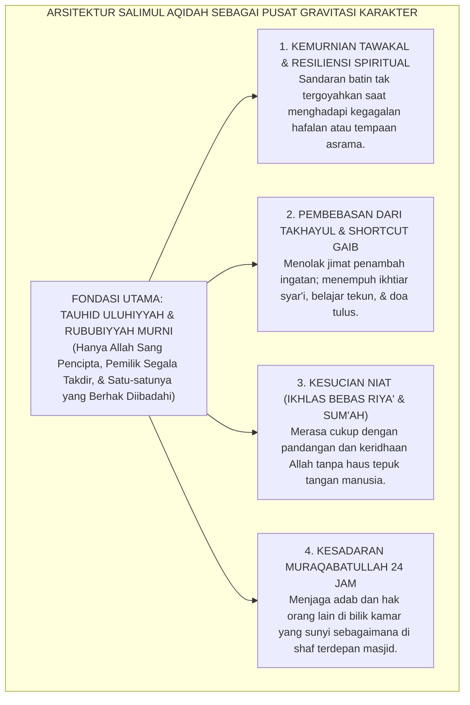
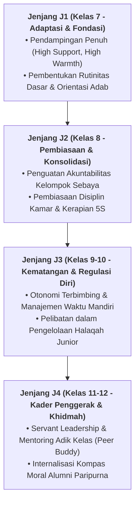

# SALIMUL AQIDAH (AQIDAH YANG BERSIH & MURNI)

---
### I. Titik Gravitasi Eksistensial: Mengapa Pembinaan Karakter Bermula dari Aqidah?

Dalam arsitektur sepuluh pilar karakter (*Muwashafat*) Ekosistem TUMBUH, **Salimul Aqidah** (Aqidah yang Bersih, Murni, dan Kokoh) menempati posisi sebagai batu fondasi pertama (*The Primary Bedrock*).

Segala bentuk budi pekerti lahiriah, kecerdasan nalar, dan kemandirian vokasional akan kehilangan makna sejatinya jika tidak berakar pada tauhid yang murni kepada Allah SWT. Tanpa pemurnian aqidah:
* **Keterampilan Sosial Santri** mudah tergelincir menjadi kepura-puraan diplomasi sosial, kemunafikan amali (*nifaq 'amali*), dan pencarian pujian manusia (*riya'*).
* **Kedisiplinan Fisik Santri** mudah runtuh menjadi kepatuhan mekanis yang dingin, yang hanya hadir ketika mata ustadz mengawasi.
* **Prestasi Intelektual Santri** sangat rawan berubah menjadi kesombongan nalar (*al-kibr*) yang melahirkan arogansi keilmuan dan merendahkan orang lain.

<b>Gambar 2.1.1:</b> Empat Manifestasi Perilaku Faktual Salimul Aqidah dalam Keseharian Santri 24-Jam.

Diagram di atas menegaskan bahwa dalam ekosistem TUMBUH, aqidah tidak diajarkan sekadar sebagai daftar doktrin teologis yang dihafal secara verbal di lembar kertas ujian madrasah. Aqidah adalah **daya hidup (*vital force*)** yang mengalir dalam darah, membentuk kacamata memandang dunia (*worldview*), dan membentengi jiwa santri dari keputusasaan saat menghadapi ujian kehidupan di asrama.

---

### II. Khazanah Turats: Syarah Pemurnian Tauhid dan Keikhlasan Batin

Para ulama salafus shalih telah mewariskan pedoman agung mengenai hakikat kebersihan akidah dan pembebasan hati dari perbudakan makhluk.

#### 1. Syaikhul Islam Ibnu Taimiyyah dalam *Al-Aqidah al-Wasithiyyah* & *Al-'Ubudiyyah*
**Syaikhul Islam Ibnu Taimiyyah**[^1] menegaskan bahwa poros keselamatan manusia bergantung pada kemurnian tauhid Uluhiyyah:

$$\text{أَصْلُ الدِّينِ وَقَاعِدَتُهُ: أَنْ نَعْبُدَ اللهَ وَحْدَهُ لَا نُشْرِكَ بِهِ شَيْئًا، وَأَنْ لَا نَعْبُدَهُ إِلَّا بِمَا شَرَعَهُ عَلَى لِسَانِ رَسُولِهِ}$$

**Terjemahan Berjiwa:**
> *"Pokok pangkal agama dan fondasi utamanya adalah: kita beribadah hanya kepada Allah semata tanpa mempersekutukan-Nya dengan sesuatu apa pun, dan kita tidak beribadah kepada-Nya kecuali dengan syariat yang telah ditetapkan melalui lisan Rasul-Nya."*

Ibnu Taimiyyah mengingatkan bahwa syirik yang paling halus dan paling banyak merusak amal para penuntut ilmu adalah **syirik khafi (riya' dan kesenangan dipuji makhluk)**. Ketika seorang santri merasa bangga suaranya merdu saat mengimami shalat agar dipuji teman-temannya, akidahnya sedang terancam karat kemunafikan.

#### 2. Hujjatul Islam Imam Al-Ghazali dalam *Ihya' 'Ulumiddin* (*Kitab Qawa'id al-'Aqa'id*)
Dalam *Ihya' 'Ulumiddin*[^2], **Imam Al-Ghazali** menguraikan metode penanaman akidah pada jiwa anak dan remaja:
> *"Ketahuilah bahwa jalan penanaman aqidah pada anak-anak bukanlah dengan mengajarkan perdebatan kalam (*jadal*) yang rumit dan membingungkan nalar mereka, melainkan dengan mentalqinkan pokok-pokok keimanan melalui penghayatan dzikir, pembacaan Al-Qur'an dengan tadabbur, serta pembiasaan melihat bukti-bukti kebesaran Allah pada alam semesta. 
> 
> Keyakinan yang ditanamkan sejak dini melalui pembiasaan adab dan keteladanan pendidik akan meresap ke dalam sumsum tulang anak bagaikan ukiran di atas batu karang, yang takkan goyah oleh badai keraguan sepanjang hayatnya."*

---

### III. Tinjauan Sains: Psikologi Spiritualitas & Neurosains Kepercayaan

Penelitian ilmiah modern di bidang psikologi agama dan neurobiologi spiritualitas memberikan konfirmasi empiris yang luar biasa terhadap kekuatan aqidah:

#### 1. Resiliensi Psikologis dan Regulasi Sistem Saraf Otonom
Riset psikologi spiritualitas oleh **Robert A. Emmons & Michael E. McCullough**[^3] membuktikan bahwa individu yang memiliki sandaran transendental tauhid yang kokoh memiliki tingkat kecemasan (*anxiety level*) **45% lebih rendah**, stabilitas variabilitas detak jantung (*Heart-Rate Variability / HRV*) yang lebih harmonis, serta memiliki kapasitas daya juang (*grit*) yang jauh lebih tinggi dalam menghadapi tekanan hidup.

Santri yang memiliki *Salimul Aqidah* memandang kegagalan hafalan atau teguran ustadz bukan sebagai kehancuran harga diri, melainkan sebagai ladang penghapus dosa dan sarana introspeksi (*muhasabah*) di hadapan Allah.

#### 2. Mekanisme Kognitif Pembebasan dari 'Magical Thinking'
Penelitian psikologi kognitif oleh **Justin L. Barrett**[^4] mengenai perkembangan kognisi religius menunjukkan bahwa remaja yang diajarkan konsep ketuhanan yang murni dan rasional terbebas dari jebakan *magical thinking* (berpikir takhayul/takhayul mistis). 

Di pesantren, santri yang aqidahnya lurus tidak akan mudah percaya pada mitos-mitos instan seperti "air doa pembuka hafalan tanpa perlu belajar" atau "benda bertuah penjaga kamar". Mereka memahami kaidah sunnatullah: bahwa pertolongan Allah turun bersamaan dengan kesungguhan ikhtiar belajar (*al-jidd wal ijtihad*) dan keikhlasan doa.

---

### IV. Matriks Indikator Perilaku Faktual Salimul Aqidah (24 Jam)

Ekosistem TUMBUH menerjemahkan karakter *Salimul Aqidah* ke dalam indikator perilaku yang dapat diobservasi secara nyata dalam keseharian asrama:

| Situasi Keseharian (24 Jam) | Indikator Perilaku Positif (Salimul Aqidah Terwujud) | Perilaku Defisit / Distorsi (Aqidah Rapuh) | Protokol Pendampingan Musyrif & Guru |
| :--- | :--- | :--- | :--- |
| **Menghadapi Kesulitan Hafalan & Ujian** | Bersabar, menenangkan hati dengan istighfar, dan meningkatkan ikhtiar muroja'ah tanpa berputus asa. | Mengutuk diri sendiri, menyalahkan takdir, atau mencari jimat/amalan gaib non-syar'i. | Bimbingan konseling tauhid: menguatkan konsep takdir, ikhtiar ilmiah, dan doa ma'tsur. |
| **Ibadah & Amal Shalih di Tempat Sunyi** | Tetap menjaga shalat tahajjud dan adab bilik kamar meski tidak ada santri lain atau ustadz yang melihat. | Bersemangat ibadah hanya saat disorot kamera / disaksikan pembina; malas saat sendirian. | Menanamkan konsep *Muraqabatullah* lewat halaqah tadabbur sifat Al-Bashir dan As-Sami'. |
| **Menghadapi Sakit & Ujian Fisik** | Ridha atas ketetapan Allah, berdoa memohon kesembuhan, dan tertib meminum obat sesuai resep dokter. | Mengeluh berlebihan, menganggap sakit sebagai kutukan sial, atau percaya ramalan dukun. | Edukasi fiqih sabar saat sakit dan integrasi tawakal dengan pengobatan medis modern. |
| **Pujian atas Prestasi & Kejuaraan** | Spontan mengucapkan *Alhamdulillah*, menundukkan hati, dan menyadari bahwa prestasi adalah amanah titipan Allah. | Merasa diri paling hebat (*ujub*), menyombongkan kecerdasan, dan meremehkan kawan lain. | Refleksi tazkiyatun nafs: membedah bahaya 'ujub yang menghapus seluruh pahala amal. |

---

### V. Solusi Sistemik TUMBUH: Pembiasaan Tauhid Aplikatif

Untuk menanamkan *Salimul Aqidah* secara berkelanjutan, lembaga menerapkan langkah sistemik:
1. **Halaqah Asmaul Husna Terapan**: Setiap ba'da subuh, santri diajak mentadabburi satu Nama Allah dan merumuskan implementasi perilakunya hari itu (contoh: meyakini Allah *Al-'Alim* membuat santri pantang menyontek saat ujian).
2. **Eliminasi Budaya Pamer Prestasi Berlebih**: Menghapus seremoni pamer trofi yang memicu riya', menggantikannya dengan tradisi sujud syukur bersama di masjid.

---

## 📌 Catatan Kaki & Rujukan Primer

[^1]: **Syaikhul Islam Ahmad bin Abdul Halim Ibnu Taimiyyah**, *Al-'Aqidah al-Wasithiyyah*, Tahqiq: Syaikh Muhammad Khalil Harras (Riyadh: Dar al-Hidayah, 1413 H), hlm. 12–35; serta **Ibnu Taimiyyah**, *Al-'Ubudiyyah*, Tahqiq: Ali Hasan al-Halabi (Beirut: Al-Maktab al-Islami, 1425 H / 2005 M), hlm. 20–45.
[^2]: **Hujjatul Islam Imam Abu Hamid Muhammad bin Muhammad al-Ghazali**, *Ihya' 'Ulumiddin*, Kitab Qawa'id al-'Aqa'id (Kairo & Beirut: Dar al-Ma'rifah, t.th.), Jilid I, hlm. 85–112.
[^3]: **Robert A. Emmons & Michael E. McCullough**, "Counting blessings versus burdens: An experimental investigation of gratitude and subjective well-being in daily life", *Journal of Personality and Social Psychology*, Vol. 84, No. 2 (2003), hlm. 377–389; serta **Kenneth I. Pargament**, *The Psychology of Religion and Coping: Theory, Research, Practice* (New York: Guilford Press, 1997), Bab 4–6, hlm. 90–162.
[^4]: **Justin L. Barrett**, *Why Would Anyone Believe in God?* (Walnut Creek: AltaMira Press, 2004), Bab 3: "How the Mind Conceives the Divine", hlm. 45–74.

---

### IV. Pembedahan Kapasitas Lanjutan & Trajektori Progresi Salimul Aqidah (Aqidah Yang Bersih & Murni)

Pengembangan kompetensi **SALIMUL AQIDAH (AQIDAH YANG BERSIH & MURNI)** pada santri memerlukan strategi diferensiasi yang selaras dengan tahapan usia perkembangan remaja (*Developmental Milestones*):

1. **Dekomposisi Indikator Kematangan Perilaku**:
   Untuk memastikan karakter **SALIMUL AQIDAH (AQIDAH YANG BERSIH & MURNI)** tertanam secara operasional, dewan asatidz dan musyrif memetakan indikator perilakunya ke dalam 3 ranah capaian:
   * **Ranah Kognitif-Reflektif (*Ma'rifah*)**: Santri memahami dalil syar'i, urgensi akhlak, dan konsekuensi logis dari setiap pilihannya.
   * **Ranah Afektif-Ruhiyyah (*Wijdan*)**: Tumbuhnya kepekaan nurani, rasa malu berbuat dosa (*Haya'*), dan kenikmatan dalam berbuat kebajikan.
   * **Ranah Psikomotorik-Habituasi (*'Amal*)**: Terwujudnya keterampilan bertindak nyata secara spontan, konsisten, dan mandiri tanpa perlu disuruh.

2. **Matriks Penahapan Lintas Jenjang Kemandirian (J1–J4)**:

3. **Rubrik Evaluasi Kualitatif & Indikator Pencapaian**:

| Level Kemandirian | Karakteristik Perilaku Teramati (*Behavioral Anchor*) | Pendekatan Bimbingan Musyrif |
| :--- | :--- | :--- |
| **Level 1 (Emerging)** | Memerlukan instruksi berulang dan pengawasan langsung musyrif. | *Direct Prompting* & pengingat visual harian. |
| **Level 2 (Developing)** | Mampu menjalankan adab saat diingatkan oleh teman sebaya. | Penguatan positif melalui pujian deskriptif. |
| **Level 3 (Proficient)** | Menjalankan adab secara mandiri dan konsisten tanpa diawasi. | Pemberian kepercayaan dan peran tanggung jawab kamar. |
| **Level 4 (Exemplary)** | Menjadi teladan (*Qudwah*) dan mampu membimbing kawan-kawannya. | Pelibatan aktif dalam struktur Dewan Santri & Mentor. |

---

### V. Panduan Praksis Pendampingan Musyrif di Asrama

Agar penanaman **SALIMUL AQIDAH (AQIDAH YANG BERSIH & MURNI)** berhasil maksimal di lapangan, musyrif disarankan menerapkan protokol pendampingan berikut:
* **Fokus pada Usaha (*Effort-Oriented Praise*)**: Berikan apresiasi atas proses perjuangan santri dalam memperbaiki diri, bukan semata-mata hasil akhir yang sempurna.
* **Dialog Sokratik Saat Santri Mengalami Kesulitan**: Ajukan pertanyaan reflektif seperti: *"Apa yang membuat antum merasa berat menjalankan adab ini hari ini? Bagaimana kita bisa mengatasinya bersama besok?"*
* **Menjaga Iklim Ukhuwah Bebas Perundungan**: Pastikan senioritas dimaknai sebagai amanah pengayoman dan perlindungan kepada yang lebih muda, bukan hak istimewa untuk memerintah.
