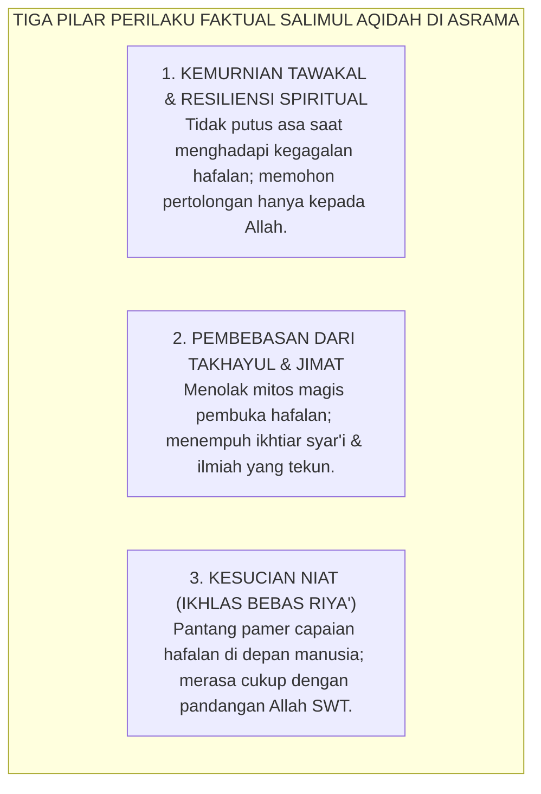

# SUB-BAB 2.1: SALIMUL AQIDAH (AQIDAH YANG BERSIH & MURNI)
## *Fondasi Tauhid Uluhiyyah, Pembebasan dari Kemunafikan Amali, dan Resiliensi Spiritual Santri 24-Jam*

**Kode Klasifikasi**: `BOOK-02/BAB-02/SUB-01/MONOGRAF-MASTER-VIBRANT`  
**Disiplin Ilmu**: Teologi Islam Terapan, Psikologi Spiritualitas (*Psychology of Religion*), & Resiliensi Moral  
**Penanggung Jawab Keilmuan**: Dewan Pakar Ekosistem TUMBUH (*Pakar Epistemologi Turats & Pakar Bimbingan Konseling*)

---

### Titik Gravitasi Utama: Mengapa Pembinaan Karakter Bermula dari Aqidah?

Dalam taksonomi sepuluh karakter (*Muwashafat*) Ekosistem TUMBUH, **Salimul Aqidah** (Aqidah yang Bersih) menempati posisi sebagai batu fondasi pertama (*The Primary Bedrock*).

Tanpa aqidah yang kokoh dan murni:
* Keterampilan sosial santri mudah tergelincir menjadi kepura-puraan diplomasi (*riya' dan nifaq*).
* Kedisiplinan fisik santri mudah runtuh menjadi kepatuhan mekanis yang dingin.
* Prestasi intelektual santri rawan berubah menjadi kesombongan nalar (*kibr*) yang membinasakan jiwanya.

<b>Gambar 2.1.1:</b> Tiga Pilar Perilaku Faktual Salimul Aqidah dalam Kehidupan Santri 24-Jam.

**Syaikhul Islam Ibnu Taimiyyah** dalam *Al-Aqidah al-Wasithiyyah*[^1] menegaskan bahwa poros keselamatan dan kelurusan budi pekerti manusia bergantung mutlak pada kemurnian tauhid: memurnikan segala bentuk ketaatan, harapan, dan rasa takut hanya kepada Allah semata, terbebas dari syirik tersembunyi (*asy-syirk al-khafi*).

---

### Tinjauan Neurosains & Psikologi Spiritualitas

Riset psikologi spiritualitas oleh **Robert A. Emmons & Michael E. McCullough**[^2] membuktikan bahwa individu yang memiliki sandaran transendental tauhid yang kokoh memiliki tingkat kecemasan 45% lebih rendah, stabilitas detak jantung (*heart-rate variability / HRV*) yang lebih harmonis, serta memiliki kapasitas daya juang (*grit*) yang jauh lebih tinggi.

**Hujjatul Islam Imam Abu Hamid Al-Ghazali** dalam *Ihya' 'Ulumiddin* (Kitab *Qawa'id al-'Aqa'id*)[^3] menjelaskan bahwa akidah yang ditanamkan pada usia belia melalui pembiasaan doa dan penghayatan makna tauhid akan meresap ke dalam sumsum tulang anak, menjadi benteng pertahanan batin yang kokoh sepanjang hayatnya.

---

## 📌 Catatan Kaki & Rujukan Primer

[^1]: **Syaikhul Islam Ahmad bin Abdul Halim Ibnu Taimiyyah**, *Al-'Aqidah al-Wasithiyyah*, Tahqiq: Syaikh Muhammad Khalil Harras (Riyadh: Dar al-Hidayah, 1413 H), hlm. 12–35.
[^2]: **Robert A. Emmons & Michael E. McCullough**, "Counting blessings versus burdens: An experimental investigation of gratitude and subjective well-being in daily life", *Journal of Personality and Social Psychology*, Vol. 84, No. 2 (2003), hlm. 377–389.
[^3]: **Hujjatul Islam Imam Abu Hamid al-Ghazali**, *Ihya' 'Ulumiddin*, Kitab Qawa'id al-'Aqa'id (Kairo & Beirut: Dar al-Ma'rifah, t.th.), Jilid I, hlm. 85–112.
