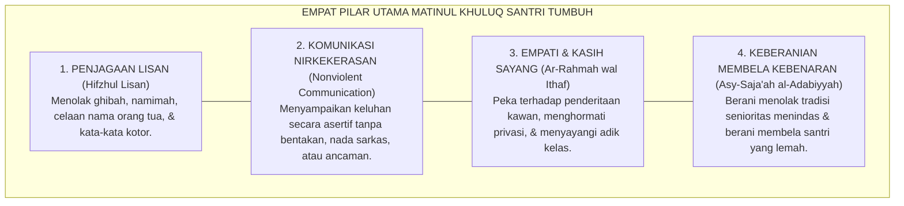
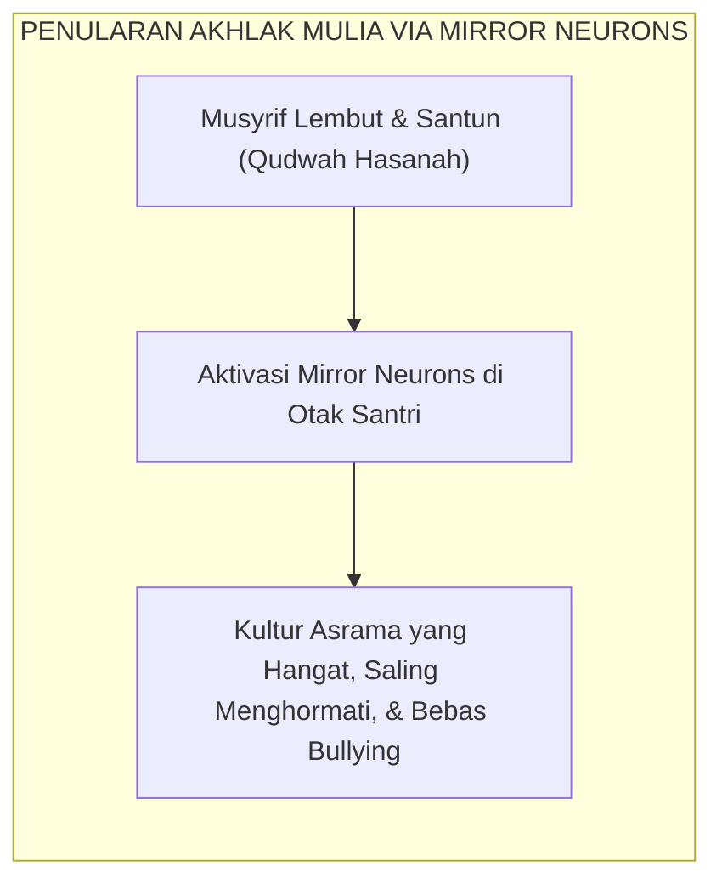

# SUB-BAB 2.2: MATINUL KHULUQ
## *Keluhuran Akhlak, Komunikasi Nirkekerasan, Penjagaan Lisan, dan Etika Relasional Pesantren*

**Kode Klasifikasi**: `BOOK-02/BAB-02/SUB-02/MONOGRAF-MASTER-VIBRANT`  
**Disiplin Ilmu**: Etika Moral Islam (*'Ilm al-Akhlaq*), Komunikasi Nirkekerasan (*Nonviolent Communication*), & Psikologi Hubungan Interpersonal  
**Penanggung Jawab Keilmuan**: Dewan Pakar Ekosistem TUMBUH (*Pakar Desain Kurikulum Adab & Pakar Bimbingan Konseling*)

---

### Makna Hakiki Matinul Khuluq: Kokoh Bagai Batu Karang, Lembut Bagai Sutra

Dalam diskursus pembinaan karakter pesantren, pilar ketiga yang menjadi mahkota kemuliaan santri adalah **Matinul Khuluq** (Akhlak yang Kokoh).

Kata *Matin* secara etimologis bermakna sesuatu yang sangat kuat, tidak mudah retak, dan memiliki daya tahan tinggi dalam menghadapi guncangan. 

Santri yang memiliki *Matinul Khuluq* bukanlah santri yang sekadar tampak santun di depan kamera pondok, melainkan santri yang:
* **Tidak mudah tersulut amarah** saat diejek atau dizalimi oleh kawannya.
* **Tetap menjaga tutur kata yang santun** bahkan ketika sedang berada dalam kondisi lelah, lapar, atau tertekan.
* **Menolak keras ikut serta dalam perundungan** (*bullying*) meskipun seluruh kawan sekamarnya melakukannya.

<b>Gambar 2.2.1:</b> Empat Pilar Utama Matinul Khuluq dalam Ekosistem TUMBUH.

**Al-Imam Abu Abdillah Muhammad bin Ismail al-Bukhari** dalam mahakaryanya *Al-Adab al-Mufrad*[^1] meriwayatkan sabda monumental Baginda Rasulullah SAW:
$$\text{إِنَّ مِنْ أَحَبِّكُمْ إِلَيَّ وَأَقْرَبِكُمْ مِنِّي مَجْلِسًا يَوْمَ الْقِيَامَةِ أَحَاسِنَكُمْ أَخْلَاقًا}$$
*"Sesungguhnya orang yang paling aku cintai di antara kalian dan yang paling dekat tempat duduknya denganku pada hari kiamat kelak adalah orang yang paling mulia akhlaknya di antara kalian!"* (HR. At-Tirmidzi no. 2018).

---

### Dekonstruksi Bahasa Toksik: Eliminasi Julukan Pejoratif (*Laqab*) di Asrama

Salah satu penyakit sosial paling merusak yang kerap dianggap "lelucon biasa" di asrama santri adalah pemberian julukan buruk (*tanabuz bil alqab*): memanggil kawan dengan sebutan binatang, ejekan fisik (*body shaming*), atau nama ayah dengan nada mencela.

Sains psikologi sosial dan neurosains afektif membuktikan bahwa **kekerasan verbal mengaktifkan jaringan rasa sakit (*pain matrix*) di otak yang sama persis dengan luka fisik akibat pukulan tongkat**.

Pakar komunikasi internasional **Marshall B. Rosenberg**[^2] dalam *Nonviolent Communication* (NVC) menegaskan bahwa bahasa penghakiman, sarkasme, dan pelabelan negatif adalah bentuk kekerasan terselubung (*tragic expression of unmet needs*) yang memutus jembatan empati antar-manusia.

Sistem TUMBUH menegakkan aturan baku **Zero Verbal Violence**:
1. **Larangan Mutlak Segala Bentuk Julukan Buruk**: Santri wajib memanggil sesamanya dengan nama aslinya yang baik atau panggilan persaudaraan yang mulia (*Akhi / Ukhti / Kang / Ning*).
2. **Pelatihan Protokol Komunikasi Asertif 4-Langkah (OFNR)**:
   * **Observasi (Observation)**: Menyatakan fakta tanpa menghakimi (*"Ketika sandal ana dipakai tanpa izin tadi pagi..."*).
   * **Perasaan (Feeling)**: Mengungkapkan perasaan secara jujur (*"...ana merasa terburu-buru dan cemas terlambat ke kelas."*).
   * **Kebutuhan (Need)**: Menyampaikan kebutuhan dasar (*"Ana butuh kepastian barang pribadi ana terjaga."*).
   * **Permintaan (Request)**: Mengajukan permintaan konkret (*"Maukah antum meminta izin terlebih dahulu jika hendak meminjam?"*).

---

### Integrasi Turats: Penjagaan Lisan (*Hifzhul Lisan*) Imam An-Nawawi

Panduan komunikasi santun ini berakar kuat pada bab khusus yang ditulis oleh **Imam Yahya bin Syaraf An-Nawawi** dalam *Riyadhus Shalihin* (Kitab *Hifzhil Lisan*)[^3] sebagai pedoman utama:

> [!NOTE]
> ### 📜 Kaidah Emas Imam An-Nawawi tentang Menjaga Lisan:
> 
> $$\text{اعْلَمْ أَنَّهُ يَنْبَغِي لِكُلِّ مُكَلَّفٍ أَنْ يَحْفَظَ لِسَانَهُ عَنْ جَمِيعِ الْكَلَامِ، إِلَّا كَلَامًا ظَهَرَتْ فِيهِ الْمَصْلَحَةُ. وَمَتَى اسْتَوَى الْكَلَامُ وَتَرْكُهُ فِي الْمَصْلَحَةِ، فَالسُّنَّةُ الْإِمْسَاكُ عَنْهُ}$$
> 
> **Artinya:**  
> *"Ketahuilah, sesungguhnya sepatutnya bagi setiap mukallaf (santri pembelajar) untuk menjaga lisannya dari segala perkataan, kecuali perkataan yang nyata-nyata mengandung kemaslahatan di dalamnya. Dan manakala berbicara dan diam memiliki kemaslahatan yang sama, maka sunnah yang utama adalah memilih diam."*

---

### Kecerdasan Sosial & Resonansi Afektif Pendidik

Pakar psikologi **Daniel Goleman**[^4] dalam risetnya tentang *Social Intelligence* membuktikan bahwa interaksi emosi bersifat menular (*emotional contagion*). Jika seorang musyrif membiasakan diri menyapa santri dengan senyuman tulus, tatapan mata yang hangat, dan nada bicara yang lembut, maka sel neuron cermin (*mirror neurons*) di otak seluruh santri sekamar akan menyerap dan merefleksikan kelembutan tersebut dalam pergaulan harian mereka.

<b>Gambar 2.2.2:</b> Penularan Kultural Akhlak Mulia dari Musyrif ke Santri.

Santri yang memiliki *Matinul Khuluq* menjadi pilar kedamaian di mana pun ia berada: tutur katanya menyejukkan, kehadirannya dirindukan, dan perilakunya menjadi cermin kemuliaan ajaran Islam di hadapan umat manusia.

---

## 📌 Catatan Kaki & Rujukan Primer

[^1]: **Al-Imam Abu Abdillah Muhammad bin Ismail al-Bukhari**, *Al-Adab al-Mufrad*, Tahqiq: Syaikh Muhammad Fu'ad Abdul Baqi (Kairo: Al-Mathba'ah as-Salafiyyah, 1379 H; cetak ulang Beirut: Dar al-Basyair al-Islamiyyah, 1989), Bab "Husnul Khuluq", hlm. 102–115.
[^2]: **Marshall B. Rosenberg**, *Nonviolent Communication: A Language of Life* (Encinitas: PuddleDancer Press, 1999; Edisi ke-3, 2015), Bab 1: "Giving from the Heart", hlm. 1–18.
[^3]: **Al-Imam Abu Zakariyya Yahya bin Syaraf an-Nawawi**, *Riyadhus Shalihin min Kalami Sayyidil Mursalin*, Tahqiq: Syaikh Syu'aib al-Arnauth (Beirut: Mu'assasah ar-Risalah, 1993), Kitab Hifzhil Lisan, hlm. 438–455.
[^4]: **Daniel Goleman**, *Social Intelligence: The New Science of Human Relationships* (New York: Bantam Books, 2006), Bab 1: "Emotional Contagion", hlm. 11–32.
