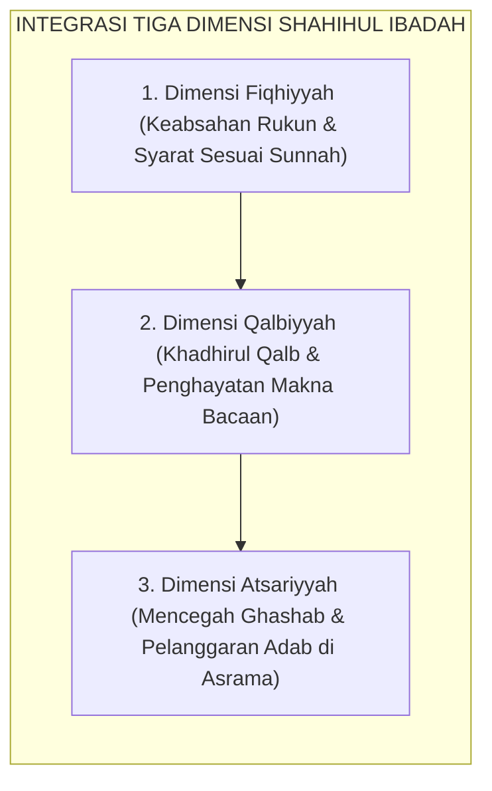

# SUB-BAB 2.2: SHAHIHUL IBADAH (IBADAH YANG BENAR SESUAI SUNNAH)
## *Standarisasi Fiqih Ibadah, Kekhusyukan Thaharah & Shalat, serta Pembiasaan Dzikir Ma'tsurat 24-Jam*

**Kode Klasifikasi**: `BOOK-02/BAB-02/SUB-02/MONOGRAF-MASTER-VIBRANT`  
**Disiplin Ilmu**: Fiqih Ibadah Terapan Syafi'iyyah, Psikologi Kekhusyukan (*Mindfulness in Prayer*), & Habitual Worship  
**Penanggung Jawab Keilmuan**: Dewan Pakar Ekosistem TUMBUH (*Pakar Epistemologi Turats & Pakar Pengasuhan Asrama*)

---

### Ibadah yang Sah, Khusyuk, dan Mencegah Kemunkaran

Pilar kedua karakter santri adalah **Shahihul Ibadah** (Ibadah yang Benar Sesuai Sunnah Nabawiyyah).

Ibadah yang benar bukan hanya sekadar memenuhi keabsahan rukun dan syarat fiqih formal, melainkan memancarkan kekhusyukan batin yang berdampak nyata pada pencegahan perbuatan keji dan munkar di bilik asrama:

<b>Gambar 2.2.1:</b> Tiga Dimensi Integratif Shahihul Ibadah Santri TUMBUH.

---

### Indikator Perilaku Faktual Shahihul Ibadah di Asrama

1. **Kesempurnaan Thaharah & Wudhu**: Santri mempraktikkan wudhu secara higienis, hemat air (*la tusrif*), membersihkan najis secara tuntas, dan merapikan pakaian shalatnya agar selalu harum dan suci.
2. **Kelaziman Shalat Berjamaah di Shaf Pertama**: Santri hadir di masjid sebelum adzan berkumandang, merapatkan shaf dengan santun, dan melazimi dzikir ma'tsurat ba'da shalat.
3. **Kekhusyukan Dzikir & Doa Ma'tsurat**: Mengikuti panduan **Imam An-Nawawi** dalam *Al-Adzkar*[^1], santri melazimi dzikir pagi-petang dan doa harian dengan penghayatan makna yang mendalam.

**Hujjatul Islam Imam Abu Hamid Al-Ghazali** dalam *Ihya' 'Ulumiddin* (Kitab *Asrar ash-Shalah*)[^2] menegaskan bahwa shalat tanpa kehadiran hati (*hudhurul qalb*) laksana tubuh tanpa ruh yang tidak akan mampu menghalau bisikan hawa nafsu.

---

## 📌 Catatan Kaki & Rujukan Primer

[^1]: **Al-Imam Abu Zakariyya Yahya bin Syaraf an-Nawawi**, *Al-Adzkar al-Muntakhabah min Kalami Sayyidil Abrar*, Tahqiq: Syaikh Syu'aib al-Arnauth (Damaskus: Dar al-Mallah, 1971; cetak ulang Beirut: Dar Ibnu Katsir, 2004), hlm. 45–98.
[^2]: **Hujjatul Islam Imam Abu Hamid al-Ghazali**, *Ihya' 'Ulumiddin*, Kitab Asrar ash-Shalah wa Muhimmatuha (Kairo & Beirut: Dar al-Ma'rifah, t.th.), Jilid I, hlm. 145–172.
