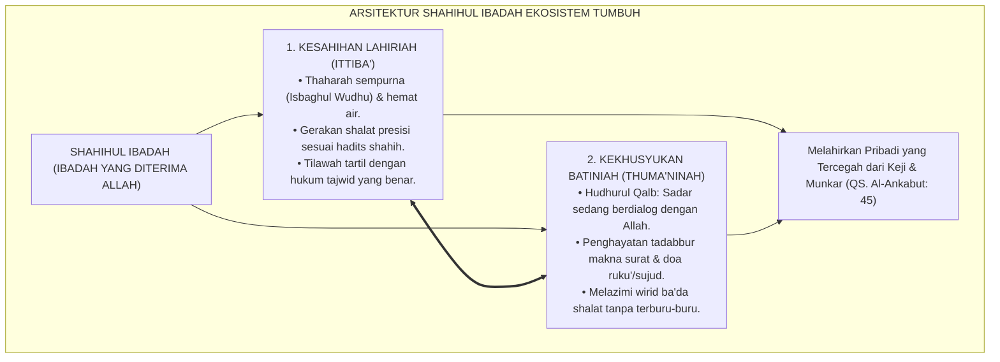
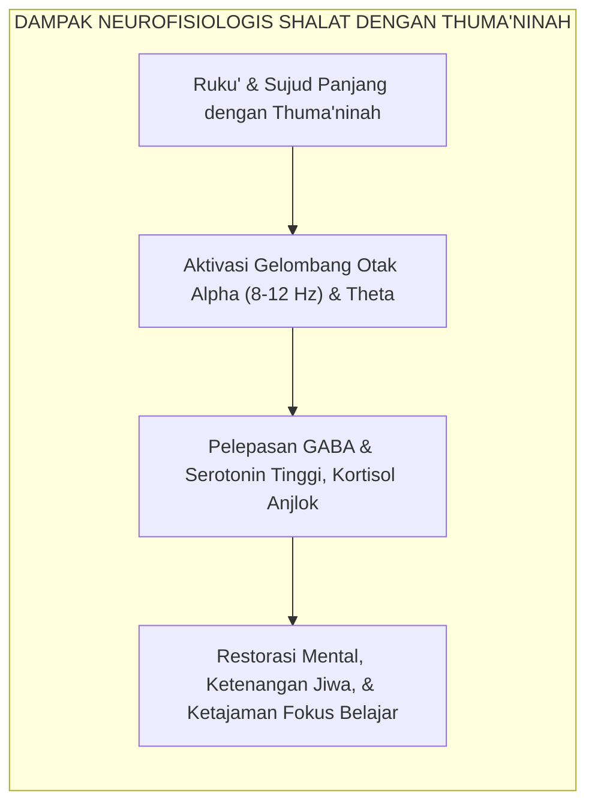

# SUB-BAB 2.2: SHAHIHUL IBADAH (IBADAH YANG BENAR & KHUSYUK)
## *Sinergi Keselarasan Sunnah Nabawiyyah, Kesucian Thaharah, dan Thuma'ninah Batin dalam Ritme Ibadah 24-Jam*

**Kode Klasifikasi**: `BOOK-02/BAB-02/SUB-02/MONOGRAF-MASTER-VIBRANT`  
**Disiplin Ilmu**: Fiqih Ibadah Terapan, Epistemologi Sunnah, Neurofisiologi Relaksasi & Gelombang Otak, & Psikologi Ibadah  
**Penanggung Jawab Keilmuan**: Dewan Pakar Ekosistem TUMBUH (*Master Author, Pakar Epistemologi Turats, & Pakar Neurosains Perkembangan*)

---

### I. Hakikat Shahihul Ibadah: Melampaui Ritualitas Mekanis Tanpa Jiwa

Di banyak lingkungan pesantren, pemandangan berikut sering kali terjadi: ketika adzan berkumandang, ratusan santri berlari tergesa-gesa ke tempat wudhu. Air kran dibuka sebesar-besarnya hingga memercik ke mana-mana, basuhan wudhu dilakukan secara kilat dalam hitungan detik tanpa meratakan air ke sela-sela jari, lalu mereka berhamburan masuk masjid untuk mendirikan shalat. Di dalam shalat, gerakan ruku' dan sujud dilakukan dengan sangat cepat bagaikan patukan ayam (*naqratan ka naqratid dik*), tanpa ada jeda ketenangan (*thuma'ninah*), dan begitu salam terucap, santri langsung berhamburan keluar masjid tanpa sempat melafalkan sebaris dzikir.

Pemandangan ini menyingkap sebuah krisis pedagogis: **ibadah telah tereduksi menjadi sekadar beban rutinitas mekanis yang dingin**. Santri menjalankan ibadah semata-mata demi menggugurkan kewajiban absensi musyrif, kehilangan hakikat kekhusyukan dan keindahan perjumpaan dengan Allah SWT.

Dalam Ekosistem TUMBUH, **Shahihul Ibadah** (Ibadah yang Benar dan Sah) ditegakkan di atas dua sayap yang tak terpisahkan:
1. **Keselarasan Lahiriah Sesuai Sunnah (*Ittiba'us Sunnah*)**: Menjalankan setiap tata cara wudhu, shalat, puasa, dan dzikir sesuai tuntunan otentik Baginda Rasulullah SAW tanpa bid'ah dan penyimpangan.
2. **Kekhusyukan dan Ketenangan Batin (*Thuma'ninah & Khusyu'*)**: Menghadirkan hati (*hudhurul qalb*), memahami makna setiap bacaan, dan menikmati setiap sujud sebagai momen istirahat rohani dari keletihan duniawi.

<b>Gambar 2.2.1:</b> Arsitektur Sinergi Dimensi Lahiriah dan Batiniah Shahihul Ibadah.

---

### II. Khazanah Turats: Syarah Imam Nawawi & Tingkatan Shalat Ibnu Qayyim

Para ulama fiqih dan tasawuf telah menegaskan bahwa ibadah tanpa thuma'ninah dan ilmu adalah amalan yang batil atau cacat nilainya.

#### 1. Wajibnya Meneladani Tata Cara Shalat Rasulullah SAW
Dalam hadits monumental yang diriwayatkan oleh **Imam Al-Bukhari**[^1], Rasulullah SAW bersabda:

$$\text{صَلُّوا كَمَا رَأَيْتُمُونِي أُصَلِّي}$$

**Artinya:** *"Shalatlah kalian sebagaimana kalian melihat aku shalat."*

**Imam Abu Zakariyya Yahya bin Syaraf An-Nawawi** dalam *Riyadhus Shalihin* dan *Al-Minhaj Syarh Shahih Muslim*[^2] menjelaskan bahwa hadits ini adalah perintah mutlak bagi setiap pendidik untuk mengajarkan fiqih ibadah secara terperinci kepada santri: mulai dari cara bertakbir, meletakkan tangan di dada, meluruskan punggung saat ruku', hingga kesempurnaan sujud di atas tujuh anggota badan.

#### 2. Lima Tingkatan Manusia dalam Menjalankan Shalat Menurut Ibnu Qayyim
Dalam kitabnya *Al-Wabil ash-Shayyib* dan *Madarij as-Salikin*[^3], **Imam Ibnu Qayyim al-Jawziyyah** membagi orang yang shalat ke dalam lima tingkatan (*maratib*):

| Tingkatan Shalat | Keadaan Hati dan Kualitas Wudhu/Shalat | Konsekuensi Akhirat |
| :--- | :--- | :--- |
| **1. Al-Mu'aqab (Tersiksa)** | Wudhu tidak sempurna, waktu terabaikan, rukun lahir dan batin rusak. | Disiksa karena meremehkan shalat. |
| **2. Al-Muhasab (Dihisab/Dicela)** | Menjaga rukun lahir shalat, namun pikirannya hanyut total dalam lamunan duniawi. | Dihisab dan tidak mendapat pahala. |
| **3. Al-Mukaffar 'Anhu (Diampuni)** | Menjaga rukun lahir dan berusaha melawan bisikan was-was setan sepanjang shalatnya. | Diampuni dosa-dosa kecilnya. |
| **4. Al-Muthab (Diberi Pahala)** | Menyempurnakan hak shalat, rukunnya, dan hatinya tenggelam dalam kekhusyukan. | Diberi ganjaran pahala yang besar. |
| **5. Al-Muqarrab (Didekatkan)** | Shalat di mana ia memandang Allah dengan mata hatinya, menjadikan shalat sebagai penyejuk jiwanya (*qurratu 'ain*). | Berada di kedudukan tertinggi di sisi Allah. |

Pendidikan karakter TUMBUH membimbing santri bertransisi dari tingkatan 1 dan 2 (yang sekadar menggugurkan kewajiban mekanis) menuju tingkatan 4 dan 5: menjadikan ibadah sebagai kenikmatan dan benteng moral hidupnya.

---

### III. Tinjauan Sains: Neurofisiologi Thuma'ninah & Gelombang Otak

Riset neurosains mutakhir membuktikan bahwa praktik ibadah yang dijalankan dengan thuma'ninah memberikan dampak neurofisiologis yang sangat menakjubkan:

#### 1. Dominasi Gelombang Otak Alpha dan Theta Saat Khusyuk
Riset neurobiologi oleh **Dr. Andrew Newberg**[^4] mengenai aktivitas otak saat meditasi dan doa khusyuk membuktikan bahwa ketika seseorang melambatkan gerakannya dan menghadirkan fokus batin (thuma'ninah), terjadi perubahan frekuensi gelombang otak dari gelombang *Beta* tinggi (stres dan cemas) menuju gelombang *Alpha* (8–12 Hz) dan *Theta* (4–7 Hz).

Pada kondisi gelombang Alpha ini:
* Aktivitas amigdala (pusat emosi agresi dan rasa takut) mereda drastis.
* Sistem saraf parasimpatis teraktivasi, menurunkan denyut jantung dan menstabilkan tekanan darah.
* Otak melepaskan neurotransmiter ketenangan (*GABA, Serotonin, dan Endorfin*), yang merestorasi kebugaran mental santri setelah lelah belajar seharian.

Santri yang shalat dengan tergesa-gesa kehilangan seluruh manfaat biologis dan spiritual ini; otaknya tetap berada dalam kondisi stres kortisol tinggi.

<b>Gambar 2.2.2:</b> Alur Dampak Neurofisiologis Shalat Thuma'ninah terhadap Pemulihan Mental Santri.

---

### IV. Matriks Indikator Perilaku Faktual Shahihul Ibadah (24 Jam)

| Aktivitas Ibadah Harian | Indikator Perilaku Positif (Shahihul Ibadah) | Perilaku Defisit / Distorsi | Protokol Intervensi Sistemik TUMBUH |
| :--- | :--- | :--- | :--- |
| **Thaharah & Wudhu** | Berwudhu tertib, membasuh sempurna (*isbagh*), dan hemat air (kran dibuka 1/3 putaran). | Membuka kran air deras berlebihan (*israf*), tumit tidak basah, bercanda saat wudhu. | Simulasi wudhu praktis di depan musyrif asrama dengan takaran 1 gayung air nabawi. |
| **Shalat Berjamaah** | Datang sebelum adzan/iqamah, merapatkan shaf bahu ke bahu, ruku' dan sujud thuma'ninah. | Terlambat masbuq, saf bolong-bolong, shalat kilat tanpa thuma'ninah, pandangan melirik ke mana-mana. | Bimbingan shaf disiplin oleh santri senior penggerak dan larangan shalat tergesa-gesa. |
| **Dzikir & Wirid Ba'da Shalat** | Duduk tenang melazimi istighfar 3x, tasbih, tahmid, takbir 33x, ayat kursi, dan doa ma'tsur. | Langsung kabur meloncat keluar masjid begitu imam salam pertama; ribut di teras masjid. | Mentradisikan dzikir sirr bersama dipimpin santri giliran, disertai renungan makna doa. |
| **Tilawah Al-Qur'an Harian** | Membaca tartil dengan makharijul huruf dan tajwid benar, menjaga mushaf di tempat terhormat. | Membaca cepat tanpa tajwid demi kejar target lembar (*khatam-oriented*), meletakkan mushaf di lantai. | Klinik Tahsin Tajwid berkala dan halaqah tadabbur 1 ayat pilihan setiap maghrib. |

---

### V. Solusi Sistemik TUMBUH: Laboratorium Fiqih Ibadah Aplikatif

Untuk memastikan ibadah santri benar dan khusyuk, lembaga menerapkan:
1. **Asesmen Fiqih Praktis 1-on-1 Berkala**: Setiap awal semester, setiap santri diuji praktik wudhu, tayamum, adzan, dan shalat jenazah oleh ustadz penguji untuk memastikan tidak ada kesalahan gerakan atau bacaan.
2. **Karantina Hening (*Digital & Activity Fasting*) 15 Menit Menjelang Adzan**: Seluruh aktivitas olahraga dan asrama dihentikan 15 menit sebelum adzan berkumandang, memberi ruang bagi santri untuk membersihkan diri dan memasuki masjid dalam keadaan tenang.

---

## 📌 Catatan Kaki & Rujukan Primer

[^1]: **Al-Imam Abu Abdillah Muhammad bin Ismail al-Bukhari**, *Shahih al-Bukhari*, Kitab al-Adzan, Bab Adzan lil Musafir (Beirut: Dar Thuq an-Najah, 1422 H), Hadits No. 631.
[^2]: **Al-Imam Abu Zakariyya Yahya bin Syaraf an-Nawawi**, *Al-Minhaj Syarh Shahih Muslim bin al-Hajjaj* (Kairo: Al-Mathba'ah al-Mishriyyah, 1930), Jilid IV, hlm. 102–125; serta **An-Nawawi**, *Riyadhus Shalihin*, Tahqiq: Syaikh Syu'aib al-Arnauth (Beirut: Mu'assasah ar-Risalah, 1993), Bab Fadhl ash-Shalawat, hlm. 340–358.
[^3]: **Al-Imam Syamsuddin Ibnu Qayyim al-Jawziyyah**, *Al-Wabil ash-Shayyib min al-Kalim ath-Thayyib*, Tahqiq: Syaikh Salim al-Hilali (Kairo: Dar Ibn Affan, 1999), hlm. 48–56; serta **Ibnu Qayyim**, *Madarij as-Salikin bayna Manazil Iyyaka Na'budu wa Iyyaka Nasta'in* (Beirut: Dar al-Kitab al-'Arabi, 1416 H), Jilid I, hlm. 520–535.
[^4]: **Andrew Newberg & Mark Robert Waldman**, *How God Changes Your Brain: Breakthrough Findings from a Leading Neuroscientist* (New York: Ballantine Books, 2009), Bab 2 & 4: "Brain Scan Studies of Spiritual Practices", hlm. 37–68, 85–112.
