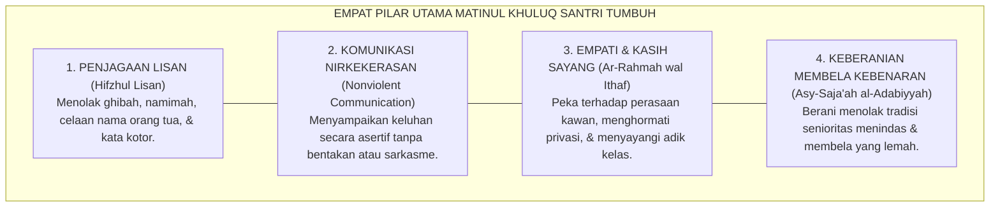

# SUB-BAB 2.3: MATINUL KHULUQ (AKHLAK YANG KOKOH & SANTUN)
## *Keluhuran Budi Pekerti, Komunikasi Nirkekerasan (NVC), Penjagaan Lisan, dan Etika Relasional Pesantren*

**Kode Klasifikasi**: `BOOK-02/BAB-02/SUB-03/MONOGRAF-MASTER-VIBRANT`  
**Disiplin Ilmu**: Etika Moral Islam (*'Ilm al-Akhlaq*), Komunikasi Nirkekerasan (*Nonviolent Communication*), & Hubungan Interpersonal  
**Penanggung Jawab Keilmuan**: Dewan Pakar Ekosistem TUMBUH (*Pakar Desain Kurikulum Adab & Pakar Bimbingan Konseling*)

---

### Makna Hakiki Matinul Khuluq: Kokoh Bagai Batu Karang, Lembut Bagai Sutra

Pilar ketiga yang menjadi mahkota kemuliaan santri adalah **Matinul Khuluq** (Akhlak yang Kokoh).

Santri yang memiliki *Matinul Khuluq* bukanlah santri yang sekadar tampak santun di depan kamera pondok, melainkan santri yang:
* **Tidak mudah tersulut amarah** saat diejek atau dizalimi oleh kawannya.
* **Tetap menjaga tutur kata santun** bahkan ketika sedang berada dalam kondisi lelah, lapar, atau tertekan.
* **Menolak keras ikut serta dalam perundungan** (*bullying*) meskipun seluruh kawan sekamarnya melakukannya.

<b>Gambar 2.3.1:</b> Empat Pilar Utama Matinul Khuluq dalam Ekosistem TUMBUH.

**Al-Imam Abu Abdillah Muhammad bin Ismail al-Bukhari** dalam *Al-Adab al-Mufrad*[^1] meriwayatkan sabda monumental Rasulullah SAW: *"Sesungguhnya orang yang paling aku cintai di antara kalian dan paling dekat majelisnya denganku pada hari kiamat adalah orang yang paling mulia akhlaknya."* (HR. At-Tirmidzi no. 2018).

Pakar komunikasi **Marshall B. Rosenberg**[^2] dalam *Nonviolent Communication* menegaskan bahwa bahasa penghakiman, sarkasme, dan pelabelan negatif adalah bentuk kekerasan terselubung yang memutus jembatan empati antar-manusia.

**Al-Imam Yahya bin Syaraf an-Nawawi** dalam *Riyadhus Shalihin* (Kitab *Hifzhil Lisan*)[^3] menggarisbawahi kewajiban menjaga lisan dari segala ucapan kecuali yang nyata-nyata mengandung kemaslahatan syar'i.

---

## 📌 Catatan Kaki & Rujukan Primer

[^1]: **Al-Imam Abu Abdillah Muhammad bin Ismail al-Bukhari**, *Al-Adab al-Mufrad*, Tahqiq: Syaikh Muhammad Fu'ad Abdul Baqi (Beirut: Dar al-Basyair al-Islamiyyah, 1989), Bab "Husnul Khuluq", hlm. 102–115.
[^2]: **Marshall B. Rosenberg**, *Nonviolent Communication: A Language of Life* (Encinitas: PuddleDancer Press, 1999; Edisi ke-3, 2015), Bab 1: "Giving from the Heart", hlm. 1–18.
[^3]: **Al-Imam Abu Zakariyya Yahya bin Syaraf an-Nawawi**, *Riyadhus Shalihin min Kalami Sayyidil Mursalin*, Tahqiq: Syaikh Syu'aib al-Arnauth (Beirut: Mu'assasah ar-Risalah, 1993), Kitab Hifzhil Lisan, hlm. 438–455.
