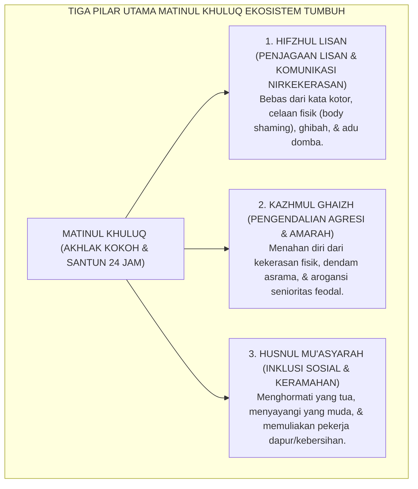
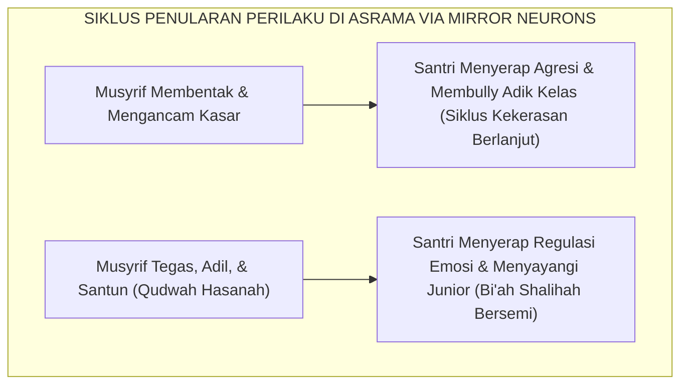

# MATINUL KHULUQ (AKHLAK YANG KOKOH & SANTUN)

---
### I. Hakikat Matinul Khuluq: Akhlak yang Tahan Uji dalam Situasi Tertekan

Banyak orang mengira bahwa seorang santri telah berakhlak mulia hanya karena ia mampu bersikap manis, mencium tangan kiai, dan bertutur kata lembut di depan tamu pondok. Namun, dalam psikologi karakter sejati, kesantunan yang ditampilkan dalam situasi tenang dan diawasi publik bukanlah ukuran kematangan akhlak yang sebenarnya.

Ujian sesungguhnya dari **Matinul Khuluq** (Akhlak yang Kokoh, Tangguh, dan Mendarah Daging) baru terbukti pada **situasi-situasi kritis bertekanan tinggi**:
* Ketika seorang santri disenggol hingga tumpah makanannya oleh kawan yang terburu-buru;
* Ketika sandal kesayangannya tertukar atau dipakai tanpa izin saat hujan lebat;
* Ketika tubuhnya lelah luar biasa setelah tugas piket malam dan ia mendapati ranjangnya diberantaki oleh kawan sekamar.

Santri yang akhlaknya rapuh (*fragile morals*) akan langsung meledak dalam caci maki, mengeluarkan sumpah serapah bernada hewani, atau melayangkan pukulan fisik. Sebaliknya, santri yang memiliki *Matinul Khuluq* memiliki bantalan kesabaran batin yang kokoh: ia mampu menahan gelombang amarahnya, memaafkan kekhilafan kawannya, dan menyelesaikan persoalan dengan komunikasi asertif tanpa melukai martabat sesama.

<b>Gambar 2.3.1:</b> Tiga Pilar Operasional Matinul Khuluq dalam Kehidupan Komunal Pesantren.

---

### II. Khazanah Turats: Syarah Hadhratusy Syaikh KH. M. Hasyim Asy'ari & Hadits Nabawi

Kemuliaan akhlak adalah puncak dari seluruh risalah kenabian Islam. Dalam hadits shahih yang diriwayatkan oleh **Imam Al-Bukhari** dalam *Al-Adab al-Mufrad*[^1], Rasulullah SAW menegaskan:

$$\text{إِنَّمَا بُعِثْتُ لِأُتَمِّمَ مَكَارِمَ الْأَخْلَاقِ}$$

**Artinya:** *"Sesungguhnya aku diutus semata-mata untuk menyempurnakan kemuliaan budi pekerti."*

Rasulullah SAW juga meredefinisi hakikat kekuatan dan kejantanan seorang muslim dalam sabdanya yang diriwayatkan oleh **Imam Al-Bukhari & Muslim**[^2]:

$$\text{لَيْسَ الشَّدِيدُ بِالصُّرَعَةِ، إِنَّمَا الشَّدِيدُ الَّذِي يَمْلِكُ نَفْسَهُ عِنْدَ الْغَضَبِ}$$

**Artinya:** *"Orang yang kuat bukanlah orang yang jago bergulat menjatuhkan lawan; sesungguhnya orang yang kuat sejati adalah orang yang mampu menguasai dirinya saat amarahnya membuncah."*

Dalam kitab monumental *Adab al-'Alim wal Muta'allim*[^3], **Hadhratusy Syaikh KH. M. Hasyim Asy'ari** meletakkan pedoman etika pergaulan antarpenuntut ilmu:
> *"Wajib bagi seorang penuntut ilmu untuk menghiasi lisannya dengan kejujuran, kelembutan, dan kerendahan hati. Diharamkan baginya memanggil kawan dengan julukan yang dibenci, mengejek kekurangan fisiknya, atau merasa dirinya lebih mulia dibanding saudaranya. Hubungan antarsantri harus dibangun di atas dasar saling menolong (*ta'awun*), saling memaafkan (*tasamuh*), dan menjaga kehormatan saudara seiman bagaikan menjaga kehormatan dirinya sendiri."*

---

### III. Tinjauan Sains: Nonviolent Communication (NVC) & Sistem Cermin Otak

Transformasi akhlak santri dari agresi menuju kelembutan didukung secara solid oleh sains komunikasi dan neurosains modern:

#### 1. Kerangka Kerja Nonviolent Communication (NVC) Marshall Rosenberg
Pakar psikologi perdamaian dunia **Dr. Marshall B. Rosenberg**[^4] merumuskan metode *Nonviolent Communication* (NVC) yang selaras dengan nilai *Hifzhul Lisan*. Santri dilatih untuk mengubah pola komunikasi menyalahkan (*judgmental communication*) menjadi **Empat Langkah NVC (OFNR)**:
1. **Observasi (*Observation*)**: Menyampaikan fakta objektif tanpa menghakimi (*"Zaid, sandal saya tadi berada di depan pintumu"* bukan *"Kamu maling sandal!"*).
2. **Perasaan (*Feelings*)**: Mengungkapkan perasaan emosional yang dirasakan (*"Saya merasa panik dan cemas karena takut terlambat shalat subuh"*).
3. **Kebutuhan (*Needs*)**: Menjelaskan kebutuhan mendasar yang belum terpenuhi (*"Karena saya membutuhkan kepastian waktu untuk wudhu"*).
4. **Permintaan (*Requests*)**: Mengajukan permintaan yang konkret dan santun (*"Maukah kamu mengembalikan sandal saya ke rak setelah selesai memakainya?"*).

#### 2. Sistem Neuron Cermin (*Mirror Neuron System*) dalam Penularan Akhlak
Riset neurosains kognitif oleh **Giacomo Rizzolatti**[^5] membuktikan bahwa otak manusia dilengkapi dengan *Mirror Neurons* (sistem saraf cermin) yang secara otomatis meniru ekspresi emosi dan perilaku orang di sekitarnya.

Ketika musyrif asrama merespons pelanggaran santri dengan bentakan, kata-kata kasar, dan ancaman fisik, sistem cermin otak santri menyerap pola kekerasan tersebut dan menduplikasikannya kepada adik kelas (*the cycle of violence*). Sebaliknya, ketika musyrif menampilkan ketenangan yang berwibawa (*firm and kind*), sirkuit cermin otak santri belajar meregulasi emosinya dan meniru keteladanan tersebut dalam relasi sosial antarkamar.

<b>Gambar 2.3.2:</b> Penularan Pola Perilaku di Asrama melalui Mekanisme Sistem Saraf Cermin (Mirror Neurons).

---

### IV. Matriks Indikator Perilaku Faktual Matinul Khuluq (24 Jam)

| Ranah Interaksi Harian | Indikator Perilaku Positif (Matinul Khuluq) | Perilaku Defisit / Pelanggaran Karakter | Tindakan Restoratif Terbimbing TUMBUH |
| :--- | :--- | :--- | :--- |
| **Friksi & Perselisihan Kamar** | Menarik napas panjang saat marah, berwudhu, dan menyampaikan keluhan secara asertif dengan formula NVC. | Mengumpat kasar, membanting pintu, memukul fisik, atau menyimpan dendam berhari-hari. | Mediasi damai restoratif oleh Duta Ishlah Kamar sebelum santri tidur malam. |
| **Relasi Senior-Junior** | Menjadi pelindung yang membimbing adik kelas dengan penuh kasih sayang dan teladan adab. | Menerapkan senioritas feodal: menyuruh cuci baju paksa, memukul, atau membentak adik kelas. | Sanksi restoratif: pencabutan hak memimpin asrama dan kewajiban mentoring adab bersama musyrif. |
| **Interaksi dengan Petugas Dapur & Kebersihan** | Menyapa santun, mengucapkan terima kasih (*Jazakallahu khair*), dan membantu meringankan tugas. | Menatap merendahkan, melempar piring kotor sembarangan, atau menuntut layanan seperti majikan. | Pelatihan khidmah sosial: santri piket membersihkan area dapur bersama staf kebersihan. |
| **Komunikasi Digital & Obrolan Santai** | Memilih kata-kata yang menyejukkan, menolak ghibah, dan menyetop perundungan di grup percakapan. | Membuat lelucon yang merendahkan nama orang tua atau bentuk fisik kawan (*body shaming*). | Refleksi bahaya dosa lisan dan kewajiban meminta maaf langsung kepada korban. |

---

### V. Solusi Sistemik TUMBUH: Dewan Ishlah Restoratif & Piagam Bebas Intimidasi

Untuk menjaga iklim akhlak yang kokoh, lembaga menetapkan:
1. **Piagam Anti-Kekerasan Mutlak (*Zero Tolerance to Violence Policy*)**: Melarang secara mutlak segala bentuk hukuman fisik, pemukulan dengan gesper/rotan, dan kekerasan verbal oleh siapa pun di dalam pondok.
2. **Kaderisasi Duta Ishlah Sebaya (*Peer Restorative Ambassadors*)**: Di setiap kamar dilatih 1 santri berkarakter matang sebagai mediator damai yang membantu menengahi perselisihan kecil kawan sekamarnya sebelum membesar.

---

## 📌 Catatan Kaki & Rujukan Primer

[^1]: **Al-Imam Abu Abdillah Muhammad bin Ismail al-Bukhari**, *Al-Adab al-Mufrad*, Tahqiq: Syaikh Muhammad Fu'ad Abdul Baqi (Beirut: Dar al-Basyair al-Islamiyyah, 1989), Bab Husnul Khuluq, Hadits No. 273; serta **Al-Imam Ahmad bin Hanbal**, *Al-Musnad*, Hadits No. 8952.
[^2]: **Al-Imam Abu Abdillah Muhammad bin Ismail al-Bukhari**, *Shahih al-Bukhari*, Kitab al-Adab, Bab al-Hadzar minal Ghadhab, Hadits No. 6114; serta **Al-Imam Muslim bin al-Hajjaj**, *Shahih Muslim*, Kitab al-Birr wash-Shilah wal Adab, Hadits No. 2609.
[^3]: **Hadhratusy Syaikh KH. M. Hasyim Asy'ari**, *Adab al-'Alim wal Muta'allim fi ma Yahtaju Ilayhi al-Muta'allim fi Ahwal Ta'allumihi wa ma Yatawaqqafu 'alayhi al-Mu'allim fi Maqamat Ta'limihi* (Jombang: Maktabah at-Turats al-Islami, 1415 H), Bab 2: "Fi Adabil Muta'allim ma'a Ikhwanihi wa Aqranihi", hlm. 28–39.
[^4]: **Marshall B. Rosenberg**, *Nonviolent Communication: A Language of Life* (Encinitas: PuddleDancer Press, 2003; Edisi ke-3, 2015), Bab 1–4, hlm. 1–66.
[^5]: **Giacomo Rizzolatti & Corrado Sinigaglia**, *Mirrors in the Brain: How Our Minds Share Actions and Emotions* (Oxford: Oxford University Press, 2008), Bab 5 & 6: "Empathy and the Mirror System", hlm. 135–184.
