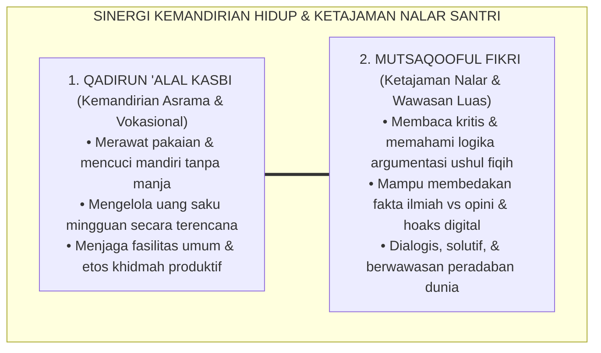

# SUB-BAB 2.3: QADIRUN 'ALAL KASBI & MUTSAQQAFUL FIKRI
## *Kemandirian Hidup, Etos Kerja Asrama, Kedalaman Intelektual, dan Keterampilan Berpikir Kritis*

**Kode Klasifikasi**: `BOOK-02/BAB-02/SUB-03/MONOGRAF-MASTER-VIBRANT`  
**Disiplin Ilmu**: Pendidikan Kemandirian Vokasional, Filsafat Ilmu Kritis (*Critical Thinking*), & Psikologi Kognitif  
**Penanggung Jawab Keilmuan**: Dewan Pakar Ekosistem TUMBUH (*Pakar Psikologi Belajar & Pakar Tata Kelola Qudwah*)

---

### Mematahkan Stereotip Santri: Antara Kemandirian Finansial dan Ketajaman Nalar

Salah satu tantangan besar alumni pesantren di era modern adalah tudingan miring bahwa lulusan pondok hanya pandai berdoa dan menghafal matan, namun tidak memiliki kecakapan hidup mandiri (*life skills*) dan gagap menghadapi dinamika peradaban global yang kompleks.

Ekosistem TUMBUH menjawab tantangan ini melalui dua pilar karakter komplementer:
1. **Qadirun 'alal Kasbi**: Memiliki kemampuan mandiri, etos kerja tinggi, tanggung jawab finansial, dan kesiapan berkarya secara mandiri.
2. **Mutsaqqoful Fikri**: Memiliki wawasan intelektual yang luas, menguasai literasi Turats klasik, sekaligus memiliki nalar kritis ilmiah (*critical thinking*) dalam merespons perkembangan ilmu pengetahuan modern.

<b>Gambar 2.3.1:</b> Sinergi Kemandirian Hidup dan Ketajaman Nalar Santri TUMBUH.

**Al-Imam Abu al-Hasan al-Mawardi** dalam *Adab ad-Dunya wad-Din*[^1] menegaskan bahwa kemuliaan seorang penuntut ilmu hanya akan sempurna jika ditopang oleh dua pilar: kebersihan mata pencaharian yang halal (*kifayatul ma'asy*) dan kecemerlangan akal budi yang terus diasah dengan ilmu (*shafa'ul aql*).

---

### Indikator Perilaku Faktual Qadirun 'alal Kasbi di Asrama 24 Jam

Kemandirian di pesantren tidak harus menunggu santri lulus mendirikan perusahaan, melainkan dibangun dari hal-hal mikro di bilik asrama setiap hari:

1. **Kemandirian Perawatan Diri (*Self-Sufficiency*)**:  
   Santri mencuci pakaian pribadinya secara teratur, menjemur pada tempatnya, melipat rapi ke dalam lemari, dan menjahit kancing bajunya yang lepas secara mandiri tanpa bergantung pada orang tua atau adik kelas.
2. **Literasi Keuangan Syar'i (*Financial Self-Regulation*)**:  
   Santri membuat catatan pengeluaran uang saku mingguan, menyisihkan sebagian uang sakunya untuk kotak infaq Jumat, serta menghindari budaya konsumerisme jajan berlebihan di kantin pondok.
3. **Etos Kewirausahaan Sosial (*Social Entrepreneurship*)**:  
   Santri aktif terlibat dalam unit usaha pondok (seperti koperasi santri, hidroponik asrama, atau perpustakaan santri), melatih jiwa kepemimpinan manajerial dan integritas amanah.

---

### Indikator Perilaku Faktual Mutsaqqoful Fikri di Madrasah & Halaqah

Santri yang berwawasan luas bukanlah penghafal dogmatis yang kaku, melainkan pembelajar yang adaptif dan berwawasan luas:

1. **Keterampilan Membaca Kritis (*Critical Active Reading*)**:  
   Saat mempelajari kitab kuning, santri tidak hanya menerjemahkan lafadz (*makna gandul*), melainkan menganalisis *illat* hukum, konteks maqashid syari'ah, dan membandingkan pendapat lintas madzhab secara objektif.
2. **Kecakapan Literasi Digital & Anti-Hoaks**:  
   Santri dibekali prinsip *Tabayyun* (verifikasi fakta berbasis QS. Al-Hujurat: 6) untuk menyaring informasi di media digital, menolak penyebaran ujaran kebencian, dan mampu menulis opini yang mencerahkan publik.
3. **Kemampuan Berdiskusi Argumentatif Santun (*Munazharah Beradab*)**:  
   Santri mampu mempertahankan argumen berbasis dalil dan data logis tanpa emosi, serta berlapang dada menerima kebenaran jika lawan bicaranya memiliki argumen yang lebih kuat.

---

### Landasan Kognitif: Teori Beban Kognitif & Metakognisi

Pakar psikologi kognitif **John Sweller**[^2] dalam *Cognitive Load Theory* membuktikan bahwa nalar kritis hanya akan berkembang apabila beban kognitif yang tidak relevan (*extraneous cognitive load*) dieliminasi melalui desain pembelajaran yang terstruktur. 

Di pesantren TUMBUH, metode sorogan dan halaqah didesain secara interaktif: santri diajak memetakan konsep kitab menggunakan peta pikiran (*mind mapping*) dan simulasi studi kasus nyata (*case-based study*), sehingga kapasitas memori kerja (*working memory*) santri teroptimalkan.

Filsuf Islam modern **Prof. Dr. Syed Muhammad Naquib al-Attas**[^3] menegaskan bahwa akal yang tercerahkan (*'Aql Salim*) adalah akal yang mampu mengenali hirarki wujud dan kebenaran, menempatkan ilmu wahyu sebagai pemandu tertinggi bagi seluruh disiplin sains empiris.

---

### Solusi Sistemik TUMBUH: Laboratorium Kemandirian & Pojok Literasi Digital

Sistem TUMBUH menghidupkan dua pilar ini melalui program konkret:
* **Pojok Literasi Halaqah (*Maktabah Ma'rifah*)**: Setiap kamar asrama dilengkapi rak buku berisi buku-buku sains populer, biografi tokoh peradaban Islam, dan ensiklopedia kontemporer untuk memicu diskusi nalar kritis santri.
* **Proyek Khidmah Kemandirian (*Kifayah Project*)**: Setiap semester santri diberi proyek kemandirian tim (misalnya mengelola kebun sayur asrama atau merawat inventaris sarana pondok) untuk mengasah etos kerja nyata.

Santri TUMBUH tumbuh menjadi pribadi yang berdaya: tangannya mandiri menghasilkan karya halal, dan pikirannya tajam memancarkan cahaya hikmah bagi kemajuan peradaban Islam.

---

## 📌 Catatan Kaki & Rujukan Primer

[^1]: **Al-Imam Abu al-Hasan Ali bin Muhammad al-Mawardi**, *Adab ad-Dunya wad-Din*, Tahqiq: Dr. Muhammad Ridha Qahwaji (Beirut: Dar Ibnu Katsir, 1993), Bab 4: "Fi Adab al-Kasb", hlm. 215–248.
[^2]: **John Sweller, Paul Ayres, & Slava Kalyuga**, *Cognitive Load Theory* (New York: Springer Science+Business Media, 2011), Bab 2: "Human Cognitive Architecture", hlm. 11–32.
[^3]: **Prof. Dr. Syed Muhammad Naquib al-Attas**, *Prolegomena to the Metaphysics of Islam: An Exposition of the Underlying Foundations of Islam and Modernity* (Kuala Lumpur: International Institute of Islamic Thought and Civilization / ISTAC, 1995), Bab 3: "The Intuition of Existence", hlm. 111–142.
