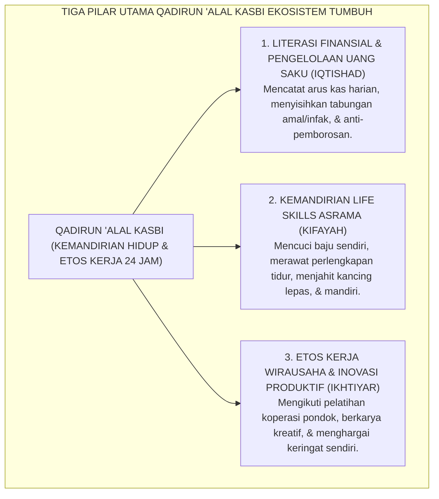
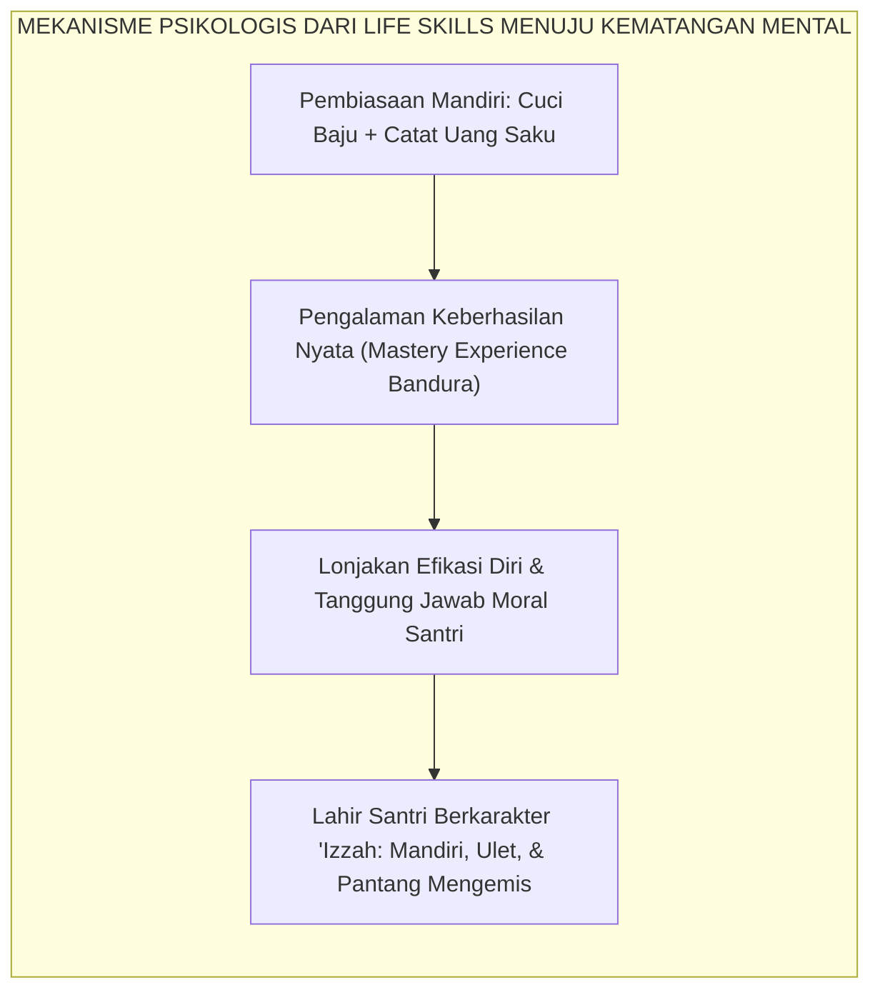
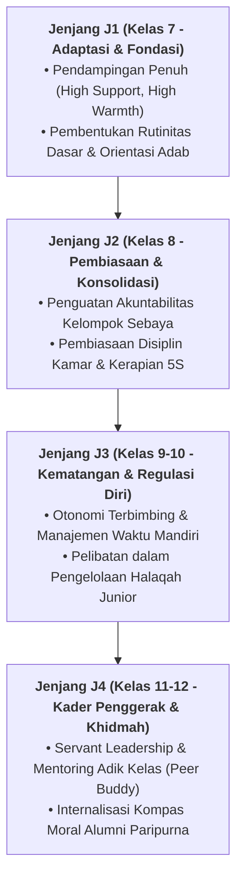

# QADIRUN 'ALAL KASBI (MANDIRI SECARA FINANSIAL & ETOS KERJA)

---
### I. Hakikat Qadirun 'alal Kasbi: Menolak Mentalitas Parasit dan Pemanjaan

Salah satu anomali paling memprihatinkan yang kerap ditemukan pada sebagian alumni lembaga pendidikan adalah **ketidakmampuan hidup mandiri (*helplessness in practical life*)**. 

Tidak sedikit santri yang hafal matan kitab kuning beratus-ratus bait, namun ketika pulang ke masyarakat, ia tidak mampu mengelola anggaran keuangannya sendiri, tidak memiliki etos kerja untuk mencari nafkah halal, dan terus menggantungkan biaya hidupnya kepada orang tua atau belas kasihan donatur. Di asrama, fenomena ini terlihat nyata dalam kebiasaan buruk santri:
* Menghabiskan seluruh uang saku bulanan hanya dalam tiga hari pertama untuk jajan konsumtif di kantin, lalu hidup merana dan meminjam uang kawan di sisa hari (*impulsive financial behavior*);
* Malas mencuci dan melipat pakaiannya sendiri, lalu mengupah adik kelas secara zalim untuk mencucikannya;
* Merusak fasilitas asrama tanpa rasa tanggung jawab karena merasa bukan miliknya.

Dalam Ekosistem TUMBUH, **Qadirun 'alal Kasbi** (Memiliki Kemampuan dan Etos Berpenghasilan Mandiri) bukanlah sekadar materi kewirausahaan sampingan, melainkan **pilar pembentukan martabat (*izzah*) seorang mukmin**. Islam membenci mentalitas pengemis dan ketergantungan parasit. Santri dididik untuk terbiasa bekerja keras, menghargai nilai uang, merawat fasilitas hidupnya secara mandiri, dan memiliki keterampilan praktis yang menjadikannya pribadi mandiri yang siap membiayai dakwahnya.

<b>Gambar 2.4.1:</b> Tiga Pilar Operasional Kemandirian Hidup dan Etos Kerja Santri.

---

### II. Khazanah Turats: Syarah Imam Asy-Syaibani (*Al-Kasb*) & Hadits Keutamaan Bekerja

Islam menempatkan usaha mencari rezeki yang halal dan kemandirian tangan pada derajat ibadah yang teramat mulia.

#### 1. Keutamaan Makan dari Hasil Keringat Tangan Sendiri
Dalam hadits shahih riwayat **Imam Al-Bukhari**[^1], Rasulullah SAW bersabda:

$$\text{مَا أَكَلَ أَحَدٌ طَعَامًا قَطُّ خَيْرًا مِنْ أَنْ يَأْكُلَ مِنْ عَمَلِ يَدِهِ، وَإِنَّ نَبِيَّ اللهِ دَاوُدَ عَلَيْهِ السَّلَامُ كَانَ يَأْكُلُ مِنْ عَمَلِ يَدِهِ}$$

**Artinya:** *"Tidak ada satu makanan pun yang dimakan oleh seseorang yang lebih baik daripada makanan yang dihasilkan dari jerih payah tangannya sendiri; dan sesungguhnya Nabi Allah Daud 'alaihissalam dahulu makan dari hasil karya tangannya sendiri."*

#### 2. Wajibnya Kemandirian Menurut Imam Muhammad bin al-Hasan Asy-Syaibani
Murid utama Imam Abu Hanifah, **Imam Muhammad bin al-Hasan Asy-Syaibani** dalam kitab agungnya *Al-Kasb*[^2] meletakkan fondasi fiqih ekonomi Islam:
> *"Mencari penghasilan halal (*kasb al-halal*) adalah kewajiban syar'i yang setingkat setelah kewajiban shalat dan puasa. Orang yang menolak bekerja dengan dalih 'tawakal' padahal ia masih membutuhkan bantuan orang lain sesungguhnya sedang melakukan kemaksiatan kebodohan. Kemuliaan seorang penuntut ilmu terletak pada kemandirian tangannya dari meminta-minta kepada penguasa dan manusia."*

Senada dengan itu, **Imam Abu al-Hasan Al-Mawardi** dalam *Adab ad-Dunya wad-Din*[^3] menegaskan bahwa kemandirian ekonomi adalah benteng utama yang melindungi kesucian ilmu seorang ulama dari intervensi hawa nafsu duniawi.

---

### III. Tinjauan Sains: Teori Efikasi Diri (Bandura) & Psikologi Finansial Remaja

Pembiasaan kemandirian hidup santri di asrama memiliki landasan psikologis dan ekonomi yang sangat kuat:

#### 1. Teori Efikasi Diri Albert Bandura (*Mastery Experience*)
Pakar psikologi terkemuka **Prof. Albert Bandura**[^4] membuktikan bahwa rasa percaya diri dan ketangguhan mental seseorang (*self-efficacy*) paling kuat dibangun melalui **pengalaman penguasaan langsung (*mastery experiences*)**.

Ketika seorang santri berusia 13 tahun dilatih mencuci bajunya sendiri sampai bersih, merapikan lemarinya secara teratur, dan berhasil mengelola uang sakunya cukup hingga akhir bulan, otaknya mengirimkan sinyal kemenangan kompetensi: *"Saya mampu mengendalikan hidup saya!"* Rasa efikasi diri ini akan menular ke dalam ketekunannya saat memecahkan masalah pelajaran dan ketangguhannya saat menghadapi krisis hidup di masa depan.

#### 2. Riset Literasi Finansial Remaja Lusardi & Mitchell
Riset global oleh **Annamaria Lusardi & Olivia S. Mitchell**[^5] membuktikan bahwa remaja yang dibiasakan mencatat pengeluaran uang saku secara mandiri sejak usia SMP/MTs memiliki tingkat kecerdasan finansial **3 kali lebih tinggi**, risiko terlilit utang di usia dewasa 60% lebih rendah, serta memiliki kecenderungan menabung dan berinvestasi sosial (filantropi/sedekah) yang jauh lebih konsisten.

<b>Gambar 2.4.2:</b> Alur Transformasi dari Pembiasaan Life Skills Asrama Menuju Efikasi Diri Santri.

---

### IV. Matriks Indikator Perilaku Faktual Qadirun 'alal Kasbi (24 Jam)

| Situasi Keseharian Asrama | Indikator Perilaku Positif (Qadirun 'alal Kasbi) | Perilaku Defisit / Ketergantungan | Protokol Pembiasaan Terstruktur TUMBUH |
| :--- | :--- | :--- | :--- |
| **Pengelolaan Uang Saku Mingguan** | Mencatat setiap pemasukan & pengeluaran di Logbook Finansial, menyisihkan infak subuh, dan hemat. | Menghabiskan uang saku di awal pekan, membeli barang tidak penting, lalu berutang ke teman. | Pendampingan budgeting mingguan oleh Musyrif dan pembatasan plafon belanja harian di kantin. |
| **Perawatan Pakaian & Ranjang Pribadi** | Mencuci pakaian sendiri secara terjadwal, melipat rapi di loker, dan menjahit kancing yang lepas. | Mengongkos adik kelas untuk mencuci baju (*exploitative delegation*) atau menumpuk baju basah kotor. | Larangan mutlak menyuruh santri lain mencuci baju; workshop keterampilan *Basic Life Skills*. |
| **Etos Partisipasi Kerja Bakti Asrama** | Bekerja tuntas tanpa perlu diawasi, merawat alat kebersihan bersama, dan proaktif membantu dapur. | Menghindar dari piket kerja bakti, malas-malasan, atau melempar tugas ke santri yang lebih lemah. | Penilaian rubrik etos kerja asrama yang terhubung dengan rapor Jenjang Kemandirian TUMBUH (J1–J4). |
| **Kreativitas Karya & Kewirausahaan** | Menulis artikel mading, berpartisipasi dalam divisi kreatif/koperasi, menghargai nilai karya. | Bersikap pasif, gemar merusak fasilitas umum (*vandalism*), dan memandang rendah pekerjaan fisik. | Program *Santri Entrepreneur Incubator*: magang pengelolaan koperasi dan bazaar karya santri. |

---

### V. Solusi Sistemik TUMBUH: Logbook Finansial Digital & Bengkel Kemandirian

Lembaga mengoperasionalkan pembinaan kemandirian melalui dua inovasi:
1. **Buku Rekening Logbook Finansial Santri**: Setiap santri dibekali logbook saku untuk mencatat 3 pos anggaran mingguan: *Kebutuhan Pokok, Tabungan Sedekah, dan Dana Darurat*.
2. **Bengkel Keterampilan Hidup (*Life Skills Workshop*)**: Setiap semester diadakan pelatihan wajib pertukangan dasar, kelistrikan sederhana, menjahit pakaian, serta dasar sanitasi dan kuliner sehat asrama.

---

## 📌 Catatan Kaki & Rujukan Primer

[^1]: **Al-Imam Abu Abdillah Muhammad bin Ismail al-Bukhari**, *Shahih al-Bukhari*, Kitab al-Buyu', Bab Kasbir Rajuli wa 'Amalihi bi Yadih (Beirut: Dar Thuq an-Najah, 1422 H), Hadits No. 2072.
[^2]: **Al-Imam Muhammad bin al-Hasan asy-Syaibani**, *Kitab al-Kasb*, Tahqiq: Dr. Abdul Fattah Abu Ghuddah (Damaskus & Beirut: Maktab al-Mathbu'at al-Islamiyyah, 1997), hlm. 55–88.
[^3]: **Al-Imam Abu al-Hasan Ali bin Muhammad al-Mawardi**, *Adab ad-Dunya wad-Din*, Tahqiq: Dr. Muhammad Ridha Qahwaji (Beirut: Dar Ibnu Katsir, 1993), Bab 5: "Fi Adabil Kasbi wal Ma'asy", hlm. 215–248.
[^4]: **Albert Bandura**, *Self-Efficacy: The Exercise of Control* (New York: W. H. Freeman and Company, 1997), Bab 2 & 3: "Sources of Self-Efficacy", hlm. 79–115; serta **Albert Bandura**, *Social Foundations of Thought and Action: A Social Cognitive Theory* (Englewood Cliffs: Prentice-Hall, 1986).
[^5]: **Annamaria Lusardi & Olivia S. Mitchell**, "The economic importance of financial literacy: Theory and evidence", *Journal of Economic Literature*, Vol. 52, No. 1 (2014), hlm. 5–44.

---

### IV. Pembedahan Kapasitas Lanjutan & Trajektori Progresi Qadirun 'Alal Kasbi (Mandiri Secara Finansial & Etos Kerja)

Pengembangan kompetensi **QADIRUN 'ALAL KASBI (MANDIRI SECARA FINANSIAL & ETOS KERJA)** pada santri memerlukan strategi diferensiasi yang selaras dengan tahapan usia perkembangan remaja (*Developmental Milestones*):

1. **Dekomposisi Indikator Kematangan Perilaku**:
   Untuk memastikan karakter **QADIRUN 'ALAL KASBI (MANDIRI SECARA FINANSIAL & ETOS KERJA)** tertanam secara operasional, dewan asatidz dan musyrif memetakan indikator perilakunya ke dalam 3 ranah capaian:
   * **Ranah Kognitif-Reflektif (*Ma'rifah*)**: Santri memahami dalil syar'i, urgensi akhlak, dan konsekuensi logis dari setiap pilihannya.
   * **Ranah Afektif-Ruhiyyah (*Wijdan*)**: Tumbuhnya kepekaan nurani, rasa malu berbuat dosa (*Haya'*), dan kenikmatan dalam berbuat kebajikan.
   * **Ranah Psikomotorik-Habituasi (*'Amal*)**: Terwujudnya keterampilan bertindak nyata secara spontan, konsisten, dan mandiri tanpa perlu disuruh.

2. **Matriks Penahapan Lintas Jenjang Kemandirian (J1–J4)**:

3. **Rubrik Evaluasi Kualitatif & Indikator Pencapaian**:

| Level Kemandirian | Karakteristik Perilaku Teramati (*Behavioral Anchor*) | Pendekatan Bimbingan Musyrif |
| :--- | :--- | :--- |
| **Level 1 (Emerging)** | Memerlukan instruksi berulang dan pengawasan langsung musyrif. | *Direct Prompting* & pengingat visual harian. |
| **Level 2 (Developing)** | Mampu menjalankan adab saat diingatkan oleh teman sebaya. | Penguatan positif melalui pujian deskriptif. |
| **Level 3 (Proficient)** | Menjalankan adab secara mandiri dan konsisten tanpa diawasi. | Pemberian kepercayaan dan peran tanggung jawab kamar. |
| **Level 4 (Exemplary)** | Menjadi teladan (*Qudwah*) dan mampu membimbing kawan-kawannya. | Pelibatan aktif dalam struktur Dewan Santri & Mentor. |

---

### V. Panduan Praksis Pendampingan Musyrif di Asrama

Agar penanaman **QADIRUN 'ALAL KASBI (MANDIRI SECARA FINANSIAL & ETOS KERJA)** berhasil maksimal di lapangan, musyrif disarankan menerapkan protokol pendampingan berikut:
* **Fokus pada Usaha (*Effort-Oriented Praise*)**: Berikan apresiasi atas proses perjuangan santri dalam memperbaiki diri, bukan semata-mata hasil akhir yang sempurna.
* **Dialog Sokratik Saat Santri Mengalami Kesulitan**: Ajukan pertanyaan reflektif seperti: *"Apa yang membuat antum merasa berat menjalankan adab ini hari ini? Bagaimana kita bisa mengatasinya bersama besok?"*
* **Menjaga Iklim Ukhuwah Bebas Perundungan**: Pastikan senioritas dimaknai sebagai amanah pengayoman dan perlindungan kepada yang lebih muda, bukan hak istimewa untuk memerintah.
