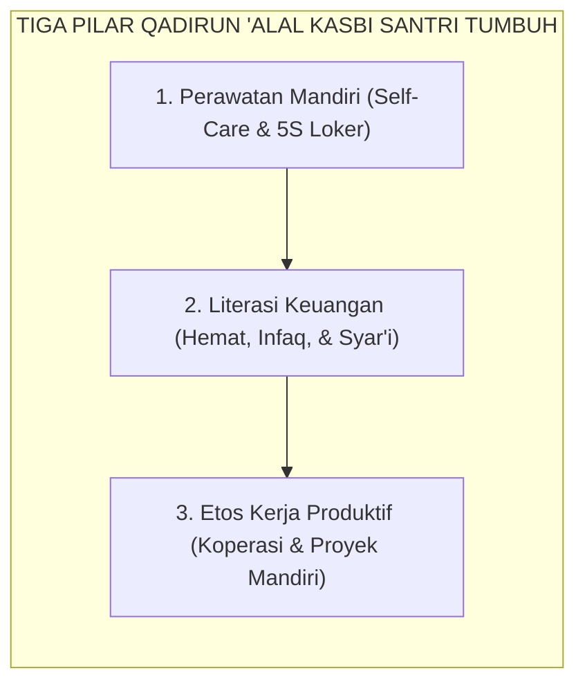

# SUB-BAB 2.4: QADIRUN 'ALAL KASBI (KEMANDIRIAN HIDUP & ETOS KERJA)
## *Kemandirian Asrama, Literasi Keuangan Syar'i, Tanggung Jawab Fasilitas, dan Etos Kifayah Produktif*

**Kode Klasifikasi**: `BOOK-02/BAB-02/SUB-04/MONOGRAF-MASTER-VIBRANT`  
**Disiplin Ilmu**: Pendidikan Kemandirian Vokasional, Literasi Finansial Remaja, & Etika Kerja Islam  
**Penanggung Jawab Keilmuan**: Dewan Pakar Ekosistem TUMBUH (*Pakar Pengasuhan Asrama & Pakar Tata Kelola Qudwah*)

---

### Kemandirian Nyata di Bilik Asrama

Pilar keempat karakter santri adalah **Qadirun 'alal Kasbi** (Mampu Bekerja Mandiri & Memiliki Etos Kifayah).

Kemandirian di pesantren TUMBUH bukan sekadar teori ekonomi, melainkan dilatihkan melalui pembiasaan hidup harian yang teratur:
* **Perawatan Diri Mandiri**: Mencuci, menjemur, melipat pakaian sendiri secara rapi, serta menjahit kancing baju yang lepas tanpa bergantung pada orang tua atau adik kelas.
* **Literasi Keuangan Syar'i**: Mengelola uang saku mingguan secara terencana, membuat pembukuan sederhana, menyisihkan infaq Jumat, dan menghindari perilaku konsumtif jajan berlebihan di kantin.
* **Pemeliharaan Inventaris Pondok**: Merawat fasilitas asrama dan madrasah dengan penuh amanah, menganggap sarana pesantren sebagai wakaf suci yang wajib dilindungi.

<b>Gambar 2.4.1:</b> Tiga Pilar Kemandirian Vokasional Santri TUMBUH.

**Al-Imam Abu al-Hasan al-Mawardi** dalam *Adab ad-Dunya wad-Din*[^1] menegaskan bahwa kemuliaan penuntut ilmu hanya akan sempurna jika ditopang oleh kebersihan mata pencaharian yang halal (*kifayatul ma'asy*) dan kemandirian hidup yang menjaganya dari kehinaan meminta-minta kepada orang lain.

---

## 📌 Catatan Kaki & Rujukan Primer

[^1]: **Al-Imam Abu al-Hasan Ali bin Muhammad al-Mawardi**, *Adab ad-Dunya wad-Din*, Tahqiq: Dr. Muhammad Ridha Qahwaji (Beirut: Dar Ibnu Katsir, 1993), Bab 4: "Fi Adab al-Kasb", hlm. 215–248.
