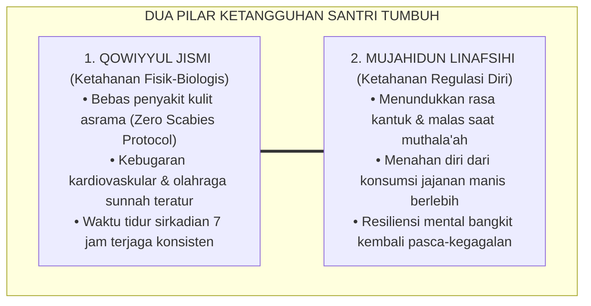
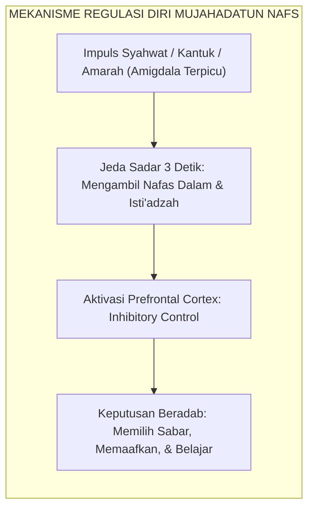

# SUB-BAB 2.4: QOWIYYUL JISMI & MUJAHIDUN LINAFSIHI
## *Kekuatan Jasmani, Higienitas Thaharah, Pengendalian Diri (*Self-Regulation*), dan Penaklukan Hawa Nafsu*

**Kode Klasifikasi**: `BOOK-02/BAB-02/SUB-04/MONOGRAF-MASTER-VIBRANT`  
**Disiplin Ilmu**: Kesehatan Fisik & Tidur Sirkadian, Neurosains Regulasi Diri (*Inhibitory Control*), & Tasawuf 'Amali  
**Penanggung Jawab Keilmuan**: Dewan Pakar Ekosistem TUMBUH (*Pakar Neurosains Perkembangan & Pakar Pengasuhan Asrama*)

---

### Dua Sisi Mata Uang Kebugaran Insan: Ketangguhan Raga dan Kedaulatan Jiwa

Di dalam hadits shahih yang sangat masyhur, Rasulullah SAW bersabda:
$$\text{الْمُؤْمِنُ الْقَوِيُّ خَيْرٌ وَأَحَبُّ إِلَى اللَّهِ مِنَ الْمُؤْمِنِ الضَّعِيفِ، وَفِي كُلٍّ خَيْرٌ}$$
*"Mukmin yang kuat lebih baik dan lebih dicintai oleh Allah daripada mukmin yang lemah, meskipun pada keduanya tetap terdapat kebaikan."* (HR. Muslim no. 2664).

Kekuatan yang dimaksud oleh Rasulullah SAW mencakup dua dimensi komplementer:
1. **Qowiyyul Jismi**: Fisik yang kuat, sehat, bersih dari kuman penyakit, bugar berenergi, dan terjaga ritme biologisnya.
2. **Mujahidun Linafsihi**: Jiwa yang memiliki kedaulatan penuh dalam menundukkan syahwat, sabar menunda kepuasan instan (*delayed gratification*), dan gigih melawan godaan maksiat.

<b>Gambar 2.4.1:</b> Sinergi Ketangguhan Fisik (Jismi) dan Pengendalian Diri (Nafsi) Santri.

**Al-Imam Ibn al-Qayyim al-Jawziyyah** dalam *Zad al-Ma'ad fi Hadyi Khairil 'Ibad*[^1] menjelaskan secara komprehensif bagaimana petunjuk Nabi SAW memadukan antara olahraga berkuda, memanah, lari cepat, pengaturan porsi makan (*Thibbun Nabawi*), dan puasa sunnah sebagai instrumen penjaga vitalitas tubuh dan penunduk hawa nafsu.

---

### Indikator Perilaku Faktual Qowiyyul Jismi di Asrama

Sistem TUMBUH menolak keras anggapan bahwa santri yang shalih harus berwajah pucat, bertubuh ringkih, dan mengidap penyakit gatal-gatal (gudik/skabies):

1. **Penerapan Protokol Nol Skabies (*Zero Scabies Policy*)**:  
   Santri menjemur kasur dan bantal secara rutin setiap pekan di bawah sinar matahari, mencuci sprei dengan air panas berkala, dan menjaga ventilasi udara kamar tetap mengalir lancar.
2. **Rutinitas Olahraga Kebugaran & Olahraga Sunnah**:  
   Santri mengikuti jadwal olahraga terstruktur 3 kali sepekan: lari pagi, senam kebugaran jasmani, pencak silat, panahan, atau renang, menjaga fungsi jantung dan daya tahan tubuhnya.
3. **Higienitas Sanitasi Pribadi (*Personal Hygiene*)**:  
   Santri memotong kuku secara teratur setiap hari Jumat, menyikat gigi minimal 2 kali sehari, dan mengenakan pakaian yang bersih serta tidak berbau apek.

---

### Indikator Perilaku Faktual Mujahidun Linafsihi di Keseharian

Kekuatan sejati seorang santri bukan diukur dari kemampuannya merobohkan lawan, melainkan kemampuannya mengendalikan diri sendiri saat diuji syahwat dan amarah:

<b>Gambar 2.4.2:</b> Alur Neurobiologis Mujahadatun Nafs Mengaktifkan Rem Kognitif Prefrontal.

1. **Penundaan Kepuasan Instan (*Delayed Gratification*)**:  
   Pakar psikologi **Walter Mischel**[^2] dalam eksperimen legendarisnya *The Marshmallow Test* membuktikan bahwa anak yang memiliki kemampuan menunda kepuasan instan memiliki peluang sukses akademis dan stabilitas emosi berkali-kali lipat lebih tinggi. Santri TUMBUH dilatih menunda membuka jajan atau mengobrol santai hingga seluruh tugas muthala'ah selesai tuntas.
2. **Pengendalian Impuls Amarah (*Emotional Inhibitory Control*)**:  
   Riset neurosains kontrol diri oleh **Roy F. Baumeister**[^3] membuktikan bahwa kekuatan kehendak (*willpower*) bekerja seperti otot yang dapat dilatih. Saat tersenggol kawan di antrean wudhu, santri tidak membalas dengan pukulan, melainkan melafalkan *Ta'awwudz* dan tersenyum lapang dada.
3. **Ketahanan Melawan Kemalasan (*Spiritual Grit*)**:  
   Santri mampu bangkit dari tempat tidur saat alarm subuh berbunyi tanpa menekan tombol tunda (*snooze*), melatih kedaulatan jiwa atas kelemahan fisik raganya.

---

### Tinjauan Turats: Menyelami Kedalaman *Riyadhatun Nafs* Imam Al-Ghazali

Konsep penempaan diri ini berakar pada ajaran **Hujjatul Islam Imam Abu Hamid Al-Ghazali** dalam *Ihya' 'Ulumiddin* (Kitab *Riyadhatin Nafs*)[^4] sebagai berikut:

> [!NOTE]
> ### 📜 Kaidah Imam Al-Ghazali tentang Menjinakkan Nafsu:
> 
> $$\text{مَثَلُ النَّفْسِ فِي ضَرَاوَتِهَا كَمَثَلِ الدَّابَّةِ السَّمُوحِ؛ إِذَا أَلْجَمْتَهَا وَقَيَّدْتَهَا بِالرِّيَاضَةِ انْقَادَتْ، وَإِذَا أَرْسَلْتَهَا وَأَهْمَلْتَهَا جَمَحَتْ وَأَهْلَكَتْ صَاحِبَهَا}$$
> 
> **Artinya:**  
> *"Perumpamaan hawa nafsu dalam kebuasannya laksana binatang tunggangan yang liar; apabila engkau kekang ia dengan tali kendali latihan spiritual (*Riyadhah*), niscaya ia akan tunduk patuh. Namun apabila engkau lepaskan ia begitu saja tanpa disiplin, niscaya ia akan berontak liar dan mencelakakan penunggangnya."*

Santri yang memiliki *Qowiyyul Jismi* dan *Mujahidun Linafsihi* tumbuh menjadi sosok pemuda muslim idaman peradaban: bertubuh tegap sehat, berwajah cerah bercahaya, dan memiliki jiwa ksatria yang mampu menaklukkan segala bujuk rayu kemaksiatan.

---

## 📌 Catatan Kaki & Rujukan Primer

[^1]: **Al-Imam Syamsuddin Muhammad bin Abi Bakr Ibnu Qayyim al-Jawziyyah**, *Zad al-Ma'ad fi Hadyi Khairil 'Ibad*, Tahqiq: Syaikh Syu'aib al-Arnauth & Abdul Qadir al-Arnauth (Kuwait: Maktabah al-Manar al-Islamiyyah / Beirut: Mu'assasah ar-Risalah, 1979), Jilid IV: "At-Thibbun Nabawi", hlm. 220–265.
[^2]: **Walter Mischel**, *The Marshmallow Test: Mastering Self-Control* (New York: Little, Brown and Company, 2014), Bab 1: "The Delay of Gratification Paradigm", hlm. 15–42.
[^3]: **Roy F. Baumeister & John Tierney**, *Willpower: Rediscovering the Greatest Human Strength* (New York: Penguin Press, 2011), Bab 2: "Where Willpower Power Comes From", hlm. 41–68.
[^4]: **Hujjatul Islam Imam Abu Hamid al-Ghazali**, *Ihya' 'Ulumiddin*, Kitab Riyadhatin Nafs wa Tahdzibil Akhlaq (Kairo & Beirut: Dar al-Ma'rifah, t.th.), Jilid III, hlm. 60–75.
