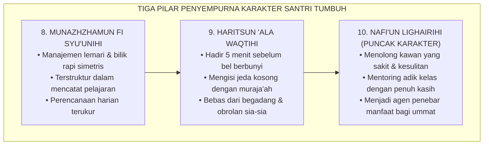
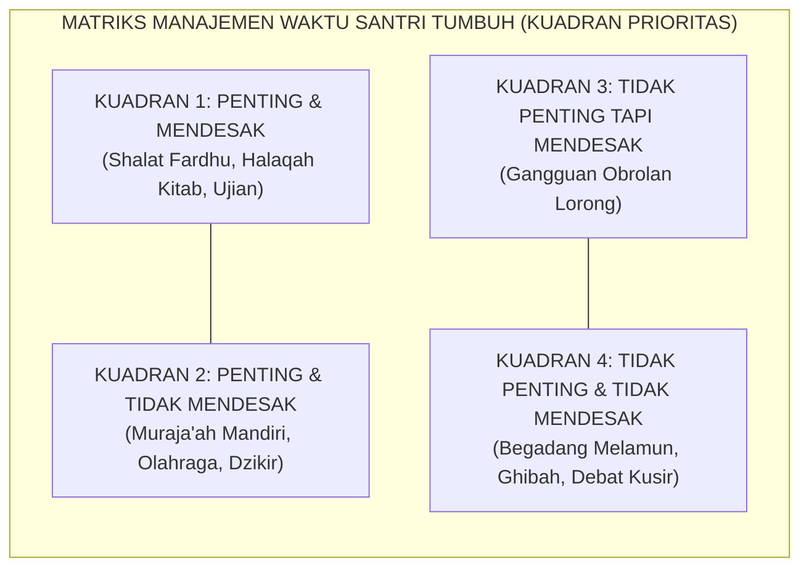

# SUB-BAB 2.5: MUNAZHZHAMUN, HARITSUN, & NAFI'UN LIGHAIRIHI
## *Keteraturan Manajemen Hidup, Disiplin Waktu, dan Puncak Karakter Khidmah Sosial yang Bermanfaat Luas*

**Kode Klasifikasi**: `BOOK-02/BAB-02/SUB-05/MONOGRAF-MASTER-VIBRANT`  
**Disiplin Ilmu**: Manajemen Waktu Islami, Psikologi Produktivitas Karakter, & Teori Kepemimpinan Altruistik  
**Penanggung Jawab Keilmuan**: Dewan Pakar Ekosistem TUMBUH (*Pakar Tata Kelola Qudwah & Pakar Desain Kurikulum Adab*)

---

### Tiga Pilar Penyempurna: Keteraturan, Waktu, dan Khidmah Sosial

Tiga profil terakhir dalam taksonomi sepuluh karakter (*Muwashafat*) Ekosistem TUMBUH adalah **tiga pilar penyempurna (*The Triad of Social Impact*)**:
1. **Munazhzhamun fi Syu'unihi**: Tertib, rapi, dan terorganisir dalam menata seluruh urusan pribadi dan komunalnya.
2. **Haritsun 'ala Waqtihi**: Sangat hemat dan disiplin dalam mengelola waktu, pantang membuang detik hidup dalam kesia-siaan (*lahwun*).
3. **Nafi'un Lighairihi**: Bermanfaat luas, memiliki kepekaan sosial tinggi, dan mendedikasikan hidupnya untuk melayani ummat (*Khidmah*).

<b>Gambar 2.5.1:</b> Alur Progresi dari Keteraturan Pribadi Menuju Puncak Kebermanfaatan Sosial.

**Hadhratusy Syaikh KH. M. Hasyim Asy'ari** dalam *Adab al-'Alim wal Muta'allim*[^1] menegaskan bahwa kealiman seorang penuntut ilmu tercermin dari bagaimana ia menghargai setiap detik umurnya: tidak membiarkan satu helaan nafas pun berlalu tanpa diisi dengan menuntut ilmu, berdzikir, atau memberikan kemanfaatan bagi sesamanya.

---

### Indikator Perilaku Faktual Munazhzhamun fi Syu'unihi di Asrama

Keteraturan hidup di pesantren TUMBUH bukan sekadar formalitas saat inspeksi musyrif, melainkan cermin dari ketertiban batin:

1. **Standar Kerapian Loker Pribadi (*5S/5R Asrama*)**:  
   Santri menata lemari bajunya dengan pembagian zona yang jelas (seragam sekolah di gantungan atas, sarung shalat di rak tengah, pakaian santai di rak bawah, dan perlengkapan mandi di kotak khusus).
2. **Keteraturan Tata Catatan Kitab (*Organized Learning Notes*)**:  
   Santri mencatat syarah ustadz dengan tulisan yang rapi, memberi tanda stabilo/warna pada kaidah penting, dan memiliki jadwal muthala'ah mandiri yang terstruktur.
3. **Kesiapan Logistik Pribadi**:  
   Sebelum tidur malam pukul 22.00 WIB, santri telah menyiapkan kitab, buku tulis, dan seragam yang akan dipakai esok pagi, sehingga tidak ada kepanikan terburu-buru saat fajar menyingsing.

---

### Indikator Perilaku Faktual Haritsun 'ala Waqtihi

Waktu adalah modal utama seorang santri. Hilangnya waktu tanpa faedah adalah kematian spiritual sebelum ajal fisik tiba:

<b>Gambar 2.5.2:</b> Penerapan Matriks Manajemen Waktu Kuadran Prioritas di Pesantren.

Pakar kepemimpinan **Stephen R. Covey**[^2] dalam *The 7 Habits of Highly Effective People* menegaskan bahwa individu yang unggul memfokuskan 80% energinya pada **Kuadran 2**: aktivitas yang sangat penting bagi pembentukan masa depan namun tidak mendesak (seperti membaca buku mendalam, membangun relasi positif, dan merawat kesehatan).

Santri TUMBUH menerapkan:
1. **Prinsip *5-Minute Early Rule***: Hadir 5 menit lebih awal di masjid dan ruang kelas sebelum bel berbunyi.
2. **Pemanfaatan Jeda Waktu (*Fragmented Time Optimization*)**: Membawa buku saku (*pocket notes*) untuk menghafal mufradat bahasa Arab atau nadham kitab di sela antrean kantin atau menunggu mulainya shalat berjamaah.

---

### Puncak Muwashafat: Nafi'un Lighairihi (Kepemimpinan Melayani)

Puncak dari seluruh taksonomi adab adalah **Nafi'un Lighairihi** (Bermanfaat bagi Sesama).

Rasulullah SAW bersabda dengan sangat tegas:
$$\text{خَيْرُ النَّاسِ أَنْفَعُهُمْ لِلنَّاسِ}$$
*"Sebaik-baik manusia adalah yang paling bermanfaat bagi manusia lainnya!"* (HR. Ath-Thabrani dalam *Al-Mu'jam al-Ausath* no. 5787).

Pakar psikologi organisasi **Adam Grant**[^3] dalam penelitiannya *Give and Take* membuktikan bahwa orang-orang yang memiliki orientasi memberi secara tulus (*Givers*) tanpa pamrih pada akhirnya menempati puncak kepemimpinan yang paling berpengaruh dan dicintai di masyarakat.

Di pesantren TUMBUH, *Nafi'un Lighairihi* diwujudkan melalui:
1. **Budaya Khidmah Tanpa Pamrih**: Membantu membawakan nampan makanan santri yang sedang demam di ruang poskestren, menyapu serambi masjid bersama, dan menjadi tutor sebaya bagi kawan yang kesulitan memahami nahwu-sharaf.
2. **Kepemimpinan Pelayan (*Servant Leadership*)**: Santri senior memandang posisi kepengurusan organisasi santri bukan sebagai panggung kekuasaan untuk membentak adik kelas, melainkan sebagai ladang amal jariyah untuk melindungi, melayani, dan memfasilitasi kebutuhan seluruh warga pondok.

---

### Wasiat Epik Imam Al-Ghazali tentang Manajemen Waktu Harian

**Hujjatul Islam Imam Abu Hamid Al-Ghazali** dalam *Ihya' 'Ulumiddin* (Kitab *Tartib al-Awrad*)[^4] memberikan formula abadi tata kelola waktu harian penuntut ilmu:

> [!NOTE]
> ### 📜 Wasiat Emas Imam Al-Ghazali tentang Menjaga Waktu:
> 
> $$\text{يَنْبَغِي أَنْ تَكُونَ أَوْقَاتُكَ مُوَزَّعَةً، وَأَوْرَادُكَ مُرَتَّبَةً؛ فَلَا تَتْرُكْ وَقْتًا مِنَ الْأَوْقَاتِ سُدًى تَفْعَلُ فِيهِ مَا اتَّفَقَ كَيْفَمَا اتَّفَقَ، بَلْ حَاسِبْ نَفْسَكَ وَرَتِّبْ حَرَكَاتِكَ وَسَكَنَاتِكَ فِي لَيْلِكَ وَنَهَارِكَ}$$
> 
> **Artinya:**  
> *"Sepatutnya seluruh waktumu terbagi dengan rapi, dan seluruh rutinitas amalmu tertata dengan teratur. Jangan sekali-kali engkau membiarkan satu waktu pun berlalu secara sia-sia di mana engkau berbuat sekadar kebetulan tanpa arah; melainkan hisablah dirimu dan aturlah setiap gerak dan diammu di sepanjang malam dan siangmu."*

Dengan menuntaskan Bab 02 ini, sepuluh muwashafat karakter santri TUMBUH telah terdefinisi secara utuh, presisi, dan operasional: dari akar tauhid di dalam hati hingga buah kebermanfaatan nyata bagi kemaslahatan alam semesta.

---

## 📌 Catatan Kaki & Rujukan Primer

[^1]: **Hadhratusy Syaikh KH. M. Hasyim Asy'ari**, *Adab al-'Alim wal Muta'allim fi ma Yahtaju Ilayhi al-Muta'allim fi Ahwal Ta'allumihi wa ma Yatawaqqafu 'alayhi al-Mu'allim fi Maqamat Ta'limihi* (Jombang: Maktabah at-Turats al-Islami, 1415 H), Bab 2: "Adab al-Muta'allim fi Nafsihi", hlm. 24–35.
[^2]: **Stephen R. Covey**, *The 7 Habits of Highly Effective People: Powerful Lessons in Personal Change* (New York: Free Press / Simon & Schuster, 1989; Edisi Peringatan 30 Tahun, 2020), Bab 3: "Habit 3: Put First Things First", hlm. 145–182.
[^3]: **Adam Grant**, *Give and Take: A Revolutionary Approach to Success* (New York: Viking Penguin, 2013), Bab 1: "Good Returns: The Hazards and Harms of Givers and Takers", hlm. 1–26.
[^4]: **Hujjatul Islam Imam Abu Hamid al-Ghazali**, *Ihya' 'Ulumiddin*, Kitab Tartib al-Awrad wa Tafshil Ihya' al-Lail (Kairo & Beirut: Dar al-Ma'rifah, t.th.), Jilid I, hlm. 334–350.
