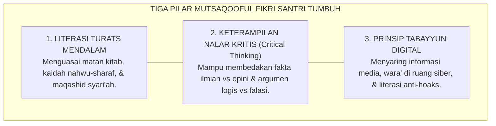

# SUB-BAB 2.5: MUTSAQQAFUL FIKRI (BERWAWASAN LUAS & BERNALAR KRITIS)
## *Kedalaman Penguasaan Turats, Integrasi Nalar Kritis Saintifik, dan Keterampilan Tabayyun di Era Digital*

**Kode Klasifikasi**: `BOOK-02/BAB-02/SUB-05/MONOGRAF-MASTER-VIBRANT`  
**Disiplin Ilmu**: Filsafat Ilmu Kritis (*Critical Thinking*), Psikologi Kognitif, & Literasi Digital Pesantren  
**Penanggung Jawab Keilmuan**: Dewan Pakar Ekosistem TUMBUH (*Pakar Psikologi Belajar & Pakar Epistemologi Turats*)

---

### Cendekiawan Muslim yang Bernalar Tajam dan Terbuka

Pilar kelima karakter santri adalah **Mutsaqqoful Fikri** (Berwawasan Luas & Berpikir Kritis).

Santri yang mutsaqqoful fikri bukanlah penghafal dogmatis yang kaku, melainkan pembelajar yang tajam nalarnya dan berwawasan luas:
* **Membaca Aktif & Kritis (*Critical Active Reading*)**: Mampu menganalisis teks Turats dengan memahami kaidah *ushul fiqih*, konteks *maqashid syari'ah*, dan membandingkan pandangan ulama secara objektif.
* **Literasi Digital & Prinsip Tabayyun**: Memiliki filter kognitif untuk memverifikasi kebenaran informasi di media digital (QS. Al-Hujurat: 6), menolak hoaks, dan pantang menyebarkan ujaran kebencian.
* **Keterampilan Munazharah Santun**: Mampu berdiskusi ilmiah secara argumentatif tanpa merendahkan orang lain yang berbeda pandangan.

<b>Gambar 2.5.1:</b> Tiga Pilar Mutsaqqoful Fikri Ekosistem TUMBUH.

Pakar psikologi kognitif **John Sweller**[^1] dalam *Cognitive Load Theory* membuktikan bahwa nalar kritis hanya akan berkembang apabila beban kognitif yang tidak relevan dieliminasi melalui desain pembelajaran interaktif yang terstruktur.

Filsuf Islam modern **Prof. Dr. Syed Muhammad Naquib al-Attas**[^2] menegaskan bahwa akal yang tercerahkan (*'Aql Salim*) adalah akal yang mampu mengenali hirarki wujud dan kebenaran, menempatkan ilmu wahyu sebagai pemandu tertinggi bagi seluruh disiplin sains empiris.

---

## 📌 Catatan Kaki & Rujukan Primer

[^1]: **John Sweller, Paul Ayres, & Slava Kalyuga**, *Cognitive Load Theory* (New York: Springer Science+Business Media, 2011), Bab 2: "Human Cognitive Architecture", hlm. 11–32.
[^2]: **Prof. Dr. Syed Muhammad Naquib al-Attas**, *Prolegomena to the Metaphysics of Islam: An Exposition of the Underlying Foundations of Islam and Modernity* (Kuala Lumpur: International Institute of Islamic Thought and Civilization / ISTAC, 1995), Bab 3: "The Intuition of Existence", hlm. 111–142.
