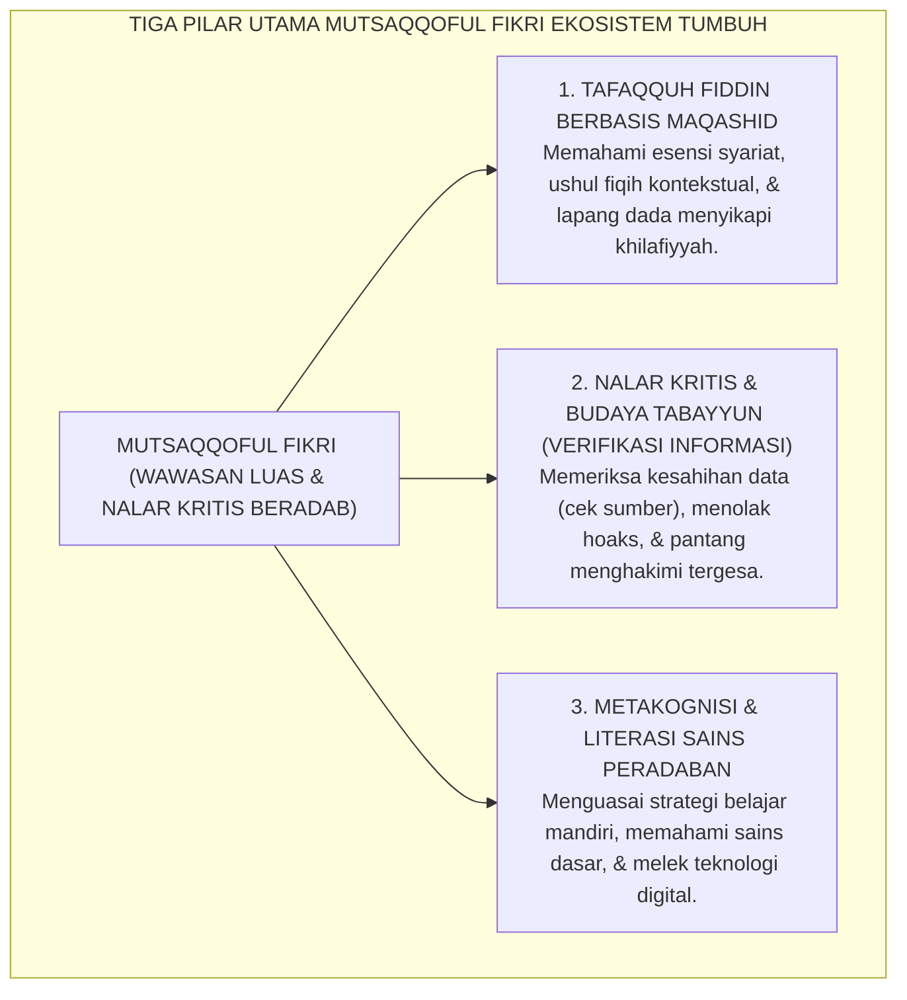
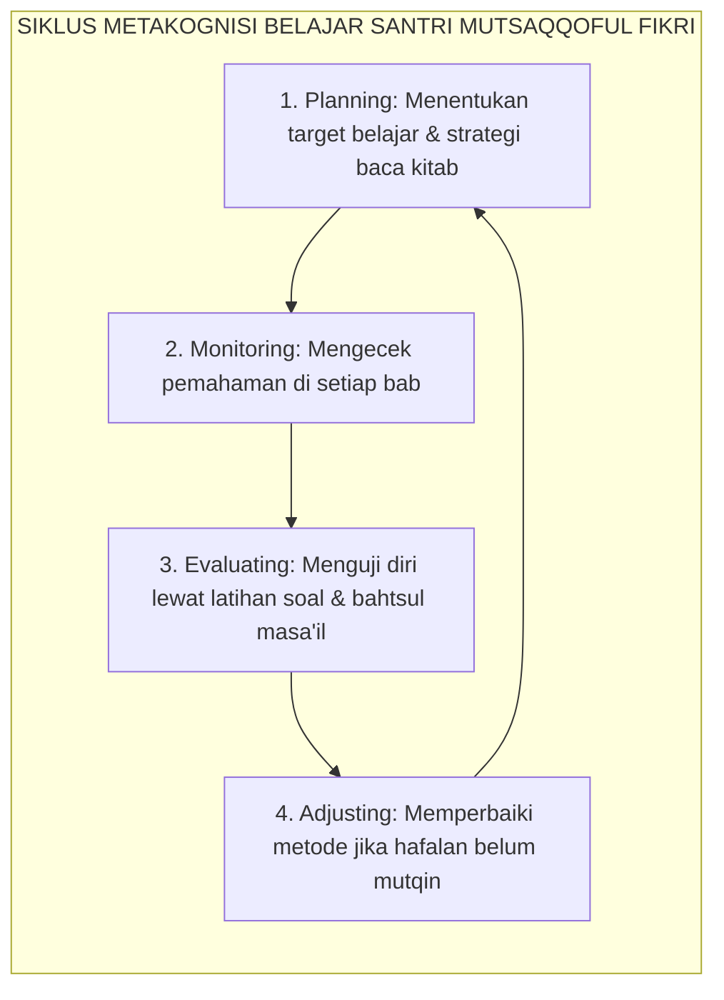

# PANDUAN PRAKTIS 2.5: MUTSAQQOFUL FIKRI (BERWAWASAN LUAS & BERNALAR KRITIS)

**Sasaran Pengguna**: Pimpinan Pondok, Kepala Pengasuhan, Wali Kelas, & Musyrif Asrama  
**Fokus Penerapan**: Panduan Kerja Lapangan & Pembiasaan Karakter Harian Sistem TUMBUH  

---

### 🎯 Tujuan & Manfaat Panduan
Panduan ini dirancang sebagai petunjuk operasional terapan agar pendidik dan musyrif dapat:
1. Menjalankan pembinaan adab santri dengan pendekatan kasih sayang (*Rahmah*) dan ketegasan yang mendidik (*Firm & Kind*).
2. Menghindari cara-cara kekerasan fisik, bentakan verbal, maupun hukuman yang mempermalukan santri.
3. Menciptakan suasana asrama dan kelas yang aman, tertib, dan menumbuhkan kesadaran diri (*Bi'ah Shalihah*).

---

### 💡 Intisari Cepat (3 Menit Memahami Esensi)
* **Kunci Pengasuhan**: Karakter santri tumbuh melalui keteladanan nyata (*Qudwah Hasanah*), komunikasi empatik, dan pembiasaan terstruktur 24 jam.
* **Tindakan Utama**: Terapkan panduan langkah demi langkah di bawah ini secara konsisten, pantau perkembangan santri secara objektif, dan berikan apresiasi atas setiap perbaikan diri yang mereka capai.
* **Prinsip Disiplin**: Fokus pada pemulihan hubungan dan tanggung jawab nyata (*Restoratif*), bukan sekadar melampiaskan amarah atau menghukum.

---

### 📖 Uraian Panduan & Langkah Aksi Lapangan

---

### I. Hakikat Mutsaqqoful Fikri: Melampaui Dogmatisme dan Fanatisme Sempit

Pendidikan pesantren pada masa lampau kerap kali terjebak dalam model pembelajaran satu arah yang menuntut santri sekadar menjadi **perekam pasif teks (*passive memorizer*)**.

Di ruang kelas madrasah, santri diajarkan untuk menghafal definisi tanpa diajak memahami latar belakang masalah (*asbab an-nuzul / asbab al-wurud*), tidak dilatih menimbang korelasi kaidah dengan realitas zaman, dan bahkan diharamkan bertanya kritis karena dianggap sebagai bentuk kelancangan adab. Akibatnya, lahirlah sebagian alumni dengan sindrom **keterbatasan wawasan kognitif (*narrow-mindedness*)**:
* Begitu mendengar perbedaan pandangan fiqih (*khilafiyyah mazhab*), mereka langsung menuduh pihak lain sesat atau bid'ah karena tidak memahami keluasan khazanah ijtihad ulama;
* Sangat mudah termakan hoaks, fitnah, dan teori konspirasi di media digital karena ketiadaan nalar verifikasi (*tabayyun*);
* Gagap dan minder saat harus berdialog dengan perkembangan sains dan tantangan peradaban modern.

Dalam Ekosistem TUMBUH, **Mutsaqqoful Fikri** (Berwawasan Luas, Cerdas, dan Berpikir Kritis) ditegakkan sebagai manifestasi dari perintah agung *Tafakkur* dan *Tadabbur*. Santri dalam sistem TUMBUH dididik untuk memiliki kedalaman ilmu syariat yang kokoh (*Tafaqquh Fiddin*), sekaligus memiliki keterbukaan nalar intelektual untuk menyerap ilmu pengetahuan modern, menganalisis fenomena secara logis, dan memfilter informasi dengan filter *Tabayyun* nabawi.

<b>Gambar 2.5.1:</b> Tiga Pilar Operasional Karakter Mutsaqqoful Fikri Santri.

---

### II. Khazanah Turats: Maqashid Asy-Syathibi & Budaya Ilmiah Al-Jahizh

Tradisi keilmuan Islam klasik dibangun di atas dialektika argumentasi yang sangat rasional, jujur, dan beradab.

#### 1. Perintah Tabayyun dan Verifikasi Epistemologis
Allah SWT menetapkan protokol verifikasi informasi dalam Al-Qur'an (QS. Al-Hujurat: 6):

$$\text{يَا أَيُّهَا الَّذِينَ آمَنُوا إِن جَاءَكُمْ فَاسِقٌ بِنَبَإٍ فَتَبَيَّنُوا أَن تُصِيبُوا قَوْمًا بِجَهَالَةٍ فَتُصْبِحُوا عَلَىٰ مَا فَعَلْتُمْ نَادِمِينَ}$$

**Artinya:** *"Wahai orang-orang yang beriman! Jika datang kepadamu orang fasik membawa suatu berita, maka bertabayyunlah (periksalah kebenarannya secara teliti), agar kamu tidak mencelakakan suatu kaum karena kebodohan (kecerobohan), yang menyebabkan kamu menyesali perbuatanmu itu."*

#### 2. Wawasan Maqashid Syari'ah Imam Abu Ishaq Asy-Syathibi
Dalam mahakaryanya *Al-Muwafaqat fi Ushul asy-Syari'ah*[^1], **Imam Abu Ishaq Asy-Syathibi** menegaskan bahwa tingkat pemahaman agama tertinggi dicapai apabila seorang penuntut ilmu mampu melihat tujuan universal syariat (*Maqashid asy-Syari'ah*):
> *"Bukanlah orang berilmu sejati mereka yang hanya mampu menghafal teks zahir ayat dan hadits tanpa memahami 'illat (alasan hukum) dan maksud di baliknya. Pemahaman yang mendalam adalah yang mampu menghubungkan teks juz'iyyat (parsial) dengan kaidah kulliyyat (universal) demi mewujudkan kemaslahatan hamba dan menolak kerusakan di muka bumi."*

Senada dengan itu, sastrawan dan ilmuwan besar Islam **Al-Jahizh** dalam *Kitab al-Hayawan*[^2] menolak sikap taklid buta dan menempatkan rasa ingin tahu ilmiah (*intellectual curiosity*) serta observasi eksperimental sebagai tangga pembuka ilmu hakiki.

---

### III. Tinjauan Sains: Teori Beban Kognitif (Sweller) & Metakognisi (Flavell)

Bagaimana sains kognitif modern menjelaskan pembentukan kapasitas nalar kritis santri?

#### 1. Teori Beban Kognitif (*Cognitive Load Theory*) John Sweller
Pakar psikologi pendidikan **Prof. John Sweller**[^3] membuktikan bahwa kapasitas memori kerja manusia (*working memory*) sangat terbatas. Ketika santri dibebani dengan ceramah monoton yang membingungkan tanpa struktur yang jelas, otaknya mengalami kelebihan beban kognitif (*extraneous cognitive load*), yang mematikan proses analisis kritis.

Sistem TUMBUH merancang pembelajaran madrasah dengan prinsip Sweller: materi disusun dalam peta konsep visual (*concept maps*), disajikan secara berjenjang, dan menghubungkan konsep baru dengan skema pengetahuan yang telah ada di memori jangka panjang (*germane cognitive load*).

#### 2. Metakognisi: Seni Mengelola Proses Belajar Diri Sendiri (Flavell)
Pakar psikologi perkembangan **John H. Flavell**[^4] merumuskan konsep **Metakognisi (*Metacognition*)**: yaitu kemampuan seseorang untuk memonitor, mengontrol, dan mengevaluasi proses berpikirnya sendiri (*thinking about thinking*).

Santri yang memiliki *Mutsaqqoful Fikri* tidak sekadar menghafal, melainkan memiliki keterampilan metakognitif:
* Mengetahui teknik belajar apa yang paling efektif bagi dirinya (apakah visual, auditori, atau ringkasan matriks);
* Mampu mendeteksi bagian materi mana yang belum ia pahami secara jujur (*self-assessment*);
* Berani mencari rujukan pembanding saat menemukan penjelasan yang janggal atau belum tuntas.

<b>Gambar 2.5.2:</b> Siklus Metakognisi Belajar Mandiri Santri Ekosistem TUMBUH.

---

### IV. Matriks Indikator Perilaku Faktual Mutsaqqoful Fikri (24 Jam)

| Ranah Aktivitas Pembelajaran | Indikator Perilaku Positif (Mutsaqqoful Fikri) | Perilaku Defisit / Fanatisme Sempit | Tindakan Pedagogis Terbimbing TUMBUH |
| :--- | :--- | :--- | :--- |
| **Diskusi & Halaqah Bahtsul Masa'il** | Menyampaikan argumen berbasis dalil shahih, mendengarkan pendapat kawan dengan hormat, dan terbuka dikoreksi. | Memotong pembicaraan kawan, memaksakan pendapat mazhabnya secara fanatik, mencela pendapat berbeda. | Pelatihan adab perbedaan pendapat (*Adab al-Ikhtilaf*) dan teknik debat ilmiah beretika (*Munazharah Adabi*). |
| **Konsumsi Informasi & Berita Digital** | Melakukan verifikasi sumber (*cross-check* data), menyaring konten bermanfaat, dan menolak menyebar gosip/hoaks. | Langsung percaya dan membagikan berita viral provokatif tanpa membaca tuntas atau mengecek validitasnya. | Literasi media digital: pelatihan mendeteksi disinformasi, bias konfirmasi, dan menjaga etika digital Islami. |
| **Sikap terhadap Sains & Teknologi** | Mengagumi keteraturan alam ciptaan Allah melalui sains, mempelajari teknologi untuk sarana kebaikan. | Menganggap seluruh sains modern sesat/haram, apriori terhadap kemajuan teknologi digital. | Integrasi kurikulum sains dan ayat-ayat kauniyyah dalam pembelajaran terpadu madrasah. |
| **Strategi Belajar & Muthala'ah Mandiri** | Membuat ringkasan intisari kitab dengan peta konsep pribadi, aktif bertanya jika menemui kesulitan logika. | Menghafal buta kata per kata tanpa memahami maknanya, malu atau takut bertanya kepada guru. | Pembiasaan pembuatan *mind mapping* dan jurnal refleksi belajar harian santri. |

---

### V. Solusi Sistemik TUMBUH: Forum Munazharah Adabi & Pojok Sains Al-Qur'an

Untuk memfasilitasi bertumbuhnya nalar kritis yang beradab, lembaga menyelenggarakan:
1. **Forum Bahtsul Masa'il Kontekstual Remaja**: Agenda bulanan di mana santri membedah isu-isu kekinian (seperti etika kecerdasan buatan, bioetika medis, dan perlindungan lingkungan) dari kacamata ushul fiqih dan sains kontemporer.
2. **Pojok Literasi & Sains Kauniyyah di Asrama**: Menyediakan ensiklopedia sains bergambar, buku-buku sejarah peradaban Islam, dan fasilitas teleskop astronomi untuk pengamatan hisab rukyat rukyatul hilal.

---

## 📌 Catatan Kaki & Rujukan Primer

[^1]: **Al-Imam Abu Ishaq Ibrahim bin Musa asy-Syathibi**, *Al-Muwafaqat fi Ushul asy-Syari'ah*, Tahqiq: Syaikh Masyhur Hasan Salman (Kairo: Dar Ibn Affan, 1997), Jilid II: "Kitab al-Maqashid", hlm. 25–68.
[^2]: **Abu Utsman Amr bin Bahr al-Jahizh**, *Kitab al-Hayawan*, Tahqiq: Abdussalam Muhammad Harun (Kairo: Musthafa al-Babi al-Halabi, 1965), Jilid I, hlm. 18–45; serta **Al-Jahizh**, *Al-Bayan wat-Tabyin* (Kairo: Maktabah al-Khanji, 1998), hlm. 33–55.
[^3]: **John Sweller, Paul Ayres, & Slava Kalyuga**, *Cognitive Load Theory* (New York: Springer, 2011), Bab 2 & 3: "Human Cognitive Architecture and Cognitive Load", hlm. 15–42.
[^4]: **John H. Flavell**, "Metacognition and cognitive monitoring: A new area of cognitive-developmental inquiry", *American Psychologist*, Vol. 34, No. 10 (1979), hlm. 906–911; serta **Douglas J. Hacker, John Dunlosky, & Arthur C. Graesser** (Eds.), *Handbook of Metacognition in Education* (New York: Routledge, 2009), hlm. 1–20.
