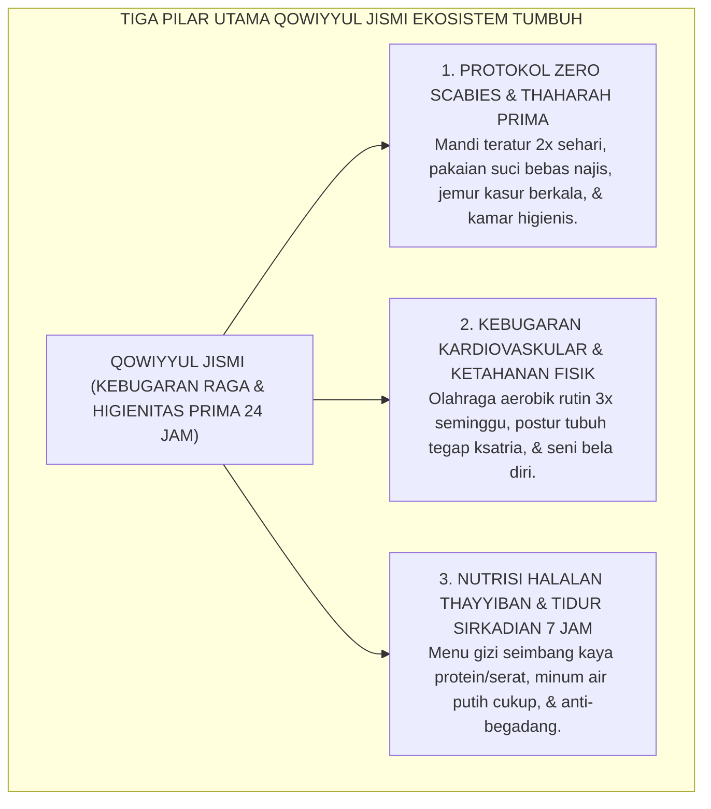
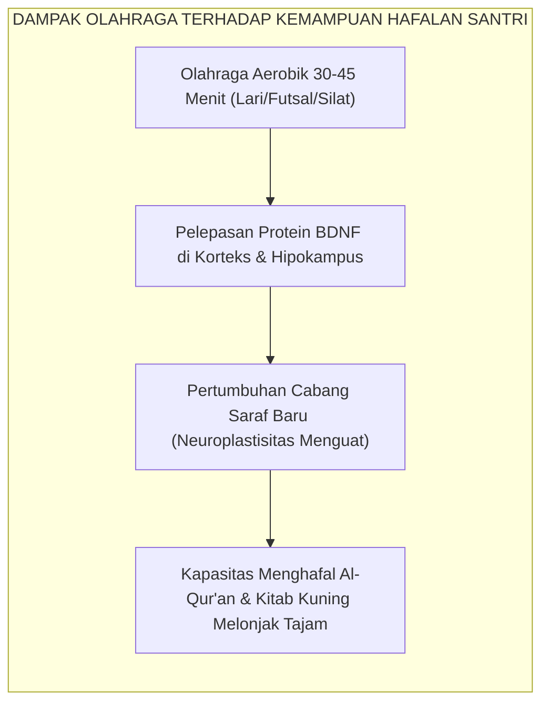

# SUB-BAB 2.6: QOWIYYUL JISMI (KEBUGARAN RAGA & HIGIENITAS THAHARAH)
## *Fondasi Kekuatan Jasmani, Integrasi Kedokteran Nabawi, Neurobiologi Kebugaran (BDNF), dan Protokol Zero Scabies 24-Jam*

**Kode Klasifikasi**: `BOOK-02/BAB-02/SUB-06/MONOGRAF-MASTER-VIBRANT`  
**Disiplin Ilmu**: Fiqih Thaharah & Kedokteran Pencegahan (*Preventive Medicine*), Fisiologi Olahraga (*Exercise Physiology*), Neurobiologi BDNF, & Sanitasi Asrama  
**Penanggung Jawab Keilmuan**: Dewan Pakar Ekosistem TUMBUH (*Master Author, Pakar Pengasuhan Asrama, & Pakar Neurosains Perkembangan*)

---

### I. Hakikat Qowiyyul Jismi: Mematahkan Mitos Kesalehan yang Ringkih

Selama puluhan tahun, terdapat sebuah mitos destruktif yang berkembang secara keliru di sebagian sudut dunia pesantren tradisional: anggapan bahwa "santri sejati harus kurus, pucat, tidak peduli pada kebersihan tubuh, dan harus terkena penyakit kulit (skabies/gudikan) sebagai tanda bahwa ilmunya telah meresap dan berkah".

Ekosistem TUMBUH menolak keras mitos keliru dan menyesatkan ini! 

Islam adalah agama kesucian (*Thaharah*), keindahan (*Jamal*), dan kekuatan (*Quwwah*). Tubuh manusia adalah amanah suci dari Allah SWT (*amanatun ilahiyyah*) yang wajib dirawat, dilatih, dan dijaga kesehatannya agar mampu memikul beban ibadah panjang, qiyamul lail, puasa, jihad keilmuan, dan pelayanan kepada ummat tanpa kelumpuhan fisik.

Di pesantren konvensional yang mengabaikan dimensi jasadiyyah:
* Santri terserang wabah gatal menular skabies secara massal, membuat mereka tidak mampu berkonsentrasi menghafal Al-Qur'an dan terjaga semalaman menggaruk luka hingga infeksi bernanah;
* Santri jarang berolahraga teratur, postur tubuh membungkuk, dan cepat lelah saat duduk di halaqah ilmu;
* Pola makan asrama didominasi karbohidrat olahan tanpa sayur dan protein bergizi (*malnutrisi tersembunyi*).

Dalam Ekosistem TUMBUH, **Qowiyyul Jismi** (Kebugaran Raga dan Kesucian Fisik) ditempatkan sebagai pilar penopang seluruh kapasitas spiritual dan kognitif santri. Raga yang kuat, bersih, dan bugar adalah sarang terbaik bagi bersemayamnya jiwa yang suci dan akal yang cerdas.

<b>Gambar 2.6.1:</b> Tiga Pilar Operasional Karakter Qowiyyul Jismi Ekosistem TUMBUH.

---

### II. Khazanah Turats: Syarah Hadits Mukmin Kuat & Kedokteran Nabawi

Islam memberikan penghormatan yang sangat tinggi terhadap kebugaran fisik dan higienitas tubuh.

#### 1. Keutamaan Mukmin yang Kuat Jasmani dan Rohani
Dalam hadits shahih riwayat **Imam Muslim**[^1], Rasulullah SAW menegaskan:

$$\text{الْمُؤْمِنُ الْقَوِيُّ خَيْرٌ وَأَحَبُّ إِلَى اللهِ مِنَ الْمُؤْمِنِ الضَّعِيفِ، وَفِي كُلٍّ خَيْرٌ}$$

**Artinya:** *"Mukmin yang kuat adalah lebih baik dan lebih dicintai oleh Allah daripada mukmin yang lemah; dan pada masing-masing tetap terdapat kebaikan."*

Para pensyarah hadits menegaskan bahwa kata "kuat" (*al-Qawiy*) mencakup kekuatan iman, kekuatan nalar, dan kekuatan jasmani yang memungkinkan seorang muslim beramal secara maksimal bagi agamanya.

#### 2. Wawasan Kedokteran Pencegahan (*Thibbul Wiqa'i*) Ibnu Qayyim al-Jawziyyah
Dalam kitab monumentalnya *Zad al-Ma'ad fi Hadyi Khairil 'Ibad* (khususnya bagian *Ath-Thibb an-Nabawi*)[^2], **Imam Ibnu Qayyim al-Jawziyyah** meletakkan kaidah kedokteran pencegahan nabawiyyah:
> *"Pokok pemeliharaan kesehatan (*hifzh ash-shihhah*) dalam syariat Islam berpijak pada tiga kaidah utama: menjaga keseimbangan unsur tubuh yang masuk melalui nutrisi thayyib, mengeluarkan sisa kotoran yang membahayakan tubuh melalui thaharah dan istinja' yang sempurna, serta menggerakkan tubuh melalui olahraga dan aktivitas fisik teratur. 
> 
> Sesungguhnya Rasulullah SAW menganjurkan olahraga lari cepat, memanah, gulat adabi, dan berkuda, karena aktivitas tersebut memperkuat otot jantung, mempertajam daya ingat otak, dan membakar sisa-sisa racun dalam darah."*

---

### III. Tinjauan Sains: Neurobiologi Kebugaran (BDNF) & Imunologi Sanitasi

Bagaimana olahraga dan higienitas mempengaruhi daya ingat santri secara neurobiologis?

#### 1. Neuroplastisitas dan Pelepasan BDNF (*Brain-Derived Neurotrophic Factor*)
Pakar neurosains dari Harvard Medical School, **Prof. John J. Ratey**[^3] dalam mahakaryanya *Spark: The Revolutionary New Science of Exercise and the Brain* membuktikan bahwa ketika seseorang melakukan aktivitas fisik aerobik intensitas sedang selama 30–45 menit:
* Otak melepaskan protein ajaib bernama **BDNF (*Brain-Derived Neurotrophic Factor*)**—yang dijuluki sebagai "pupuk ajaib otak" (*Miracle-Gro for the brain*);
* BDNF menstimulasi pertumbuhan sinapsis baru di area **Hipokampus** (pusat penyimpanan memori jangka panjang);
* Kapasitas retensi memori dan kecepatan menghafal Al-Qur'an santri meningkat hingga **20–30%** dibanding santri yang hidup sedentari (*kurang gerak*).

Santri yang hanya disuruh duduk diam sepanjang hari tanpa olahraga justru akan mengalami penurunan aliran darah ke otak (*cerebral blood flow deficit*), yang menyebabkan rasa kantuk kronis, kemalasan, dan kepikunan dini.

<b>Gambar 2.6.2:</b> Alur Neurobiologis dari Aktivitas Fisik Menuju Peningkatan Kapasitas Memori Santri.

#### 2. Imunologi Sanitasi: Pemutusan Rantai Penularan Skabies
Riset epidemiologi asrama membuktikan bahwa tungau *Sarcoptes scabiei* hanya dapat dibasmi melalui pemutusan rantai penularan lingkungan:
* Mencuci pakaian dan sprei dengan air panas minimal 60°C;
* Menjemur kasur busa/kapuk di bawah terik sinar ultraviolet matahari secara terjadwal setiap akhir pekan;
* Menjaga sirkulasi udara kamar agar tidak lembap (kelembapan di bawah 60%).

---

### IV. Matriks Indikator Perilaku Faktual Qowiyyul Jismi (24 Jam)

| Aktivitas Fisik & Higienitas | Indikator Perilaku Positif (Qowiyyul Jismi) | Perilaku Defisit / Malpraktik Sanitasi | Protokol Intervensi Sistemik TUMBUH |
| :--- | :--- | :--- | :--- |
| **Higienitas Mandi & Thaharah** | Mandi teratur 2x sehari dengan sabun, keramas teratur, menyikat gigi siwak/odol setiap sebelum shalat. | Mandi "bebek" (asal basah tanpa sabun), malas sikat gigi, memakai pakaian basah kering di badan. | Inspeksi kebersihan diri berkala oleh Musyrif Asrama dan edukasi fiqih thaharah medis. |
| **Perawatan Kasur & Ranjang Kamar** | Menjemur kasur dan bantal di bawah matahari setiap Jumat/Ahad, mengganti sprei 2 pekan sekali. | Membiarkan kasur lembap dan berdebu berbulan-bulan, menumpuk pakaian kotor di atas ranjang. | Jadwal serentak *Jemur Kasur Akbar* asrama dan penyemprotan disinfektan alami. |
| **Partisipasi Olahraga & Seni Bela Diri** | Mengikuti senam pagi, latihan silat/panahan, atau lari dengan antusias dan menjaga sportivitas. | Mengurung diri di kamar saat jam olahraga, malas bergerak (*sedentary*), merokok sembunyi-sembunyi. | Integrasi program kebugaran wajib 3x seminggu yang dipantau dengan Logbook Kebugaran Jasmani. |
| **Pola Konsumsi Makanan & Air** | Memilih menu bergizi seimbang, memperbanyak sayur dan buah, minum air putih 2 liter sehari. | Ketergantungan mie instan berlebih, jajan sembarangan di luar, jarang minum air putih hingga dehidrasi. | Standardisasi gizi dapur umum pondok dan larangan penjualan makanan ber-MSG/pengawet berlebih di kantin. |

---

### V. Solusi Sistemik TUMBUH: Poskestren Proaktif & Program Zero Scabies

Untuk mewujudkan asrama pesantren yang sehat dan bugar, lembaga menerapkan:
1. **Pos Kesehatan Pesantren (Poskestren) Terpadu**: Dipimpin oleh dokter dan tenaga medis yang melakukan *skrining* kesehatan berkala, pengobatan massal saat terdeteksi kasus pertama infeksi kulit, dan edukasi sanitasi.
2. **Klub Olahraga Prestasi & Seni Bela Diri Santri**: Setiap santri wajib memilih minimal satu cabang olahraga (Pencak Silat, Panahan, Futsal, Bulu Tangkis, atau Renang) sebagai sarana penempaan fisik ksatria.

---

## 📌 Catatan Kaki & Rujukan Primer

[^1]: **Al-Imam Abu al-Husain Muslim bin al-Hajjaj an-Naisaburi**, *Shahih Muslim*, Kitab al-Qadar, Bab fi al-Amri bil Quwwah wa Tarkil 'Ajz (Kairo: Dar Ihya' at-Turats al-'Arabi, 1955), Hadits No. 2664.
[^2]: **Al-Imam Syamsuddin Ibnu Qayyim al-Jawziyyah**, *Zad al-Ma'ad fi Hadyi Khairil 'Ibad*, Tahqiq: Syaikh Syu'aib al-Arnauth & Abdul Qadir al-Arnauth (Beirut: Mu'assasah ar-Risalah, 1979), Jilid IV: "Ath-Thibb an-Nabawi", hlm. 12–45, 180–225.
[^3]: **John J. Ratey & Eric Hagerman**, *Spark: The Revolutionary New Science of Exercise and the Brain* (New York: Little, Brown and Company, 2008), Bab 1 & 2: "Learning: Grow Your Brain Cells", hlm. 35–64; serta **Henriette van Praag**, "Exercise and the brain: Something to chew on", *Trends in Neurosciences*, Vol. 32, No. 5 (2009), hlm. 283–290.
