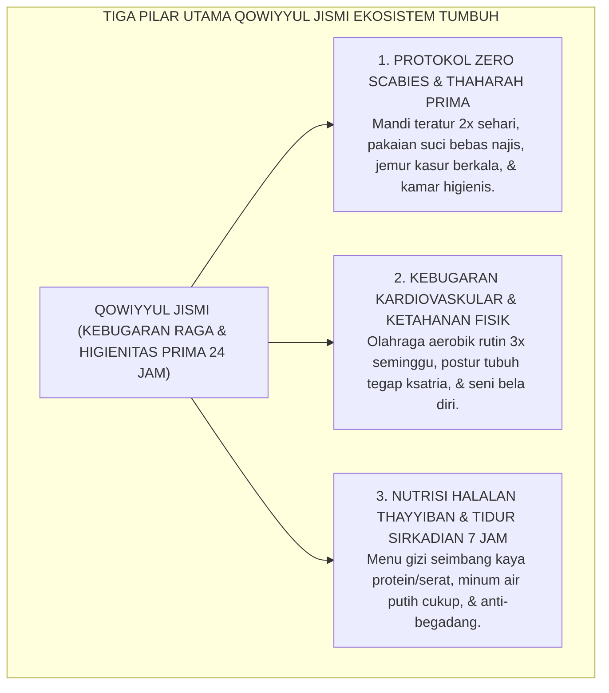
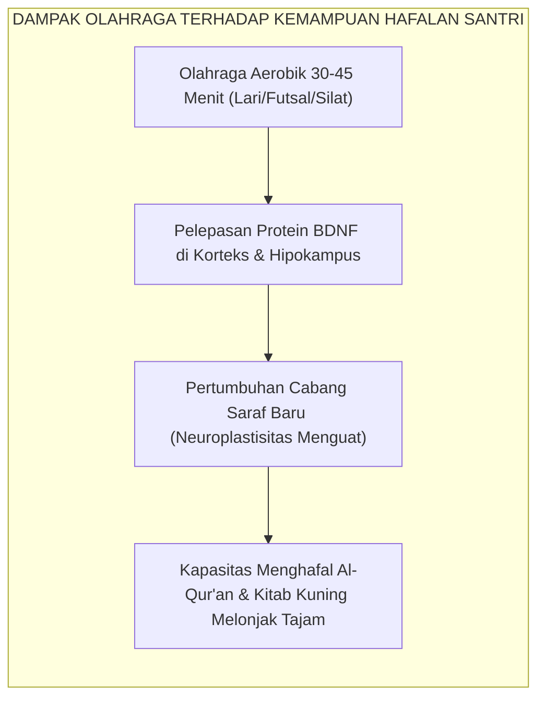

# QOWIYYUL JISMI (KEBUGARAN RAGA & HIGIENITAS THAHARAH)

---

### 🧭 PETA POSISI PANDUAN DALAM SISTEM TUMBUH (DARI HULU KE HILIR)
* **Posisi Arsitektur**: `BATANG EKOSISTEM I (Taksonomi 10 Muwashafat Adab & Tangga Kemandirian J1–J4)`
* **Peruntukan Pengguna**: Wali Kelas, Musyrif Kamar, Guru Pengampu Adab, & Mentor Santri
* **Fokus Panduan**: Memandu tahapan penanaman 10 Karakter Adab Nabawi dari fase Adaptasi (J1), Pembiasaan (J2), Kematangan (J3), hingga Kader Penggerak (J4/Tahap 7).
* **Hasil Akhir yang Dituju**: Terwujudnya santri berkarakter *Insan Adabi* yang mandiri, musyrif yang mengasuh dengan kasih sayang tanpa *burnout*, dan pesantren yang aman berbasis data (*Safe Boarding School*).

---

### 🎯 Mengapa Panduan Ini Ada & Masalah Nyata yang Dipecahkan
1. **Latar Masalah di Lapangan**: Sering kali pengasuhan di pesantren berjalan tanpa SOP yang jelas atau terjebak dalam pola reaktif—menunggu santri berbuat salah baru dihukum dengan emosional.
2. **Solusi Sistem TUMBUH**: Panduan ini memberikan langkah preventif dan terstruktur agar setiap pembiasaan adab berjalan terencana, konsisten, dan terukur.
3. **Sasaran Perubahan**: Memastikan nilai-nilai Islam menyatu dalam perilaku harian santri melalui keteladanan nyata (*Qudwah Hasanah*).

---
### 🎯 Tujuan & Manfaat Panduan
Panduan ini dirancang sebagai petunjuk operasional terapan agar pendidik dan musyrif dapat:
1. Menjalankan pembinaan adab santri dengan pendekatan kasih sayang (*Rahmah*) dan ketegasan yang mendidik (*Firm & Kind*).
2. Menghindari cara-cara kekerasan fisik, bentakan verbal, maupun hukuman yang mempermalukan santri.
3. Menciptakan suasana asrama dan kelas yang aman, tertib, dan menumbuhkan kesadaran diri (*Bi'ah Shalihah*).

---

### 💡 Intisari Cepat (3 Menit Memahami Esensi)
* **Kunci Pengasuhan**: Karakter santri tumbuh melalui keteladanan nyata (*Qudwah Hasanah*), komunikasi empatik, dan pembiasaan terstruktur 24 jam.
* **Tindakan Utama**: Terapkan panduan langkah demi langkah di bawah ini secara konsisten, pantau perkembangan santri secara objektif, dan berikan apresiasi atas setiap perbaikan diri yang mereka capai.
* **Prinsip Disiplin**: Fokus pada pemulihan hubungan dan tanggung jawab nyata (*Restoratif*), bukan sekadar melampiaskan amarah atau menghukum.

---

---

### 💬 ILUSTRASI NYATA & ANALOGI SEDERHANA
Bayangkan sebuah skenario yang sering kita lihat sehari-hari di asrama:
* Ketika seorang santri baru melakukan kekeliruan (misalnya terlambat bangun Subuh atau kasurnya berantakan), respon pertama yang sering muncul adalah bentakan keras atau hukuman fisik (seperti push-up atau jemur di lapangan).
* **Hasilnya?** Santri tersebut mungkin tampak patuh seketika karena takut, tetapi di dalam hatinya tumbuh rasa dongkol, dendam tersembunyi, atau kebiasaan "bersandiwara"—hanya tertib ketika ada pengawas di dekatnya.

Dalam Sistem TUMBUH, kita menggunakan cara yang jauh lebih cerdas, sejuk, dan membumi:
1. **Analogi "Rem dan Pedal Gas Otak"**: Santri usia remaja (usia MTs dan Aliyah) memiliki bagian otak emosi (*Sistem Limbik*) yang sudah menyala sangat kuat seperti *pedal gas mobil sport*, namun otak pengendali logikanya (*Prefrontal Cortex*) masih dalam proses tumbuh seperti *sistem rem yang baru dipasang*. Tugas guru dan musyrif bukan memarahi mobilnya, melainkan menjadi **"Sopir Teladan & Sabuk Pengaman"** yang mendampingi santri belajar menginjak rem dengan bijak.
2. **Kekuatan Contoh Nyata (*Qudwah Hasanah*)**: Santri jauh lebih cepat meniru apa yang mereka **lihat** setiap hari daripada apa yang mereka **dengar** dari ribuan nasihat panjang. Jika musyrif datang tepat waktu, tersenyum ramah, dan kamarnya rapi, santri akan menirunya dengan sukarela.

---

### 🛠️ PANDUAN LANGKAH PRAKTIS LAPANGAN (BISA LANGSUNG DIPRAKTIKKAN HARI INI)

| Tahapan Aksi | Tindakan Nyata Musyrif / Guru di Lapangan | Hal yang Harus Diperhatikan |
| :--- | :--- | :--- |
| **1. Langkah Persiapan (Sebelum Kejadian)** | Sepakati aturan bersama santri di awal pekan dengan kalimat positif (contoh: *"Kamar rapi membuat istirahat kita berkah"*). | Buat poster visual sederhana yang mudah dibaca di dinding kamar. |
| **2. Langkah Respon (Saat Terjadi Masalah)** | Tarik napas, tenangkan diri, ajak santri berbicara empat mata tanpa mempermalukannya di depan teman-temannya. | Gunakan nada bicara yang tenang namun tegas (*Firm & Kind*). |
| **3. Langkah Perbaikan (Tanggung Jawab Nyata)** | Minta santri memperbaiki kesalahannya secara langsung (contoh: merapikan kembali barang yang berantakan atau meminta maaf). | Berikan apresiasi seketika santri telah menuntaskan perbaikannya. |

---

### 🗣️ CONTOH DIALOG LAPANGAN (YANG HARUS DIUCAPKAN VS DIHINDARI)

* ❌ **JANGAN UCAPKAN (Membuat Santri Menutup Diri & Dendam)**:
  > *"Kamu ini pemalas sekali ya, sudah dibilangi berkali-kali masih saja kasur berantakan! Push-up 50 kali sekarang!"*
* ✅ **UCAPKAN INI (Mendidik Tanggung Jawab & Kesadaran Diri)**:
  > *"Akhi, antum tahu kesepakatan kamar kita tentang kerapian tempat tidur setelah Subuh. Coba lihat kasur antum sekarang, apa yang perlu disempurnakan? Mari rapikan bersama sekarang agar kamar kita nyaman dan berkah."*

---

### 📋 3 POIN EMAS RANGKUMAN (UNTUK SANTRI SENIOR & MUSYRIF MUDA)
1. **Didik dengan Kasih Sayang, Tegakkan Batas dengan Adil**: Jangan pernah mencampuradukkan ketegasan aturan dengan pelampiasan amarah pribadi.
2. **Apresiasi 4x Lebih Banyak daripada Teguran (*Magic Ratio 4:1*)**: Jangan hanya bersuara ketika santri berbuat salah. Saat mereka berbuat baik (salat di shaf depan, menolong kawan, membaca Al-Qur'an), segera berikan pujian tulus.
3. **Fokus pada Perbaikan Hubungan (*Restoratif*)**: Masalah perilaku adalah peluang emas untuk mendidik santri menjadi pribadi yang lebih dewasa dan bertanggung jawab.

---

### 📖 Uraian Lengkap Landasan & Rujukan Sistem

---

### I. Hakikat Qowiyyul Jismi: Mematahkan Mitos Kesalehan yang Ringkih

Selama puluhan tahun, terdapat sebuah mitos destruktif yang berkembang secara keliru di sebagian sudut dunia pesantren tradisional: anggapan bahwa "santri sejati harus kurus, pucat, tidak peduli pada kebersihan tubuh, dan harus terkena penyakit kulit (skabies/gudikan) sebagai tanda bahwa ilmunya telah meresap dan berkah".

Ekosistem TUMBUH menolak keras mitos keliru dan menyesatkan ini! 

Islam adalah agama kesucian (*Thaharah*), keindahan (*Jamal*), dan kekuatan (*Quwwah*). Tubuh manusia adalah amanah suci dari Allah SWT (*amanatun ilahiyyah*) yang wajib dirawat, dilatih, dan dijaga kesehatannya agar mampu memikul beban ibadah panjang, qiyamul lail, puasa, jihad keilmuan, dan pelayanan kepada ummat tanpa kelumpuhan fisik.

Di pesantren konvensional yang mengabaikan dimensi jasadiyyah:
* Santri terserang wabah gatal menular skabies secara massal, membuat mereka tidak mampu berkonsentrasi menghafal Al-Qur'an dan terjaga semalaman menggaruk luka hingga infeksi bernanah;
* Santri jarang berolahraga teratur, postur tubuh membungkuk, dan cepat lelah saat duduk di halaqah ilmu;
* Pola makan asrama didominasi karbohidrat olahan tanpa sayur dan protein bergizi (*malnutrisi tersembunyi*).

Dalam Ekosistem TUMBUH, **Qowiyyul Jismi** (Kebugaran Raga dan Kesucian Fisik) ditempatkan sebagai pilar penopang seluruh kapasitas spiritual dan kognitif santri. Raga yang kuat, bersih, dan bugar adalah sarang terbaik bagi bersemayamnya jiwa yang suci dan akal yang cerdas.

<b>Gambar 2.6.1:</b> Tiga Pilar Operasional Karakter Qowiyyul Jismi Ekosistem TUMBUH.

---

### II. Khazanah Turats: Syarah Hadits Mukmin Kuat & Kedokteran Nabawi

Islam memberikan penghormatan yang sangat tinggi terhadap kebugaran fisik dan higienitas tubuh.

#### 1. Keutamaan Mukmin yang Kuat Jasmani dan Rohani
Dalam hadits shahih riwayat **Imam Muslim**[^1], Rasulullah SAW menegaskan:

$$\text{الْمُؤْمِنُ الْقَوِيُّ خَيْرٌ وَأَحَبُّ إِلَى اللهِ مِنَ الْمُؤْمِنِ الضَّعِيفِ، وَفِي كُلٍّ خَيْرٌ}$$

**Artinya:** *"Mukmin yang kuat adalah lebih baik dan lebih dicintai oleh Allah daripada mukmin yang lemah; dan pada masing-masing tetap terdapat kebaikan."*

Para pensyarah hadits menegaskan bahwa kata "kuat" (*al-Qawiy*) mencakup kekuatan iman, kekuatan nalar, dan kekuatan jasmani yang memungkinkan seorang muslim beramal secara maksimal bagi agamanya.

#### 2. Wawasan Kedokteran Pencegahan (*Thibbul Wiqa'i*) Ibnu Qayyim al-Jawziyyah
Dalam kitab monumentalnya *Zad al-Ma'ad fi Hadyi Khairil 'Ibad* (khususnya bagian *Ath-Thibb an-Nabawi*)[^2], **Imam Ibnu Qayyim al-Jawziyyah** meletakkan kaidah kedokteran pencegahan nabawiyyah:
> *"Pokok pemeliharaan kesehatan (*hifzh ash-shihhah*) dalam syariat Islam berpijak pada tiga kaidah utama: menjaga keseimbangan unsur tubuh yang masuk melalui nutrisi thayyib, mengeluarkan sisa kotoran yang membahayakan tubuh melalui thaharah dan istinja' yang sempurna, serta menggerakkan tubuh melalui olahraga dan aktivitas fisik teratur. 
> 
> Sesungguhnya Rasulullah SAW menganjurkan olahraga lari cepat, memanah, gulat adabi, dan berkuda, karena aktivitas tersebut memperkuat otot jantung, mempertajam daya ingat otak, dan membakar sisa-sisa racun dalam darah."*

---

### III. Tinjauan Sains: Neurobiologi Kebugaran (BDNF) & Imunologi Sanitasi

Bagaimana olahraga dan higienitas mempengaruhi daya ingat santri secara neurobiologis?

#### 1. Neuroplastisitas dan Pelepasan BDNF (*Brain-Derived Neurotrophic Factor*)
Pakar neurosains dari Harvard Medical School, **Prof. John J. Ratey**[^3] dalam mahakaryanya *Spark: The Revolutionary New Science of Exercise and the Brain* membuktikan bahwa ketika seseorang melakukan aktivitas fisik aerobik intensitas sedang selama 30–45 menit:
* Otak melepaskan protein ajaib bernama **BDNF (*Brain-Derived Neurotrophic Factor*)**—yang dijuluki sebagai "pupuk ajaib otak" (*Miracle-Gro for the brain*);
* BDNF menstimulasi pertumbuhan sinapsis baru di area **Hipokampus** (pusat penyimpanan memori jangka panjang);
* Kapasitas retensi memori dan kecepatan menghafal Al-Qur'an santri meningkat hingga **20–30%** dibanding santri yang hidup sedentari (*kurang gerak*).

Santri yang hanya disuruh duduk diam sepanjang hari tanpa olahraga justru akan mengalami penurunan aliran darah ke otak (*cerebral blood flow deficit*), yang menyebabkan rasa kantuk kronis, kemalasan, dan kepikunan dini.

<b>Gambar 2.6.2:</b> Alur Neurobiologis dari Aktivitas Fisik Menuju Peningkatan Kapasitas Memori Santri.

#### 2. Imunologi Sanitasi: Pemutusan Rantai Penularan Skabies
Riset epidemiologi asrama membuktikan bahwa tungau *Sarcoptes scabiei* hanya dapat dibasmi melalui pemutusan rantai penularan lingkungan:
* Mencuci pakaian dan sprei dengan air panas minimal 60°C;
* Menjemur kasur busa/kapuk di bawah terik sinar ultraviolet matahari secara terjadwal setiap akhir pekan;
* Menjaga sirkulasi udara kamar agar tidak lembap (kelembapan di bawah 60%).

---

### IV. Matriks Indikator Perilaku Faktual Qowiyyul Jismi (24 Jam)

| Aktivitas Fisik & Higienitas | Indikator Perilaku Positif (Qowiyyul Jismi) | Perilaku Defisit / Malpraktik Sanitasi | Protokol Intervensi Sistemik TUMBUH |
| :--- | :--- | :--- | :--- |
| **Higienitas Mandi & Thaharah** | Mandi teratur 2x sehari dengan sabun, keramas teratur, menyikat gigi siwak/odol setiap sebelum shalat. | Mandi "bebek" (asal basah tanpa sabun), malas sikat gigi, memakai pakaian basah kering di badan. | Inspeksi kebersihan diri berkala oleh Musyrif Asrama dan edukasi fiqih thaharah medis. |
| **Perawatan Kasur & Ranjang Kamar** | Menjemur kasur dan bantal di bawah matahari setiap Jumat/Ahad, mengganti sprei 2 pekan sekali. | Membiarkan kasur lembap dan berdebu berbulan-bulan, menumpuk pakaian kotor di atas ranjang. | Jadwal serentak *Jemur Kasur Akbar* asrama dan penyemprotan disinfektan alami. |
| **Partisipasi Olahraga & Seni Bela Diri** | Mengikuti senam pagi, latihan silat/panahan, atau lari dengan antusias dan menjaga sportivitas. | Mengurung diri di kamar saat jam olahraga, malas bergerak (*sedentary*), merokok sembunyi-sembunyi. | Integrasi program kebugaran wajib 3x seminggu yang dipantau dengan Logbook Kebugaran Jasmani. |
| **Pola Konsumsi Makanan & Air** | Memilih menu bergizi seimbang, memperbanyak sayur dan buah, minum air putih 2 liter sehari. | Ketergantungan mie instan berlebih, jajan sembarangan di luar, jarang minum air putih hingga dehidrasi. | Standardisasi gizi dapur umum pondok dan larangan penjualan makanan ber-MSG/pengawet berlebih di kantin. |

---

### V. Solusi Sistemik TUMBUH: Poskestren Proaktif & Program Zero Scabies

Untuk mewujudkan asrama pesantren yang sehat dan bugar, lembaga menerapkan:
1. **Pos Kesehatan Pesantren (Poskestren) Terpadu**: Dipimpin oleh dokter dan tenaga medis yang melakukan *skrining* kesehatan berkala, pengobatan massal saat terdeteksi kasus pertama infeksi kulit, dan edukasi sanitasi.
2. **Klub Olahraga Prestasi & Seni Bela Diri Santri**: Setiap santri wajib memilih minimal satu cabang olahraga (Pencak Silat, Panahan, Futsal, Bulu Tangkis, atau Renang) sebagai sarana penempaan fisik ksatria.

---

## 📌 Catatan Kaki & Rujukan Primer

[^1]: **Al-Imam Abu al-Husain Muslim bin al-Hajjaj an-Naisaburi**, *Shahih Muslim*, Kitab al-Qadar, Bab fi al-Amri bil Quwwah wa Tarkil 'Ajz (Kairo: Dar Ihya' at-Turats al-'Arabi, 1955), Hadits No. 2664.
[^2]: **Al-Imam Syamsuddin Ibnu Qayyim al-Jawziyyah**, *Zad al-Ma'ad fi Hadyi Khairil 'Ibad*, Tahqiq: Syaikh Syu'aib al-Arnauth & Abdul Qadir al-Arnauth (Beirut: Mu'assasah ar-Risalah, 1979), Jilid IV: "Ath-Thibb an-Nabawi", hlm. 12–45, 180–225.
[^3]: **John J. Ratey & Eric Hagerman**, *Spark: The Revolutionary New Science of Exercise and the Brain* (New York: Little, Brown and Company, 2008), Bab 1 & 2: "Learning: Grow Your Brain Cells", hlm. 35–64; serta **Henriette van Praag**, "Exercise and the brain: Something to chew on", *Trends in Neurosciences*, Vol. 32, No. 5 (2009), hlm. 283–290.
