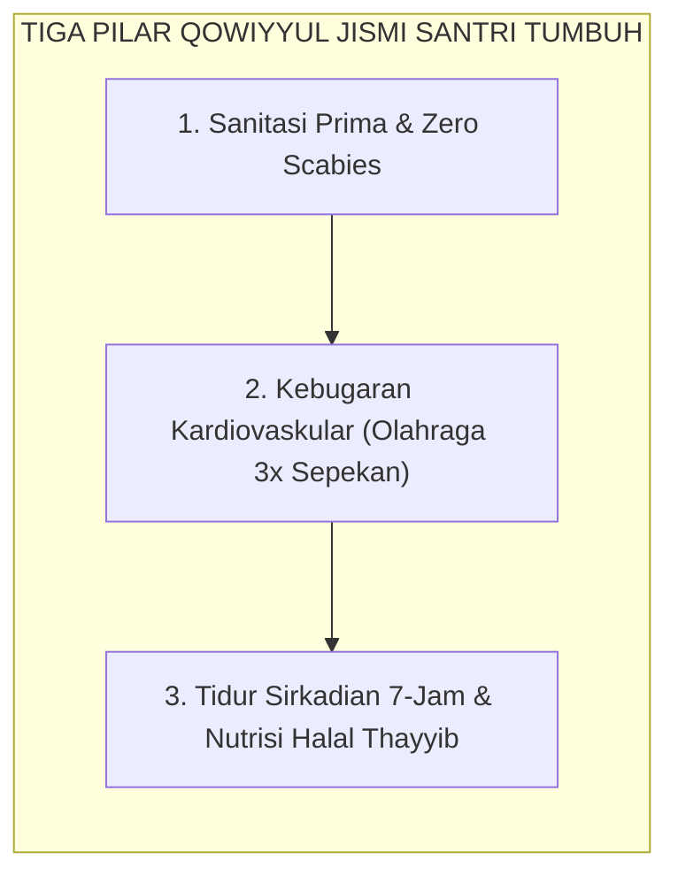

# SUB-BAB 2.6: QOWIYYUL JISMI (FISIK YANG KUAT, BERSIH, & BUGAR)
## *Higienitas Thaharah, Protokol Nol Skabies (Zero Scabies), Kebugaran Kardiovaskular, dan Ritme Tidur Sirkadian 7-Jam*

**Kode Klasifikasi**: `BOOK-02/BAB-02/SUB-06/MONOGRAF-MASTER-VIBRANT`  
**Disiplin Ilmu**: Kesehatan Komunitas Pesantren, Kedokteran Fisik Islami (*Thibbun Nabawi*), & Ritme Sirkadian  
**Penanggung Jawab Keilmuan**: Dewan Pakar Ekosistem TUMBUH (*Pakar Pengasuhan Asrama & Pakar Neurosains Perkembangan*)

---

### Mukmin yang Kuat Lebih Dicintai Allah

Pilar keenam karakter santri adalah **Qowiyyul Jismi** (Fisik yang Kuat, Bersih, dan Sehat).

Rasulullah SAW bersabda: *"Mukmin yang kuat lebih baik dan lebih dicintai oleh Allah daripada mukmin yang lemah, meskipun pada keduanya tetap terdapat kebaikan."* (HR. Muslim no. 2664).

Sistem TUMBUH menolak keras anggapan bahwa santri yang shalih harus bertubuh ringkih dan terkena penyakit kulit gatal-gatal (gudik/skabies):
* **Protokol Nol Skabies (*Zero Scabies Protocol*)**: Menjemur kasur dan bantal secara teratur di bawah sinar matahari setiap pekan, mencuci sprei berkala, dan menjaga sirkulasi ventilasi udara kamar.
* **Kebugaran Jasmani & Olahraga Sunnah**: Mengikuti jadwal olahraga terstruktur 3 kali sepekan (lari pagi, pencak silat, panahan, renang, atau futsal).
* **Ritme Tidur Sirkadian 7 Jam**: Menjamin santri tidur tepat waktu pukul 22.00 WIB hingga 03.30/04.00 WIB agar hormon pertumbuhan (*Human Growth Hormone*) dan konsolidasi memori di otak bekerja optimal.

<b>Gambar 2.6.1:</b> Tiga Pilar Kebugaran Jasmani Santri TUMBUH.

**Al-Imam Ibn al-Qayyim al-Jawziyyah** dalam *Zad al-Ma'ad*[^1] menjelaskan bahwa petunjuk Rasulullah SAW memadukan secara harmonis antara olahraga fisik, pembatasan porsi makan berlebih, dan kebersihan thaharah sebagai syarat mutlak terpeliharanya vitalitas tubuh dan ketajaman daya ingat otak.

---

## 📌 Catatan Kaki & Rujukan Primer

[^1]: **Al-Imam Syamsuddin Muhammad bin Abi Bakr Ibnu Qayyim al-Jawziyyah**, *Zad al-Ma'ad fi Hadyi Khairil 'Ibad*, Tahqiq: Syaikh Syu'aib al-Arnauth & Abdul Qadir al-Arnauth (Kuwait: Maktabah al-Manar / Beirut: Mu'assasah ar-Risalah, 1979), Jilid IV: "At-Thibbun Nabawi", hlm. 220–265.
