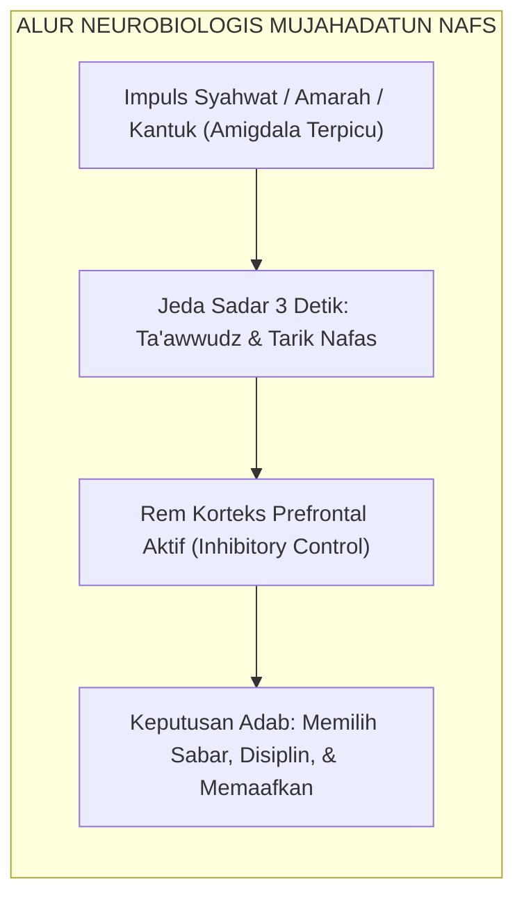

# SUB-BAB 2.7: MUJAHIDUN LINAFSIHI (PEJUANG PENGENDALIAN DIRI)
## *Neurosains Regulasi Diri, Penundaan Kepuasan Instan (Delayed Gratification), dan Penaklukan Hawa Nafsu*

**Kode Klasifikasi**: `BOOK-02/BAB-02/SUB-07/MONOGRAF-MASTER-VIBRANT`  
**Disiplin Ilmu**: Neurosains Pengendalian Diri (*Inhibitory Control*), Psikologi Kehendak (*Willpower*), & Tasawuf 'Amali  
**Penanggung Jawab Keilmuan**: Dewan Pakar Ekosistem TUMBUH (*Pakar Neurosains Perkembangan & Pakar Epistemologi Turats*)

---

### Menaklukkan Musuh Terbesar di Dalam Dada

Pilar ketujuh karakter santri adalah **Mujahidun Linafsihi** (Pejuang yang Gigih Mengendalikan Hawa Nafsu).

Kekuatan sejati seorang santri bukan diukur dari kemampuannya merobohkan lawan, melainkan kemampuannya mengendalikan amarah dan syahwatnya sendiri:
* **Penundaan Kepuasan Instan (*Delayed Gratification*)**: Mampu menunda kesenangan jangka pendek (mengobrol santai atau tidur siang berlebih) demi meraih keberhasilan hafalan Al-Qur'an dan muthala'ah kitab.
* **Pengendalian Impuls Amarah (*Emotional Inhibitory Control*)**: Mampu menahan diri saat diprovokasi kawan; memilih menarik nafas dalam, melafalkan ta'awwudz, dan tersenyum lapang dada.
* **Resiliensi Spiritual (*Spiritual Grit*)**: Cepat bangkit dan bertaubat saat melakukan kesalahan tanpa larut dalam keputusasaan batin.

<b>Gambar 2.7.1:</b> Alur Neurobiologis Mujahadatun Nafs Santri TUMBUH.

Pakar psikologi **Walter Mischel**[^1] dalam eksperimen klasiknya *The Marshmallow Test* membuktikan bahwa anak yang memiliki kapasitas menunda kepuasan instan memiliki peluang sukses akademis dan kematangan emosi berkali-kali lipat lebih tinggi.

Pakar neurosains kehendak **Roy F. Baumeister**[^2] membuktikan bahwa kontrol diri (*willpower*) bekerja laksana otot yang semakin kuat jika dilatih secara teratur setiap hari.

**Hujjatul Islam Imam Abu Hamid Al-Ghazali** dalam *Ihya' 'Ulumiddin* (Kitab *Riyadhatin Nafs*)[^3] menjelaskan bahwa hawa nafsu laksana binatang liar yang harus dijinakkan dengan tali kendali latihan spiritual (*Riyadhah*) agar tunduk patuh di bawah perintah akal dan syariat.

---

## 📌 Catatan Kaki & Rujukan Primer

[^1]: **Walter Mischel**, *The Marshmallow Test: Mastering Self-Control* (New York: Little, Brown and Company, 2014), Bab 1: "The Delay of Gratification Paradigm", hlm. 15–42.
[^2]: **Roy F. Baumeister & John Tierney**, *Willpower: Rediscovering the Greatest Human Strength* (New York: Penguin Press, 2011), Bab 2: "Where Willpower Power Comes From", hlm. 41–68.
[^3]: **Hujjatul Islam Imam Abu Hamid al-Ghazali**, *Ihya' 'Ulumiddin*, Kitab Riyadhatin Nafs wa Tahdzibil Akhlaq (Kairo & Beirut: Dar al-Ma'rifah, t.th.), Jilid III, hlm. 60–75.
