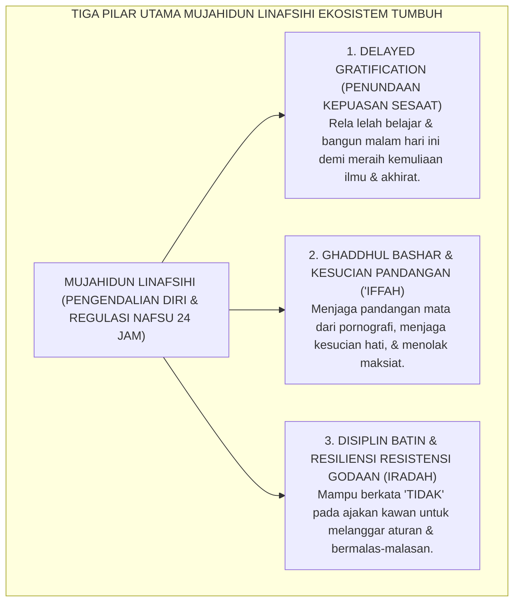
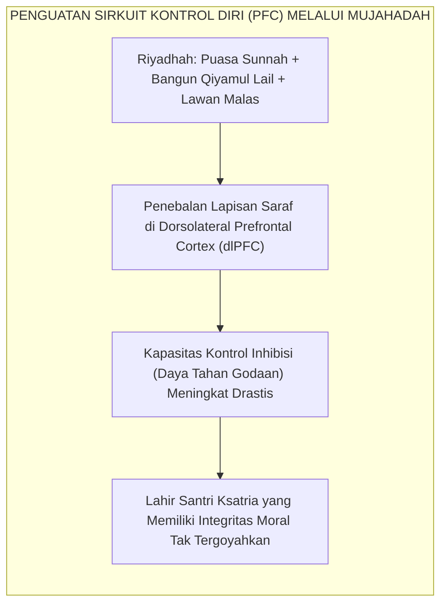
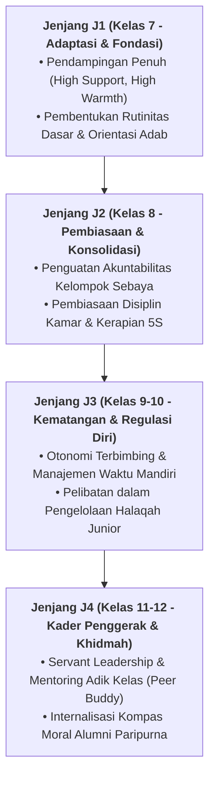

# MUJAHIDUN LINAFSIHI (PENGENDALIAN HAWA NAFSU & REGULASI DIRI)

---
### I. Hakikat Mujahidun Linafsihi: Medan Tempur Terbesar di Dalam Diri

Dalam perjalanan hidup seorang penuntut ilmu di pesantren, musuh paling berbahaya yang mampu menggagalkan masa depannya bukanlah ketatnya jadwal madrasah, bukan pula ustadz yang tegas, melainkan **hawa nafsunya sendiri yang bersemayam di dalam dadanya (*an-Nafs al-Ammarah bis-Su'*)**.

Remaja yang gagal menaklukkan dorongan impulsif nafsunya akan terperosok ke dalam berbagai perilaku destruktif:
* **Kelumpuhan Daya Tahan Belajar (*Instant Gratification Trap*)**: Tidak mampu bertahan membaca kitab lebih dari 10 menit karena terbiasa mencari kepuasan instan;
* **Kecanduan Tersembunyi (*Hidden Digital Addiction*)**: Berusaha menyelundupkan gawai secara ilegal ke asrama hanya untuk bermain game online sembunyi-sembunyi di bawah selimut hingga larut malam;
* **Ketidakberdayaan Melawan Rasa Malas**: Selalu beralasan sakit saat adzan subuh berkumandang hanya demi menambah beberapa menit tidur di kasur empuk.

Dalam Ekosistem TUMBUH, **Mujahidun Linafsihi** (Pejuang yang Gigih Menaklukkan Hawa Nafsunya) adalah mahkota kepribadian santri. Santri tidak diposisikan sebagai robot yang patuh karena dipaksa kamera pengawas, melainkan sebagai **ksatria batin (*spiritual warrior*)** yang dilatih setiap hari untuk mengendalikan syahwatnya, menolak kepuasan sesaat (*delayed gratification*), dan mengarahkan seluruh kehendak jiwanya demi menggapai derajat keridhaan Allah SWT.

<b>Gambar 2.7.1:</b> Tiga Pilar Operasional Karakter Mujahidun Linafsihi Santri.

---

### II. Khazanah Turats: Syarah Hadits Mujahid Sejati & Riyadhatun Nafs Al-Ghazali

Para ulama Islam telah membedah secara mendalam dinamika perang batin melawan dorongan nafsu hewani (*an-Nafs al-Bahimiyyah*).

#### 1. Hakikat Mujahid Sejati dalam Sunnah Nabawiyyah
Dalam hadits shahih yang diriwayatkan oleh **Imam At-Tirmidzi**[^1], Rasulullah SAW menegaskan:

$$\text{الْمُجَاهِدُ مَنْ جَاهَدَ نَفْسَهُ فِي اللهِ}$$

**Artinya:** *"Mujahid (pejuang) sejati adalah orang yang bersungguh-sungguh berjihad melawan hawa nafsunya demi ketaatan kepada Allah."*

#### 2. Metode Pelatihan Jiwa (*Riyadhatun Nafs*) Imam Al-Ghazali
Dalam *Ihya' 'Ulumiddin* (Kitab *Kasyr asy-Syahwatain: Syahwat al-Bathn wa Syahwat al-Farj*)[^2], **Hujjatul Islam Imam Abu Hamid Al-Ghazali** mengibaratkan hawa nafsu manusia bagaikan seekor kuda liar:
> *"Ketahuilah bahwa nafsu manusia jika dibiarkan bebas menuruti seluruh keinginannya, ia akan menjadi liar dan melemparkan penunggangnya ke dalam jurang kebinasaan. 
> 
> Namun, jika nafsu tersebut dilatih secara bertahap (*riyadhah*) dengan mengurangi porsi makan berlebih melalui puasa, membatasi tidur berlebihan melalui qiyamul lail, dan mengekangnya dengan kendali syariat, maka nafsu tersebut akan tunduk menjadi tunggangan setia yang menghantarkan manusia menuju hadirat Ilahi."*

Dalam *Al-Fawa'id*[^3], **Imam Ibnu Qayyim al-Jawziyyah** menjelaskan strategi memenangkan perang batin: *Tolaklah lintasan pikiran buruk (*al-khawatir*) saat pertama kali muncul di kepala; karena jika lintasan pikiran dibiarkan, ia akan berubah menjadi syahwat (*asy-syahwah*); jika syahwat dibiarkan, ia akan mengkristal menjadi kehendak bulat (*al-iradah*); dan jika kehendak dibiarkan, ia akan meletup menjadi tindakan maksiat nyata (*al-fi'l*).*

---

### III. Tinjauan Sains: The Marshmallow Test & Otot Kontrol Diri Prefrontal

Konsep *Mujahidun Linafsihi* memiliki padanan ilmiah yang sangat kokoh dalam riset psikologi kontrol diri modern:

#### 1. Eksperimen Legendaris The Marshmallow Test (Walter Mischel)
Riset longitudinal monumental oleh **Prof. Walter Mischel**[^4] dari Stanford University menguji kemampuan anak menunda kepuasan (*delayed gratification*): anak diberi satu marshmallow, namun jika ia mampu menahan diri tidak memakannya selama 15 menit, ia akan diberi hadiah marshmallow kedua.

Pelacakan terhadap anak-anak tersebut selama 40 tahun membuktikan bahwa:
* Anak yang memiliki kemampuan menunda kepuasan (*high self-control*) tumbuh menjadi remaja dengan capaian nilai ujian SAT yang jauh lebih tinggi, memiliki indeks massa tubuh (BMI) yang lebih sehat, memiliki ketahanan stres yang luar biasa, dan terbebas dari kecanduan narkoba;
* Sebaliknya, anak yang tidak mampu menahan impuls (*low self-control*) memiliki risiko tinggi terjerat perilaku kriminal, kegagalan karier, dan ketidakstabilan relasi sosial.

#### 2. Neurobiologi Kontrol Inhibisi di Korteks Prefrontal (PFC)
Pakar neurosains kognitif **Prof. Roy F. Baumeister**[^5] dalam teorinya tentang *Ego Depletion & Self-Control Muscle* membuktikan bahwa kontrol diri bekerja persis seperti otot biologis:
* Kontrol diri dikendalikan oleh sirkuit inhibisi di **Dorsolateral Prefrontal Cortex (dlPFC)**;
* Semakin sering otot kontrol diri ini dilatih (melalui puasa sunnah, menahan diri dari menyontek, dan bangun fajar), sirkuit prefrontal tersebut semakin tebal dan kuat (*neuroplastic strengthening*).

<b>Gambar 2.7.2:</b> Alur Neurobiologis Penguatan Kapasitas Kontrol Diri Santri melalui Riyadhah.

---

### IV. Matriks Indikator Perilaku Faktual Mujahidun Linafsihi (24 Jam)

| Situasi Godaan Keseharian | Indikator Perilaku Positif (Mujahidun Linafsihi) | Perilaku Defisit / Korban Hawa Nafsu | Protokol Pendampingan Terstruktur TUMBUH |
| :--- | :--- | :--- | :--- |
| **Menghadapi Waktu Tidur vs Begadang** | Disiplin memadamkan lampu pukul 22.00 WIB dan langsung berwudhu untuk tidur, menolak ajakan begadang. | Asyik mengobrol unfaedah hingga larut malam, begadang di lorong, lalu kesiangan shalat subuh. | Patroli malam empati oleh Musyrif dan konseling sirkadian tidur bagi santri yang gemar begadang. |
| **Menghadapi Integritas Ujian Madrasah** | Pantang menyontek atau membuka contekan, percaya diri dengan hasil ikhtiar sendiri dan ridha pada takdir. | Mencontek, membuat catatan kecil di telapak tangan, atau bekerjasama curang dengan kawan. | Disiplin Restoratif: pembatalan nilai, kewajiban belajar mandiri, dan refleksi kejujuran bersama guru BK. |
| **Pengendalian Syahwat Gawai & Media** | Menggunakan fasilitas komputer pondok semata-mata untuk riset akademis dan dakwah; menjaga pandangan mata. | Menyelundupkan gawai ilegal, mengakses konten pornografi/game judi online di warnet luar. | Karantina digital terstruktur, program konseling pemulihan kecanduan adiksi, dan pengalihan ke olahraga. |
| **Ibadah Puasa Sunnah & Qiyamul Lail** | Menjalankan puasa Senin-Kamis atau puasa Daud dengan gembira, melatih penundaan rasa lapar fisik. | Menolak berpuasa sunnah dengan alasan malas, makan berlebihan di luar jam makan (*gluttony*). | Halaqah motivasi keutamaan puasa sunnah dan penyediaan menu sahur-berbuka sehat bersama. |

---

### V. Solusi Sistemik TUMBUH: Pembiasaan Digital Fasting & Klinik Regulasi Diri

Lembaga merumuskan instrumen aplikatif:
1. **Kebijakan Puasa Digital Terstruktur (*Structured Digital Fasting Protocol*)**: Pesantren didesain sebagai zona bebas radiasi kecanduan gawai, di mana interaksi digital hanya diizinkan di laboratorium komputer madrasah dengan filter konten ketat.
2. **Klinik Bimbingan Konseling Regulasi Diri**: Santri yang terdeteksi memiliki masalah impulsivitas tinggi mendapatkan sesi pendampingan CBT (*Cognitive Behavioral Therapy*) Islami untuk melatih teknik pernapasan de-eskalasi dan pengalihan stimulus godaan.

---

## 📌 Catatan Kaki & Rujukan Primer

[^1]: **Al-Imam Abu Isa Muhammad bin Isa at-Tirmidzi**, *Sunan at-Tirmidzi*, Kitab Fadha'il al-Jihad, Bab Man Qaatala Tahta Rayatin 'Ammiyyah (Beirut: Dar al-Gharb al-Islami, 1998), Hadits No. 1621. Dinyatakan shahih oleh Syaikh Al-Albani.
[^2]: **Hujjatul Islam Imam Abu Hamid Muhammad bin Muhammad al-Ghazali**, *Ihya' 'Ulumiddin*, Kitab Kasyrisy Syahwatain (Kairo & Beirut: Dar al-Ma'rifah, t.th.), Jilid III, hlm. 85–110.
[^3]: **Al-Imam Syamsuddin Ibnu Qayyim al-Jawziyyah**, *Al-Fawa'id*, Tahqiq: Syaikh Syu'aib al-Arnauth (Kairo: Dar al-Afaq al-Jadidah, t.th.), hlm. 88–104; serta **Ibnu Qayyim**, *Madarij as-Salikin bayna Manazil Iyyaka Na'budu wa Iyyaka Nasta'in* (Beirut: Dar al-Kitab al-'Arabi, 1416 H), Jilid II, hlm. 340–360.
[^4]: **Walter Mischel, Yuichi Shoda, & Philip K. Peake**, "Predicting adolescent cognitive and self-regulatory competencies from preschool delay of gratification: Identifying delayed predictors", *Developmental Psychology*, Vol. 26, No. 6 (1990), hlm. 978–986; serta **Walter Mischel**, *The Marshmallow Test: Mastering Self-Control* (New York: Little, Brown and Company, 2014), hlm. 1–45.
[^5]: **Roy F. Baumeister, Ellen Bratslavsky, Mark Muraven, & Dianne M. Tice**, "Ego depletion: Is the active self a limited resource?", *Journal of Personality and Social Psychology*, Vol. 74, No. 5 (1998), hlm. 1252–1265; serta **Roy F. Baumeister & John Tierney**, *Willpower: Rediscovering the Greatest Human Strength* (New York: Penguin Press, 2011), Bab 1 & 2.

---

### IV. Pembedahan Kapasitas Lanjutan & Trajektori Progresi Mujahidun Linafsihi (Pengendalian Hawa Nafsu & Regulasi Diri)

Pengembangan kompetensi **MUJAHIDUN LINAFSIHI (PENGENDALIAN HAWA NAFSU & REGULASI DIRI)** pada santri memerlukan strategi diferensiasi yang selaras dengan tahapan usia perkembangan remaja (*Developmental Milestones*):

1. **Dekomposisi Indikator Kematangan Perilaku**:
   Untuk memastikan karakter **MUJAHIDUN LINAFSIHI (PENGENDALIAN HAWA NAFSU & REGULASI DIRI)** tertanam secara operasional, dewan asatidz dan musyrif memetakan indikator perilakunya ke dalam 3 ranah capaian:
   * **Ranah Kognitif-Reflektif (*Ma'rifah*)**: Santri memahami dalil syar'i, urgensi akhlak, dan konsekuensi logis dari setiap pilihannya.
   * **Ranah Afektif-Ruhiyyah (*Wijdan*)**: Tumbuhnya kepekaan nurani, rasa malu berbuat dosa (*Haya'*), dan kenikmatan dalam berbuat kebajikan.
   * **Ranah Psikomotorik-Habituasi (*'Amal*)**: Terwujudnya keterampilan bertindak nyata secara spontan, konsisten, dan mandiri tanpa perlu disuruh.

2. **Matriks Penahapan Lintas Jenjang Kemandirian (J1–J4)**:

3. **Rubrik Evaluasi Kualitatif & Indikator Pencapaian**:

| Level Kemandirian | Karakteristik Perilaku Teramati (*Behavioral Anchor*) | Pendekatan Bimbingan Musyrif |
| :--- | :--- | :--- |
| **Level 1 (Emerging)** | Memerlukan instruksi berulang dan pengawasan langsung musyrif. | *Direct Prompting* & pengingat visual harian. |
| **Level 2 (Developing)** | Mampu menjalankan adab saat diingatkan oleh teman sebaya. | Penguatan positif melalui pujian deskriptif. |
| **Level 3 (Proficient)** | Menjalankan adab secara mandiri dan konsisten tanpa diawasi. | Pemberian kepercayaan dan peran tanggung jawab kamar. |
| **Level 4 (Exemplary)** | Menjadi teladan (*Qudwah*) dan mampu membimbing kawan-kawannya. | Pelibatan aktif dalam struktur Dewan Santri & Mentor. |

---

### V. Panduan Praksis Pendampingan Musyrif di Asrama

Agar penanaman **MUJAHIDUN LINAFSIHI (PENGENDALIAN HAWA NAFSU & REGULASI DIRI)** berhasil maksimal di lapangan, musyrif disarankan menerapkan protokol pendampingan berikut:
* **Fokus pada Usaha (*Effort-Oriented Praise*)**: Berikan apresiasi atas proses perjuangan santri dalam memperbaiki diri, bukan semata-mata hasil akhir yang sempurna.
* **Dialog Sokratik Saat Santri Mengalami Kesulitan**: Ajukan pertanyaan reflektif seperti: *"Apa yang membuat antum merasa berat menjalankan adab ini hari ini? Bagaimana kita bisa mengatasinya bersama besok?"*
* **Menjaga Iklim Ukhuwah Bebas Perundungan**: Pastikan senioritas dimaknai sebagai amanah pengayoman dan perlindungan kepada yang lebih muda, bukan hak istimewa untuk memerintah.
