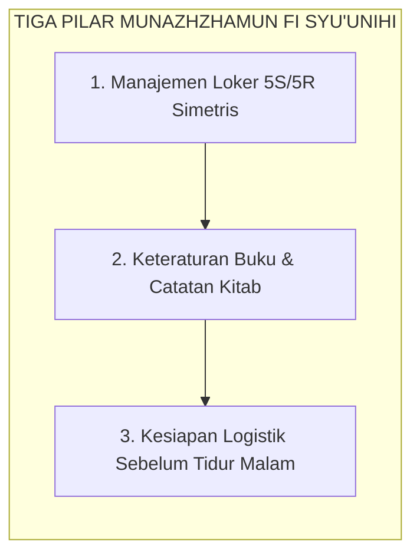

# SUB-BAB 2.8: MUNAZHZHAMUN FI SYU'UNIHI (TERTIB DALAM SEGALA URUSAN)
## *Manajemen Keteraturan Hidup, Standar 5S/5R Loker Asrama, Perencanaan Harian, dan Disiplin Logistik Pribadi*

**Kode Klasifikasi**: `BOOK-02/BAB-02/SUB-08/MONOGRAF-MASTER-VIBRANT`  
**Disiplin Ilmu**: Manajemen Keteraturan Pribadi (*Personal Organization*), Ergonomi Asrama, & Psikologi Keteraturan Spasial  
**Penanggung Jawab Keilmuan**: Dewan Pakar Ekosistem TUMBUH (*Pakar Pengasuhan Asrama & Pakar Tata Kelola Qudwah*)

---

### Keteraturan Fisik sebagai Cermin Kerapian Batin

Pilar kedelapan karakter santri adalah **Munazhzhamun fi Syu'unihi** (Tertib dan Terorganisir dalam Segala Urusannya).

Keteraturan hidup di asrama TUMBUH bukan sekadar formalitas saat inspeksi musyrif, melainkan cermin dari ketertiban batin penuntut ilmu:
* **Standar Kerapian Loker 5S/5R**: Menata lemari pakaian dengan zonasi simetris yang jelas (seragam di gantungan atas, sarung di rak tengah, pakaian santai di rak bawah, dan perlengkapan mandi di kotak khusus).
* **Keteraturan Catatan Belajar**: Mencatat syarah kitab secara rapi dengan memberi tanda warna pada kaidah penting (*fawa'id*), serta menyusun jadwal muthala'ah mandiri.
* **Kesiapan Logistik Malam Hari**: Menyiapkan seragam, peci, sajadah, dan kitab yang akan digunakan esok hari sebelum tidur malam pukul 22.00 WIB, mencegah kepanikan dan ketergesaan di waktu subuh.

<b>Gambar 2.8.1:</b> Tiga Pilar Keteraturan Hidup Santri TUMBUH.

**Hadhratusy Syaikh KH. M. Hasyim Asy'ari** dalam *Adab al-'Alim wal Muta'allim*[^1] menegaskan bahwa penuntut ilmu wajib menata kitab-kitabnya dengan penuh takdzim: meletakkan Al-Qur'an di posisi teratas, diikuti kitab hadits, tafsir, ushul fiqih, dan nahwu-sharaf, serta menjaga kerapian tempat tidurnya agar hati senantiasa tenang dan siap menerima ilmu.

---

## 📌 Catatan Kaki & Rujukan Primer

[^1]: **Hadhratusy Syaikh KH. M. Hasyim Asy'ari**, *Adab al-'Alim wal Muta'allim fi ma Yahtaju Ilayhi al-Muta'allim fi Ahwal Ta'allumihi wa ma Yatawaqqafu 'alayhi al-Mu'allim fi Maqamat Ta'limihi* (Jombang: Maktabah at-Turats al-Islami, 1415 H), Bab 2: "Adab al-Muta'allim ma'a Kutubihi", hlm. 35–42.
