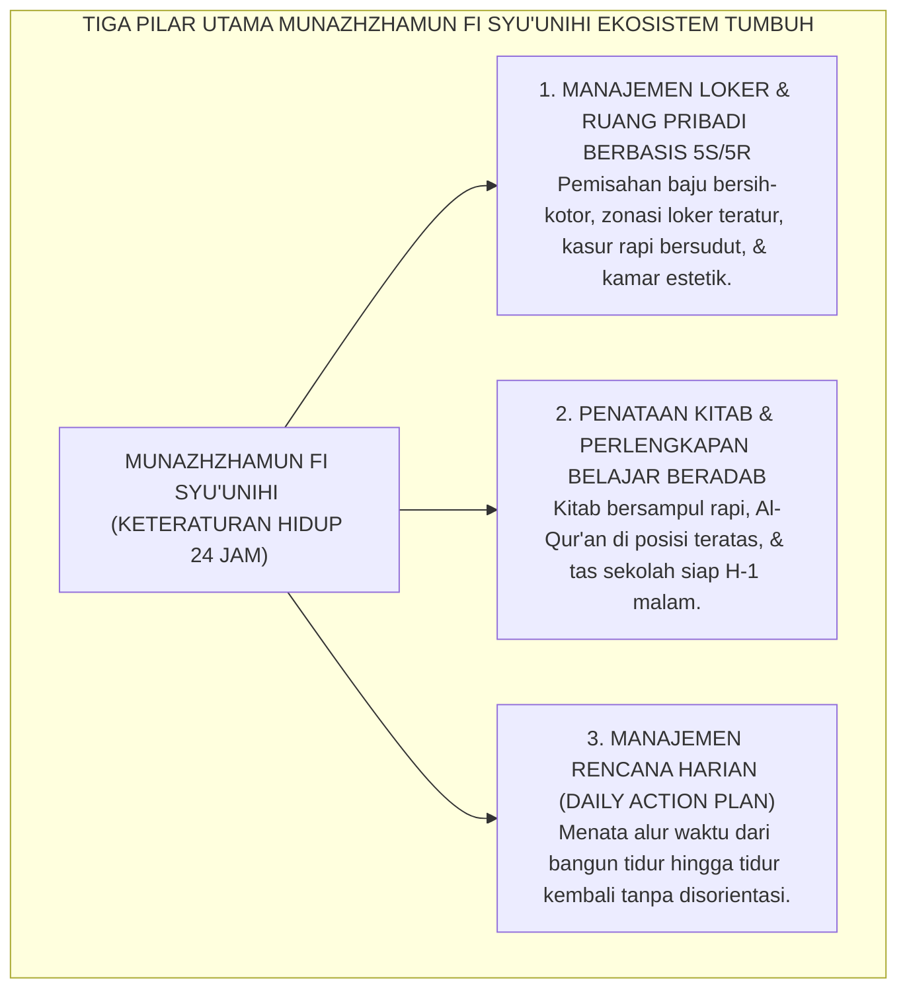
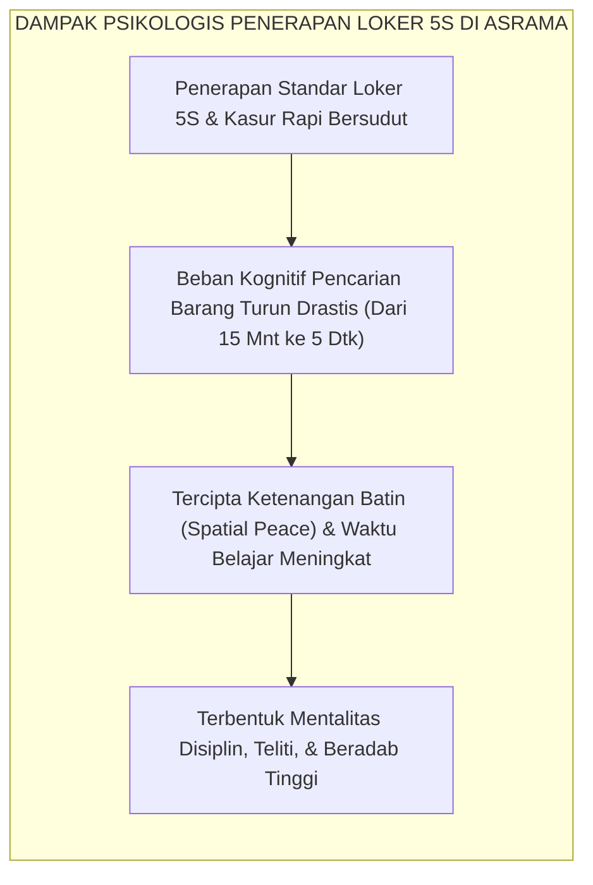
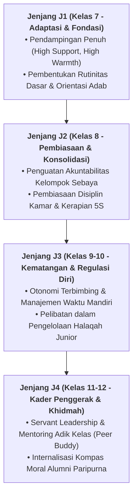

# MUNAZHZHAMUN FI SYU'UNIHI (TERATUR DALAM SEGALA URUSAN)

---
### I. Hakikat Munazhzhamun fi Syu'unihi: Ketertiban Fisik sebagai Cermin Jiwa

Ada sebuah pepatah kearifan kuno yang berbunyi: *"Kondisi kamarmu adalah cerminan dari isi pikiranmu."*

Ketika kita melangkah masuk ke dalam sebagian bilik asrama santri konvensional, kita kerap disuguhi pemandangan yang memilukan hati:
* Pakaian bersih dan pakaian kotor bercampur baur di dalam lemari yang dijejalkan sembarangan;
* Kitab-kitab suci bertumpuk miring di lantai semen tanpa sampul pelindung, bercampur dengan bungkus makanan dan kaos kaki kotor;
* Setiap pagi saat hendak berangkat ke madrasah, suasana asrama berubah menjadi kepanikan massal: santri berteriak-teriak mencari pecinya yang hilang, berebut setrika, atau kalang kabut mencari buku tugas yang terselip entah di mana.

Kekacauan fisik (*physical disorder*) semacam ini bukan sekadar masalah estetika sepele, melainkan **manifestasi dari kelumpuhan manajemen mental (*mental clutter*)**. Santri yang hidup dalam kesemrawutan ruang akan menghabiskan energi kognitifnya setiap hari hanya untuk mencari barang-barang yang tercecer, memicu stres kronis, dan menurunkan kualitas fokus belajarnya.

Dalam Ekosistem TUMBUH, **Munazhzhamun fi Syu'unihi** (Teratur dan Rapi dalam Segala Urusan Hidup) adalah wujud nyata dari keimanan dan adab. Islam adalah agama yang mencintai keindahan dan keteraturan (*Inna Allaha jamilun yuhibbul jamal*). Santri dididik untuk menguasai keterampilan manajemen tata ruang pribadi, memelihara perlengkapan hidupnya dengan standar 5S (*Seiri, Seiton, Seiso, Seiketsu, Shitsuke*), dan menata ritme kesehariannya dengan presisi yang menenangkan jiwa.

<b>Gambar 2.8.1:</b> Tiga Pilar Operasional Karakter Munazhzhamun fi Syu'unihi Santri.

---

### II. Khazanah Turats: Syarah Imam Al-Khathib Al-Baghdadi & Syekh Az-Zarnuji

Penghormatan ulama salaf terhadap keteraturan penataan buku dan kerapian hidup merupakan teladan peradaban yang sangat memukau.

#### 1. Keindahan dan Kerapian adalah Bagian dari Sunnah
Dalam hadits shahih yang diriwayatkan oleh **Imam Muslim**[^1], Rasulullah SAW bersabda:

$$\text{إِنَّ اللهَ جَمِيلٌ يُحِبُّ الْجَمَالَ}$$

**Artinya:** *"Sesungguhnya Allah itu Maha Indah dan mencintai keindahan."*

#### 2. Adab Menata Kitab Menurut Imam Al-Khathib Al-Baghdadi
Dalam mahakaryanya *Al-Jami' li Akhlaq ar-Rawi wa Adab as-Sami'*[^2], **Al-Hafizh Al-Khathib Al-Baghdadi** menetapkan protokol kerapian penuntut ilmu:
> *"Wajib bagi penuntut ilmu untuk memelihara kerapian kitab-kitabnya. Janganlah ia meletakkan kitab berserakan di tanah, jangan melipat halaman buku sebagai pembatas, dan hendaklah ia menyusun kitab-kitabnya berdasarkan kemuliaan ilmunya: meletakkan Al-Qur'anul Karim di tumpukan paling atas, disusul kitab Shahih Hadits, kitab Fiqih, Ushul, hingga kitab Bahasa.*
> 
> *Kerapian lemari buku dan kebersihan catatan seorang murid mencerminkan ketajaman akal dan kesucian adabnya kepada ilmu."*

Senada dengan itu, **Syekh Burhanuddin Az-Zarnuji** dalam *Ta'lim al-Muta'allim*[^3] menegaskan bahwa keberkahan ilmu dan kemudahan pemahaman diperoleh salah satunya melalui keteraturan tulisan (*husnul khath*) dan penjagaan alat-alat tulis agar selalu siap digunakan.

---

### III. Tinjauan Sains: Metodologi Kaizen 5S & Psikologi Ketertiban Ruang

Bagaimana sains manajemen kualitas dan psikologi lingkungan membuktikan keunggulan hidup teratur?

#### 1. Implementasi Metodologi Lean 5S (5R) di Asrama Pesantren
Metodologi efisiensi industri global dari Jepang **5S (Seiri, Seiton, Seiso, Seiketsu, Shitsuke)**[^4] diadaptasi secara sempurna ke dalam pembiasaan asrama TUMBUH:
* **1. Seiri (Ringkas / Sisihkan)**: Memilah barang yang masih terpakai dan menyedekahkan pakaian/barang yang sudah kekecilan atau tidak terpakai; tidak menimbun sampah di loker.
* **2. Seiton (Rapi / Susun)**: Memberi label dan menempatkan setiap barang pada zonanya (Rak 1: Baju gantung/seragam; Rak 2: Baju lipat; Rak 3: Buku & alat shalat; Rak 4: Peralatan mandi).
* **3. Seiso (Resik / Bersihkan)**: Membersihkan debu loker dan menyapu lantai kamar setiap hari.
* **4. Seiketsu (Rawat / Standarisasi)**: Mempertahankan standar kerapian kamar setiap saat, bukan hanya saat ada inspeksi.
* **5. Shitsuke (Rajin / Pembiasaan Diri)**: Menjadikan keteraturan sebagai refleks watak yang mendarah daging.

#### 2. Riset Psikologi Ketertiban Ruang Kathleen Vohs
Pakar psikologi dari University of Minnesota, **Prof. Kathleen D. Vohs**[^5] membuktikan melalui riset eksperimental bahwa lingkungan ruang yang rapi dan teratur (*orderly environment*) secara signifikan meningkatkan:
* Ketaatan terhadap norma moral dan aturan sosial;
* Kecenderungan untuk berbagi dan bersedekah (*altruistic behavior*);
* Ketahanan konsentrasi belajar dan penurunan hormon stres kortisol.

<b>Gambar 2.8.2:</b> Alur Transformasi dari Manajemen Loker 5S Menuju Ketenangan Mental Santri.

---

### IV. Matriks Indikator Perilaku Faktual Munazhzhamun fi Syu'unihi (24 Jam)

| Objek & Waktu Keseharian | Indikator Perilaku Positif (Munazhzhamun fi Syu'unihi) | Perilaku Defisit / Kesemrawutan | Protokol Pembiasaan Sistemik TUMBUH |
| :--- | :--- | :--- | :--- |
| **Tempat Tidur Saat Bangun Pagi** | Menarik sprei kencang bebas kerutan, melipat selimut rapi di ujung kasur, menaruh bantal sejajar. | Meninggalkan kasur dalam kondisi acak-acakan, selimut terlempar di lantai, bantal berceceran. | Pembiasaan protokol 2 menit *Make Your Bed* setiap fajar sebelum melangkah ke masjid. |
| **Penataan Loker Pribadi (5S)** | Pakaian tersusun rapi sesuai kategori (gamis, seragam, kaos), tidak ada barang basah di loker. | Loker dijejali pakaian kusut bercampur baur, makanan terbuka mengundang semut/tikus. | Audit mingguan visual 5S kamar dengan feedback edukatif tanpa mempermalukan santri. |
| **Penataan Meja Belajar & Kitab** | Kitab tersusun tegak bersampul rapi, alat tulis berada di kotak pensil, meja bebas sampah. | Kitab terbuka tergeletak di lantai, halaman terlipat, pulpen berserakan di kolong ranjang. | Pembagian rak buku bersekat untuk setiap santri dan gerakan *Cinta Kitab Suci*. |
| **Persiapan Sekolah Madrasah (H-1 Malam)** | Menyiapkan seragam tersetrika, tas sekolah, dan buku pelajaran sebelum tidur pukul 21.45 WIB. | Baru mencari buku dan kaos kaki saat bel madrasah berbunyi, panik, dan terlambat masuk kelas. | Rutinitas 10 menit persiapan H-1 malam di setiap kamar asrama dipandu Musyrif. |

---

### V. Solusi Sistemik TUMBUH: Standarisasi Desain Loker & Festival Kamar Asri

Lembaga merumuskan program pendukung:
1. **Desain Modular Loker Ergonomis**: Setiap santri difasilitasi loker pribadi 4 sekat standar dengan ventilasi udara yang baik dan gantungan baju standar.
2. **Festival Kamar Asri & Estetik (*Bi'ah Jamilah Award*)**: Penghargaan bulanan bagi kamar yang paling konsisten menjaga kerapian 5S, kebersihan sanitasi, dan kenyamanan belajar, dengan hadiah jamuan makan bersama pengasuh pondok.

---

## 📌 Catatan Kaki & Rujukan Primer

[^1]: **Al-Imam Abu al-Husain Muslim bin al-Hajjaj an-Naisaburi**, *Shahih Muslim*, Kitab al-Iman, Bab Tahrim al-Kibr wa Bayanihi (Kairo: Dar Ihya' at-Turats al-'Arabi, 1955), Hadits No. 91.
[^2]: **Al-Hafizh Al-Khathib Abu Bakar Ahmad bin Ali al-Baghdadi**, *Al-Jami' li Akhlaq ar-Rawi wa Adab as-Sami'*, Tahqiq: Dr. Mahmud ath-Thahhan (Riyadh: Maktabah al-Ma'arif, 1983), Jilid I, hlm. 380–415.
[^3]: **Al-Imam Burhanuddin al-Zarnuji**, *Ta'lim al-Muta'allim Thariq at-Ta'allum*, Tahqiq: Syaikh Mustafa Asyur (Kairo: Dar al-I'tisham, 1986), Bab "Fi Adab al-Kutub", hlm. 55–68.
[^4]: **Hiroyuki Hirano**, *5 Pillars of the Visual Workplace: The Sourcebook for 5S Implementation* (Portland: Productivity Press, 1995), Bab 1–3, hlm. 1–45; serta **Masaaki Imai**, *Gemba Kaizen: A Commonsense Approach to a Continuous Improvement Strategy* (New York: McGraw-Hill, 2012).
[^5]: **Kathleen D. Vohs, Joseph P. Redden, & Ryan Rahinel**, "Physical order produces healthy choices, generosity, and conventionality, whereas disorder produces creativity", *Psychological Science*, Vol. 24, No. 9 (2013), hlm. 1860–1867.

---

### IV. Pembedahan Kapasitas Lanjutan & Trajektori Progresi Munazhzhamun Fi Syu'Unihi (Teratur Dalam Segala Urusan)

Pengembangan kompetensi **MUNAZHZHAMUN FI SYU'UNIHI (TERATUR DALAM SEGALA URUSAN)** pada santri memerlukan strategi diferensiasi yang selaras dengan tahapan usia perkembangan remaja (*Developmental Milestones*):

1. **Dekomposisi Indikator Kematangan Perilaku**:
   Untuk memastikan karakter **MUNAZHZHAMUN FI SYU'UNIHI (TERATUR DALAM SEGALA URUSAN)** tertanam secara operasional, dewan asatidz dan musyrif memetakan indikator perilakunya ke dalam 3 ranah capaian:
   * **Ranah Kognitif-Reflektif (*Ma'rifah*)**: Santri memahami dalil syar'i, urgensi akhlak, dan konsekuensi logis dari setiap pilihannya.
   * **Ranah Afektif-Ruhiyyah (*Wijdan*)**: Tumbuhnya kepekaan nurani, rasa malu berbuat dosa (*Haya'*), dan kenikmatan dalam berbuat kebajikan.
   * **Ranah Psikomotorik-Habituasi (*'Amal*)**: Terwujudnya keterampilan bertindak nyata secara spontan, konsisten, dan mandiri tanpa perlu disuruh.

2. **Matriks Penahapan Lintas Jenjang Kemandirian (J1–J4)**:

3. **Rubrik Evaluasi Kualitatif & Indikator Pencapaian**:

| Level Kemandirian | Karakteristik Perilaku Teramati (*Behavioral Anchor*) | Pendekatan Bimbingan Musyrif |
| :--- | :--- | :--- |
| **Level 1 (Emerging)** | Memerlukan instruksi berulang dan pengawasan langsung musyrif. | *Direct Prompting* & pengingat visual harian. |
| **Level 2 (Developing)** | Mampu menjalankan adab saat diingatkan oleh teman sebaya. | Penguatan positif melalui pujian deskriptif. |
| **Level 3 (Proficient)** | Menjalankan adab secara mandiri dan konsisten tanpa diawasi. | Pemberian kepercayaan dan peran tanggung jawab kamar. |
| **Level 4 (Exemplary)** | Menjadi teladan (*Qudwah*) dan mampu membimbing kawan-kawannya. | Pelibatan aktif dalam struktur Dewan Santri & Mentor. |

---

### V. Panduan Praksis Pendampingan Musyrif di Asrama

Agar penanaman **MUNAZHZHAMUN FI SYU'UNIHI (TERATUR DALAM SEGALA URUSAN)** berhasil maksimal di lapangan, musyrif disarankan menerapkan protokol pendampingan berikut:
* **Fokus pada Usaha (*Effort-Oriented Praise*)**: Berikan apresiasi atas proses perjuangan santri dalam memperbaiki diri, bukan semata-mata hasil akhir yang sempurna.
* **Dialog Sokratik Saat Santri Mengalami Kesulitan**: Ajukan pertanyaan reflektif seperti: *"Apa yang membuat antum merasa berat menjalankan adab ini hari ini? Bagaimana kita bisa mengatasinya bersama besok?"*
* **Menjaga Iklim Ukhuwah Bebas Perundungan**: Pastikan senioritas dimaknai sebagai amanah pengayoman dan perlindungan kepada yang lebih muda, bukan hak istimewa untuk memerintah.
