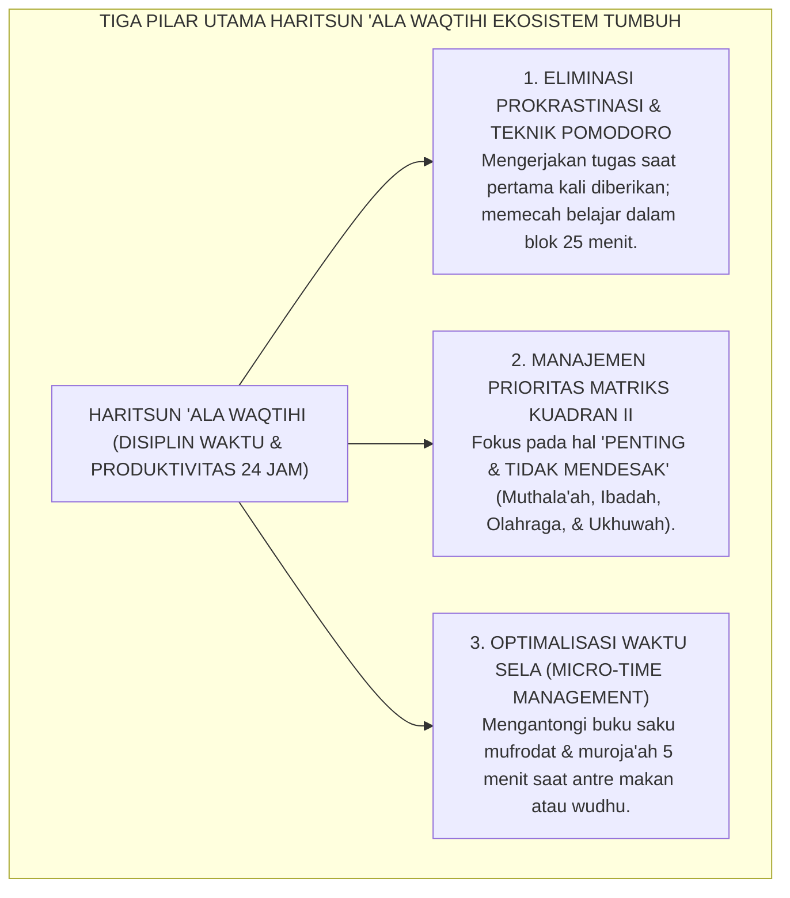
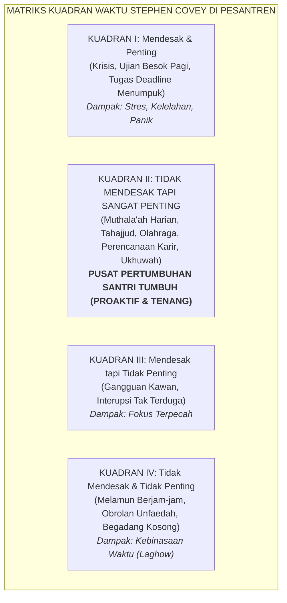

# HARITSUN 'ALA WAQTIHI (DISIPLIN WAKTU & PRODUKTIVITAS TINGGI)

---

### 🧭 PETA POSISI PANDUAN DALAM SISTEM TUMBUH (DARI HULU KE HILIR)
* **Posisi Arsitektur**: `BATANG EKOSISTEM I (Taksonomi 10 Muwashafat Adab & Tangga Kemandirian J1–J4)`
* **Peruntukan Pengguna**: Wali Kelas, Musyrif Kamar, Guru Pengampu Adab, & Mentor Santri
* **Fokus Panduan**: Memandu tahapan penanaman 10 Karakter Adab Nabawi dari fase Adaptasi (J1), Pembiasaan (J2), Kematangan (J3), hingga Kader Penggerak (J4/Tahap 7).
* **Hasil Akhir yang Dituju**: Terwujudnya santri berkarakter *Insan Adabi* yang mandiri, musyrif yang mengasuh dengan kasih sayang tanpa *burnout*, dan pesantren yang aman berbasis data (*Safe Boarding School*).

---

### 🎯 Mengapa Panduan Ini Ada & Masalah Nyata yang Dipecahkan
1. **Latar Masalah di Lapangan**: Sering kali pengasuhan di pesantren berjalan tanpa SOP yang jelas atau terjebak dalam pola reaktif—menunggu santri berbuat salah baru dihukum dengan emosional.
2. **Solusi Sistem TUMBUH**: Panduan ini memberikan langkah preventif dan terstruktur agar setiap pembiasaan adab berjalan terencana, konsisten, dan terukur.
3. **Sasaran Perubahan**: Memastikan nilai-nilai Islam menyatu dalam perilaku harian santri melalui keteladanan nyata (*Qudwah Hasanah*).

---
### 🎯 Tujuan & Manfaat Panduan
Panduan ini dirancang sebagai petunjuk operasional terapan agar pendidik dan musyrif dapat:
1. Menjalankan pembinaan adab santri dengan pendekatan kasih sayang (*Rahmah*) dan ketegasan yang mendidik (*Firm & Kind*).
2. Menghindari cara-cara kekerasan fisik, bentakan verbal, maupun hukuman yang mempermalukan santri.
3. Menciptakan suasana asrama dan kelas yang aman, tertib, dan menumbuhkan kesadaran diri (*Bi'ah Shalihah*).

---

### 💡 Intisari Cepat (3 Menit Memahami Esensi)
* **Kunci Pengasuhan**: Karakter santri tumbuh melalui keteladanan nyata (*Qudwah Hasanah*), komunikasi empatik, dan pembiasaan terstruktur 24 jam.
* **Tindakan Utama**: Terapkan panduan langkah demi langkah di bawah ini secara konsisten, pantau perkembangan santri secara objektif, dan berikan apresiasi atas setiap perbaikan diri yang mereka capai.
* **Prinsip Disiplin**: Fokus pada pemulihan hubungan dan tanggung jawab nyata (*Restoratif*), bukan sekadar melampiaskan amarah atau menghukum.

---

### 📖 Uraian Panduan & Langkah Aksi Lapangan

---

### I. Hakikat Haritsun 'ala Waqtihi: Waktu Adalah Modal Eksistensial Utama

Dalam filsafat pendidikan Islam, waktu bukanlah sekadar deretan detik pada jam dinding, bukan pula "uang" sebagaimana dalam adagium materialistis Barat (*time is money*). Waktu adalah **kehidupan itu sendiri (*al-waqtu huwa al-hayah*)** dan modal eksistensial paling berharga yang dianugerahkan Allah kepada manusia untuk mengumpulkan bekal akhirat.

Namun, di banyak lingkungan asrama, kebocoran waktu (*time leakage*) menjadi penyakit laten yang paling banyak membunuh potensi santri:
* **Sindrom Menunda-nunda (*Chronic Procrastination*)**: Baru mulai belajar menghafal kitab pada pukul 23.00 WIB malam saat besok paginya ada ujian setoran (*the cramming trap*);
* **Obrolan Hampa (*Laghow / Idle Gossip*)**: Menghabiskan waktu berjam-jam ba'da ashar atau ba'da isya hanya untuk duduk melamun di teras atau mengobrolkan hal-hal yang tidak bernilai ilmu maupun pahala;
* **Budaya "Jam Karet"**: Terbiasa datang terlambat ke masjid atau ke ruang madrasah tanpa merasa bersalah (*punctuality deficit*).

Dalam Ekosistem TUMBUH, **Haritsun 'ala Waqtihi** (Sangat Menjaga dan Menghargai Waktu) adalah tanda kematangan akal dan keimanan. Santri dalam sistem TUMBUH dilatih untuk menjadi tuan atas waktunya: mampu membagi waktu secara cerdas (*Time Blocking*), memprioritaskan aktivitas utama di atas aktivitas sekunder, dan memanfaatkan waktu-waktu sela (*micro-time*) untuk memperbanyak dzikir, muroja'ah hafalan, dan karya produktif.

<b>Gambar 2.9.1:</b> Tiga Pilar Operasional Karakter Haritsun 'ala Waqtihi Santri.

---

### II. Khazanah Turats: Syarah Hasan Al-Bashri & Syaikh Abu Ghuddah (*Qimatuz Zaman*)

Para ulama salafus shalih adalah manusia yang paling kikir terhadap waktunya melebihi orang bakhil yang menjaga hartanya.

#### 1. Wasiat Keabadian Imam Hasan Al-Bashri
Ulama tabi'in agung **Imam Al-Hasan Al-Bashri**[^1] mewariskan untaian hikmah yang menggetarkan kalbu:

$$\text{يَا ابْنَ آدَمَ، إِنَّمَا أَنْتَ أَيَّامٌ، كُلَّمَا ذَهَبَ يَوْمٌ ذَهَبَ بَعْضُكَ}$$

**Artinya:** *"Wahai anak Adam! Sesungguhnya hakikat dirimu hanyalah kumpulan hari-hari; setiap kali satu hari berlalu dari hidupmu, maka hilanglah sebagian dari keberadaan dirimu."*

Beliau juga menegaskan: *"Aku menjumpai suatu kaum (para sahabat Nabi) yang mereka itu jauh lebih kikir terhadap waktu-waktu mereka daripada kekikiran kalian terhadap dinar dan dirham kalian."*

#### 2. Mahakarya Syaikh Abdul Fattah Abu Ghuddah (*Qimatuz Zaman 'indal 'Ulama*)
Ulama hadits dan pakar tarbiyah terkemuka abad ke-20, **Syaikh Abdul Fattah Abu Ghuddah** dalam kitab monumentalnya *Qimatuz Zaman 'indal 'Ulama*[^2] mengisahkan bagaimana para ulama klasik memanfaatkan setiap detik kehidupannya:
* **Al-Imam Ibnu Jarir ath-Thabari** menulis 40 lembar karya ilmiah setiap hari sepanjang 40 tahun hidupnya;
* **Al-Imam Abu al-Wafa' Ibnu 'Aqil** memakan roti kering yang dicelupkan ke air agar tidak membuang waktu mengunyah makanan, seraya berkata: *"Aku tidak rela membiarkan satu jam pun dari umurku berlalu tanpa lidahku membaca ilmu atau tanganku menulis catatan."*

---

### III. Tinjauan Sains: Psikologi Prokrastinasi & Matriks Prioritas Eisenhower-Covey

Bagaimana sains perilaku modern menjelaskan fenomena penundaan waktu dan solusinya?

#### 1. Hakikat Prokrastinasi sebagai Masalah Regulasi Emosi (Timothy Pychyl)
Pakar psikologi prokrastinasi dunia **Dr. Timothy A. Pychyl**[^3] membuktikan bahwa menunda-nunda pekerjaan (*procrastination*) bukanlah masalah ketidakmampuan mengatur jadwal jam dinding, melainkan **kegagalan regulasi emosi (*short-term mood repair*)**:
* Ketika santri dihadapkan pada tugas hafalan kitab yang sulit, otaknya merasa cemas dan terancam;
* Untuk meredakan rasa cemas sesaat tersebut, santri melarikan diri ke aktivitas yang memberi kesenangan instan (seperti mengobrol atau melamun);
* Solusinya adalah teknik **"Just Start 5 Minutes"**: membimbing santri untuk mulai membaca hanya 5 menit pertama, yang secara otomatis menurunkan ambang kecemasan otak (*activation energy hurdle*).

#### 2. Matriks Manajemen Waktu Kuadran II Stephen R. Covey
Pakar kepemimpinan global **Stephen R. Covey**[^4] merumuskan Matriks 4 Kuadran Waktu:

<b>Gambar 2.9.2:</b> Matriks Empat Kuadran Waktu dalam Kehidupan Santri Pesantren.

Santri dalam sistem TUMBUH dilatih untuk mengalokasikan 70% energinya di **Kuadran II**: aktivitas yang tidak mendesak namun sangat menentukan kualitas masa depannya (seperti muroja'ah rutin, qiyamul lail, dan menjaga kesehatan).

---

### IV. Matriks Indikator Perilaku Faktual Haritsun 'ala Waqtihi (24 Jam)

| Situasi Ritme Waktu Harian | Indikator Perilaku Positif (Haritsun 'ala Waqtihi) | Perilaku Defisit / Pemborosan Waktu | Tindakan Terbimbing Ekosistem TUMBUH |
| :--- | :--- | :--- | :--- |
| **Transisi Jam Madrasah & Masjid** | Hadir 5 menit sebelum bel masuk atau adzan berkumandang, siap dengan perlengkapan lengkap. | Datang terlambat terengah-engah setelah guru berada di kelas atau imam telah ruku'. | Budaya ketepatan waktu (*Punctuality Creed*) dan penugasan piket penyambut waktu. |
| **Pemanfaatan Waktu Sela (Micro-Time)** | Membaca 1 lembar Al-Qur'an atau kartu saku kosakata Arab saat mengantre makanan/laundry. | Berdiri bengong, saling senggol, atau mengeluh panjang tentang lamanya antrean. | Gerakan *Pocket Card Mufrodat*: membekali santri kartu hafalan saku yang mudah dibawa. |
| **Mengerjakan Tugas Belajar & PR** | Langsung menuntaskan tugas di jam muthala'ah sore hari tanpa menunggu malam ujian. | Menunda tugas hingga larut malam, menyalin tugas kawan di pagi hari sebelum bel masuk. | Penerapan teknik Pomodoro terpimpin (25 menit hening belajar, 5 menit relaksasi) di aula. |
| **Waktu Ba'da Isya (20.30 - 21.45 WIB)** | Mengoptimalkan untuk muthala'ah kitab, muroja'ah tahfizh, dan persiapan tidur tepat waktu. | Duduk mengobrol ngalor-ngidul di tangga asrama, ribut main tebak-tebakan tidak berfaedah. | Pengawasan aktif koridor asrama oleh Musyrif Asrama dan penataan ruang belajar hening. |

---

### V. Solusi Sistemik TUMBUH: Protokol Jam Sinkron & Daily Time-Blocking Sheet

Lembaga merumuskan fasilitas pendukung:
1. **Sinkronisasi Jam Digital Pesantren (*Unified Clock System*)**: Seluruh jam dinding di madrasah, masjid, asrama, dan ruang makan disinkronkan secara presisi menggunakan waktu server digital terpusat.
2. **Lembar Perencanaan Blok Waktu (*Daily Time-Blocking Sheet*)**: Setiap santri menyusun jadwal harian mandiri di awal pekan, memetakan jam belajar, ibadah, olahraga, dan istirahat dalam blok-blok waktu visual yang disiplin.

---

## 📌 Catatan Kaki & Rujukan Primer

[^1]: **Abu Nu'aim Ahmad bin Abdillah al-Ashbahani**, *Hilyatul Auliya' wa Thabaqat al-Ashfiya'* (Kairo: Maktabah al-Khanji, 1932), Jilid II, hlm. 145–160 (Biografi Al-Hasan Al-Bashri).
[^2]: **Syaikh Abdul Fattah Abu Ghuddah**, *Qimatuz Zaman 'indal 'Ulama* (Aleppo & Beirut: Maktab al-Mathbu'at al-Islamiyyah, 1984; Edisi ke-10, 2012), hlm. 25–88.
[^3]: **Timothy A. Pychyl**, *Solving the Procrastination Puzzle: A Concise Guide to Solving the Procrastination Problem* (New York: TarcherPerigee / Penguin Random House, 2013), Bab 1–3, hlm. 1–45; serta **Piers Steel**, "The nature of procrastination: A meta-analytic and theoretical review of quintessential self-regulatory failure", *Psychological Bulletin*, Vol. 133, No. 1 (2007), hlm. 65–94.
[^4]: **Stephen R. Covey**, *The 7 Habits of Highly Effective People: Powerful Lessons in Personal Change* (New York: Free Press, 1989; Edisi Peringatan 30 Tahun, Simon & Schuster, 2020), Habit 3: "Put First Things First", hlm. 157–195.
