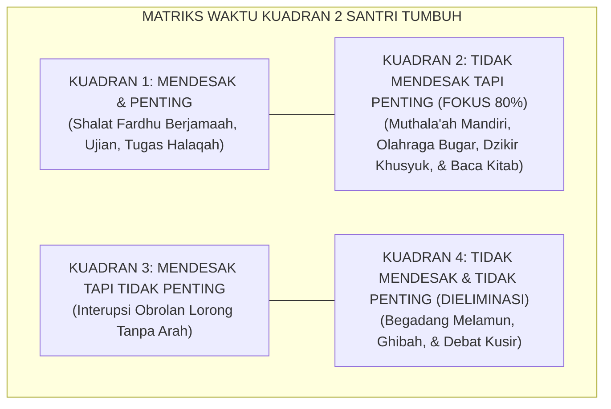

# SUB-BAB 2.9: HARITSUN 'ALA WAQTIHI (DISIPLIN WAKTU & PRODUKTIF)
## *Manajemen Waktu Santri, Prinsip Hadir 5 Menit Lebih Awal, Pemanfaatan Jeda Terfragmentasi, dan Eliminasi Kesia-siaan (Lahwun)*

**Kode Klasifikasi**: `BOOK-02/BAB-02/SUB-09/MONOGRAF-MASTER-VIBRANT`  
**Disiplin Ilmu**: Manajemen Waktu Islami (*Islamic Time Management*), Psikologi Produktivitas, & Etika Umur  
**Penanggung Jawab Keilmuan**: Dewan Pakar Ekosistem TUMBUH (*Pakar Tata Kelola Qudwah & Pakar Desain Kurikulum Adab*)

---

### Waktu adalah Modal Kehidupan Penuntut Ilmu

Pilar kesembilan karakter santri adalah **Haritsun 'ala Waqtihi** (Sangat Menjaga dan Menghargai Waktu).

Waktu adalah nafas kehidupan yang tidak akan pernah kembali. Di asrama TUMBUH, santri dilatih memandang setiap detik umurnya sebagai amanah ibadah:
* **Prinsip *5-Minute Early Rule***: Hadir 5 menit lebih awal di masjid, halaqah quran, dan ruang kelas sebelum bel berbunyi.
* **Pemanfaatan Waktu Terfragmentasi (*Fragmented Time Optimization*)**: Membawa buku saku (*pocket notes*) untuk menghafal mufradat bahasa Arab atau nadham kitab di sela-sela antrean makan atau menunggu waktu iqamah.
* **Penghapusan Waktu Sia-Sia (*Zero Lahwun Policy*)**: Menolak begadang tanpa tujuan dan menghindari obrolan kosong yang merusak kejernihan hati.

<b>Gambar 2.9.1:</b> Matriks Manajemen Waktu Kuadran Prioritas Santri TUMBUH.

Pakar kepemimpinan **Stephen R. Covey**[^1] dalam *The 7 Habits of Highly Effective People* membuktikan bahwa orang-orang paling sukses memfokuskan sebagian besar energinya pada aktivitas **Kuadran 2**: membangun kapasitas diri jangka panjang sebelum krisis terjadi.

**Hujjatul Islam Imam Abu Hamid Al-Ghazali** dalam *Ihya' 'Ulumiddin* (Kitab *Tartib al-Awrad*)[^2] memberikan kaidah emas: *"Sepatutnya seluruh waktumu terbagi dengan rapi dan terencana; jangan biarkan satu detik pun berlalu secara sia-sia tanpa hisab."*

---

## 📌 Catatan Kaki & Rujukan Primer

[^1]: **Stephen R. Covey**, *The 7 Habits of Highly Effective People: Powerful Lessons in Personal Change* (New York: Free Press / Simon & Schuster, 1989; Edisi Peringatan 30 Tahun, 2020), Bab 3: "Habit 3: Put First Things First", hlm. 145–182.
[^2]: **Hujjatul Islam Imam Abu Hamid al-Ghazali**, *Ihya' 'Ulumiddin*, Kitab Tartib al-Awrad wa Tafshil Ihya' al-Lail (Kairo & Beirut: Dar al-Ma'rifah, t.th.), Jilid I, hlm. 334–350.
