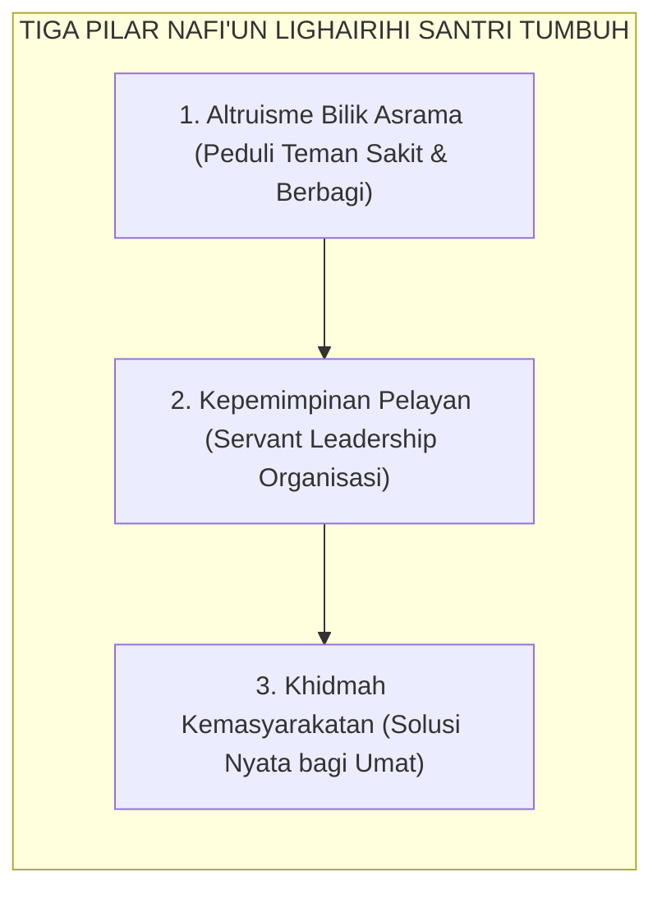

# SUB-BAB 2.10: NAFI'UN LIGHAIRIHI (BERMANFAAT LUAS BAGI SESAMA)
## *Puncak Mahkota Karakter: Kepemimpinan Melayani (Servant Leadership), Altruisme Ukhuwah, dan Etos Khidmah Ummat*

**Kode Klasifikasi**: `BOOK-02/BAB-02/SUB-10/MONOGRAF-MASTER-VIBRANT`  
**Disiplin Ilmu**: Kepemimpinan Pelayan (*Servant Leadership*), Psikologi Altruisme Sosial, & Fiqih Khidmah Peradaban  
**Penanggung Jawab Keilmuan**: Dewan Pakar Ekosistem TUMBUH (*Pakar Tata Kelola Qudwah & Pakar Sosiologi Santri*)

---

### Puncak Muwashafat: Bermanfaat Luas bagi Ummat

Puncak dan mahkota dari seluruh sepuluh pilar karakter santri adalah **Nafi'un Lighairihi** (Bermanfaat Luas bagi Sesama Manusia).

Rasulullah SAW bersabda dalam sabda agungnya:
$$\text{خَيْرُ النَّاسِ أَنْفَعُهُمْ لِلنَّاسِ}$$
*"Sebaik-baik manusia adalah yang paling bermanfaat bagi manusia lainnya!"* (HR. Ath-Thabrani dalam *Al-Mu'jam al-Ausath* no. 5787).

Santri yang memiliki karakter *Nafi'un Lighairihi* adalah santri yang:
* **Mendedikasikan Diri untuk Melayani (*Khidmah Altruistik*)**: Membantu kawan sekamar yang sakit, menyapu serambi masjid bersama, dan menjadi tutor sebaya bagi adik kelas yang kesulitan belajar nahwu-sharaf.
* **Menerapkan Kepemimpinan Pelayan (*Servant Leadership*)**: Memandang jabatan kepengurusan organisasi santri bukan sebagai takhta kekuasaan untuk membentak, melainkan sebagai amanah khidmah untuk melayani dan memfasilitasi kebutuhan seluruh warga pondok.
* **Menjadi Duta Kebaikan di Masyarakat**: Siap diterjunkan mengabdi di tengah masyarakat luas membawa rahmat, solusi, dan kedamaian peradaban Islam.

<b>Gambar 2.10.1:</b> Tiga Pilar Kebermanfaatan Sosial Santri TUMBUH.

Pakar psikologi organisasi **Adam Grant**[^1] dalam penelitiannya *Give and Take* membuktikan bahwa orang-orang yang memiliki orientasi memberi secara tulus (*Givers*) pada akhirnya menempati puncak kepemimpinan yang paling berpengaruh dan dicintai oleh komunitasnya.

**Hadhratusy Syaikh KH. M. Hasyim Asy'ari** dalam *Adab al-'Alim wal Muta'allim*[^2] menegaskan bahwa keberkahan ilmu seorang penuntut ilmu terletak pada sejauh mana ilmunya diamalkan untuk menolong orang lain, mendamaikan perselisihan, dan meringankan beban sesama mukmin lillahi ta'ala.

---

## 📌 Catatan Kaki & Rujukan Primer

[^1]: **Adam Grant**, *Give and Take: A Revolutionary Approach to Success* (New York: Viking Penguin, 2013), Bab 1: "Good Returns: The Hazards and Harms of Givers and Takers", hlm. 1–26.
[^2]: **Hadhratusy Syaikh KH. M. Hasyim Asy'ari**, *Adab al-'Alim wal Muta'allim fi ma Yahtaju Ilayhi al-Muta'allim fi Ahwal Ta'allumihi wa ma Yatawaqqafu 'alayhi al-Mu'allim fi Maqamat Ta'limihi* (Jombang: Maktabah at-Turats al-Islami, 1415 H), Bab 2: "Adab al-Muta'allim fi Nafsihi", hlm. 24–35.
