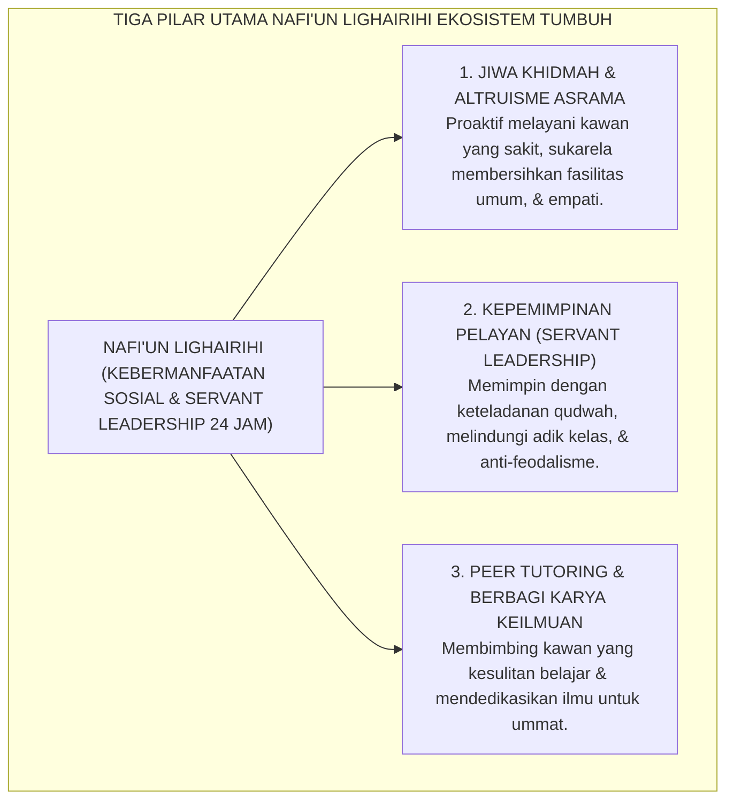
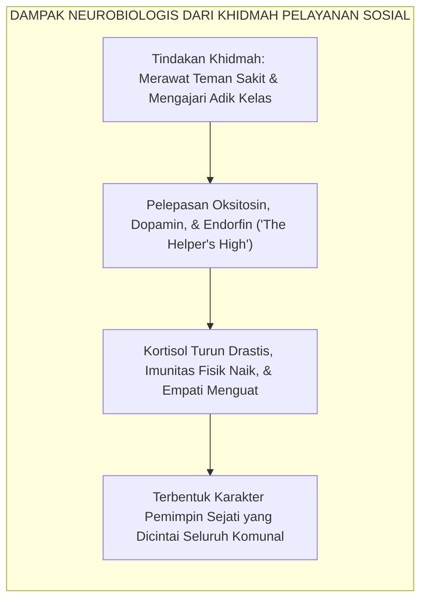

# PANDUAN PRAKTIS 2.10: NAFI'UN LIGHAIRIHI (BERMANFAAT LUAS BAGI SESAMA)

**Sasaran Pengguna**: Pimpinan Pondok, Kepala Pengasuhan, Wali Kelas, & Musyrif Asrama  
**Fokus Penerapan**: Panduan Kerja Lapangan & Pembiasaan Karakter Harian Sistem TUMBUH  

---

### 🎯 Tujuan & Manfaat Panduan
Panduan ini dirancang sebagai petunjuk operasional terapan agar pendidik dan musyrif dapat:
1. Menjalankan pembinaan adab santri dengan pendekatan kasih sayang (*Rahmah*) dan ketegasan yang mendidik (*Firm & Kind*).
2. Menghindari cara-cara kekerasan fisik, bentakan verbal, maupun hukuman yang mempermalukan santri.
3. Menciptakan suasana asrama dan kelas yang aman, tertib, dan menumbuhkan kesadaran diri (*Bi'ah Shalihah*).

---

### 💡 Intisari Cepat (3 Menit Memahami Esensi)
* **Kunci Pengasuhan**: Karakter santri tumbuh melalui keteladanan nyata (*Qudwah Hasanah*), komunikasi empatik, dan pembiasaan terstruktur 24 jam.
* **Tindakan Utama**: Terapkan panduan langkah demi langkah di bawah ini secara konsisten, pantau perkembangan santri secara objektif, dan berikan apresiasi atas setiap perbaikan diri yang mereka capai.
* **Prinsip Disiplin**: Fokus pada pemulihan hubungan dan tanggung jawab nyata (*Restoratif*), bukan sekadar melampiaskan amarah atau menghukum.

---

### 📖 Uraian Panduan & Langkah Aksi Lapangan

---

### I. Hakikat Nafi'un Lighairihi: Muara Agung Seluruh Kurikulum Adab

Dalam arsitektur sepuluh karakter (*Muwashafat*) Ekosistem TUMBUH, **Nafi'un Lighairihi** (Bermanfaat Luas bagi Sesama Manusia) menempati posisi sebagai **puncak kubah peradaban (*The Crown of Character*)**.

Sembilan muwashafat sebelumnya—mulai dari akidah yang bersih, ibadah yang benar, akhlak kokoh, kemandirian finansial, wawasan luas, kebugaran fisik, pengendalian nafsu, keteraturan hidup, hingga disiplin waktu—sesungguhnya adalah proses pembentukan kapasitas internal (*internal capacity building*). Namun, seluruh kapasitas tersebut tidak boleh berhenti sebagai kesalehan individual yang egois (*individualistic piety*).

Di banyak lembaga pendidikan, kerap muncul santri yang cerdas luar biasa dan rajin beribadah di shaf terdepan, namun memiliki kepribadian yang dingin dan antisosial:
* Enggan mengajari kawannya yang kesulitan memahami nahwu karena takut tersaingi dalam perebutan ranking kelas;
* Menutup mata ketika melihat kawan sekamarnya menangis demam tinggi di ranjang, dan memilih fokus menghafal Al-Qur'an sendirian;
* Ketika menjabat sebagai pengurus asrama, ia memimpin dengan tangan besi dan arogansi kekuasaan, menuntut dilayani dan dihormati adik kelasnya.

Dalam Ekosistem TUMBUH, **Nafi'un Lighairihi** membalikkan paradigma kekuasaan tersebut: **ukuran kemuliaan santri ditentukan oleh seberapa besar pengorbanan dan pelayanan yang ia persembahkan bagi kemaslahatan saudaranya**. Santri dididik untuk memiliki jiwa kepemimpinan pelayan (*Servant Leadership*), menghidupkan tradisi luhur *Khidmah* pesantren, dan menjadikan setiap tarikan napasnya sebagai rahmat bagi alam semesta (*Rahmatan lil 'Alamin*).

<b>Gambar 2.10.1:</b> Tiga Pilar Operasional Karakter Nafi'un Lighairihi Santri Ekosistem TUMBUH.

---

### II. Khazanah Turats: Syarah Hadits Manusia Paling Dicintai Allah & Tradisi Khidmah

Islam memandang bahwa ibadah sosial yang membawa kebahagiaan bagi sesama memiliki derajat pahala yang melampaui ibadah sunnah individual.

#### 1. Manusia dan Amal yang Paling Dicintai Allah
Dalam hadits monumental yang diriwayatkan oleh **Imam Ath-Thabrani** dalam *Al-Mu'jam al-Awsath*[^1], Rasulullah SAW bersabda dengan sabda yang sangat agung:

$$\text{أَحَبُّ النَّاسِ إِلَى اللهِ أَنْفَعُهُمْ لِلنَّاسِ، وَأَحَبُّ الْأَعْمَالِ إِلَى اللهِ عَزَّ وَجَلَّ سُرُورٌ تُدْخِلُهُ عَلَى مُسْلِمٍ، أَوْ تَكْشِفُ عَنْهُ كُرْبَةً، أَوْ تَقْضِي عَنْهُ دَيْنًا، أَوْ تَطْرُدُ عَنْهُ جُوعًا،}$$
$$\text{وَلَأَنْ أَمْشِيَ مَعَ أَخٍ لِي فِي حَاجَةٍ أَحَبُّ إِلَيَّ مِنْ أَنْ أَعْتَكِفَ فِي هَذَا الْمَسْجِدِ (مَسْجِدِ الْمَدِينَةِ) شَهْرًا}$$

**Terjemahan Berjiwa:**
> *"Manusia yang paling dicintai oleh Allah adalah yang paling bermanfaat bagi sesama manusia. Dan amalan yang paling dicintai oleh Allah 'Azza wa Jalla adalah rasa bahagia yang engkau masukkan ke dalam hati seorang muslim, atau engkau hilangkan kesusahannya, atau engkau lunaskan utangnya, atau engkau singkirkan rasa laparnya.*
> 
> *Dan sungguh, jika aku berjalan bersama saudaraku demi menolong memenuhi suatu hajat kebutuhannya, hal itu jauh lebih aku cintai daripada aku beri'tikaf di masjidku ini (Masjid Nabawi di Madinah) selama satu bulan penuh!"*

#### 2. Tradisi Khidmah Agung di Bumi Pesantren Nusantara
Para ulama dan kiai Nusantara meletakkan tradisi **Khidmah** sebagai pintu pembuka keberkahan ilmu yang paling utama. Syaikhina wa Murobbina KH. Hasyim Asy'ari, KH. Ahmad Dahlan, dan KH. Imam Zarkasyi mendidik para santrinya bahwa kepintaran otak tidak ada artinya jika hatinya sombong dan enggan berkhidmah melayani ummat. Santri yang ikhlas membantu di dapur umum pondok, menyapu halaman masjid, dan menjaga keamanan santri yunior sering kali dibukakan pintu futuh ilmu yang luar biasa oleh Allah SWT.

---

### III. Tinjauan Sains: Servant Leadership (Greenleaf) & Neurobiologi Altruisme

Bagaimana sains kepemimpinan modern dan neurobiologi memvalidasi keagungan karakter *Nafi'un Lighairihi*?

#### 1. Teori Servant Leadership Robert K. Greenleaf
Pakar kepemimpinan global **Robert K. Greenleaf**[^2] merumuskan konsep **Kepemimpinan Pelayan (*Servant Leadership*)**:
> *"Pemimpin sejati bukanlah orang yang menuntut kekuasaan dan meminta dilayani (*power-oriented*), melainkan orang yang dorongan terdalam hatinya berawal dari keinginan tulus untuk melayani terlebih dahulu (*to serve first*). Uji kehebatan seorang servant-leader adalah: Apakah orang-orang yang ia layani bertumbuh menjadi lebih mandiri, lebih bijak, lebih sehat, dan terinspirasi untuk ikut melayani sesamanya?"*

Sistem TUMBUH menghancurkan tradisi feodalisme senioritas dan menggantikannya dengan *Servant Leadership*: santri senior kelas akhir tidak bertindak sebagai mandor penindas, melainkan sebagai **pelindung dan pengasuh (*protective mentors*)** yang siap berkorban demi keselamatan adik kelasnya.

#### 2. Fenomena Neurobiologis "The Helper's High" (Allan Luks)
Riset neurofisiologi perilaku prososial oleh **Allan Luks & Dr. Stephen Post**[^3] membuktikan bahwa ketika seseorang menolong orang lain dengan tulus tanpa pamrih:
* Otak mengalami fenomena yang disebut **"The Helper's High"**: pelepasan hormon **Oksitosin, Dopamin, dan Endorfin** secara serentak;
* Tingkat hormon stres kortisol anjlok hingga **50%**;
* Sistem imunitas tubuh menguat drastis, meningkatkan kesehatan kardiovaskular dan melahirkan rasa bahagia batin yang mendalam (*eudaimonic well-being*).

<b>Gambar 2.10.2:</b> Alur Dampak Neurobiologis Pelayanan Sosial (Khidmah) terhadap Kebahagiaan Santri.

---

### IV. Matriks Indikator Perilaku Faktual Nafi'un Lighairihi (24 Jam)

| Situasi Sosial Keseharian | Indikator Perilaku Positif (Nafi'un Lighairihi) | Perilaku Defisit / Egoisme Pribadi | Protokol Pembiasaan Ekosistem TUMBUH |
| :--- | :--- | :--- | :--- |
| **Kawan Sekamar Mengalami Sakit** | Spontan mengambilkan makanan ke dapur, membelikan obat di Poskestren, dan menemani dengan hangat. | Bersikap acuh tak acuh, mengeluh karena kamar jadi berisik, atau menjauhi kawan yang sakit. | Penugasan giliran *Duta Khidmah Kamar* untuk merawat santri sakit dipantau Musyrif. |
| **Bimbingan Belajar Sebaya (Peer Tutoring)** | Ikhlas mengajari kawan yang belum lancar membaca kitab atau matematika tanpa meminta bayaran. | Menyembunyikan catatan pelajaran, pelit ilmu (*intellectual hoarding*), atau meremehkan kawan yang lambat. | Program resmi *Peer Tutoring Halaqah*: santri berprestasi membimbing 2 santri junior. |
| **Kepemimpinan Organisasi Santri** | Memimpin dengan turun ke lapangan, ikut menyapu bersama adik kelas, mendengar masukan santri. | Duduk berpangku tangan memerintah dengan bentakan, menggunakan tongkat hukuman fisik (*tyranny*). | Standardisasi SOP Pengurus Santri berbasis *Qudwah Hasanah* dan evaluasi kepemimpinan 360°. |
| **Kepedulian terhadap Lingkungan Asrama** | Spontan memungut sampah yang tercecer di jalan, mematikan kran air yang meluap, merawat tanaman. | Melangkah melewati sampah begitu saja (*bystander apathy*), membiarkan air tumpah terbuang. | Gerakan *Operasi Semut 5 Menit* serentak ba'da shalat ashar di seluruh area pondok. |

---

### V. Solusi Sistemik TUMBUH: Inkubasi Tahun Khidmah & Ekspedisi Pengabdian Ummat

Sebagai puncak penempaan sepuluh karakter, lembaga merancang program aksi:
1. **Program Inkubasi Pengabdian Santri Akhir (*Tahun Khidmah*)**: Santri kelas akhir diwajibkan menjalani masa khidmah dakwah dan pelayanan sosial di pesantren cabang atau masyarakat pedalaman sebelum diwisuda.
2. **Ekspedisi Sosial-Ekologis Berkah Desa**: Setiap liburan semester, santri diterjunkan ke desa-desa sekitar pondok untuk mengajar TPA gratis, merenovasi fasilitas umum desa, dan menyelenggarakan pengobatan gratis bersama tim Poskestren.

Dengan tuntasnya pemaparan **10 Muwashafat Karakter Santri dalam sistem TUMBUH pada Bab 02 ini**, arsitektur kurikulum pembinaan karakter telah berdiri lengkap, utuh, dan operasional. Kita siap melangkah ke **Bab 03: Trajektori Biososial-Spiritual Remaja Pesantren** untuk membedah dinamika biologis dan neurosains transisi usia 12–18 tahun santri.

---

## 📌 Catatan Kaki & Rujukan Primer

[^1]: **Al-Hafizh Al-Imam Abu al-Qasim Sulaiman bin Ahmad ath-Thabrani**, *Al-Mu'jam al-Awsath*, Tahqiq: Dr. Mahmud ath-Thahhan (Kairo: Dar al-Haramain, 1415 H), Jilid VI, Hadits No. 6026; serta **Al-Albani**, *Silsilah al-Ahadits ash-Shahihah*, No. 906.
[^2]: **Robert K. Greenleaf**, *Servant Leadership: A Journey into the Nature of Legitimate Power and Greatness* (New York: Paulist Press, 1977; Edisi Peringatan 25 Tahun, 2002), Bab 1: "The Servant as Leader", hlm. 21–48; serta **Larry C. Spears** (Ed.), *Reflections on Leadership: How Robert K. Greenleaf's Theory of Servant-Leadership Influenced Today's Top Management Thinkers* (New York: John Wiley & Sons, 1995).
[^3]: **Allan Luks & Peggy Payne**, *The Healing Power of Doing Good: The Health and Spiritual Benefits of Helping Others* (New York: Ballantine Books, 1991; Edisi Revisi, iUniverse, 2001), Bab 2 & 3: "The Helper's High", hlm. 17–58; serta **Stephen G. Post**, *Why Good Things Happen to Good People: The Exciting New Science of How Being a Good Person Can Help You Live a Longer, Healthier, Largely Happier Life* (New York: Broadway Books, 2007).
