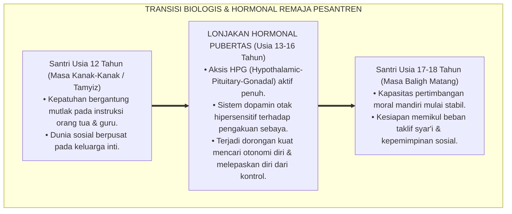
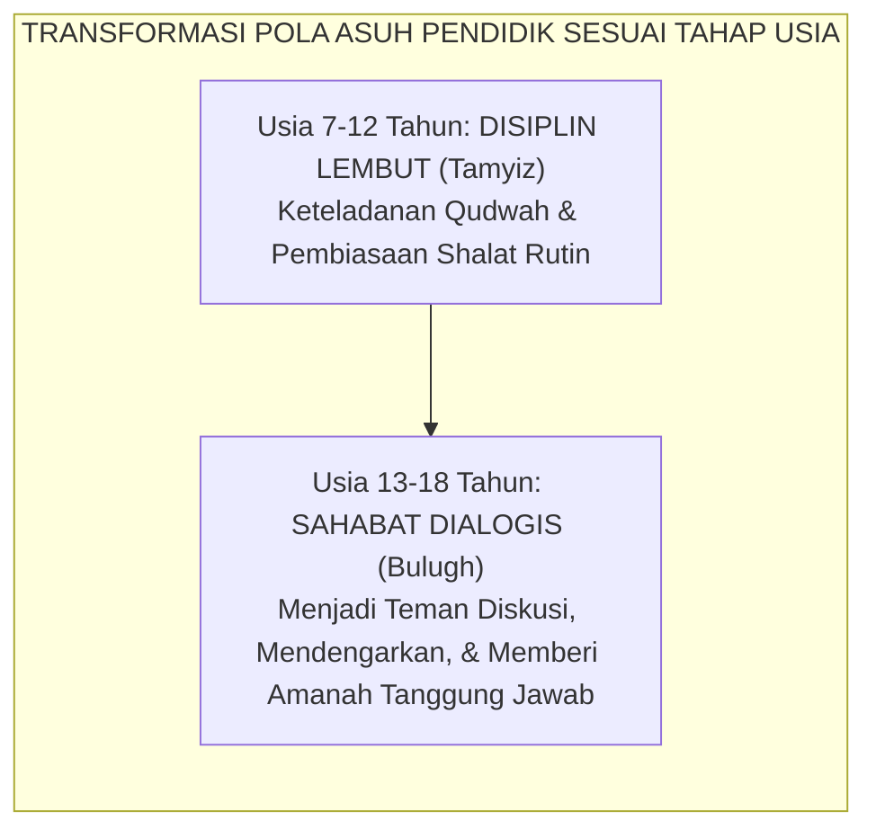

# SUB-BAB 3.1: TRANSISI PUBERTAS & DINAMIKA HORMONAL ASRAMA
## *Memahami Ledakan Biologis Remaja (Usia 12–18 Tahun) dalam Ekosistem Berasrama Tanpa Vonis Moralitas Negatif*

**Kode Klasifikasi**: `BOOK-02/BAB-03/SUB-01/MONOGRAF-MASTER-VIBRANT`  
**Disiplin Ilmu**: Psikologi Perkembangan Remaja (*Adolescent Development*), Endokrinologi Perilaku, & Fiqih Baligh Turats  
**Penanggung Jawab Keilmuan**: Dewan Pakar Ekosistem TUMBUH (*Pakar Neurosains Perkembangan & Pakar Pengasuhan Asrama*)

---

### Titik Balik Kehidupan Santri: Ketika Tubuh Berubah dan Jiwa Berguncang

Rentang usia santri di pondok pesantren (12 hingga 18 tahun) adalah fase transisi biologis dan psikologis paling dramatis dalam seluruh siklus kehidupan manusia: **fase pubertas (*marhalah al-bulugh*)**.

Pada fase ini, tubuh anak mengalami lonjakan hormon secara masif:
* **Hormon Testosteron** pada santri putra melonjak hingga 20–30 kali lipat dibanding masa kanak-kanak, memicu dorongan fisik motorik tinggi, pencarian status kelompok, dan kebutuhan pembuktian kejantanan (*dominance seeking*).
* **Hormon Estrogen dan Progesteron** pada santri putri mengalami fluktuasi siklik yang tajam, memicu kepekaan emosional mendalam, kebutuhan penerimaan relasional, dan dinamika keintiman kelompok sebaya.

<b>Gambar 3.1.1:</b> Alur Transisi Perkembangan Hormonal dan Kognitif Remaja Santri.

Pakar psikologi perkembangan remaja terkemuka **Laurence Steinberg**[^1] dalam *Age of Opportunity* menegaskan bahwa masa pubertas bukanlah sebuah "kerusakan mental", melainkan jendela plastisitas otak kedua (*second window of neuroplasticity*) di mana otak remaja sedang ditata ulang untuk mempersiapkan kemandirian hidup dewasa.

---

### Kesalahan Fatal Pendekatan Tradisional: Menghakimi Gejala Biologis sebagai Dosa Moral

Di banyak pondok pesantren konvensional, perubahan perilaku alamiah akibat transisi pubertas ini kerap kali disalahpahami oleh para pembina:
* Ketika santri putra usia 14 tahun mendadak menjadi sangat bising, suka pamer kekuatan fisik, dan gelisah jika duduk diam terlalu lama, ustadz kerap mencapnya: *"Anak bengal!", "Keras kepala!", "Tidak tahu sopan santun!"*
* Santri kemudian dihukum fisik (dijemur di lapangan terik atau dipukul rotan), yang secara neurobiologis justru semakin menyulut hormon agresi di otaknya.

Sistem TUMBUH meluruskan pemahaman ini: **perilaku gelisah dan pencarian status pada remaja awal adalah sinyal biologis yang membutuhkan kanal penyaluran positif (*sublimasi*), bukan pentungan kekerasan**.

---

### Panduan Turats: Fiqih Baligh & *Tuhfat al-Maudud* Ibnu Qayyim

Khazanah keilmuan Islam sesungguhnya telah membedah dinamika transisi pubertas ini secara sangat bijaksana.

**Al-Imam Ibn al-Qayyim al-Jawziyyah** dalam karyanya *Tuhfat al-Maudud bi Ahkam al-Maulud*[^2] menguraikan fase-fase pertumbuhan anak: dari masa *Thufullah* (kanak-kanak), *Tamyiz* (mampu membedakan baik-buruk), *Murahaqah* (menjelang pubertas), hingga *Bulugh* (baligh berakal). 

Ibnu Qayyim menggarisbawahi bahwa saat anak memasuki masa baligh, pendidik wajib mengubah metode pengasuhan dari sekadar perintah searah menjadi **pendampingan dialogis (*al-Musyahadah wal Mu'akhat*)**, karena jiwa remaja sedang mencari pembuktian martabat dirinya:

<b>Gambar 3.1.2:</b> Pergeseran Paradigma Pengasuhan dari Perintah Menuju Sahabat Dialogis.

**Al-Imam Abu al-Hasan al-Mawardi** dalam *Adab ad-Dunya wad-Din*[^3] juga memperingatkan bahwa masa muda (*asy-syabab*) laksana sejenis kegilaan sementara (*syu'bah min al-junun*) karena gejolak darah yang mendidih, sehingga seorang murabbi wajib menyikapinya dengan kelapangan dada dan kelembutan ekstra.

---

### Pengaruh Kehidupan Berasrama 24-Jam terhadap Dinamika Remaja

Pakar neurobiologi perilaku **Robert M. Sapolsky**[^4] dalam karyanya *Behave* membuktikan bahwa lingkungan yang padat, minim privasi, dan terisolasi dari keluarga dapat memicu lonjakan hormon stres kortisol jika tidak dikelola dengan tata ruang yang nyaman dan iklim relasi yang aman.

Di pesantren, santri remaja tinggal bersama puluhan kawannya selama 24 jam penuh tanpa ponsel dan tanpa orang tua:
* Jika iklim asrama dipenuhi ancaman bentakan senior, sistem saraf remaja akan terkunci dalam mode pertahanan diri (*Fight-or-Flight*).
* Namun jika asrama didesain hangat, suportif, dan menyediakan sarana penyaluran energi positif (seperti lapangan olahraga, seni hadrah, kaligrafi, dan robotik), maka hormon testosteron dan dopamin santri akan tersublimasikan menjadi **prestasi karya yang gemilang**.

---

### Solusi Sistemik TUMBUH: Program Sublimasi Energi Pubertas (*Quwwah Channeling*)

Sistem TUMBUH menerapkan strategi preventif di asrama:
1. **Penyaluran Energi Fisik Harian**: Menyediakan waktu 60 menit setiap sore (16.00–17.00 WIB) untuk olahraga intensitas sedang-tinggi (futsal, basket, bela diri, atau lari santai) guna membakar kelebihan energi motorik santri secara sehat.
2. **Edukasi Fiqih Thaharah & Biologi Reproduksi Islami**: Memberikan bimbingan khusus tentang mimpi basah (*ihtilam*), adab mandi janabah, dan pemeliharaan kebersihan organ tubuh tanpa tabu yang memalukan anak.
3. **Pemberian Amanah Kepemimpinan Bertahap**: Memberikan peran tanggung jawab nyata (seperti kapten kamar, penanggung jawab inventaris, atau komandan barisan) untuk memuaskan kebutuhan psikologis akan pengakuan status tanpa perlu melakukan kenakalan.

---

## 📌 Catatan Kaki & Rujukan Primer

[^1]: **Laurence Steinberg**, *Age of Opportunity: Lessons from the New Science of Adolescence* (Boston: Houghton Mifflin Harcourt, 2014), Bab 2: "The Plastic Brain", hlm. 25–58.
[^2]: **Al-Imam Syamsuddin Muhammad bin Abi Bakr Ibnu Qayyim al-Jawziyyah**, *Tuhfat al-Maudud bi Ahkam al-Maulud*, Tahqiq: Syaikh Abdul Qadir al-Arnauth (Damaskus: Maktabah Dar al-Bayan, 1971), Bab 14: "Fi Ri'ayati ash-Shibyan wa Adabihim", hlm. 210–245.
[^3]: **Al-Imam Abu al-Hasan Ali bin Muhammad al-Mawardi**, *Adab ad-Dunya wad-Din*, Tahqiq: Dr. Muhammad Ridha Qahwaji (Beirut: Dar Ibnu Katsir, 1993), Bab 2: "Adab an-Nafs", hlm. 78–95.
[^4]: **Robert M. Sapolsky**, *Behave: The Biology of Humans at Our Best and Worst* (New York: Penguin Press, 2017), Bab 6: "Adolescence; or, Dude, Where's My Frontal Cortex?", hlm. 154–173.
