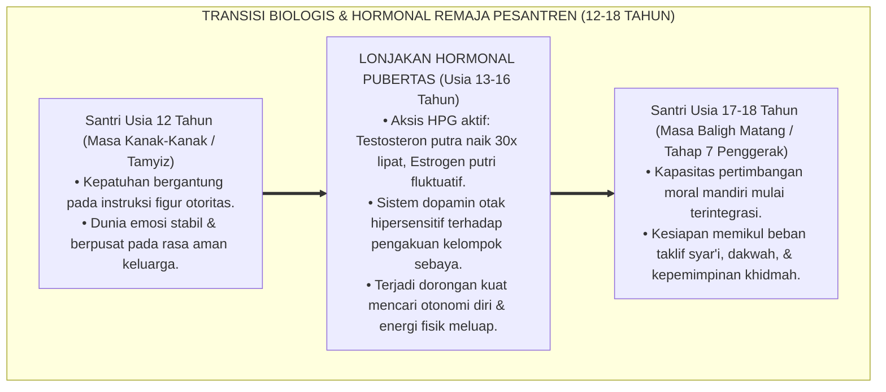
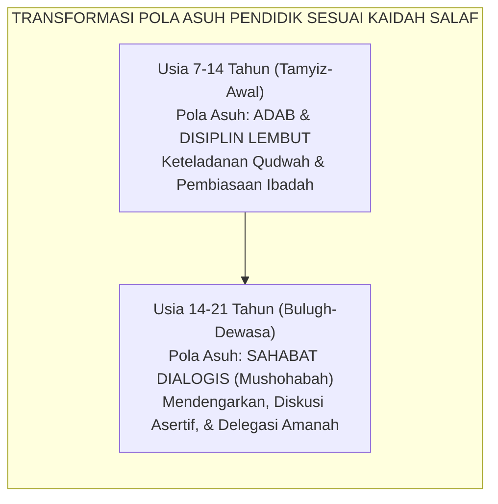
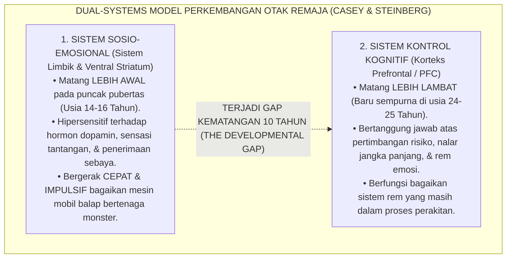

# PANDUAN PRAKTIS 3.1: TRANSISI PUBERTAS & DINAMIKA HORMONAL ASRAMA

**Sasaran Pengguna**: Pimpinan Pondok, Kepala Pengasuhan, Wali Kelas, & Musyrif Asrama  
**Fokus Penerapan**: Panduan Kerja Lapangan & Pembiasaan Karakter Harian Sistem TUMBUH  

---

### 🎯 Tujuan & Manfaat Panduan
Panduan ini dirancang sebagai petunjuk operasional terapan agar pendidik dan musyrif dapat:
1. Menjalankan pembinaan adab santri dengan pendekatan kasih sayang (*Rahmah*) dan ketegasan yang mendidik (*Firm & Kind*).
2. Menghindari cara-cara kekerasan fisik, bentakan verbal, maupun hukuman yang mempermalukan santri.
3. Menciptakan suasana asrama dan kelas yang aman, tertib, dan menumbuhkan kesadaran diri (*Bi'ah Shalihah*).

---

### 💡 Intisari Cepat (3 Menit Memahami Esensi)
* **Kunci Pengasuhan**: Karakter santri tumbuh melalui keteladanan nyata (*Qudwah Hasanah*), komunikasi empatik, dan pembiasaan terstruktur 24 jam.
* **Tindakan Utama**: Terapkan panduan langkah demi langkah di bawah ini secara konsisten, pantau perkembangan santri secara objektif, dan berikan apresiasi atas setiap perbaikan diri yang mereka capai.
* **Prinsip Disiplin**: Fokus pada pemulihan hubungan dan tanggung jawab nyata (*Restoratif*), bukan sekadar melampiaskan amarah atau menghukum.

---

### 📖 Uraian Panduan & Langkah Aksi Lapangan

---

### I. Titik Balik Kehidupan Santri: Ketika Tubuh Berubah dan Jiwa Berguncang

Rentang usia santri di pondok pesantren (12 hingga 18 tahun) adalah fase transisi biologis, hormonal, dan psikologis paling dramatis dalam seluruh siklus kehidupan manusia: **fase pubertas (*marhalah al-bulugh*)**.

Pada rentang usia inilah, tubuh seorang anak mengalami badai biologis secara masif melalui pengaktifan sumbu aksis HPG (*Hypothalamic-Pituitary-Gonadal Axis*):
* **Hormon Testosteron** pada santri putra melonjak secara fantastis hingga **20 hingga 30 kali lipat** dibanding masa kanak-kanak. Lonjakan ini memicu ledakan energi fisik motorik yang meluap-luap, dorongan untuk bersaing, kebutuhan pembuktian kejantanan (*dominance seeking*), dan sensitivitas tinggi terhadap rasa tertantang.
* **Hormon Estrogen dan Progesteron** pada santri putri mengalami fluktuasi siklik yang tajam, memicu kepekaan emosional yang mendalam (*affective sensitivity*), kebutuhan mendesak akan rasa aman relasional, keintiman persahabatan, dan rentan terhadap kecemasan penolakan sosial.

<b>Gambar 3.1.1:</b> Alur Transisi Perkembangan Hormonal dan Kognitif Remaja Santri.

Pakar psikologi perkembangan remaja terkemuka dari Temple University, **Prof. Laurence Steinberg**[^1] dalam karyanya *Age of Opportunity: Lessons from the New Science of Adolescence* menegaskan bahwa masa pubertas bukanlah masa "kerusakan mental", melainkan **jendela plastisitas otak kedua (*the second window of neuroplasticity*)**. Di fase inilah otak manusia sedang ditata ulang secara masif oleh alam untuk mempersiapkan individu menjadi manusia dewasa yang mandiri, berani mengambil risiko, dan mampu memimpin masyarakat.

---

### II. Kesalahan Fatal Pendekatan Tradisional: Menghakimi Gejala Biologis sebagai Dosa Moral

Di banyak pondok pesantren konvensional, perubahan perilaku alamiah akibat transisi pubertas ini kerap kali disalahpahami secara fatal oleh para pembina dan ustadz:
* Ketika santri putra usia 14 tahun mendadak menjadi sangat berisik di lorong asrama, gemar pamer kekuatan fisik, suka bergulat di atas kasur, dan gelisah jika disuruh duduk diam terlalu lama, pengurus asrama kerap menjatuhkan vonis moralitas: *"Dasar anak nakal!", "Santri bebal!", "Keras kepala tidak beradab!"*
* Santri kemudian dihukum fisik: dijemur di lapangan terik matahari, dipukul dengan rotan, atau dibotak paksa kepalanya.

Secara neurobiologis dan psikologis, tindakan menghukum fisik ledakan energi pubertas ini adalah sebuah kejahatan pedagogis. Membentak dan memukul santri yang sedang mengalami lonjakan testosteron **tidak akan pernah meredam energinya, melainkan membelokkan energi tersebut menjadi agresi tersembunyi, dendam asrama, dan perundungan sadis terhadap adik kelas**.

Ekosistem TUMBUH meluruskan pemahaman ini: **energi fisik yang meluap pada remaja bukanlah kejahatan moral, melainkan bahan bakar fitrah yang membutuhkan kanalisasi positif (*sublimasi biologis*), bukan pentungan kekerasan**.

---

### III. Panduan Turats: Fiqih Baligh & Wasiat Emas Tiga Fase Pengasuhan

Khazanah keilmuan Islam sesungguhnya telah membedah dinamika transisi perkembangan anak secara sangat komprehensif dan penuh kasih sayang.

#### 1. Pembagian Fase Perkembangan Menurut Ibnu Qayyim al-Jawziyyah
Dalam kitab monumentalnya *Tuhfat al-Maudud bi Ahkam al-Maulud*[^2], **Al-Imam Ibnu Qayyim al-Jawziyyah** membagi fase tumbuh kembang manusia ke dalam empat tahapan organik:
1. **Thufullah** (Masa Kanak-Kanak Awal: Usia 0–7 tahun);
2. **Tamyiz** (Masa Kanak-Kanak Akhir: Usia 7–12 tahun, di mana nalar anak mulai mampu membedakan maslahat dan mafsadat);
3. **Murahaqah** (Masa Transisi Pubertas: Usia 12–15 tahun, gejolak tanda-tanda baligh);
4. **Bulugh wa Taklif** (Masa Baligh Sempurna: Usia 15 tahun ke atas, di mana beban hukum syariat telah jatuh sepenuhnya di pundaknya).

Ibnu Qayyim menggarisbawahi bahwa saat anak memasuki masa *Murahaqah*, pendidik diharamkan memperlakukan mereka bagaikan anak kecil yang hanya diperintah secara diktator. Pendidik wajib mengubah pendekatan menjadi **pendampingan dialogis (*al-Musyahadah wal Mu'akhat*)**, karena jiwa remaja sedang mencari pembuktian martabat dirinya.

#### 2. Wasiat Emas Sayyidina Ali bin Abi Thalib RA Mengenai Pola Asuh Tiga Babak
Sayyidina Ali bin Abi Thalib RA (dan dinisbatkan pula pada para sahabat) mewariskan kaidah emas metode pengasuhan anak:

$$\text{لَاعِبْهُ سَبْعًا، وَأَدِّبْهُ سَبْعًا، وَصَاحِبْهُ سَبْعًا}$$

**Artinya:** *"Ajaklah ia bermain (perlakukan bagai raja dengan kelembutan) pada 7 tahun pertama (usia 0–7 tahun); tanamkanlah adab dan disiplin padanya pada 7 tahun kedua (usia 7–14 tahun); dan jadikanlah ia sebagai SAHABAT diskusi pada 7 tahun ketiga (usia 14–21 tahun)."*

<b>Gambar 3.1.2:</b> Pergeseran Paradigma Pengasuhan dari Disiplin Menuju Sahabat Dialogis.

Ketika santri menginjak usia 14–18 tahun, musyrif yang terus memposisikan dirinya sebagai "mandor pengawas" akan selalu menghadapi perlawanan bawah tanah (*covert defiance*). Namun, musyrif yang memposisikan dirinya sebagai **sahabat yang mendengarkan (*supportive mentor*)** akan menjadi tempat berlabuh teraman bagi curahan kegelisahan jiwa santri.

---

### IV. Tinjauan Sains: Dual-Systems Model & Sensitivitas Dopamin

Pakar neurosains perkembangan terkemuka **Prof. B.J. Casey**[^3] merumuskan teori **Dual-Systems Model of Adolescent Brain Development**:

<b>Gambar 3.1.3:</b> Model Sistem Ganda (Dual-Systems Model) Perkembangan Otak Remaja.

Kesenjangan biologis antara sistem penggerak emosi (yang sudah matang penuh) dan sistem pengerem nalar (yang masih bertumbuh) inilah yang menjelaskan mengapa santri remaja sangat gemar mencari sensasi (*sensation seeking*), mudah terbakar emosinya saat ditantang, dan sangat takut diasingkan oleh teman sebayanya.

---

### V. Solusi Sistemik TUMBUH: Kanalisasi Energi Fisik & Mentoring Baligh

Menjawab dinamika transisi pubertas ini, Ekosistem TUMBUH menerapkan strategi kanalisasi terstruktur:
1. **Penyaluran Energi Motorik Tinggi Melalui Program Ksatria**: Menyediakan jadwal harian olahraga kompetitif (futsal, basket, beladiri pencak silat, panahan) ba'da ashar sebagai wadah resmi penyaluran hormon testosteron, sehingga santri tidak lagi menyalurkannya lewat perkelahian di lorong asrama.
2. **Mentoring Fiqih Baligh & Edukasi Kedewasaan**: Membekali santri dengan modul komprehensif mengenai mimpi basah (*ihtilam*), thaharah mandi junub, fiqih haid bagi santriwati, serta pemaknaan spiritual bahwa baligh adalah gerbang kemuliaan memikul amanah Allah (*ahliyyatul ada'*).

---

## 📌 Catatan Kaki & Rujukan Primer

[^1]: **Laurence Steinberg**, *Age of Opportunity: Lessons from the New Science of Adolescence* (Boston: Houghton Mifflin Harcourt, 2014), Bab 1 & 2: "The Adolescent Brain: A Work in Progress", hlm. 15–58.
[^2]: **Al-Imam Syamsuddin Ibnu Qayyim al-Jawziyyah**, *Tuhfat al-Maudud bi Ahkam al-Maulud*, Tahqiq: Syaikh Abdul Qadir al-Arnauth (Damaskus: Maktabah Dar al-Bayan, 1971), Bab 15: "Fi Fasl Maratib al-Insan min al-Wiladah ila al-Bulugh", hlm. 140–185.
[^3]: **B.J. Casey, Rebecca M. Jones, & Todd A. Hare**, "The adolescent brain", *Annals of the New York Academy of Sciences*, Vol. 1124, No. 1 (2008), hlm. 111–126; serta **B.J. Casey**, "Beyond simple models of self-control to circuit-based accounts of adolescent behavior", *Annual Review of Psychology*, Vol. 66 (2015), hlm. 295–319.
