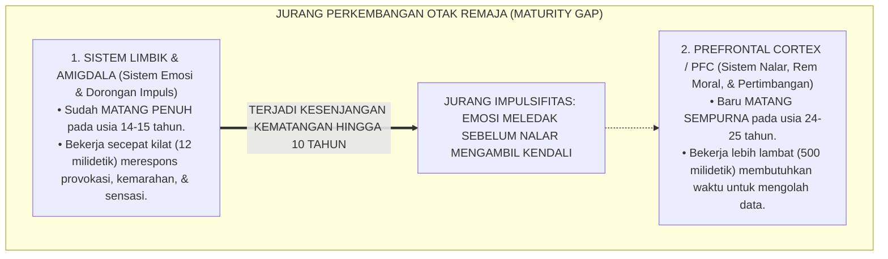
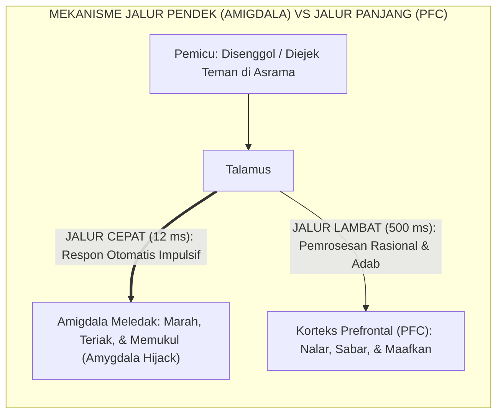
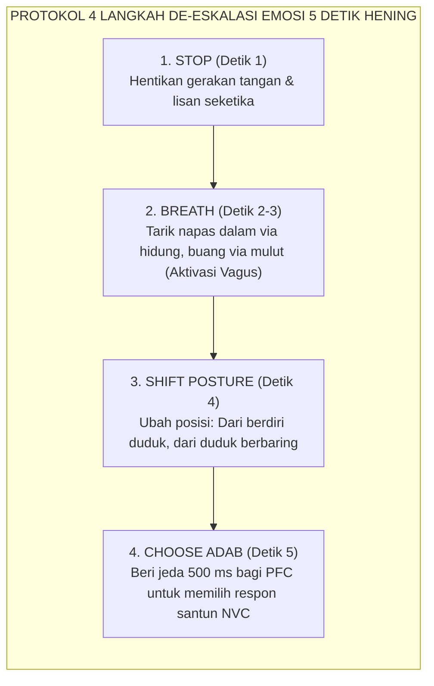

# PANDUAN PRAKTIS 3.2: KESENJANGAN MATURASI LIMBIK VS PREFRONTAL CORTEX

**Sasaran Pengguna**: Pimpinan Pondok, Kepala Pengasuhan, Wali Kelas, & Musyrif Asrama  
**Fokus Penerapan**: Panduan Kerja Lapangan & Pembiasaan Karakter Harian Sistem TUMBUH  

---

### 🎯 Tujuan & Manfaat Panduan
Panduan ini dirancang sebagai petunjuk operasional terapan agar pendidik dan musyrif dapat:
1. Menjalankan pembinaan adab santri dengan pendekatan kasih sayang (*Rahmah*) dan ketegasan yang mendidik (*Firm & Kind*).
2. Menghindari cara-cara kekerasan fisik, bentakan verbal, maupun hukuman yang mempermalukan santri.
3. Menciptakan suasana asrama dan kelas yang aman, tertib, dan menumbuhkan kesadaran diri (*Bi'ah Shalihah*).

---

### 💡 Intisari Cepat (3 Menit Memahami Esensi)
* **Kunci Pengasuhan**: Karakter santri tumbuh melalui keteladanan nyata (*Qudwah Hasanah*), komunikasi empatik, dan pembiasaan terstruktur 24 jam.
* **Tindakan Utama**: Terapkan panduan langkah demi langkah di bawah ini secara konsisten, pantau perkembangan santri secara objektif, dan berikan apresiasi atas setiap perbaikan diri yang mereka capai.
* **Prinsip Disiplin**: Fokus pada pemulihan hubungan dan tanggung jawab nyata (*Restoratif*), bukan sekadar melampiaskan amarah atau menghukum.

---

### 📖 Uraian Panduan & Langkah Aksi Lapangan

---

### I. Fenomena 'Bertindak Sebelum Berpikir': Membedah Misteri Otak Santri

Hampir setiap musyrif asrama pernah mengalami dialog yang membingungkan seperti ini:
Seorang santri kelas 8 MTs (usia 14 tahun) baru saja melompat dari lantai dua asrama demi mengambil bola yang tersangkut di genteng, atau ia tiba-tiba memukul kawannya hanya karena dipanggil dengan nada yang sedikit meninggi. 

Ketika sang musyrif memanggil santri tersebut ke ruang kantor dan bertanya dengan penuh selidik: *"Ahmad, mengapa kamu melakukan perbuatan yang sangat berbahaya dan bodoh itu? Apakah kamu tidak memikirkan akibatnya jika kakimu patah atau kawanmu terluka?"*

Santri tersebut menundukkan kepala, tampak bingung dengan dirinya sendiri, dan menjawab dengan suara lirih: *"Saya tidak tahu, Ustadz... tadi tiba-tiba langsung saya lakukan saja tanpa sempat berpikir."*

Mayoritas pendidik konvensional akan menganggap jawaban tersebut sebagai alasan dusta yang dibuat-buat. Namun, bagi para pakar neurosains perkembangan, jawaban santri tersebut adalah **kejujuran neurobiologis yang sangat nyata**. Santri tersebut memang benar-benar **belum sempat berpikir sebelum bertindak!**

Mengapa hal ini terjadi? Jawabannya terletak pada sebuah fenomena biologis yang disebut **Kesenjangan Garis Waktu Maturasi Otak (*The Neurological Maturity Gap*)**:

<b>Gambar 3.2.1:</b> Kesenjangan Garis Waktu Kematangan Sistem Limbik vs Prefrontal Cortex pada Remaja.

Pakar neurosains menganalogikan otak santri remaja bagaikan **sebuah mobil balap supercanggih bertenaga 500 tenaga kuda (Sistem Limbik yang bertenaga besar), namun sistem remnya masih berupa rem sepeda kayuh yang sedang dalam proses perakitan (Korteks Prefrontal yang belum matang)**.

---

### II. Khazanah Turats: Gejolak Jiwa Muda (*Syabab*) & Seni Menahan Diri (*Al-Hilim*)

Kearifan Islam klasik telah mengenali gejolak ketidakstabilan akal masa muda jauh sebelum mesin pemindai otak fMRI ditemukan.

#### 1. Gejolak Masa Muda dalam Hadits Nabawi
Dalam sebuah atsar dan hadits yang diriwayatkan oleh **Imam Al-Baihaqi** dalam *Syu'abul Iman*[^1], Rasulullah SAW bersabda:

$$\text{الشَّبَابُ شُعْبَةٌ مِنَ الْجُنُونِ}$$

**Artinya:** *"Masa muda itu memiliki satu cabang dari gejolak ketidakstabilan akal (kegilaan impulsif)."*

Para ulama mensyarah hadits ini bukan untuk menghina masa muda, melainkan untuk mengingatkan para pendidik bahwa darah muda memiliki kecenderungan alami untuk bertindak gegabah menuruti hawa nafsunya jika tidak dibimbing oleh nalar dan syariat.

#### 2. Pertempuran Tentara Akal dan Tentara Nafsu Menurut Imam Al-Ghazali
Dalam *Ihya' 'Ulumiddin* (Kitab *Syarh 'Aja'ibil Qalb*)[^2], **Hujjatul Islam Imam Abu Hamid Al-Ghazali** menguraikan perang batin di dalam jiwa manusia:
> *"Ketahuilah bahwa di dalam kalbu manusia terdapat dua kekuatan yang saling bertarung: Jaisyul 'Aql (Tentara Akal Sehat) yang mengajak kepada pertimbangan masa depan dan keridhaan Allah, serta Jaisyul Hawa wal Ghadhab (Tentara Nafsu dan Amarah) yang menuntut pelampiasan seketika tanpa mempedulikan akibat buruknya.*
> 
> *Pada usia anak-anak dan remaja awal, tentara nafsu syahwat dan amarah telah tumbuh perkasa mendahului tentara akal. Maka tugas utama seorang murobbi (pendidik) adalah meminjamkan akalnya untuk membimbing dan membentengi tentara akal anak hingga ia mampu menundukkan tentara nafsunya sendiri."*

Ulama Islam mengajarkan dua karakter luhur untuk menjembatani jurang ini: **Al-Hilim** (kebijaksanaan menahan amarah) dan **Al-Anah** (ketenangan menimbang perkara tanpa tergesa-gesa).

---

### III. Tinjauan Sains: Reaktivitas Amigdala & Fenomena 'Amygdala Hijack'

Bagaimana mekanisme pembajakan emosi terjadi di otak santri saat menghadapi konflik di asrama?

#### 1. Pembajakan Amigdala (*Amygdala Hijack*) Daniel Goleman
Pakar kecerdasan emosional **Daniel Goleman**[^3] menjelaskan bahwa ketika santri merasa terancam atau tersinggung:
* Informasi sensorik dari mata dan telinga masuk ke **Talamus**;
* Talamus mengirimkan sinyal melalui dua jalur: jalur pintas cepat (*the low road*) langsung ke **Amigdala** (hanya 12 milidetik), dan jalur lambat (*the high road*) ke **Korteks Prefrontal / PFC** (500 milidetik);
* Jika santri tidak terlatih meregulasi emosinya, amigdala akan meledak membajak seluruh otak (*Amygdala Hijack*), membanjiri tubuh dengan hormon adrenalin dan kortisol, sebelum PFC sempat menganalisis situasi secara rasional.

<b>Gambar 3.2.2:</b> Perbedaan Kecepatan Sinyal Otak: Jalur Cepat Amigdala vs Jalur Lambat PFC.

#### 2. Bahaya Bentakan Pendidik terhadap Lumpuhnya PFC Santri
Ketika seorang ustadz atau musyrif membentak santri yang sedang bersalah dengan suara menggelegar dan wajah merah padam, amigdala santri mendeteksi bahaya predator mematikan. Otak santri langsung masuk ke mode bertahan hidup primitif: **Lawan, Lari, atau Membatu (*Fight, Flight, or Freeze*)**. 

Dalam kondisi ini, sirkuit Prefrontal Cortex santri lumpuh total (*functional hypofrontality*). Nasihat atau ayat suci yang dibacakan ustadz saat membentak **tidak akan pernah diserap oleh otak santri**, karena pintu nalar logikanya sedang terkunci rapat oleh rasa takut!

---

### IV. Protokol Lapangan: Protokol 5 Detik Hening (*The 5-Second Pause Protocol*)

Menerjemahkan sunnah Nabi dan neurosains ke dalam praksis pengasuhan asrama, Ekosistem TUMBUH melatih santri menjalankan **Protokol 5 Detik Hening (*Protokol Khamsi Tsawani*)** setiap kali menghadapi situasi pemicu amarah:

<b>Gambar 3.2.3:</b> Empat Langkah Protokol De-eskalasi Emosi 5 Detik Hening Santri.

Protokol ini menyelaraskan hadits shahih riwayat **Imam Abu Dawud**[^4]:

$$\text{إِذَا غَضِبَ أَحَدُكُمْ وَهُوَ قَائِمٌ فَلْيَجْلِسْ، فَإِنْ ذَهَبَ عَنْهُ الْغَضَبُ وَإِلَّا فَلْيَضْطَجِعْ}$$

**Artinya:** *"Jika salah seorang di antara kalian marah dalam keadaan berdiri, maka hendaklah ia duduk; jika amarahnya telah reda, maka cukup, namun jika belum reda, hendaklah ia berbaring."*

Secara neurobiologis, mengubah posisi dari berdiri ke duduk menurunkan frekuensi denyut jantung, merelaksasi otot leher, dan memberikan jeda waktu krusial bagi Prefrontal Cortex untuk mengambil alih kendali perilaku dari amigdala.

---

### V. Solusi Sistemik TUMBUH: Kebijakan 'Cooling-Down' 30 Menit dalam Penanganan Pelanggaran

Untuk mencegah malpraktik penanganan santri:
1. **Aturan Jeda Pendinginan 30 Menit (*The 30-Minute Cooling-Down Rule*)**: Musyrif diharamkan menyidang atau menasihati santri yang baru saja terlibat perkelahian dalam kondisi emosi masih meluap. Santri dipisahkan, diberi segelas air putih, diminta berwudhu, dan diistirahatkan selama 30 menit hingga hormon kortisolnya kembali normal.
2. **Sidang Restoratif Berbasis Dialogis**: Setelah kondisi tenang tercapai, musyrif memandu dialog restoratif untuk melatih Prefrontal Cortex santri menganalisis dampak perbuatannya terhadap diri sendiri dan orang lain.

---

## 📌 Catatan Kaki & Rujukan Primer

[^1]: **Al-Hafizh Abu Bakar Ahmad bin al-Husain al-Baihaqi**, *Syu'abul Iman*, Tahqiq: Dr. Abdul Ali Abdul Hamid Hamid (Riyadh: Maktabah ar-Rusyd, 2003), Hadits No. 10260; serta dinisbatkan sebagai atsar Sayyidina Ali RA.
[^2]: **Hujjatul Islam Imam Abu Hamid Muhammad bin Muhammad al-Ghazali**, *Ihya' 'Ulumiddin*, Kitab Syarh 'Aja'ibil Qalb (Kairo & Beirut: Dar al-Ma'rifah, t.th.), Jilid III, hlm. 3–25.
[^3]: **Daniel Goleman**, *Emotional Intelligence: Why It Can Matter More Than IQ* (New York: Bantam Books, 1995; Edisi Peringatan 10 Tahun, 2005), Bab 2: "Anatomy of an Emotional Hijacking", hlm. 13–28.
[^4]: **Al-Imam Abu Dawud Sulaiman bin al-Asy'ats as-Sijistani**, *Sunan Abi Dawud*, Kitab al-Adab, Bab Ma Yuqalu 'indal Ghadhab (Beirut: Al-Maktabah al-'Ashriyyah, t.th.), Hadits No. 4782.
