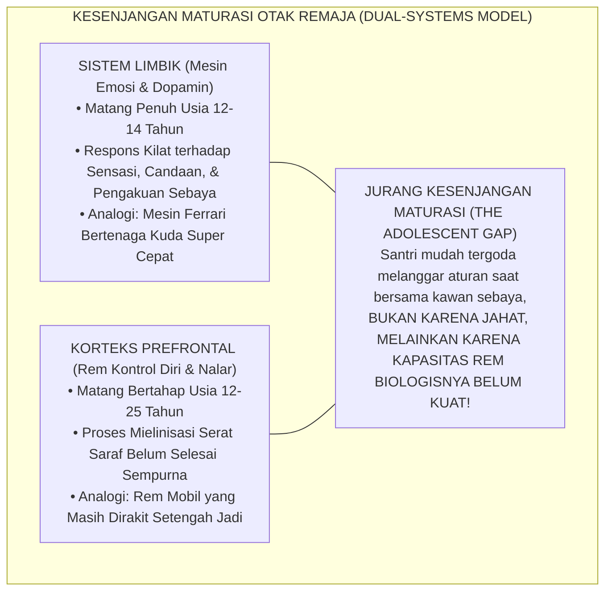
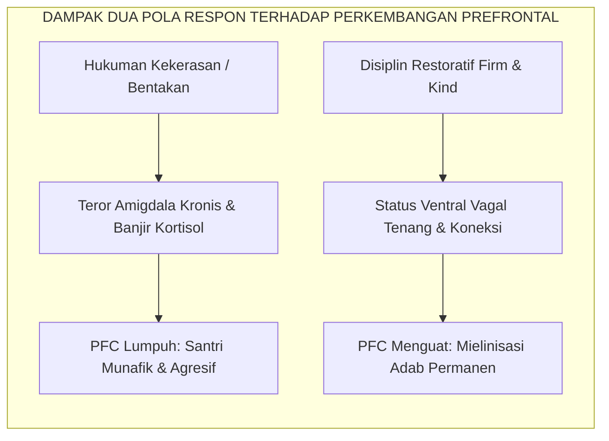

# SUB-BAB 3.2: KESENJANGAN MATURASI LIMBIK VS PREFRONTAL CORTEX
## *Model Sistem Ganda Neurosains Kognitif Remaja dan Dinamika Regulasi Kontrol Diri Santri*

**Kode Klasifikasi**: `BOOK-02/BAB-03/SUB-02/MONOGRAF-MASTER-VIBRANT`  
**Disiplin Ilmu**: Neurosains Perkembangan Otak (*Developmental Cognitive Neuroscience*), Teori Sistem Ganda (*Dual-Systems Model*), & Psiko-Spiritual Islam  
**Penanggung Jawab Keilmuan**: Dewan Pakar Ekosistem TUMBUH (*Pakar Neurosains Perkembangan & Pakar Psikologi Belajar*)

---

### Mobil Berkecepatan Tinggi dengan Rem yang Masih Dirakit

Salah satu penemuan paling revolusioner dalam neurosains perkembangan abad ke-21 adalah **Model Sistem Ganda (*Dual-Systems Model of Adolescent Brain Development*)**[^1].

Model ini menjelaskan sebuah fakta biologis yang sangat mencengangkan tentang arsitektur otak remaja usia 12 hingga 18 tahun:
* **Sistem Sosio-Emosional / Limbik** (khususnya *Amigdala* dan *Nukleus Akumbens* yang memproses sensasi emosi, gairah, dorongan mencari kesenangan, dan sensitivitas terhadap persetujuan teman sebaya) telah **matang secara penuh dan bekerja sangat aktif sejak masa awal pubertas**.
* Sebaliknya, **Sistem Kontrol Kognitif / Korteks Prefrontal (*Prefrontal Cortex / PFC*)** (wilayah otak depan yang berfungsi sebagai "rem eksekutif": menimbang risiko jangka panjang, mengendalikan impuls emosi, memikirkan konsekuensi akhirat, dan mengatur konsentrasi) **masih dalam proses pertumbuhan dan baru akan matang sempurna pada usia 22–25 tahun!**

<b>Gambar 3.2.1:</b> Kesenjangan Maturasi Antara Sistem Limbik dan Korteks Prefrontal pada Remaja.

Pakar neurosains kognitif terkemuka **B. J. Casey & Sarah-Jayne Blakemore**[^2] mengibaratkan remaja laksana **"sebuah mobil Ferrari berkecepatan tinggi yang dikemudikan oleh sopir pemula dengan pedal rem yang belum selesai dipasang sempurna"**.

---

### Mengapa Santri Melakukan Tindakan Konyol di Asrama?

Kesenjangan neurobiologis ini menjawab berbagai teka-teki perilaku santri di asrama yang selama ini membingungkan para ustadz:
1. **Mengapa santri hafal dalil larangan ghashab, tetapi tetap memakai sandal kawan saat terburu-buru?**  
   Karena saat terburu-buru, sinyal dorongan limbik melesat jauh lebih cepat daripada kecepatan sinyal rem PFC yang masih lambat.
2. **Mengapa santri berani melakukan hal berbahaya saat bersama geng kamarnya (seperti memanjat pagar atau membuat lelucon ekstrem)?**  
   Karena kehadiran teman sebaya memicu banjir neurotransmiter *dopamin* di sistem penghargaan otak (*reward system*), melumpuhkan pertimbangan akal sehat sesaat.

Ketika ustadz memahami fakta biologis ini, ustadz tidak akan lagi merespons kesalahan anak dengan kemarahan destruktif. Ustadz menyadari bahwa **tugas pendidik bukanlah menghukum kelemahan biologis anak, melainkan bertindak sebagai "Prefrontal Cortex Tambahan (*External PFC*)" yang memandu dan menguatkan rem kontrol diri santri**.

---

### Integrasi Turats: Pertarungan *Jundul 'Aql* Melawan *Jundusy Syahwah*

Kebenaran hukum neurobiologis ini secara menakjubkan telah diuraikan oleh **Hujjatul Islam Imam Abu Hamid Al-Ghazali** dalam *Ihya' 'Ulumiddin* (Kitab *'Aja'ibul Qalb*)[^3] tentang dinamika pertarungan di dalam benteng hati (*Hishnul Qalb*):

> [!NOTE]
> ### 📜 Syarah Imam Al-Ghazali tentang Pasukan Akal Melawan Syahwat:
> 
> $$\text{اعْلَمْ أَنَّ الْقَلْبَ كَالْحِصْنِ، وَالشَّيْطَانَ كَالْعَدُوِّ الْمُرَابِطِ، وَالشَّهْوَةَ وَالْغَضَبَ أَعْظَمُ أَبْوَابِهِ؛ فَلَا يَقْدِرُ عَلَى حِرَاسَةِ الْحِصْنِ إِلَّا بِجُنُودِ الْعَقْلِ وَالْحِكْمَةِ، وَالْعَقْلُ فِي ابْتِدَاءِ أَمْرِ الصِّبَا يَكُونُ ضَعِيفًا يَحْتَاجُ إِلَى نُصْرَةِ الْمُرَبِّي وَمُؤَازَرَتِهِ}$$
> 
> **Artinya:**  
> *"Ketahuilah sesungguhnya hati itu laksana benteng pertahanan, setan laksana musuh yang mengintai, sedangkan syahwat dan amarah adalah pintu gerbang terbesarnya. Tidak ada yang mampu menjaga benteng tersebut kecuali bala tentara akal dan hikmah; dan sesungguhnya akal pada permulaan usia belia masih berada dalam kondisi lemah yang sangat membutuhkan pertolongan dan sokongan kuat dari sang pembimbing (*Murabbi*)."*

Al-Ghazali menegaskan sembilan abad lalu: akal anak muda belum mandiri (*dha'if*), ia membutuhkan sokongan eksternal dari musyrif (*scaffolding*) hingga bala tentara akalnya matang dan mampu menguasai kerajaannya sendiri secara mandiri.

---

### Dampak Fatal Hukuman Kekerasan terhadap Otak Remaja

Pakar psikiatri anak **Bruce D. Perry**[^4] membuktikan bahwa ketika seorang anak remaja yang sedang mengalami kegagalan kontrol diri dibentak, dihina di depan umum, atau dipukul rotan:
* Otak santri mengalami **"Pembajakan Amigdala (*Amygdala Hijacking*)"**: otak beralih ke status bertahan hidup primitif (*reptilian brain*).
* Sirkuit saraf Prefrontal Cortex yang sedang tumbuh justru **terputus dan mengalami kelumpuhan (*down-regulation*)**.
* Akibatnya: anak tidak belajar memperbaiki moralnya, melainkan belajar menjadi lebih lihai berbohong dan menyimpan dendam kesumat.

<b>Gambar 3.2.2:</b> Pengaruh Pendekatan Disiplin terhadap Pematangan Prefrontal Cortex Santri.

---

### Solusi Sistemik TUMBUH: Pembiasaan Rem Kognitif (*Stop-Think-Act Protocol*)

Sistem TUMBUH melatih santri mempercepat pematangan rem Prefrontal Cortex melalui **Protokol 3-Langkah Sadar (STA)**:
1. **STOP (Berhenti Sejenak)**: Saat emosi mulai memuncak, santri dilatih mengambil jeda 3 detik, menarik nafas panjang, dan melafalkan *Isti'adzah*.
2. **THINK (Berpikir Menimbang)**: Santri bertanya pada dirinya: *"Apakah tindakan ini diridhai Allah? Apa dampaknya bagi kawan dan masa depan ana?"*
3. **ACT (Bertindak Bijak)**: Santri memilih tindakan yang beradab: memaafkan, berdialog santun, atau meminta bantuan musyrif.

Melalui pendampingan yang penuh kesabaran ini, sirkuit Prefrontal Cortex santri mengalami proses mielinisasi yang optimal, mengantarkan anak bertumbuh menjadi sosok insan kamil yang berkepribadian matang, tenang, dan berakhlak mulia.

---

## 📌 Catatan Kaki & Rujukan Primer

[^1]: **Laurence Steinberg**, "A social neuroscience perspective on adolescent risk-taking", *Developmental Review*, Vol. 28, No. 1 (2008), hlm. 78–106; serta **B. J. Casey, Rebecca M. Jones, & Todd A. Hare**, "The adolescent brain", *Annals of the New York Academy of Sciences*, Vol. 1124, No. 1 (2008), hlm. 111–126.
[^2]: **Sarah-Jayne Blakemore**, *Inventing Ourselves: The Secret Life of the Teenage Brain* (New York: PublicAffairs / Hachette Book Group, 2018), Bab 4: "The Brain's Sense of Self", hlm. 65–94.
[^3]: **Hujjatul Islam Imam Abu Hamid al-Ghazali**, *Ihya' 'Ulumiddin*, Kitab Syarh 'Aja'ibil Qalb (Kairo & Beirut: Dar al-Ma'rifah, t.th.), Jilid III, hlm. 6–18.
[^4]: **Bruce D. Perry & Maia Szalavitz**, *The Boy Who Was Raised as a Dog: And Other Stories from a Child Psychiatrist's Notebook* (New York: Basic Books, 2006; edisi revisi 2017), Bab 5: "The Coldest Heart", hlm. 95–124.
