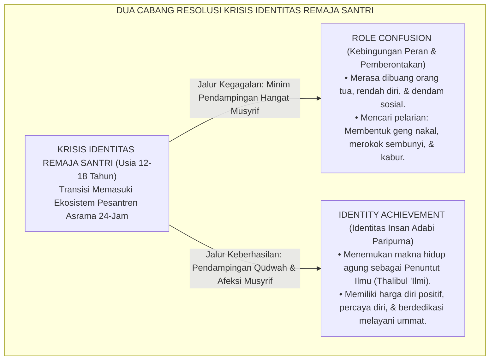

# SUB-BAB 3.3: KRISIS IDENTITAS & KONSTRUKSI KONSEP DIRI SANTRI
## *Menavigasi Fase Pencarian Jati Diri (Identity vs Role Confusion) Menuju Pembentukan Identitas Insan Adabi*

**Kode Klasifikasi**: `BOOK-02/BAB-03/SUB-03/MONOGRAF-MASTER-VIBRANT`  
**Disiplin Ilmu**: Psikososial Perkembangan (Teori Erikson), Psikologi Kepribadian Islam, & Terapi Eksistensial  
**Penanggung Jawab Keilmuan**: Dewan Pakar Ekosistem TUMBUH (*Pakar Bimbingan Konseling & Pakar Filosofi TUMBUH*)

---

### Gempa Eksistensial di Balik Gerbang Pesantren

Ketika seorang anak berusia 12–14 tahun diantar orang tuanya melintasi gerbang pondok pesantren, sesungguhnya ia sedang mengalami **gempa eksistensial terbesar dalam hidupnya**:
* Identitas lamanya sebagai "anak manja di rumah yang dilayani orang tua" mendadak runtuh.
* Fasilitas gadget, kamar pribadi ber-AC, dan lingkaran kawan sekolah dasarnya hilang seketika.
* Ia harus hidup mandiri bersama puluhan anak asing di sebuah kamar sempit, mengenakan sarung dan peci, serta tunduk pada jadwal ibadah yang sangat padat.

Di tengah situasi disrupsi total ini, jiwa remaja berteriak mempertanyakan eksistensi dirinya:  
$$\text{"Siapakah diriku sebenarnya? Mengapa aku ditaruh di sini? Apakah aku seorang buangan, ataukah aku seorang pejuang penuntut ilmu?"}$$

<b>Gambar 3.3.1:</b> Dua Jalur Resolusi Krisis Identitas Remaja Santri Berdasarkan Model Psikososial Erikson.

Pakar psikososial legendaris **Erik H. Erikson**[^1] merumuskan bahwa tahapan kelima perkembangan manusia (usia 12–18 tahun) adalah pertarungan antara **Identitas Diri versus Kebingungan Peran (*Identity vs. Role Confusion*)**. 

Jika remaja gagal menemukan peran sosial yang bermakna dan tidak mendapatkan figur panutan yang positif, ia akan mengalami krisis difusi identitas (*identity diffusion*) yang melahirkan kepribadian anti-sosial dan pemberontakan destruktif.

---

### Teori Status Identitas James Marcia: Menuntun Santri Menuju *Identity Achievement*

Pakar psikologi **James E. Marcia**[^2] mengembangkan teori Erikson ke dalam empat status identitas remaja:

| Status Identitas Remaja | Kondisi Psikologis di Lapangan Pesantren | Strategi Bimbingan Musyrif TUMBUH |
| :--- | :--- | :--- |
| **1. Identity Diffusion (Difusi Identitas)** | Santri apatis, bingung tujuan hidup, tidak peduli aturan pondok, dan pasif melamun. | Membangun ikatan emosional hangat (*Attachment*), mendengarkan keluh kesahnya, dan memulihkan rasa percaya dirinya. |
| **2. Identity Foreclosure (Penyitaan Identitas)** | Santri patuh buta karena dipaksa orang tua tanpa memahami makna ibadah, rentan stres mendadak saat ujian. | Mengajak dialog rasional tentang tujuan hidup dan membuka ruang penemuan makna pribadi (*Meaning-Making*). |
| **3. Identity Moratorium (Eksplorasi Aktif)** | Santri sedang aktif mencari jati diri, banyak bertanya kritis, kadang mencoba melanggar batas aturan kecil. | Memberikan ruang eksplorasi minat bakat (seni, orasi, olahraga) dalam batas koridor adab yang aman. |
| **4. Identity Achievement (Identitas Matang)** | Santri mantap memeluk identitas sebagai *Thalibul 'Ilmi*, ikhlas beribadah, dan memiliki komitmen moral mandiri. | Memberikan amanah kepemimpinan dan mentoring adik kelas (Tangga T4 Transformasi). |

---

### Wawasan Turats: Pengenalan Diri (*Ma'rifatun Nafs*) Imam Al-Muhasibi & Ibnu Hazm

Proses pencarian dan penataan konsep diri ini sejalan dengan ajaran ulama tasawuf dan etika Islam klasik.

**Al-Imam Al-Harits al-Muhasibi** dalam *Ar-Ri'ayah li Huquqillah*[^3] menegaskan bahwa pintu masuk pembenahan akhlak adalah kejujuran dalam membedah penyakit batin dan mengenali hakikat kehambaan diri di hadapan Allah (*I'tiraf bil 'Ubudiyyah*).

Senada dengan itu, **Al-Imam Ibnu Hazm al-Andalusi** dalam mahakaryanya *Al-Akhlaq was-Siyar fi Mudawat an-Nufus*[^4] menuliskan refleksi eksistensial yang sangat mendalam:

> [!NOTE]
> ### 📜 Refleksi Eksistensial Ibnu Hazm tentang Makna Hidup Sejati:
> 
> $$\text{تَطَلَّبْتُ هَدَفًا وَاحِدًا يَسْتَوِي جَمِيعُ النَّاسِ فِي اسْتِحْسَانِهِ وَطَلَبِهِ، فَلَمْ أَجِدْ إِلَّا شَيْئًا وَاحِدًا، وَهُوَ: طَرْدُ الْهَمِّ؛ وَلَمْ أَجِدْ طَرْدَ الْهَمِّ نَافِعًا إِلَّا فِي التَّوَجُّهِ إِلَى اللَّهِ بِالْعَمَلِ لِلْآخِرَةِ}$$
> 
> **Artinya:**  
> *"Aku merenungkan satu tujuan akhir yang disepakati oleh seluruh umat manusia sebagai kebaikan yang dicari, dan aku tidak menemukan selain satu hal: **menghilangkan kegelisahan jiwa (*Thardul Hamm*)**; dan aku mendapati bahwa kegelisahan jiwa tidak akan pernah hilang secara hakiki kecuali dengan menghadapkan wajah seutuhnya kepada Allah melalui amal untuk akhirat."*

---

### Solusi Sistemik TUMBUH: Konstruksi Identitas "Aku Santri Mulia, Pewaris Nabi"

Sistem TUMBUH merancang program penanaman identitas diri sejak pekan pertama santri masuk asrama:
1. **Upacara Ikrar Penuntut Ilmu (*Matsama Adabi*)**: Santri disambut dengan karpet merah dan pelukan hangat para kiai dan musyrif, menanamkan rasa bangga bahwa mereka adalah "Prajurit Peradaban" yang terpilih.
2. **Jurnal Muhasabah & Visi Hidup (*My Life Purpose Journal*)**: Santri dibimbing menuliskan visi hidup 10 tahun ke depan, cita-cita keilmuan, dan kontribusi nyata yang ingin ia berikan bagi umat manusia.
3. **Pemberian Peran Identitas Positif**: Menghapus label negatif (*"anak bermasalah"*), menggantinya dengan panggilan pemberdayaan (*"calon pemimpin yang sedang berproses"*).

Santri yang telah mencapai kematangan identitas ini tidak akan lagi goyah oleh godaan pergaulan buruk: di dadanya telah terpatri kebanggaan sejati sebagai seorang **Insan Adabi** penegak panji-panji Islam di muka bumi.

---

## 📌 Catatan Kaki & Rujukan Primer

[^1]: **Erik H. Erikson**, *Identity: Youth and Crisis* (New York: W. W. Norton & Company, 1968), Bab 4: "Identity and Life Cycle: The Psychosocial Stages", hlm. 128–141.
[^2]: **James E. Marcia**, "Development and validation of ego-identity status", *Journal of Personality and Social Psychology*, Vol. 3, No. 5 (1966), hlm. 551–558; serta "Identity in adolescence", dalam J. Adelson (Ed.), *Handbook of Adolescent Psychology* (New York: John Wiley & Sons, 1980), hlm. 159–187.
[^3]: **Al-Imam Al-Harits bin Asad al-Muhasibi**, *Ar-Ri'ayah li Huquqillah*, Tahqiq: Dr. Abdul Qadir Ahmad 'Atha (Kairo: Dar al-Kutub al-'Ilmiyyah, 1980), hlm. 45–78.
[^4]: **Al-Imam Abu Muhammad Ali bin Ahmad Ibnu Hazm al-Andalusi**, *Al-Akhlaq was-Siyar fi Mudawat an-Nufus*, Tahqiq: Dr. Eva Riad (Beirut: Dar al-Afaq al-Jadidah, 1979), Bab 1: "Mudawat an-Nufus wa Tahdzib al-Akhlaq", hlm. 15–28.
