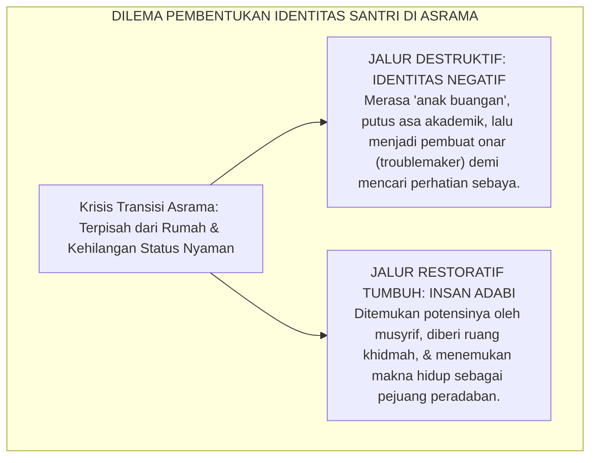
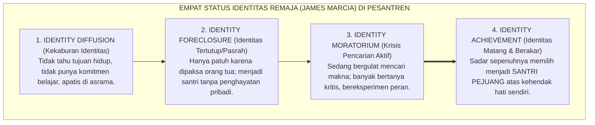

# PANDUAN PRAKTIS 3.3: KRISIS IDENTITAS & KONSTRUKSI KONSEP DIRI SANTRI

**Sasaran Pengguna**: Pimpinan Pondok, Kepala Pengasuhan, Wali Kelas, & Musyrif Asrama  
**Fokus Penerapan**: Panduan Kerja Lapangan & Pembiasaan Karakter Harian Sistem TUMBUH  

---

### 🎯 Tujuan & Manfaat Panduan
Panduan ini dirancang sebagai petunjuk operasional terapan agar pendidik dan musyrif dapat:
1. Menjalankan pembinaan adab santri dengan pendekatan kasih sayang (*Rahmah*) dan ketegasan yang mendidik (*Firm & Kind*).
2. Menghindari cara-cara kekerasan fisik, bentakan verbal, maupun hukuman yang mempermalukan santri.
3. Menciptakan suasana asrama dan kelas yang aman, tertib, dan menumbuhkan kesadaran diri (*Bi'ah Shalihah*).

---

### 💡 Intisari Cepat (3 Menit Memahami Esensi)
* **Kunci Pengasuhan**: Karakter santri tumbuh melalui keteladanan nyata (*Qudwah Hasanah*), komunikasi empatik, dan pembiasaan terstruktur 24 jam.
* **Tindakan Utama**: Terapkan panduan langkah demi langkah di bawah ini secara konsisten, pantau perkembangan santri secara objektif, dan berikan apresiasi atas setiap perbaikan diri yang mereka capai.
* **Prinsip Disiplin**: Fokus pada pemulihan hubungan dan tanggung jawab nyata (*Restoratif*), bukan sekadar melampiaskan amarah atau menghukum.

---

### 📖 Uraian Panduan & Langkah Aksi Lapangan

---

### I. Pertanyaan Eksistensial di Balik Tembok Pesantren: 'Siapakah Aku Sebenarnya?'

Ketika seorang anak berusia 12 atau 13 tahun pertama kali diantarkan oleh orang tuanya melintasi gerbang pesantren, lalu ditinggalkan sendirian di sebuah kamar asrama bersama kawan-kawan baru yang belum dikenalnya, jiwa anak tersebut sesungguhnya sedang mengalami sebuah **gempa eksistensial (*existential crisis*)**.

Di rumah asalnya, ia memiliki identitas yang jelas: sebagai anak kesayangan ayah dan ibunya, memiliki kamar tidur pribadi, dan segala kebutuhannya dilayani. Namun, di dalam ekosistem asrama:
* Ia mendadak hanyalah "satu dari lima ratus santri" yang harus mengantre mandi, mencuci piringnya sendiri, dan berebut tempat duduk di halaqah ilmu;
* Ia mengalami keterputusan ikatan emosional primer (*homesickness shock*);
* Muncul suara-suara batin yang menyiksa: *"Mengapa orang tuaku membuangku ke sini? Apakah aku anak yang tidak diinginkan? Siapakah diriku sebenarnya jika aku tidak pintar menghafal Al-Qur'an dan selalu dimarahi ustadz?"*

Jika krisis identitas ini tidak didampingi secara bijaksana, santri akan terjerat ke dalam **Sindrom Identitas Negatif (*The Negative Identity Trap*)**[^1]: santri yang merasa gagal meraih pengakuan lewat jalur prestasi akademik akan dengan sengaja memilih menjadi *"tokoh antagonis/troublemaker"* di asrama—sering melanggar aturan, merokok sembunyi-sembunyi, atau membully adik kelas—semata-mata demi mendapatkan perhatian dan status di mata teman sebayanya (*"Lebih baik dikenal sebagai anak nakal daripada tidak dianggap sama sekali!"*).

<b>Gambar 3.3.1:</b> Dua Jalur Percabangan Pembentukan Identitas Remaja di Pesantren.

---

### II. Khazanah Turats: Ma'rifatun Nafs Imam Al-Ghazali & Kemuliaan Fitrah Manusia

Tradisi keilmuan Islam meletakkan pengenalan jati diri sebagai gerbang utama pengenalan kepada Sang Pencipta.

#### 1. Hakikat Pengenalan Jiwa (*Ma'rifatun Nafs*)
Dalam atsar dan kalam hikmah yang masyhur di kalangan ulama sufi dan pensyarah hadits:

$$\text{مَنْ عَرَفَ نَفْسَهُ فَقَدْ عَرَفَ رَبَّهُ}$$

**Artinya:** *"Barangsiapa yang mengenal hakikat dirinya (kelemahannya, kefakirannya, dan potensi fitrahnya), maka sungguh ia akan mengenal Tuhannya (Keagungan, Kasih Sayang, dan Kekuasaan-Nya)."*

#### 2. Dekonstruksi Hakikat Manusia dalam *Kimiya-yi Sa'adat* Imam Al-Ghazali
Dalam karyanya *Kimiya-yi Sa'adat* (Kimia Kebahagiaan) dan *Mizan al-'Amal*[^2], **Hujjatul Islam Imam Abu Hamid Al-Ghazali** menguraikan bahwa manusia tersusun dari empat unsur sifat:
1. **Sifat Bahimiyyah (Kebinatangternakan)**: Yang hanya peduli pada makan, minum, dan syahwat biologis;
2. **Sifat Sabu'iyyah (Kebinatangbuasan)**: Yang suka menyerang, memukul, mendominasi, dan mencaci maki sesama;
3. **Sifat Syaithaniyyah (Kedurjanaan Iblis)**: Yang suka menipu, merancang tipu daya jahat, dan membisikkan maksiat;
4. **Sifat Malakiyyah wa Rabbaniyyah (Kemalaikatan & Ketuhanan)**: Yang rindu pada ilmu, keadilan, cinta kasih, keindahan, dan ibadah kepada Allah SWT.

Imam Al-Ghazali menegaskan: *"Wahai penuntut ilmu! Engkau diciptakan bukan untuk menjadi binatang ternak yang sekadar memperebutkan makanan di dapur pondok, bukan pula menjadi anjing hutan yang menerkam kawan sekamarmu. Engkau diciptakan membawa percikan ruh kemuliaan malaikat untuk menjadi khalifah Allah yang memakmurkan bumi!"*

Penanaman kesadaran luhur ini membangkitkan rasa **'Izzah (Martabat Diri Spiritual)** pada dada santri: bahwa dirinya adalah makhluk mulia yang tidak layak merendahkan diri dalam maksiat atau kemalasan yang hina.

---

### III. Tinjauan Sains: Teori Psikososial Erik Erikson & Status Identitas James Marcia

Psikologi perkembangan modern membedah secara ilmiah dinamika pembentukan identitas ini:

#### 1. Tahap Kelima Teori Psikososial Erik Erikson (*Identity vs. Role Confusion*)
Pakar psikoanalisis perkembangan dunia **Prof. Erik H. Erikson**[^3] merumuskan bahwa tugas perkembangan utama remaja usia 12–18 tahun adalah menyelesaikan krisis **Identitas Diri vs Kekaburan Peran (*Identity vs. Role Confusion*)**:
* Remaja berusaha menyatukan pemahaman tentang: *Siapakah diriku di masa lalu? Siapakah diriku sekarang? Dan peran apa yang akan aku mainkan di masa depan?*
* Jika pesantren hanya menuntut kepatuhan mekanis tanpa memberi ruang eksplorasi dan penghargaan terhadap keunikan bakat santri, santri akan mengalami **Kekaburan Peran (*Role Confusion*)**: ia menjadi pribadi yang pasif, minder, atau membelot mencari kelompok sub-kultur negatif di luar asrama.

#### 2. Empat Status Identitas Remaja Menurut James Marcia
Pengembangan teori Erikson oleh **James E. Marcia**[^4] memetakan empat status identitas remaja:

<b>Gambar 3.3.2:</b> Trajektori Perkembangan Empat Status Identitas Remaja di Lembaga Pendidikan.

Tujuan Ekosistem TUMBUH adalah membimbing santri bertransisi dari *Identity Foreclosure* (menjadi santri sekadar karena dipaksa ayah-ibu) menuju **Identity Achievement**: santri yang memeluk identitas kesantriannya dengan penuh kebanggaan, kesadaran intelektual, dan cinta yang membara.

---

### IV. Matriks Transformasi Konsep Diri Santri: Dari Minder Menuju Tangguh

| Dimensi Konsep Diri | Konsep Diri Rapuh & Terdistorsi (*Insecure / Defiant*) | Konsep Diri Matang Insan Adabi (*TUMBUH Identity*) | Intervensi Terstruktur Musyrif & Guru BK |
| :--- | :--- | :--- | :--- |
| **Makna Menjadi Santri** | Menganggap diri sebagai "anak buangan" yang dihukum orang tua di pondok. | Memandang diri sebagai "duta pilihan keluarga" yang diamanahi menuntut ilmu mulia. | Sesi konseling *Narrative Reframing*: mengubah sudut pandang pengasingan menjadi pemuliaan. |
| **Penerimaan Keunikan Diri** | Merasa tidak berguna karena tidak juara kelas; iri hati dan minder pada teman berprestasi. | Menyadari ragam kecerdasan fitrah: unggul di seni, olahraga, teknologi, atau sosial khidmah. | Peta Talenta Fitrah Santri: memetakan dan mengapresiasi keunikan pilar potensi setiap anak. |
| **Resiliensi Menghadapi Teguran** | Merasa harga diri diinjak-injak saat ditegur; membalas dengan dendam atau mogok makan. | Menerima masukan sebagai bahan evaluasi diri (*muhasabah*); percaya bahwa ustadz menyayanginya. | Penerapan Disiplin Restoratif: menegur perilakunya tanpa pernah merendahkan martabat pribadinya. |

---

### V. Solusi Sistemik TUMBUH: Program 'Meaning-Making Workshop' & Ikrar Fitrah Santri

Untuk mengokohkan fondasi identitas santri, lembaga menyelenggarakan:
1. **Lokakarya Kebermaknaan Hidup (*Meaning-Making Workshop*) di Awal Tahun**: Menghubungkan cita-cita pribadi santri dengan visi perjuangan peradaban Islam dan kebanggaan almamater pesantren.
2. **Penulisan Surat Masa Depan (*Letter to My 25-Year-Old Self*)**: Setiap santri menuliskan visi kontribusi dirinya 10 tahun ke depan, yang disimpan dalam amplop tertutup dan menjadi kompas navigasi belajarnya di pondok.

---

## 📌 Catatan Kaki & Rujukan Primer

[^1]: **Roy F. Baumeister**, *Identity: Cultural Change and the Struggle for Self* (New York: Oxford University Press, 1986), Bab 4 & 5, hlm. 78–125.
[^2]: **Hujjatul Islam Imam Abu Hamid Muhammad bin Muhammad al-Ghazali**, *Mizan al-'Amal*, Tahqiq: Dr. Sulaiman Dunya (Kairo: Dar al-Ma'arif, 1964), hlm. 35–68; serta **Al-Ghazali**, *Kimiya-yi Sa'adat (The Alchemy of Happiness)*, Terjemahan Claud Field (London: Octagon Press, 1980), Bab 1: "The Knowledge of Self", hlm. 1–18.
[^3]: **Erik H. Erikson**, *Identity: Youth and Crisis* (New York: W. W. Norton & Company, 1968), Bab 3 & 4: "The Life Cycle: Epigenesis of Identity" & "Identity Confusion", hlm. 91–178.
[^4]: **James E. Marcia**, "Development and validation of ego-identity status", *Journal of Personality and Social Psychology*, Vol. 3, No. 5 (1966), hlm. 551–558; serta **James E. Marcia**, "Identity in adolescence", dalam J. Adelson (Ed.), *Handbook of Adolescent Psychology* (New York: John Wiley & Sons, 1980), hlm. 159–187.
