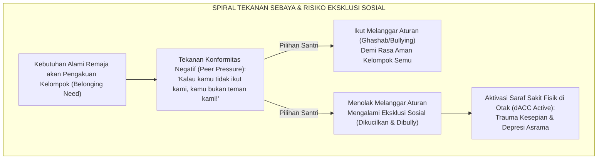
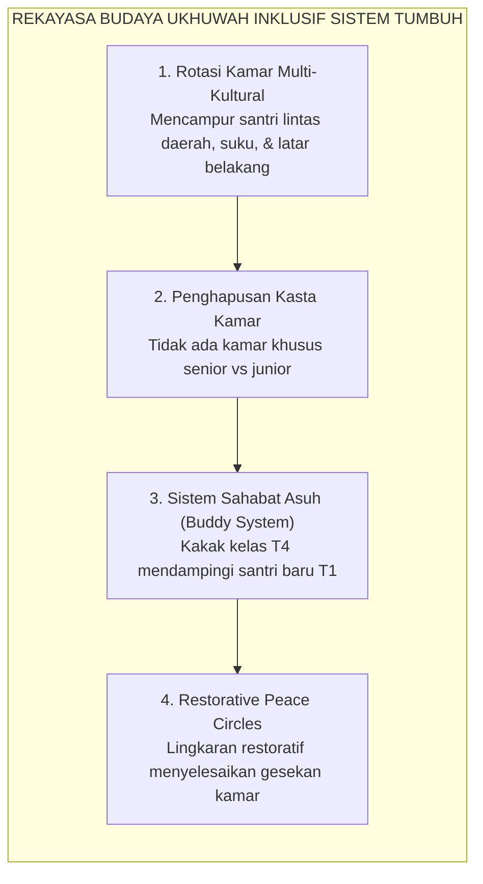

# SUB-BAB 3.4: DINAMIKA KONFORMITAS SEBAYA & MITIGASI EKSKLUSI SOSIAL
## *Membedah Kekuatan Tekanan Teman Sebaya (Peer Pressure), Fenomena Klik Kamar, dan Rekayasa Budaya Ukhuwah Inklusif*

**Kode Klasifikasi**: `BOOK-02/BAB-03/SUB-04/MONOGRAF-MASTER-VIBRANT`  
**Disiplin Ilmu**: Psikologi Sosial Remaja, Sosiologi Pesantren, & Teori Dinamika Kelompok  
**Penanggung Jawab Keilmuan**: Dewan Pakar Ekosistem TUMBUH (*Pakar Sosiologi Santri & Pakar Disiplin Positif*)

---

### Tirani Kelompok Sebaya: Mengapa Pendapat Teman Lebih Ditakuti daripada Hukuman Ustadz?

Di lingkungan pondok pesantren yang terisolasi dari pengaruh luar selama 24 jam penuh, **kelompok teman sebaya (*peer group*) menjadi kekuatan sosial paling dominan yang mengendalikan perilaku santri**.

Bagi seorang santri remaja berusia 13–16 tahun:
* Ancaman terburuk bukanlah surat panggilan orang tua atau teguran dari musyrif.
* **Ancaman paling mengerikan adalah dikucilkan, diejek, atau dicap sebagai "anak aneh / cepu" oleh kawan-kawan satu kamarnya!**

Akibat ketakutan mendalam akan pengucilan sosial ini, santri yang aslinya baik dan beradab kerap kali terpaksa ikut-ikutan melakukan pelanggaran: ikut mencemooh santri baru, ikut memakai sandal orang lain (*ghashab*), atau ikut begadang melanggar aturan, semata-mata demi mempertahankan status keanggotaan kelompoknya (*social belonging*).

<b>Gambar 3.4.1:</b> Spiral Dinamika Tekanan Konformitas Sebaya dan Risiko Eksklusi Sosial di Asrama.

Pakar psikologi sosial legendaris **Solomon Asch**[^1] dalam eksperimen klasiknya membuktikan bahwa lebih dari 75% individu bersedia memberikan jawaban yang jelas-jelas salah hanya karena terpengaruh oleh kesepakatan mayoritas kelompoknya.

Riset neurosains sosial oleh **Naomi I. Eisenberger**[^2] membuktikan bahwa rasa sakit akibat dikucilkan oleh kelompok (*social ostracism*) mengaktifkan sirkuit saraf *dorsal Anterior Cingulate Cortex* (dACC) di otak yang sama persis dengan luka fisik akibat tusukan pisau atau benturan keras.

---

### Dekonstruksi Fenomena Klik Kamar & Eksklusivisme Daerah (*Ashabiyyah*)

Penyakit sosial yang paling lazim merusak iklim asrama adalah terbentuknya **Klik Eksklusif (*Cliques*)**:
* Kelompok santri senior membentuk geng berdasarkan kesamaan daerah asal (*paguyuban kedaerahan primordial*), status ekonomi, atau senioritas kamar.
* Kelompok ini menciptakan hierarki kasta tak resmi di asrama: menentukan siapa yang berhak mandi duluan, siapa yang harus mencucikan piring, dan siapa yang boleh diintimidasi.

**Henri Tajfel & John Turner**[^3] dalam *Social Identity Theory* menjelaskan bahwa ketika sebuah kelompok (*In-Group*) mendefinisikan identitasnya dengan merendahkan kelompok lain (*Out-Group*), maka kekerasan simbolik dan diskriminasi antarkelompok akan meletus secara otomatis.

Dalam Islam, fanatisme kelompok sempit ini disebut **Ashabiyyah Jahiliyyah** yang dilaknat oleh Rasulullah SAW:
$$\text{لَيْسَ مِنَّا مَنْ دَعَا إِلَى عَصَبِيَّةٍ، وَلَيْسَ مِنَّا مَنْ قَاتَلَ عَلَى عَصَبِيَّةٍ، وَلَيْسَ مِنَّا مَنْ مَاتَ عَلَى عَصَبِيَّةٍ}$$
*"Bukan termasuk golongan kami orang yang menyeru kepada 'ashabiyyah (fanatisme golongan), bukan termasuk golongan kami orang yang berperang demi 'ashabiyyah, dan bukan termasuk golongan kami orang yang mati di atas 'ashabiyyah!"* (HR. Abu Dawud no. 5121).

---

### Integrasi Turats: Adab Persaudaraan (*Ulfah & Ukhuwah*) Imam Al-Ghazali & Ibnu Miskawaih

Solusi atas perpecahan sosial ini telah dirumuskan secara gemilang oleh para pakar etika Islam klasik.

**Filsuf Etika Islam Ibnu Miskawaih** dalam *Tahdzib al-Akhlaq*[^4] menegaskan bahwa manusia adalah makhluk sosial alami (*Madaniyyun bit-Thab'i*) yang membutuhkan cinta dan persahabatan sejati (*as-Shadaqah wal Mahabbah*) untuk menyempurnakan keutamaan akhlaknya.

**Hujjatul Islam Imam Abu Hamid Al-Ghazali** dalam *Ihya' 'Ulumiddin* (Kitab *Adab al-Ulfah wal Ukhuwwah*)[^5] menetapkan bahwa persaudaraan karena Allah (*Ukhuwah Fillah*) menuntut pemenuhan hak-hak lahir dan batin: saling tolong dalam urusan materi (*al-Muwasaah bil Mal*), menutupi aib kawan, memaafkan kekhilafan, dan menjauhi segala bentuk perdebatan yang merusak hati.

---

### Solusi Sistemik TUMBUH: Rekayasa Sosiometri & Budaya Inklusif Kamar

Ekosistem TUMBUH memutus rantai klik beracun melalui pendekatan struktural:

<b>Gambar 3.4.2:</b> Empat Pilar Rekayasa Sosiometri Pembentukan Ukhuwah Inklusif TUMBUH.

1. **Penataan Kamar Heterogen (*Heterogeneous Room Assignment*)**: Mengharamkan pembentukan kamar berbasis kedaerahan; setiap bilik kamar diisi secara proporsional oleh santri dari berbagai daerah untuk melatih toleransi lintas budaya.
2. **Sistem Sahabat Asuh (*Adab Buddy System*)**: Setiap santri baru di tangga T1 dipasangkan dengan seorang santri teladan di tangga T4 yang bertugas sebagai kakak asuh pelindung (*protector & mentor*), memastikan tidak ada santri baru yang merasa terisolasi.
3. **Audit Sosiometri Asrama Berkala**: Musyrif menggunakan instrumen sosiometri sederhana setiap bulan untuk mendeteksi anak-anak yang terisolasi (*isolated students*) dan segera memberikan intervensi inklusi sosial.

Dengan rekayasa sosiometri ini, asrama pesantren bertransformasi menjadi **taman persaudaraan sejati (*Baitul Ukhuwah*)**: tempat di mana setiap anak merasa diterima, dilindungi, dan dicintai sebagai saudara seiman.

---

## 📌 Catatan Kaki & Rujukan Primer

[^1]: **Solomon E. Asch**, "Opinions and social pressure", *Scientific American*, Vol. 193, No. 5 (1955), hlm. 31–35; serta **Solomon E. Asch**, *Social Psychology* (Englewood Cliffs: Prentice-Hall, 1952), Bab 16: "Effects of Group Pressure upon the Modification and Distortion of Judgments", hlm. 450–501.
[^2]: **Naomi I. Eisenberger, Matthew D. Lieberman, & Kipling D. Williams**, "Does rejection hurt? An fMRI study of social exclusion", *Science*, Vol. 302, No. 5643 (2003), hlm. 290–292.
[^3]: **Henri Tajfel & John C. Turner**, "An integrative theory of intergroup conflict", dalam W. G. Austin & S. Worchel (Eds.), *The Social Psychology of Intergroup Relations* (Monterey: Brooks/Cole, 1979), hlm. 33–47.
[^4]: **Abu Ali Ahmad bin Muhammad Ibnu Miskawaih**, *Tahdzib al-Akhlaq wa Tathhir al-A'raq*, Tahqiq: Dr. Qusthantin Zuraiq (Beirut: American University of Beirut, 1966), Bab 5: "Fi 'Ilal an-Nufus wa 'Ilajiha", hlm. 125–158.
[^5]: **Hujjatul Islam Imam Abu Hamid al-Ghazali**, *Ihya' 'Ulumiddin*, Kitab Adab al-Ulfah wal Ukhuwwah wash-Shuhbah (Kairo & Beirut: Dar al-Ma'rifah, t.th.), Jilid II, hlm. 155–182.
