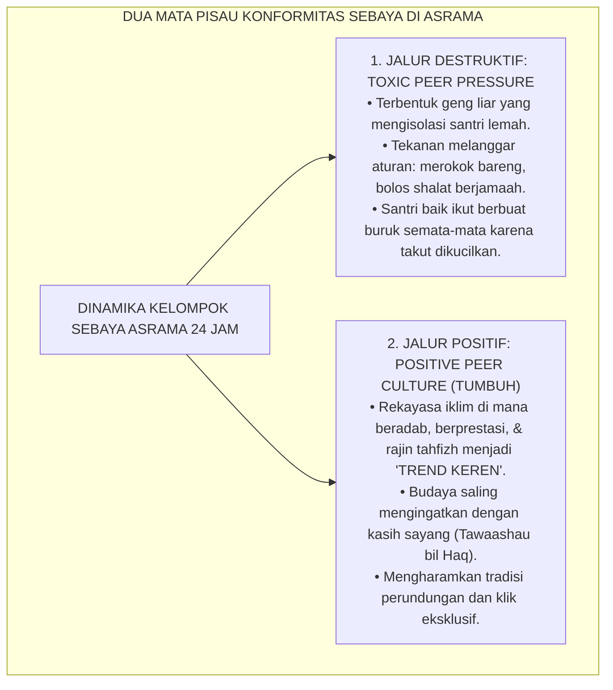
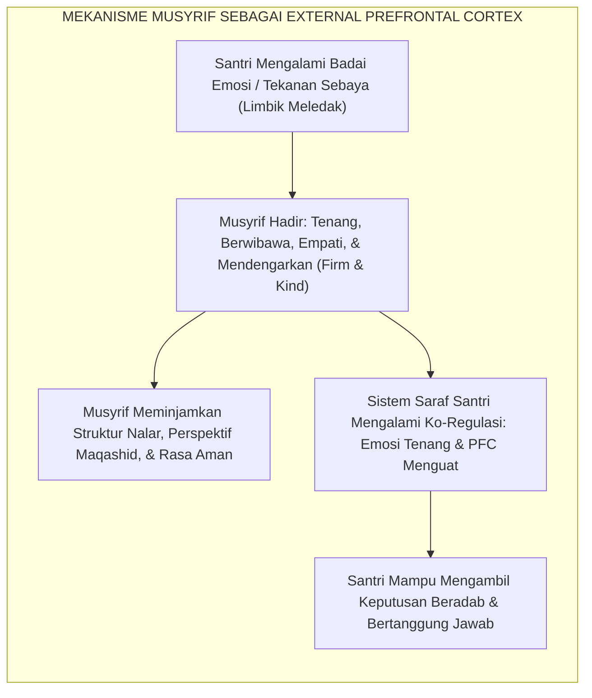

# KONFORMITAS SEBAYA & MUSYRIF SEBAGAI EXTERNAL PREFRONTAL CORTEX

---

### 🧭 PETA POSISI PANDUAN DALAM SISTEM TUMBUH (DARI HULU KE HILIR)
* **Posisi Arsitektur**: `BATANG EKOSISTEM I (Taksonomi 10 Muwashafat Adab & Tangga Kemandirian J1–J4)`
* **Peruntukan Pengguna**: Wali Kelas, Musyrif Kamar, Guru Pengampu Adab, & Mentor Santri
* **Fokus Panduan**: Memandu tahapan penanaman 10 Karakter Adab Nabawi dari fase Adaptasi (J1), Pembiasaan (J2), Kematangan (J3), hingga Kader Penggerak (J4/Tahap 7).
* **Hasil Akhir yang Dituju**: Terwujudnya santri berkarakter *Insan Adabi* yang mandiri, musyrif yang mengasuh dengan kasih sayang tanpa *burnout*, dan pesantren yang aman berbasis data (*Safe Boarding School*).

---

### 🎯 Mengapa Panduan Ini Ada & Masalah Nyata yang Dipecahkan
1. **Latar Masalah di Lapangan**: Sering kali pengasuhan di pesantren berjalan tanpa SOP yang jelas atau terjebak dalam pola reaktif—menunggu santri berbuat salah baru dihukum dengan emosional.
2. **Solusi Sistem TUMBUH**: Panduan ini memberikan langkah preventif dan terstruktur agar setiap pembiasaan adab berjalan terencana, konsisten, dan terukur.
3. **Sasaran Perubahan**: Memastikan nilai-nilai Islam menyatu dalam perilaku harian santri melalui keteladanan nyata (*Qudwah Hasanah*).

---
### 🎯 Tujuan & Manfaat Panduan
Panduan ini dirancang sebagai petunjuk operasional terapan agar pendidik dan musyrif dapat:
1. Menjalankan pembinaan adab santri dengan pendekatan kasih sayang (*Rahmah*) dan ketegasan yang mendidik (*Firm & Kind*).
2. Menghindari cara-cara kekerasan fisik, bentakan verbal, maupun hukuman yang mempermalukan santri.
3. Menciptakan suasana asrama dan kelas yang aman, tertib, dan menumbuhkan kesadaran diri (*Bi'ah Shalihah*).

---

### 💡 Intisari Cepat (3 Menit Memahami Esensi)
* **Kunci Pengasuhan**: Karakter santri tumbuh melalui keteladanan nyata (*Qudwah Hasanah*), komunikasi empatik, dan pembiasaan terstruktur 24 jam.
* **Tindakan Utama**: Terapkan panduan langkah demi langkah di bawah ini secara konsisten, pantau perkembangan santri secara objektif, dan berikan apresiasi atas setiap perbaikan diri yang mereka capai.
* **Prinsip Disiplin**: Fokus pada pemulihan hubungan dan tanggung jawab nyata (*Restoratif*), bukan sekadar melampiaskan amarah atau menghukum.

---

### 📖 Uraian Panduan & Langkah Aksi Lapangan

---

### I. Kekuatan Konformitas Sebaya: Pedang Bermata Dua di Bilik Asrama

Di lingkungan pesantren berasrama 24 jam, terdapat sebuah hukum sosial yang mutlak berlaku: **suara dan persetujuan teman sebaya (*peer approval*) memiliki pengaruh sepuluh kali lipat lebih kuat dalam menentukan perilaku remaja dibandingkan aturan formal yang tertulis di papan mading pondok**.

Remaja menghabiskan hampir seluruh siklus harinya bersama kawan-kawannya: bangun tidur bersama, mengantre wudhu bersama, belajar di satu kelas, makan dari nampan yang sama, hingga tidur bersebelahan di ranjang bertingkat. Keterikatan komunal yang teramat intensif ini melahirkan fenomena **Konformitas Kelompok Sebaya (*Peer Conformity*)**:

<b>Gambar 3.4.1:</b> Dua Arah Perkembangan Pengaruh Dinamika Kelompok Sebaya di Asrama Pesantren.

Jika dinamika kelompok sebaya ini dibiarkan berjalan liar tanpa rekayasa sosial, asrama akan berubah menjadi sarang perundungan bawah tanah. Namun, jika direkayasa dengan tepat, kelompok sebaya akan menjadi **mesin penular kebaikan (*positive contagion*)** yang paling efektif dalam sejarah pendidikan Islam.

---

### II. Khazanah Turats: Syarah Hadits Sahabat Karib & Tanggung Jawab Pengasuhan (*In Loco Parentis*)

Para ulama Islam telah menetapkan kaidah fundamental mengenai betapa dahsyatnya pengaruh lingkungan pergaulan terhadap pembentukan karakter.

#### 1. Pengaruh Sahabat Karib dalam Sunnah Nabawiyyah
Dalam hadits shahih yang diriwayatkan oleh **Imam Abu Dawud & At-Tirmidzi**[^1], Rasulullah SAW menegaskan:

$$\text{الْمَرْءُ عَلَى دِينِ خَلِيلِهِ، فَلْيَنْظُرْ أَحَدُكُمْ مَنْ يُخَالِلُ}$$

**Artinya:** *"Seseorang itu berada di atas agama (pola hidup dan akhlak) sahabat karibnya; maka hendaklah salah seorang di antara kalian meneliti dengan cermat siapa yang ia jadikan sebagai sahabat karibnya."*

Dalam hadits lain riwayat **Imam Al-Bukhari & Muslim**[^2], Rasulullah SAW mengibaratkan sahabat yang shalih bagaikan pembawa minyak wangi (yang memberi aroma harum wangi meskipun kita tidak membelinya), sedangkan sahabat yang buruk bagaikan pandai besi (yang dapat membakar pakaian kita atau meninggalkan bau asap yang menyesakkan dada).

#### 2. Konsep Musyrif sebagai Wali Mursyid (*In Loco Parentis*)
Dalam kitab *Adab ash-Shuhbah*[^3], **Imam Abu Hamid Al-Ghazali** dan **Imam Al-Harits Al-Muhasibi** meletakkan konsep pengasuhan: bahwa musyrif asrama mengemban amanah suci sebagai pengganti orang tua di tempat perantauan (*In Loco Parentis*). 

Musyrif bukan sekadar "satpam penjaga pintu asrama", melainkan **Waliyyun Mursyid (Pemandu Jiwa)** yang wajib mencurahkan kasih sayang, memahami keunikan karakter setiap anak asuhnya, serta hadir secara fisik dan batin di saat-saat kritis santri membutuhkan pertimbangan nalar.

---

### III. Tinjauan Sains: Rasa Sakit Sosial Lieberman & Musyrif sebagai 'External PFC'

Penelitian neurosains sosial membongkar mengapa remaja begitu takluk pada tekanan kelompok sebayanya:

#### 1. Neurosains Rasa Sakit Sosial (*Social Pain*) Matthew Lieberman
Pakar neurosains sosial dari UCLA, **Prof. Matthew D. Lieberman**[^4] dalam riset monumentalnya *Social: Why Our Brains Are Wired to Connect* membuktikan fakta mengejutkan:
* Otak manusia memproses rasa sakit akibat penolakan sosial (*social rejection / ostracism*) di area **Dorsal Anterior Cingulate Cortex (dACC)**—yaitu area saraf yang sama persis yang memproses rasa sakit fisik saat tubuh tersayat pisau atau terbakar api!
* Bagi seorang santri remaja, ancaman dikucilkan oleh kawan sekamarnya dirasakan oleh otaknya sebagai **ancaman kematian sosial (*social death*)**. 

Itulah sebabnya santri yang baik sekalipun sering kali terpaksa ikut melanggar aturan pondok jika seluruh kawan sekamarnya melakukannya, semata-mata demi menghindari rasa sakit penolakan saraf dACC tersebut.

#### 2. Konsep Musyrif sebagai 'External Prefrontal Cortex (External PFC)'
Mengingat Korteks Prefrontal internal santri baru matang sempurna di usia 24 tahun, santri belum memiliki kapasitas penuh untuk menahan tekanan impuls kelompoknya sendirian. Di sinilah letak revolusi pedagogis Ekosistem TUMBUH: **Musyrif Asrama bertindak sebagai 'External Prefrontal Cortex' (Otak Depan Tambahan) bagi santri-santrinya!**

<b>Gambar 3.4.2:</b> Alur Ko-Regulasi Emosi Melalui Peran Musyrif sebagai External Prefrontal Cortex.

Musyrif hadir mendampingi:
* Meminjamkan kestabilan emosi saat santri panik (*Co-Regulation*);
* Membantu membedah konsekuensi logis jangka panjang dari suatu tindakan;
* Memberikan perlindungan fisik dan psikologis bagi santri yang berani menolak ajakan buruk kawan sebayanya (*The Guardian Anchor*).

---

### IV. Matriks Operasional Intervensi Musyrif sebagai External PFC (24 Jam)

| Situasi Kritis Asrama | Respon Emosional Santri (Limbik Internal) | Intervensi Musyrif sebagai External PFC | Dampak Transformasi pada Santri |
| :--- | :--- | :--- | :--- |
| **Provokasi Konflik Antarkamar** | Ingin balas dendam, memukul kawan yang mengejek demi menjaga gengsi kamar. | Mengamankan lokasi, menenangkan detak jantung santri lewat napas hening, membedah opsi damai. | Santri belajar bahwa menahan amarah adalah bukti kekuatan kejantanan ksatria sejati. |
| **Tekanan Bolos Ibadah Bersama** | Takut dicap "sok alim" oleh kawan sekamar yang mengajak tidur di kasur saat adzan. | Musyrif menyapa kamar dengan senyuman hangat, merangkul bahu santri, mengajak ke masjid bersama. | Santri merasa didukung dan memiliki tameng perlindungan dari celaan kawannya. |
| **Homesickness Berat Awal Semester** | Menangis histeris, mogok makan, menuntut orang tua menjemput pulang saat itu juga. | Menyediakan ruang dialog aman, memvalidasi perasaannya, mendampingi proses adaptasi harian. | Santri merasa didengarkan dan bertumbuh resiliensi batinnya menghadapi adaptasi baru. |

---

### V. Solusi Sistemik TUMBUH: Rekayasa Kamar Heterogen & Halaqah Ukhuwah

Untuk mewujudkan *Positive Peer Culture*, lembaga menetapkan:
1. **Penataan Kamar Heterogen Tanpa Sentimen Kedaerahan**: Distribusi santri di setiap bilik kamar diatur secara heterogen (mencampur santri dari berbagai daerah asal, latar belakang sosial, dan tingkat kelas) untuk menghancurkan klik primordialisme atau geng alumni sekolah tertentu.
2. **Halaqah Lingkaran Hati (*Circle of Ukhuwah*) Mingguan**: Agenda rutin 30 menit setiap malam Ahad di mana setiap kamar duduk melingkar dipandu musyrif untuk saling mengapresiasi kebaikan kawan sekamar, menyampaikan permohonan maaf, dan menyelesaikan friksi kecil sebelum menjadi bara permusuhan.

Dengan tuntasnya **Bab 03: Trajektori Biososial-Spiritual Remaja Pesantren** ini, kita telah memahami anatomi biologis, neurosains, dan psikososial santri secara paripurna. Kita siap melangkah ke bab berikutnya dalam serial monograf pembinaan karakter peradaban ini.

---

## 📌 Catatan Kaki & Rujukan Primer

[^1]: **Al-Imam Abu Dawud Sulaiman bin al-Asy'ats as-Sijistani**, *Sunan Abi Dawud*, Kitab al-Adab, Bab Man Yu'maru an Yujalis (Beirut: Al-Maktabah al-'Ashriyyah, t.th.), Hadits No. 4833; serta **Al-Imam at-Tirmidzi**, *Sunan at-Tirmidzi*, Hadits No. 2378 (Dinyatakan hasan shahih).
[^2]: **Al-Imam Abu Abdillah Muhammad bin Ismail al-Bukhari**, *Shahih al-Bukhari*, Kitab al-Buyu', Bab fi al-'Ithar wa Bai'il Misk, Hadits No. 2101; serta **Al-Imam Muslim bin al-Hajjaj**, *Shahih Muslim*, Kitab al-Birr wash-Shilah, Hadits No. 2628.
[^3]: **Hujjatul Islam Imam Abu Hamid Muhammad bin Muhammad al-Ghazali**, *Ihya' 'Ulumiddin*, Kitab Adab al-Ulfah wal Ukhuwwah wash-Shuhbah wa Mu'asyaratil Khalq (Kairo & Beirut: Dar al-Ma'rifah, t.th.), Jilid II, hlm. 170–215.
[^4]: **Matthew D. Lieberman**, *Social: Why Our Brains Are Wired to Connect* (New York: Crown Publishers / Random House, 2013), Bab 3: "Broken Hearts and Broken Bones: The Pain of Social Loss", hlm. 39–72; serta **Naomi I. Eisenberger, Matthew D. Lieberman, & Kipling D. Williams**, "Does rejection hurt? An fMRI study of social exclusion", *Science*, Vol. 302, No. 5643 (2003), hlm. 290–292.
