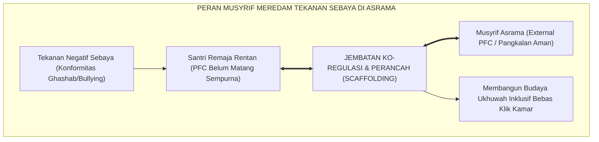

# SUB-BAB 3.4: KONFORMITAS SEBAYA & MUSYRIF SEBAGAI EXTERNAL PFC
## *Menavigasi Tekanan Teman Sebaya (Peer Pressure), Mitigasi Eksklusi Sosial, dan Peran Sentral Musyrif sebagai Perancah Ko-Regulasi*

**Kode Klasifikasi**: `BOOK-02/BAB-03/SUB-04/MONOGRAF-MASTER-VIBRANT`  
**Disiplin Ilmu**: Psikologi Sosial Remaja, Teori *Scaffolding & Co-Regulation*, & Metodologi Pengasuhan Asrama  
**Penanggung Jawab Keilmuan**: Dewan Pakar Ekosistem TUMBUH (*Pakar Sosiologi Santri & Pakar Pengasuhan Asrama*)

---

### Tirani Kelompok Sebaya dan Kebutuhan Pangkalan Rasa Aman

Di lingkungan asrama 24 jam, kelompok teman sebaya (*peer group*) memegang pengaruh sosial yang sangat dominan. 

Bagi santri remaja usia 13–16 tahun, ketakutan dikucilkan atau diejek oleh kawan sekamarnya kerap kali mendorong anak yang aslinya beradab ikut-ikutan melakukan pelanggaran aturan pondok.

Riset neurosains sosial oleh **Naomi I. Eisenberger**[^1] membuktikan bahwa rasa sakit akibat dikucilkan secara sosial (*social ostracism*) mengaktifkan sirkuit saraf *dorsal Anterior Cingulate Cortex* (dACC) di otak yang sama persis dengan luka fisik.

Ketika menghadapi badai dinamika sebaya ini, santri remaja yang Korteks Prefrontalnya belum matang membutuhkan **Musyrif Asrama sebagai "Korteks Prefrontal Eksternal (*The External Prefrontal Cortex*)"**[^2] yaitu figur dewasa yang meminjamkan ketenangan jiwanya, kejelasan pertimbangannya, dan perlindungan empatiknya.

<b>Gambar 3.4.1:</b> Fungsi Musyrif sebagai External PFC Merespons Tekanan Kelompok Sebaya.

Pakar psikologi pendidikan **Lev S. Vygotsky & Jerome Bruner**[^3] merumuskan konsep *Scaffolding*: musyrif memasang perancah aturan dan kehangatan afektif hingga santri mampu beradab mandiri secara otonom.

Pakar psikiatri anak **Desiree W. Murray**[^4] membuktikan bahwa anak tidak akan mampu melakukan regulasi diri (*self-regulation*) sebelum berulang kali merasakan pengalaman ditenangkan oleh orang dewasa yang tenang dan penuh kasih (*co-regulation*).

---

### Wawasan Turats: Kasih Sayang Pendidik Melebihi Orang Tua Kandung

**Hadhratusy Syaikh KH. M. Hasyim Asy'ari** dalam *Adab al-'Alim wal Muta'allim*[^5] menegaskan bahwa musyrif wajib memperlakukan santrinya laksana ayah yang penyayang kepada anak kandungnya: bersabar menghadapi ketidakmatangan emosi mereka dan membimbing adab mereka dengan kelembutan (*ar-Rifq*).

**Hujjatul Islam Imam Abu Hamid Al-Ghazali** dalam *Ihya' 'Ulumiddin* (Kitab *Adab al-Ulfah wal Ukhuwwah*)[^6] menggarisbawahi bahwa hak-hak persaudaraan Islam menuntut perlindungan bagi yang lemah dan penghapusan segala bentuk fanatisme kelompok yang merusak kesucian jamaah.

---

## 📌 Catatan Kaki & Rujukan Primer

[^1]: **Naomi I. Eisenberger, Matthew D. Lieberman, & Kipling D. Williams**, "Does rejection hurt? An fMRI study of social exclusion", *Science*, Vol. 302, No. 5643 (2003), hlm. 290–292.
[^2]: **Laurence Steinberg**, *Age of Opportunity: Lessons from the New Science of Adolescence* (Boston: Houghton Mifflin Harcourt, 2014), Bab 8: "The Age of Opportunity", hlm. 195–218.
[^3]: **Lev S. Vygotsky**, *Mind in Society: The Development of Higher Psychological Processes*, Ed. Michael Cole et al. (Cambridge: Harvard University Press, 1978), hlm. 79–91.
[^4]: **Desiree W. Murray, Katie Rosanbalm, & Christina Christopoulos**, *Self-Regulation and Toxic Stress: Foundations for Understanding Self-Regulation from an Applied Developmental Perspective* (Washington: OPRE Report #2015-21, U.S. Department of Health and Human Services, 2015), hlm. 12–35.
[^5]: **Hadhratusy Syaikh KH. M. Hasyim Asy'ari**, *Adab al-'Alim wal Muta'allim fi ma Yahtaju Ilayhi al-Muta'allim fi Ahwal Ta'allumihi wa ma Yatawaqqafu 'alayhi al-Mu'allim fi Maqamat Ta'limihi* (Jombang: Maktabah at-Turats al-Islami, 1415 H), Bab 1: "Fi Adab al-Mu'allim ma'a Thullabihi", hlm. 14–22.
[^6]: **Hujjatul Islam Imam Abu Hamid al-Ghazali**, *Ihya' 'Ulumiddin*, Kitab Adab al-Ulfah wal Ukhuwwah wash-Shuhbah (Kairo & Beirut: Dar al-Ma'rifah, t.th.), Jilid II, hlm. 155–182.
