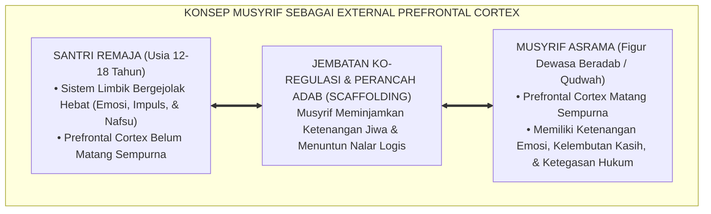
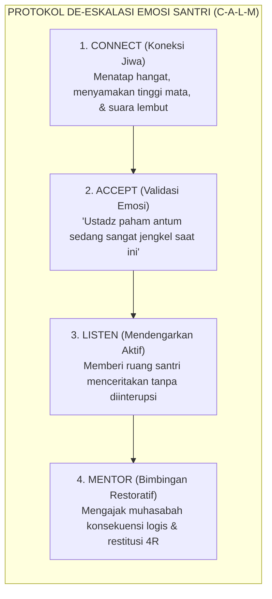

# SUB-BAB 3.5: MUSYRIF SEBAGAI EXTERNAL PFC & PERANCAH REGULASI
## *Peran Sentral Musyrif sebagai 'Korteks Prefrontal Eksternal', Teori Ko-Regulasi Emosi, dan Metodologi Scaffolding Adab*

**Kode Klasifikasi**: `BOOK-02/BAB-03/SUB-05/MONOGRAF-MASTER-VIBRANT`  
**Disiplin Ilmu**: Psikologi Pedagogi Terapan, Teori *Scaffolding & Co-Regulation*, & Metodologi Pengasuhan Islam (*In Loco Parentis*)  
**Penanggung Jawab Keilmuan**: Dewan Pakar Ekosistem TUMBUH (*Pakar Pengasuhan Asrama & Pakar Neurosains Perkembangan*)

---

### Ketika Otak Remaja Belum Mandiri: Siapakah yang Menjadi Rem Pengendali?

Sebagaimana telah dibuktikan pada Sub-Bab 3.2, wilayah *Korteks Prefrontal (PFC)* santri remaja usia 12–18 tahun masih dalam proses pematangan biologis dan belum mampu menjalankan fungsi kendali eksekutif secara mandiri.

Pertanyaan krusialnya: **ketika pedal rem biologis santri masih belum kuat, siapakah yang harus menjaga agar laju kehidupan santri tidak menabrak jurang kehancuran moral?**

Jawabannya adalah **Musyrif Asrama dan Asatidz Pengasuh**.

Dalam neurobiologi perkembangan dan psikologi pengasuhan modern, kehadiran musyrif di asrama didefinisikan sebagai **"Korteks Prefrontal Eksternal (*The External Prefrontal Cortex*)"**[^1] yaitu figur dewasa yang hadir meminjamkan kematangan akalnya, ketenangan emosinya, dan kejelasan pertimbangannya untuk membantu santri menavigasi badai emosi masa pubertas.

<b>Gambar 3.5.1:</b> Fungsi Musyrif sebagai External Prefrontal Cortex dan Jembatan Ko-Regulasi Adab.

---

### Teori Scaffolding Vygotsky & Ko-Regulasi Emosi (*Co-Regulation*)

Pakar psikologi pendidikan legendaris **Lev Vygotsky & Jerome Bruner**[^2] merumuskan konsep **Perancah Pembelajaran (*Scaffolding*)** dalam *Zone of Proximal Development* (ZPD):
* Santri tidak bisa langsung dilepas 100% mandiri untuk beradab sejak hari pertama, karena ia belum memiliki kapasitas tersebut.
* Musyrif memasang "perancah pelindung" (aturan jelas, jadwal rutin, pengingat hangat, dan kehadiran fisik).
* Seiring berjalannya waktu dan bertambahnya kapasitas regulasi diri santri menaiki Tangga T1 hingga T4, perancah tersebut perlahan-lahan dikurangi hingga santri mampu beradab secara mandiri penuh (*independent self-regulation*).

Pakar psikiatri anak **Desiree W. Murray et al.**[^3] merumuskan konsep **Ko-Regulasi (*Co-Regulation*)**: anak tidak mampu menenangkan dirinya sendiri (*self-regulation*) sebelum ia berulang kali merasakan pengalaman ditenangkan oleh orang dewasa yang penuh kasih dan tenang (*co-regulation*).

Jika musyrif merespons santri yang sedang emosi dengan ikut berteriak dan marah-marah, musyrif tersebut sedang menurunkan kapasitas otaknya setara dengan anak kecil. Sebaliknya, musyrif yang dewasa akan tetap bernafas tenang, merendahkan nada bicaranya, dan memancarkan rasa aman (*Ventral Vagal safety*) yang meredakan badai amigdala santri dalam hitungan detik.

---

### Wasiat Turats: Kasih Sayang Pendidik Melebihi Orang Tua Kandung

Kedudukan luhur musyrif sebagai perancah jiwa dan pelindung fitrah ini merupakan inti ajaran *In Loco Parentis* dalam peradaban Islam.

**Hadhratusy Syaikh KH. M. Hasyim Asy'ari** dalam *Adab al-'Alim wal Muta'allim*[^4] menuliskan wasiat agung tentang adab seorang guru terhadap muridnya:

> [!NOTE]
> ### 📜 Wasiat Hadhratusy Syaikh KH. Hasyim Asy'ari tentang Kasih Sayang Pendidik:
> 
> $$\text{يَنْبَغِي لِلْمُعَلِّمِ أَنْ يُعَامِلَ طَلَبَتَهُ بِالرِّفْقِ وَالشَّفَقَةِ، وَأَنْ يَكُونَ لَهُمْ كَالْوَالِدِ الشَّفِيقِ عَلَى وَلَدِهِ؛ يَصْبِرُ عَلَى جَفْوَتِهِمْ، وَيَعْذُرُهُمْ فِي سُوءِ أَدَبِهِمْ فِي بَعْضِ الْأَحْوَالِ، لِأَنَّ الْإِنْسَانَ مَجْبُولٌ عَلَى النَّقْصِ حَتَّى يُهَذِّبَهُ الْعِلْمُ}$$
> 
> **Artinya:**  
> *"Sepatutnya bagi seorang pendidik (musyrif) untuk memperlakukan para santrinya dengan penuh kelembutan (*ar-Rifq*) dan kasih sayang mendalam (*asy-Syafaqah*). Hendaklah ia memposisikan dirinya laksana seorang ayah yang penuh belas kasih kepada anak kandungnya: sabar menghadapi kekasaran sikap mereka, dan memaklumi kekurangan adab mereka pada sebagian keadaan; karena sesungguhnya manusia itu tercipta dalam kondisi serba kurang hingga ilmu dan tarbiyah menyempurnakan budi pekertinya."*

**Hujjatul Islam Imam Abu Hamid Al-Ghazali** dalam *Fatihatul 'Ulum*[^5] menegaskan bahwa hak seorang guru pengasuh lebih agung daripada orang tua kandung: orang tua kandung menyelamatkan anak dari api duniawi, sedangkan guru pengasuh menyelamatkan jiwa anak dari api neraka akhirat.

---

### Solusi Sistemik TUMBUH: Protokol De-eskalasi Krisis Emosi Musyrif

Di lingkungan asrama TUMBUH, musyrif dibekali keterampilan teknis **Protokol De-Eskalasi 4-Langkah (CALM Protocol)** saat menghadapi santri yang sedang mengamuk atau melanggar aturan:

<b>Gambar 3.5.2:</b> Protokol De-eskalasi Krisis Emosi Santri oleh Musyrif TUMBUH.

Dengan memahami perannya sebagai *External Prefrontal Cortex*, para musyrif asrama tidak lagi memandang kenakalan santri sebagai beban kekesalan, melainkan sebagai **ladang amal jariyah peradaban**: menuntun jiwa-jiwa muda menyeberangi jembatan pubertas dengan selamat, mengantarkan mereka menjadi pribadi muttaqin yang kokoh, mandiri, dan beradab mulia.

---

## 📌 Catatan Kaki & Rujukan Primer

[^1]: **Laurence Steinberg**, *Age of Opportunity: Lessons from the New Science of Adolescence* (Boston: Houghton Mifflin Harcourt, 2014), Bab 8: "The Age of Opportunity", hlm. 195–218.
[^2]: **Lev S. Vygotsky**, *Mind in Society: The Development of Higher Psychological Processes*, Ed. Michael Cole et al. (Cambridge: Harvard University Press, 1978), Bab 6: "Interaction Between Learning and Development", hlm. 79–91; serta **David Wood, Jerome S. Bruner, & Gail Ross**, "The role of tutoring in problem solving", *Journal of Child Psychology and Psychiatry*, Vol. 17, No. 2 (1976), hlm. 89–100.
[^3]: **Desiree W. Murray, Katie Rosanbalm, & Christina Christopoulos**, *Self-Regulation and Toxic Stress: Foundations for Understanding Self-Regulation from an Applied Developmental Perspective* (Washington: OPRE Report #2015-21, Administration for Children and Families, U.S. Department of Health and Human Services, 2015), hlm. 12–35.
[^4]: **Hadhratusy Syaikh KH. M. Hasyim Asy'ari**, *Adab al-'Alim wal Muta'allim fi ma Yahtaju Ilayhi al-Muta'allim fi Ahwal Ta'allumihi wa ma Yatawaqqafu 'alayhi al-Mu'allim fi Maqamat Ta'limihi* (Jombang: Maktabah at-Turats al-Islami, 1415 H), Bab 1: "Fi Adab al-Mu'allim ma'a Thullabihi", hlm. 14–22.
[^5]: **Hujjatul Islam Imam Abu Hamid al-Ghazali**, *Fatihatul 'Ulum* (Kairo: Al-Mathba'ah al-Husayniyyah, 1322 H), Bab 4: "Fi Adab al-Mu'allim wal Muta'allim", hlm. 45–58.
