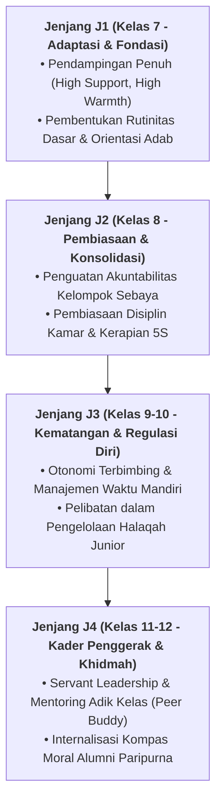

# RESILIENSI & GRIT SANTRI MENGHADAPI TARGET TAHFIZH

---
### Mengubah Kejenuhan Menjadi Ketabahan Spiritual

Menghafal Al-Qur'an dan kitab turats membutuhkan stamina kognitif tinggi. Santri dilatih memiliki *Growth Mindset* dan ketangguhan mental (*Grit*): memandang kesulitan hafalan bukan sebagai tanda kebodohan, melainkan proses pembentukan jalur sinaptik baru di otak yang bernilai pahala berlipat ganda.

#### A. Membangun Daya Tahan Mental (*Grit*) dalam Menghafal Al-Qur'an
Menghafal Al-Qur'an 30 juz menuntut stamina mental dan ketekunan luar biasa (*Mujahadah*). Sering kali santri mengalami masa jenuh (*plateau phase*) atau frustrasi ketika menghadapi ayat-ayat mutasyabihat:
1. **Prinsip *Small Wins* (Kemenangan Kecil Bertahap)**: Membagi target hafalan besar menjadi potongan-potongan kecil yang dapat dicapai setiap hari (misalnya 1 halaman atau 5 baris mutqin) untuk memicu pelepasan dopamin alami dan rasa percaya diri santri.
2. **Kultur Saling Menyimak (*Tadarus Ukhuwah*)**: Mengubah proses setoran yang menegangkan menjadi suasana kemitraan yang saling menyemangati antarsantri se-kamar.
3. **Reframing Rasa Lelah sebagai Penggugur Dosa**: Mengajarkan santri memaknai keletihan menghafal sebagai proses tazkiyatun nafs dan investasi abadi di akhirat, bukan beban kompetisi ranking.

#### B. Protokol Musyrif Mengatasi Kejenuhan Santri
* Sediakan jeda aktif (*Active Recovery*) seperti olahraga memanah, renang, atau rihlah alam terbuka di akhir pekan saat target mingguan tercapai.
* Larang keras hukuman berdiri berjam-jam saat setoran belum lancar; gantikan dengan pendampingan sorogan reflektif yang sabar.

---

### IV. Pembedahan Kapasitas Lanjutan & Trajektori Progresi Resiliensi & Grit Santri Menghadapi Target Tahfizh

Pengembangan kompetensi **RESILIENSI & GRIT SANTRI MENGHADAPI TARGET TAHFIZH** pada santri memerlukan strategi diferensiasi yang selaras dengan tahapan usia perkembangan remaja (*Developmental Milestones*):

1. **Dekomposisi Indikator Kematangan Perilaku**:
   Untuk memastikan karakter **RESILIENSI & GRIT SANTRI MENGHADAPI TARGET TAHFIZH** tertanam secara operasional, dewan asatidz dan musyrif memetakan indikator perilakunya ke dalam 3 ranah capaian:
   * **Ranah Kognitif-Reflektif (*Ma'rifah*)**: Santri memahami dalil syar'i, urgensi akhlak, dan konsekuensi logis dari setiap pilihannya.
   * **Ranah Afektif-Ruhiyyah (*Wijdan*)**: Tumbuhnya kepekaan nurani, rasa malu berbuat dosa (*Haya'*), dan kenikmatan dalam berbuat kebajikan.
   * **Ranah Psikomotorik-Habituasi (*'Amal*)**: Terwujudnya keterampilan bertindak nyata secara spontan, konsisten, dan mandiri tanpa perlu disuruh.

2. **Matriks Penahapan Lintas Jenjang Kemandirian (J1–J4)**:

3. **Rubrik Evaluasi Kualitatif & Indikator Pencapaian**:

| Level Kemandirian | Karakteristik Perilaku Teramati (*Behavioral Anchor*) | Pendekatan Bimbingan Musyrif |
| :--- | :--- | :--- |
| **Level 1 (Emerging)** | Memerlukan instruksi berulang dan pengawasan langsung musyrif. | *Direct Prompting* & pengingat visual harian. |
| **Level 2 (Developing)** | Mampu menjalankan adab saat diingatkan oleh teman sebaya. | Penguatan positif melalui pujian deskriptif. |
| **Level 3 (Proficient)** | Menjalankan adab secara mandiri dan konsisten tanpa diawasi. | Pemberian kepercayaan dan peran tanggung jawab kamar. |
| **Level 4 (Exemplary)** | Menjadi teladan (*Qudwah*) dan mampu membimbing kawan-kawannya. | Pelibatan aktif dalam struktur Dewan Santri & Mentor. |

---

### V. Panduan Praksis Pendampingan Musyrif di Asrama

Agar penanaman **RESILIENSI & GRIT SANTRI MENGHADAPI TARGET TAHFIZH** berhasil maksimal di lapangan, musyrif disarankan menerapkan protokol pendampingan berikut:
* **Fokus pada Usaha (*Effort-Oriented Praise*)**: Berikan apresiasi atas proses perjuangan santri dalam memperbaiki diri, bukan semata-mata hasil akhir yang sempurna.
* **Dialog Sokratik Saat Santri Mengalami Kesulitan**: Ajukan pertanyaan reflektif seperti: *"Apa yang membuat antum merasa berat menjalankan adab ini hari ini? Bagaimana kita bisa mengatasinya bersama besok?"*
* **Menjaga Iklim Ukhuwah Bebas Perundungan**: Pastikan senioritas dimaknai sebagai amanah pengayoman dan perlindungan kepada yang lebih muda, bukan hak istimewa untuk memerintah.
