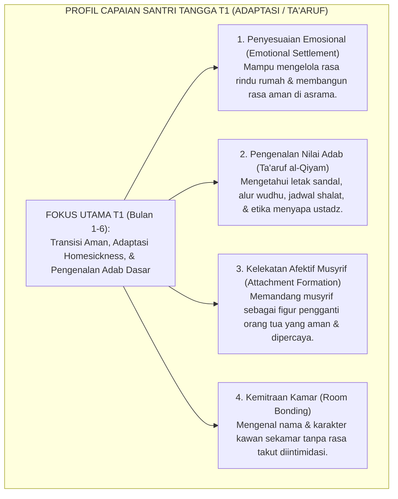
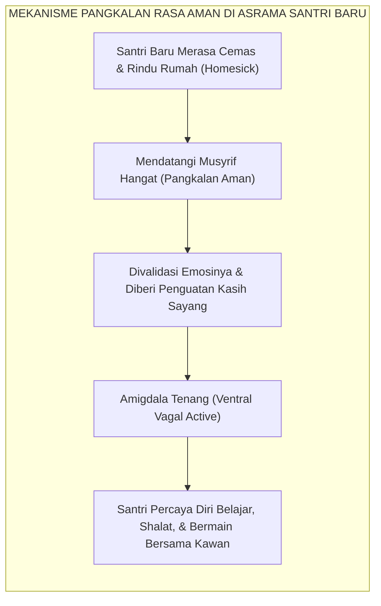

# TANGGA T1 — ADAPTASI (TA'ARUF) & HOMESICKNESS

---

### 🧭 PETA POSISI PANDUAN DALAM SISTEM TUMBUH (DARI HULU KE HILIR)
* **Posisi Arsitektur**: `BATANG EKOSISTEM I (Taksonomi 10 Muwashafat Adab & Tangga Kemandirian J1–J4)`
* **Peruntukan Pengguna**: Wali Kelas, Musyrif Kamar, Guru Pengampu Adab, & Mentor Santri
* **Fokus Panduan**: Memandu tahapan penanaman 10 Karakter Adab Nabawi dari fase Adaptasi (J1), Pembiasaan (J2), Kematangan (J3), hingga Kader Penggerak (J4/Tahap 7).
* **Hasil Akhir yang Dituju**: Terwujudnya santri berkarakter *Insan Adabi* yang mandiri, musyrif yang mengasuh dengan kasih sayang tanpa *burnout*, dan pesantren yang aman berbasis data (*Safe Boarding School*).

---

### 🎯 Mengapa Panduan Ini Ada & Masalah Nyata yang Dipecahkan
1. **Latar Masalah di Lapangan**: Sering kali pengasuhan di pesantren berjalan tanpa SOP yang jelas atau terjebak dalam pola reaktif—menunggu santri berbuat salah baru dihukum dengan emosional.
2. **Solusi Sistem TUMBUH**: Panduan ini memberikan langkah preventif dan terstruktur agar setiap pembiasaan adab berjalan terencana, konsisten, dan terukur.
3. **Sasaran Perubahan**: Memastikan nilai-nilai Islam menyatu dalam perilaku harian santri melalui keteladanan nyata (*Qudwah Hasanah*).

---
### 🎯 Tujuan & Manfaat Panduan
Panduan ini dirancang sebagai petunjuk operasional terapan agar pendidik dan musyrif dapat:
1. Menjalankan pembinaan adab santri dengan pendekatan kasih sayang (*Rahmah*) dan ketegasan yang mendidik (*Firm & Kind*).
2. Menghindari cara-cara kekerasan fisik, bentakan verbal, maupun hukuman yang mempermalukan santri.
3. Menciptakan suasana asrama dan kelas yang aman, tertib, dan menumbuhkan kesadaran diri (*Bi'ah Shalihah*).

---

### 💡 Intisari Cepat (3 Menit Memahami Esensi)
* **Kunci Pengasuhan**: Karakter santri tumbuh melalui keteladanan nyata (*Qudwah Hasanah*), komunikasi empatik, dan pembiasaan terstruktur 24 jam.
* **Tindakan Utama**: Terapkan panduan langkah demi langkah di bawah ini secara konsisten, pantau perkembangan santri secara objektif, dan berikan apresiasi atas setiap perbaikan diri yang mereka capai.
* **Prinsip Disiplin**: Fokus pada pemulihan hubungan dan tanggung jawab nyata (*Restoratif*), bukan sekadar melampiaskan amarah atau menghukum.

---

---

### 💬 ILUSTRASI NYATA & ANALOGI SEDERHANA
Bayangkan sebuah skenario yang sering kita lihat sehari-hari di asrama:
* Ketika seorang santri baru melakukan kekeliruan (misalnya terlambat bangun Subuh atau kasurnya berantakan), respon pertama yang sering muncul adalah bentakan keras atau hukuman fisik (seperti push-up atau jemur di lapangan).
* **Hasilnya?** Santri tersebut mungkin tampak patuh seketika karena takut, tetapi di dalam hatinya tumbuh rasa dongkol, dendam tersembunyi, atau kebiasaan "bersandiwara"—hanya tertib ketika ada pengawas di dekatnya.

Dalam Sistem TUMBUH, kita menggunakan cara yang jauh lebih cerdas, sejuk, dan membumi:
1. **Analogi "Rem dan Pedal Gas Otak"**: Santri usia remaja (usia MTs dan Aliyah) memiliki bagian otak emosi (*Sistem Limbik*) yang sudah menyala sangat kuat seperti *pedal gas mobil sport*, namun otak pengendali logikanya (*Prefrontal Cortex*) masih dalam proses tumbuh seperti *sistem rem yang baru dipasang*. Tugas guru dan musyrif bukan memarahi mobilnya, melainkan menjadi **"Sopir Teladan & Sabuk Pengaman"** yang mendampingi santri belajar menginjak rem dengan bijak.
2. **Kekuatan Contoh Nyata (*Qudwah Hasanah*)**: Santri jauh lebih cepat meniru apa yang mereka **lihat** setiap hari daripada apa yang mereka **dengar** dari ribuan nasihat panjang. Jika musyrif datang tepat waktu, tersenyum ramah, dan kamarnya rapi, santri akan menirunya dengan sukarela.

---

### 🛠️ PANDUAN LANGKAH PRAKTIS LAPANGAN (BISA LANGSUNG DIPRAKTIKKAN HARI INI)

| Tahapan Aksi | Tindakan Nyata Musyrif / Guru di Lapangan | Hal yang Harus Diperhatikan |
| :--- | :--- | :--- |
| **1. Langkah Persiapan (Sebelum Kejadian)** | Sepakati aturan bersama santri di awal pekan dengan kalimat positif (contoh: *"Kamar rapi membuat istirahat kita berkah"*). | Buat poster visual sederhana yang mudah dibaca di dinding kamar. |
| **2. Langkah Respon (Saat Terjadi Masalah)** | Tarik napas, tenangkan diri, ajak santri berbicara empat mata tanpa mempermalukannya di depan teman-temannya. | Gunakan nada bicara yang tenang namun tegas (*Firm & Kind*). |
| **3. Langkah Perbaikan (Tanggung Jawab Nyata)** | Minta santri memperbaiki kesalahannya secara langsung (contoh: merapikan kembali barang yang berantakan atau meminta maaf). | Berikan apresiasi seketika santri telah menuntaskan perbaikannya. |

---

### 🗣️ CONTOH DIALOG LAPANGAN (YANG HARUS DIUCAPKAN VS DIHINDARI)

* ❌ **JANGAN UCAPKAN (Membuat Santri Menutup Diri & Dendam)**:
  > *"Kamu ini pemalas sekali ya, sudah dibilangi berkali-kali masih saja kasur berantakan! Push-up 50 kali sekarang!"*
* ✅ **UCAPKAN INI (Mendidik Tanggung Jawab & Kesadaran Diri)**:
  > *"Akhi, antum tahu kesepakatan kamar kita tentang kerapian tempat tidur setelah Subuh. Coba lihat kasur antum sekarang, apa yang perlu disempurnakan? Mari rapikan bersama sekarang agar kamar kita nyaman dan berkah."*

---

### 📋 3 POIN EMAS RANGKUMAN (UNTUK SANTRI SENIOR & MUSYRIF MUDA)
1. **Didik dengan Kasih Sayang, Tegakkan Batas dengan Adil**: Jangan pernah mencampuradukkan ketegasan aturan dengan pelampiasan amarah pribadi.
2. **Apresiasi 4x Lebih Banyak daripada Teguran (*Magic Ratio 4:1*)**: Jangan hanya bersuara ketika santri berbuat salah. Saat mereka berbuat baik (salat di shaf depan, menolong kawan, membaca Al-Qur'an), segera berikan pujian tulus.
3. **Fokus pada Perbaikan Hubungan (*Restoratif*)**: Masalah perilaku adalah peluang emas untuk mendidik santri menjadi pribadi yang lebih dewasa dan bertanggung jawab.

---

### 📖 Uraian Lengkap Landasan & Rujukan Sistem

---

### Tangga Pertama: Gerbang Paling Rentan dalam Kehidupan Santri

Dalam arsitektur progresi karakter Ekosistem TUMBUH, **Jenjang J1 (Adaptasi / *Ta'aruf*)** menaungi santri pada **6 bulan pertama** kehidupannya di pondok pesantren.

Fase ini adalah fase paling rentan (*the most vulnerable phase*):
* Lebih dari 85% santri baru mengalami sindrom kerinduan rumah (*Homesickness*) tingkat sedang hingga berat.
* Santri mengalami disorientasi ruang, kejutan budaya (*culture shock*), dan kecemasan perpisahan (*separation anxiety*) dari orang tua.
* Jika fase T1 ini tidak didampingi dengan kehangatan afektif yang tepat, santri berisiko mengalami trauma psikologis, mogok makan, jatuh sakit, hingga kabur dari pondok pesantren.

<b>Gambar 4.1.1:</b> Peta Capaian Karakter Santri pada Jenjang J1 (Adaptasi / Ta'aruf).

Pakar psikologi klinis anak **Christopher A. Thurber**[^1] membuktikan bahwa kerinduan rumah (*homesickness*) bukanlah sekadar "cengeng", melainkan respons duka normal (*normative grief response*) akibat hilangnya rasa aman primer. Pendekatan yang efektif bukanlah mencemooh anak, melainkan membangun rasa kelekatan baru di lingkungan institusi.

---

### Teori Kelekatan John Bowlby: Musyrif sebagai Pangkalan Rasa Aman (*Secure Base*)

Pakar psikologi perkembangan terkemuka **John Bowlby**[^2] dalam *Attachment Theory* merumuskan bahwa anak hanya akan mampu mengeksplorasi lingkungan baru dan belajar dengan optimal apabila ia memiliki **"Pangkalan Rasa Aman (*Secure Base*)"**:

<b>Gambar 4.1.2:</b> Alur Pembentukan Kelekatan Aman Santri Baru dengan Musyrif Asrama.

Di asrama TUMBUH, musyrif hadir sebagai pangkalan aman:
* Musyrif mendengarkan tangisan rindu santri baru tanpa menghakimi: *"Wajar antum kangen Ummi, Nak. Ustadz di sini menemani antum, insya Allah kita berjuang bersama."*
* Sentuhan fisik yang santun (menepuk pundak dengan hangat) dan senyuman tulus menstimulasi pelepasan hormon *oksitosin* yang meredakan rasa cemas anak.

---

### Integrasi Turats: Konsep *Ta'aruf* & *Ta'lif al-Qulub* Ulama Salaf

Pendekatan adaptasi berbasis kelembutan ini selaras dengan prinsip dakwah dan tarbiyah nabawiyyah.

**Hujjatul Islam Imam Abu Hamid Al-Ghazali** dalam *Ayyuhal Walad*[^3] mengingatkan bahwa penuntut ilmu pemula laksana tunas tanaman yang baru dipindahkan ke tanah baru; ia membutuhkan siraman air yang lembut dan naungan dari terik matahari yang menyengat agar akarnya tidak layu.

Pendiri Gontor **KH. Imam Zarkasyi**[^4] menetapkan masa perkenalan santri baru (*Pekan Perkenalan Khutbatul 'Arsy*) sebagai masa paling sakral: santri tidak boleh dibebani hukuman berat, melainkan diperkenalkan pada keindahan nilai pondok dengan riang gembira.

---

### Solusi Sistemik TUMBUH: Protokol 30 Hari Pertama Penanganan Homesickness

Sistem TUMBUH merancang **Protokol 30 Hari Transisi Emas (*Golden Transition Protocol*)**:
1. **Zero Punitive Zone**: Selama 30 hari pertama, santri di tangga T1 tidak dikenakan konsekuensi pelanggaran berat. Setiap kesalahan adab diposisikan sebagai peluang edukasi langsung (*immediate instructional coaching*).
2. **Jadwal Telepon Terjadwal & Hangat**: Memfasilitasi komunikasi suara dengan orang tua secara teratur dengan pendampingan musyrif untuk menjaga kestabilan emosi anak.
3. **Malam Keakraban Kamar (*Baituna Jannatuna Night*)**: Setiap malam Ahad diadakan makan bersama dan permainan kelompok di dalam kamar untuk mempercepat perekatan persaudaraan antarsantri baru.

Dengan tuntasnya Jenjang J1, santri telah berhasil melintasi masa krisis adaptasi, siap melangkah mantap menaiki **Jenjang J2 (Habituasi / Ta'awun)**.

---

## 📌 Catatan Kaki & Rujukan Primer

[^1]: **Christopher A. Thurber & Edward A. Walton**, "Preventing and treating homesickness", *Pediatrics*, Vol. 119, No. 1 (2007), hlm. 192–201; serta **Christopher A. Thurber**, *The Secret Ingredients of Summer Camp: How to Have the Most Fun, Make the Best Friends, and Learn the Coolest Things* (New York: CampSpirit, 2011).
[^2]: **John Bowlby**, *Attachment and Loss: Vol. 1. Attachment* (New York: Basic Books, 1969; Edisi ke-2, 1982), Bab 11: "The Child's Tie to His Mother: Attachment Behavior", hlm. 177–209.
[^3]: **Hujjatul Islam Imam Abu Hamid al-Ghazali**, *Ayyuhal Walad fi Nashihat at-Talamidz*, Tahqiq: Dr. Ahmad Ahmad Badawi (Kairo: Dar al-Qalam, 1986), hlm. 18–32.
[^4]: **K.H. Imam Zarkasyi**, *Pondok Pesantren sebagai Lembaga Pendidikan Karakter dan Pencetak Kader Umat* (Ponorogo: Gontor Press, 1988), hlm. 40–62.
