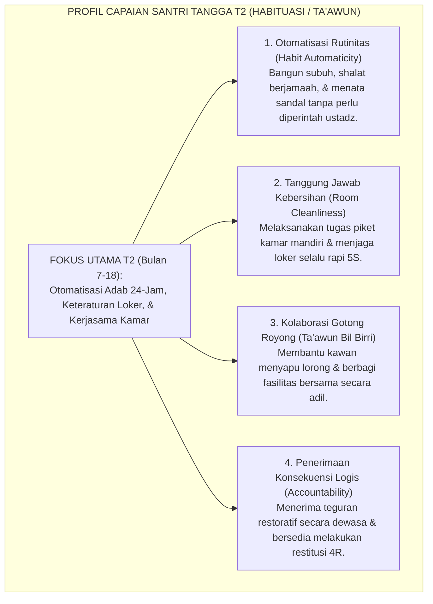
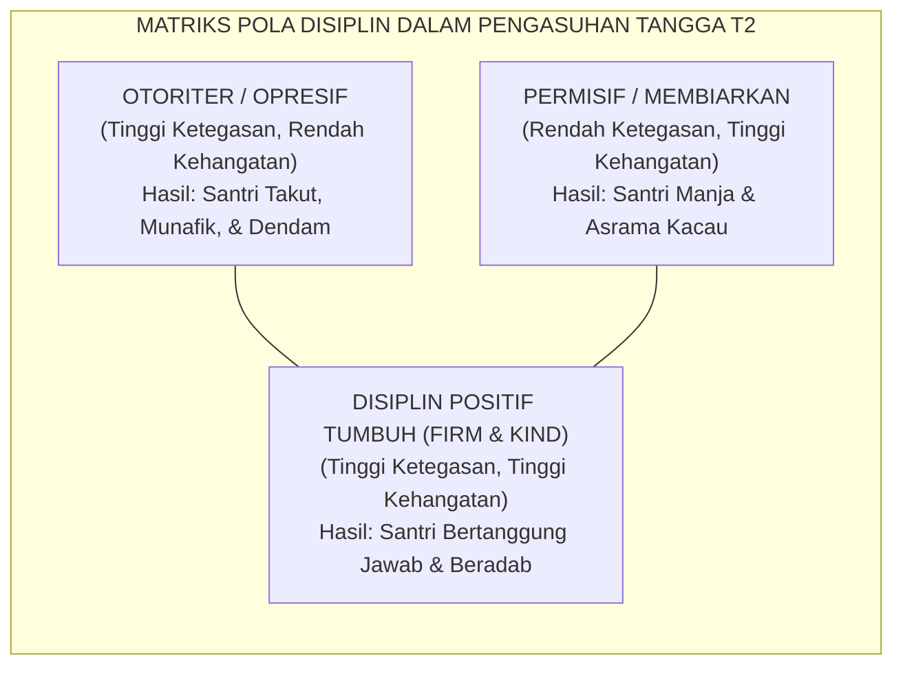

# TANGGA T2 — HABITUASI (TA'AWUN) & PEMBIASAAN 24-JAM

---

### 🧭 PETA POSISI PANDUAN DALAM SISTEM TUMBUH (DARI HULU KE HILIR)
* **Posisi Arsitektur**: `BATANG EKOSISTEM I (Taksonomi 10 Muwashafat Adab & Tangga Kemandirian J1–J4)`
* **Peruntukan Pengguna**: Wali Kelas, Musyrif Kamar, Guru Pengampu Adab, & Mentor Santri
* **Fokus Panduan**: Memandu tahapan penanaman 10 Karakter Adab Nabawi dari fase Adaptasi (J1), Pembiasaan (J2), Kematangan (J3), hingga Kader Penggerak (J4/Tahap 7).
* **Hasil Akhir yang Dituju**: Terwujudnya santri berkarakter *Insan Adabi* yang mandiri, musyrif yang mengasuh dengan kasih sayang tanpa *burnout*, dan pesantren yang aman berbasis data (*Safe Boarding School*).

---

### 🎯 Mengapa Panduan Ini Ada & Masalah Nyata yang Dipecahkan
1. **Latar Masalah di Lapangan**: Sering kali pengasuhan di pesantren berjalan tanpa SOP yang jelas atau terjebak dalam pola reaktif—menunggu santri berbuat salah baru dihukum dengan emosional.
2. **Solusi Sistem TUMBUH**: Panduan ini memberikan langkah preventif dan terstruktur agar setiap pembiasaan adab berjalan terencana, konsisten, dan terukur.
3. **Sasaran Perubahan**: Memastikan nilai-nilai Islam menyatu dalam perilaku harian santri melalui keteladanan nyata (*Qudwah Hasanah*).

---
### 🎯 Tujuan & Manfaat Panduan
Panduan ini dirancang sebagai petunjuk operasional terapan agar pendidik dan musyrif dapat:
1. Menjalankan pembinaan adab santri dengan pendekatan kasih sayang (*Rahmah*) dan ketegasan yang mendidik (*Firm & Kind*).
2. Menghindari cara-cara kekerasan fisik, bentakan verbal, maupun hukuman yang mempermalukan santri.
3. Menciptakan suasana asrama dan kelas yang aman, tertib, dan menumbuhkan kesadaran diri (*Bi'ah Shalihah*).

---

### 💡 Intisari Cepat (3 Menit Memahami Esensi)
* **Kunci Pengasuhan**: Karakter santri tumbuh melalui keteladanan nyata (*Qudwah Hasanah*), komunikasi empatik, dan pembiasaan terstruktur 24 jam.
* **Tindakan Utama**: Terapkan panduan langkah demi langkah di bawah ini secara konsisten, pantau perkembangan santri secara objektif, dan berikan apresiasi atas setiap perbaikan diri yang mereka capai.
* **Prinsip Disiplin**: Fokus pada pemulihan hubungan dan tanggung jawab nyata (*Restoratif*), bukan sekadar melampiaskan amarah atau menghukum.

---

---

### 💬 ILUSTRASI NYATA & ANALOGI SEDERHANA
Bayangkan sebuah skenario yang sering kita lihat sehari-hari di asrama:
* Ketika seorang santri baru melakukan kekeliruan (misalnya terlambat bangun Subuh atau kasurnya berantakan), respon pertama yang sering muncul adalah bentakan keras atau hukuman fisik (seperti push-up atau jemur di lapangan).
* **Hasilnya?** Santri tersebut mungkin tampak patuh seketika karena takut, tetapi di dalam hatinya tumbuh rasa dongkol, dendam tersembunyi, atau kebiasaan "bersandiwara"—hanya tertib ketika ada pengawas di dekatnya.

Dalam Sistem TUMBUH, kita menggunakan cara yang jauh lebih cerdas, sejuk, dan membumi:
1. **Analogi "Rem dan Pedal Gas Otak"**: Santri usia remaja (usia MTs dan Aliyah) memiliki bagian otak emosi (*Sistem Limbik*) yang sudah menyala sangat kuat seperti *pedal gas mobil sport*, namun otak pengendali logikanya (*Prefrontal Cortex*) masih dalam proses tumbuh seperti *sistem rem yang baru dipasang*. Tugas guru dan musyrif bukan memarahi mobilnya, melainkan menjadi **"Sopir Teladan & Sabuk Pengaman"** yang mendampingi santri belajar menginjak rem dengan bijak.
2. **Kekuatan Contoh Nyata (*Qudwah Hasanah*)**: Santri jauh lebih cepat meniru apa yang mereka **lihat** setiap hari daripada apa yang mereka **dengar** dari ribuan nasihat panjang. Jika musyrif datang tepat waktu, tersenyum ramah, dan kamarnya rapi, santri akan menirunya dengan sukarela.

---

### 🛠️ PANDUAN LANGKAH PRAKTIS LAPANGAN (BISA LANGSUNG DIPRAKTIKKAN HARI INI)

| Tahapan Aksi | Tindakan Nyata Musyrif / Guru di Lapangan | Hal yang Harus Diperhatikan |
| :--- | :--- | :--- |
| **1. Langkah Persiapan (Sebelum Kejadian)** | Sepakati aturan bersama santri di awal pekan dengan kalimat positif (contoh: *"Kamar rapi membuat istirahat kita berkah"*). | Buat poster visual sederhana yang mudah dibaca di dinding kamar. |
| **2. Langkah Respon (Saat Terjadi Masalah)** | Tarik napas, tenangkan diri, ajak santri berbicara empat mata tanpa mempermalukannya di depan teman-temannya. | Gunakan nada bicara yang tenang namun tegas (*Firm & Kind*). |
| **3. Langkah Perbaikan (Tanggung Jawab Nyata)** | Minta santri memperbaiki kesalahannya secara langsung (contoh: merapikan kembali barang yang berantakan atau meminta maaf). | Berikan apresiasi seketika santri telah menuntaskan perbaikannya. |

---

### 🗣️ CONTOH DIALOG LAPANGAN (YANG HARUS DIUCAPKAN VS DIHINDARI)

* ❌ **JANGAN UCAPKAN (Membuat Santri Menutup Diri & Dendam)**:
  > *"Kamu ini pemalas sekali ya, sudah dibilangi berkali-kali masih saja kasur berantakan! Push-up 50 kali sekarang!"*
* ✅ **UCAPKAN INI (Mendidik Tanggung Jawab & Kesadaran Diri)**:
  > *"Akhi, antum tahu kesepakatan kamar kita tentang kerapian tempat tidur setelah Subuh. Coba lihat kasur antum sekarang, apa yang perlu disempurnakan? Mari rapikan bersama sekarang agar kamar kita nyaman dan berkah."*

---

### 📋 3 POIN EMAS RANGKUMAN (UNTUK SANTRI SENIOR & MUSYRIF MUDA)
1. **Didik dengan Kasih Sayang, Tegakkan Batas dengan Adil**: Jangan pernah mencampuradukkan ketegasan aturan dengan pelampiasan amarah pribadi.
2. **Apresiasi 4x Lebih Banyak daripada Teguran (*Magic Ratio 4:1*)**: Jangan hanya bersuara ketika santri berbuat salah. Saat mereka berbuat baik (salat di shaf depan, menolong kawan, membaca Al-Qur'an), segera berikan pujian tulus.
3. **Fokus pada Perbaikan Hubungan (*Restoratif*)**: Masalah perilaku adalah peluang emas untuk mendidik santri menjadi pribadi yang lebih dewasa dan bertanggung jawab.

---

### 📖 Uraian Lengkap Landasan & Rujukan Sistem

---

### Memasuki Tangga Kedua: Dari Adaptasi Menuju Otomatisasi Karakter

Setelah santri berhasil melampaui fase adaptasi awal dan merasa aman di lingkungan pondok, santri melangkah menaiki **Jenjang J2 (Habituasi / *Ta'awun*)** yang berlangsung pada **bulan ke-7 hingga bulan ke-18** (Tahun Pertama Semester 2 hingga Tahun Kedua).

Fokus utama pada Jenjang J2 adalah **Habituasi dan Kolaborasi**:
* Nilai-nilai adab yang sebelumnya masih dilakukan dengan rasa canggung kini dilatihkan secara konsisten hingga menjadi **kebiasaan bawah sadar (*automated habits*)**.
* Interaksi santri diperluas dari sekadar menjaga diri sendiri menjadi **mampu bekerja sama dan bergotong royong (*Ta'awun*)** bersama seluruh warga kamar dan asrama.

<b>Gambar 4.2.1:</b> Peta Capaian Karakter Santri pada Jenjang J2 (Habituasi / Ta'awun).

Pakar psikologi perilaku **Phillippa Lally et al.**[^1] membuktikan bahwa pembentukan kebiasaan otomatis (*automaticity*) membutuhkan waktu rata-rata 66 hari pengulangan harian yang konsisten dalam lingkungan yang stabil. Jenjang J2 memberikan ruang waktu yang cukup agar jalur mielin adab santri terbentuk kokoh.

---

### Disiplin Positif Jane Nelsen: Menguatkan Jenjang J2 Tanpa Friksi

Pada tangga T2, santri mulai diuji oleh rasa bosan dan kejenuhan rutinitas asrama. Di sinilah banyak pembina terjebak kembali pada cara lama: menggunakan bentakan dan hukuman fisik.

Sistem TUMBUH menegakkan prinsip **Disiplin Positif (*Positive Discipline*)** yang dirumuskan oleh **Jane Nelsen**[^2] yaitu prinsip **Tegas sekaligus Hangat (*Firm and Kind*)**:
* **Tegas (*Firm*)**: Menghormati aturan dan kebutuhan lingkungan; standar adab tidak diturunkan.
* **Hangat (*Kind*)**: Menghormati martabat anak; teguran dilayangkan dengan nada tenang tanpa mempermalukan santri di depan kawan-kawannya.

<b>Gambar 4.2.2:</b> Posisi Disiplin Positif Firm & Kind Ekosistem TUMBUH.

---

### Integrasi Turats: Konsep *Ta'awun 'alal Birri wat-Taqwa*

Fondasi kolaborasi kamar pada Jenjang J2 berakar pada perintah Allah SWT dalam Al-Qur'an:
$$\text{وَتَعَاوَنُوا عَلَى الْبِرِّ وَالتَّقْوَىٰ ۖ وَلَا تَعَاوَنُوا عَلَى الْإِثْمِ وَالْعُدْوَانِ}$$
*"Dan tolong-menolonglah kamu dalam mengerjakan kebajikan dan takwa, dan jangan tolong-menolong dalam berbuat dosa dan permusuhan!"* (QS. Al-Ma'idah: 2).

**Al-Imam Abu Ishaq asy-Syathibi** dalam *Al-Muwafaqat*[^3] menjelaskan bahwa taklif kemaslahatan syariat tidak dapat ditegakkan oleh individu yang menyendiri, melainkan membutuhkan jalinan tolong-menolong (*at-Ta'awun al-Ijtima'i*) di antara sesama warga mukmin.

**Hujjatul Islam Imam Abu Hamid Al-Ghazali** dalam *Ihya' 'Ulumiddin* (Kitab *Riyadhatin Nafs*)[^4] menegaskan bahwa tahapan *al-I'tiyad* (pembiasaan) membutuhkan kesabaran pendampingan hingga perbuatan baik yang tadinya terasa berat berubah menjadi tabiat alami yang terasa nikmat.

---

### Solusi Sistemik TUMBUH: Sistem Poin Apresiasi Kamar (*Room Positive Reinforcement*)

Di asrama TUMBUH, keberhasilan Jenjang J2 didukung oleh:
1. **Inspeksi Kamar Terbuka (*Adab Clean Room Audit*)**: Setiap pagi kamar dinilai berdasarkan standar kebersihan 5S; kamar yang paling tertib mendapatkan piala bergilir kamar teladan.
2. **Penerapan Rasio Apresiasi Relasional 4:1**: Musyrif memberikan 4 apresiasi verbal tulus atas usaha kebaikan santri sebelum melayangkan 1 koreksi perbaikan.
3. **Piket Kamar Terjadwal & Rotatif**: Setiap santri bertanggung jawab membersihkan area spesifik (lantai, jendela, rak sandal, tempat sampah) secara bergilir.

Santri di tangga T2 telah membiasakan adab dalam ritme fisiknya: mereka tertib, bersih, dan mampu bekerja sama secara harmonis di dalam kamar asrama.

---

## 📌 Catatan Kaki & Rujukan Primer

[^1]: **Phillippa Lally, Cornelia H. M. van Jaarsveld, Henry W. W. Potts, & Jane Wardle**, "How are habits formed: Modelling habit formation in the real world", *European Journal of Social Psychology*, Vol. 40, No. 6 (2010), hlm. 998–1009.
[^2]: **Jane Nelsen, Lynn Lott, & H. Stephen Glenn**, *Positive Discipline in the Classroom: Developing Mutual Respect, Cooperation, and Responsibility in Your Classroom* (New York: Harmony Books / Random House, 2000; Edisi ke-4, 2013), Bab 1: "The Positive Discipline Class", hlm. 1–28.
[^3]: **Al-Imam Abu Ishaq Ibrahim asy-Syathibi**, *Al-Muwafaqat fi Ushul asy-Syari'ah*, Tahqiq: Syaikh Masyhur Hasan Salman (Kairo: Dar Ibn Affan, 1997), Jilid II, hlm. 112–135.
[^4]: **Hujjatul Islam Imam Abu Hamid al-Ghazali**, *Ihya' 'Ulumiddin*, Kitab Riyadhatin Nafs wa Tahdzibil Akhlaq (Kairo & Beirut: Dar al-Ma'rifah, t.th.), Jilid III, hlm. 62–74.
