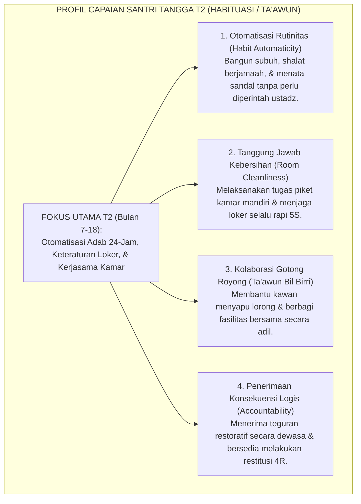
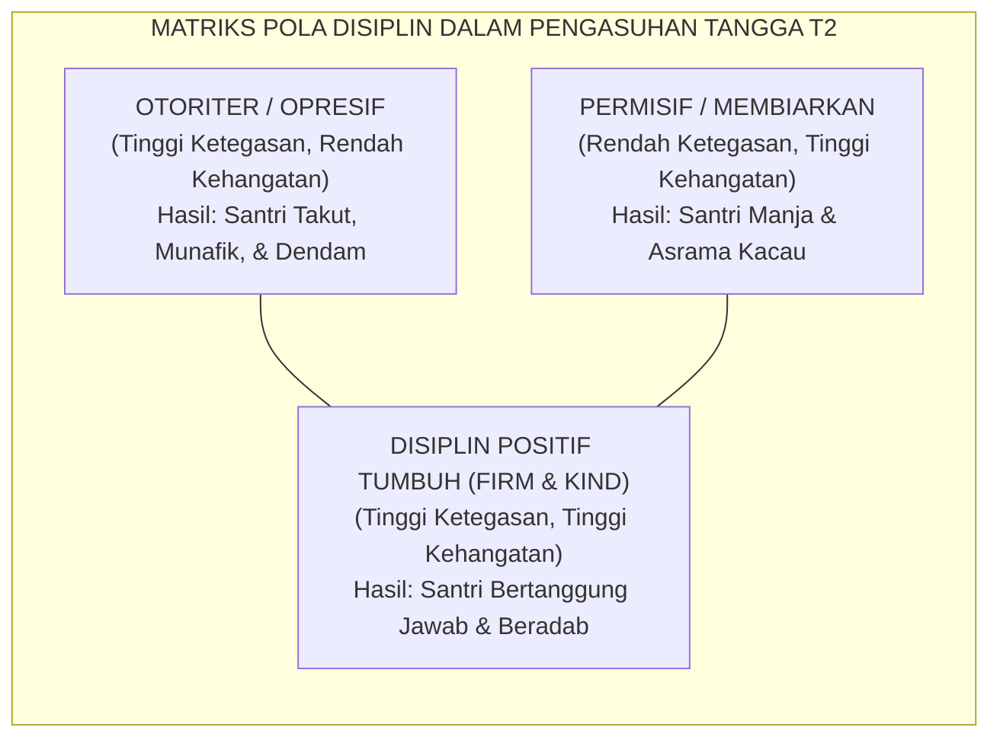
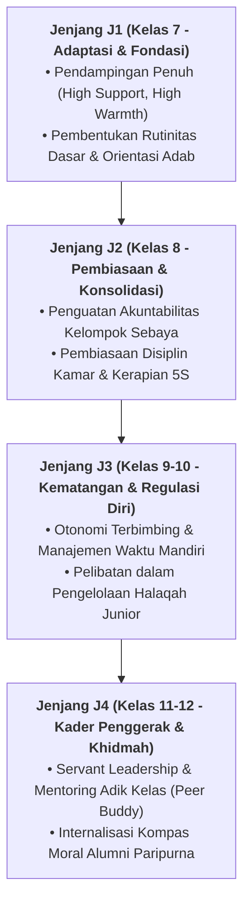

# TANGGA T2 — HABITUASI (TA'AWUN) & PEMBIASAAN 24-JAM

---
### Memasuki Tangga Kedua: Dari Adaptasi Menuju Otomatisasi Karakter

Setelah santri berhasil melampaui fase adaptasi awal dan merasa aman di lingkungan pondok, santri melangkah menaiki **Jenjang J2 (Habituasi / *Ta'awun*)** yang berlangsung pada **bulan ke-7 hingga bulan ke-18** (Tahun Pertama Semester 2 hingga Tahun Kedua).

Fokus utama pada Jenjang J2 adalah **Habituasi dan Kolaborasi**:
* Nilai-nilai adab yang sebelumnya masih dilakukan dengan rasa canggung kini dilatihkan secara konsisten hingga menjadi **kebiasaan bawah sadar (*automated habits*)**.
* Interaksi santri diperluas dari sekadar menjaga diri sendiri menjadi **mampu bekerja sama dan bergotong royong (*Ta'awun*)** bersama seluruh warga kamar dan asrama.

<b>Gambar 4.2.1:</b> Peta Capaian Karakter Santri pada Jenjang J2 (Habituasi / Ta'awun).

Pakar psikologi perilaku **Phillippa Lally et al.**[^1] membuktikan bahwa pembentukan kebiasaan otomatis (*automaticity*) membutuhkan waktu rata-rata 66 hari pengulangan harian yang konsisten dalam lingkungan yang stabil. Jenjang J2 memberikan ruang waktu yang cukup agar jalur mielin adab santri terbentuk kokoh.

---

### Disiplin Positif Jane Nelsen: Menguatkan Jenjang J2 Tanpa Friksi

Pada tangga T2, santri mulai diuji oleh rasa bosan dan kejenuhan rutinitas asrama. Di sinilah banyak pembina terjebak kembali pada cara lama: menggunakan bentakan dan hukuman fisik.

Sistem TUMBUH menegakkan prinsip **Disiplin Positif (*Positive Discipline*)** yang dirumuskan oleh **Jane Nelsen**[^2] yaitu prinsip **Tegas sekaligus Hangat (*Firm and Kind*)**:
* **Tegas (*Firm*)**: Menghormati aturan dan kebutuhan lingkungan; standar adab tidak diturunkan.
* **Hangat (*Kind*)**: Menghormati martabat anak; teguran dilayangkan dengan nada tenang tanpa mempermalukan santri di depan kawan-kawannya.

<b>Gambar 4.2.2:</b> Posisi Disiplin Positif Firm & Kind Ekosistem TUMBUH.

---

### Integrasi Turats: Konsep *Ta'awun 'alal Birri wat-Taqwa*

Fondasi kolaborasi kamar pada Jenjang J2 berakar pada perintah Allah SWT dalam Al-Qur'an:
$$\text{وَتَعَاوَنُوا عَلَى الْبِرِّ وَالتَّقْوَىٰ ۖ وَلَا تَعَاوَنُوا عَلَى الْإِثْمِ وَالْعُدْوَانِ}$$
*"Dan tolong-menolonglah kamu dalam mengerjakan kebajikan dan takwa, dan jangan tolong-menolong dalam berbuat dosa dan permusuhan!"* (QS. Al-Ma'idah: 2).

**Al-Imam Abu Ishaq asy-Syathibi** dalam *Al-Muwafaqat*[^3] menjelaskan bahwa taklif kemaslahatan syariat tidak dapat ditegakkan oleh individu yang menyendiri, melainkan membutuhkan jalinan tolong-menolong (*at-Ta'awun al-Ijtima'i*) di antara sesama warga mukmin.

**Hujjatul Islam Imam Abu Hamid Al-Ghazali** dalam *Ihya' 'Ulumiddin* (Kitab *Riyadhatin Nafs*)[^4] menegaskan bahwa tahapan *al-I'tiyad* (pembiasaan) membutuhkan kesabaran pendampingan hingga perbuatan baik yang tadinya terasa berat berubah menjadi tabiat alami yang terasa nikmat.

---

### Solusi Sistemik TUMBUH: Sistem Poin Apresiasi Kamar (*Room Positive Reinforcement*)

Di asrama TUMBUH, keberhasilan Jenjang J2 didukung oleh:
1. **Inspeksi Kamar Terbuka (*Adab Clean Room Audit*)**: Setiap pagi kamar dinilai berdasarkan standar kebersihan 5S; kamar yang paling tertib mendapatkan piala bergilir kamar teladan.
2. **Penerapan Rasio Apresiasi Relasional 4:1**: Musyrif memberikan 4 apresiasi verbal tulus atas usaha kebaikan santri sebelum melayangkan 1 koreksi perbaikan.
3. **Piket Kamar Terjadwal & Rotatif**: Setiap santri bertanggung jawab membersihkan area spesifik (lantai, jendela, rak sandal, tempat sampah) secara bergilir.

Santri di tangga T2 telah membiasakan adab dalam ritme fisiknya: mereka tertib, bersih, dan mampu bekerja sama secara harmonis di dalam kamar asrama.

---

## 📌 Catatan Kaki & Rujukan Primer

[^1]: **Phillippa Lally, Cornelia H. M. van Jaarsveld, Henry W. W. Potts, & Jane Wardle**, "How are habits formed: Modelling habit formation in the real world", *European Journal of Social Psychology*, Vol. 40, No. 6 (2010), hlm. 998–1009.
[^2]: **Jane Nelsen, Lynn Lott, & H. Stephen Glenn**, *Positive Discipline in the Classroom: Developing Mutual Respect, Cooperation, and Responsibility in Your Classroom* (New York: Harmony Books / Random House, 2000; Edisi ke-4, 2013), Bab 1: "The Positive Discipline Class", hlm. 1–28.
[^3]: **Al-Imam Abu Ishaq Ibrahim asy-Syathibi**, *Al-Muwafaqat fi Ushul asy-Syari'ah*, Tahqiq: Syaikh Masyhur Hasan Salman (Kairo: Dar Ibn Affan, 1997), Jilid II, hlm. 112–135.
[^4]: **Hujjatul Islam Imam Abu Hamid al-Ghazali**, *Ihya' 'Ulumiddin*, Kitab Riyadhatin Nafs wa Tahdzibil Akhlaq (Kairo & Beirut: Dar al-Ma'rifah, t.th.), Jilid III, hlm. 62–74.

---

### IV. Pembedahan Kapasitas Lanjutan & Trajektori Progresi Tangga T2 — Habituasi (Ta'Awun) & Pembiasaan 24-Jam

Pengembangan kompetensi **TANGGA T2 — HABITUASI (TA'AWUN) & PEMBIASAAN 24-JAM** pada santri memerlukan strategi diferensiasi yang selaras dengan tahapan usia perkembangan remaja (*Developmental Milestones*):

1. **Dekomposisi Indikator Kematangan Perilaku**:
   Untuk memastikan karakter **TANGGA T2 — HABITUASI (TA'AWUN) & PEMBIASAAN 24-JAM** tertanam secara operasional, dewan asatidz dan musyrif memetakan indikator perilakunya ke dalam 3 ranah capaian:
   * **Ranah Kognitif-Reflektif (*Ma'rifah*)**: Santri memahami dalil syar'i, urgensi akhlak, dan konsekuensi logis dari setiap pilihannya.
   * **Ranah Afektif-Ruhiyyah (*Wijdan*)**: Tumbuhnya kepekaan nurani, rasa malu berbuat dosa (*Haya'*), dan kenikmatan dalam berbuat kebajikan.
   * **Ranah Psikomotorik-Habituasi (*'Amal*)**: Terwujudnya keterampilan bertindak nyata secara spontan, konsisten, dan mandiri tanpa perlu disuruh.

2. **Matriks Penahapan Lintas Jenjang Kemandirian (J1–J4)**:

3. **Rubrik Evaluasi Kualitatif & Indikator Pencapaian**:

| Level Kemandirian | Karakteristik Perilaku Teramati (*Behavioral Anchor*) | Pendekatan Bimbingan Musyrif |
| :--- | :--- | :--- |
| **Level 1 (Emerging)** | Memerlukan instruksi berulang dan pengawasan langsung musyrif. | *Direct Prompting* & pengingat visual harian. |
| **Level 2 (Developing)** | Mampu menjalankan adab saat diingatkan oleh teman sebaya. | Penguatan positif melalui pujian deskriptif. |
| **Level 3 (Proficient)** | Menjalankan adab secara mandiri dan konsisten tanpa diawasi. | Pemberian kepercayaan dan peran tanggung jawab kamar. |
| **Level 4 (Exemplary)** | Menjadi teladan (*Qudwah*) dan mampu membimbing kawan-kawannya. | Pelibatan aktif dalam struktur Dewan Santri & Mentor. |

---

### V. Panduan Praksis Pendampingan Musyrif di Asrama

Agar penanaman **TANGGA T2 — HABITUASI (TA'AWUN) & PEMBIASAAN 24-JAM** berhasil maksimal di lapangan, musyrif disarankan menerapkan protokol pendampingan berikut:
* **Fokus pada Usaha (*Effort-Oriented Praise*)**: Berikan apresiasi atas proses perjuangan santri dalam memperbaiki diri, bukan semata-mata hasil akhir yang sempurna.
* **Dialog Sokratik Saat Santri Mengalami Kesulitan**: Ajukan pertanyaan reflektif seperti: *"Apa yang membuat antum merasa berat menjalankan adab ini hari ini? Bagaimana kita bisa mengatasinya bersama besok?"*
* **Menjaga Iklim Ukhuwah Bebas Perundungan**: Pastikan senioritas dimaknai sebagai amanah pengayoman dan perlindungan kepada yang lebih muda, bukan hak istimewa untuk memerintah.
