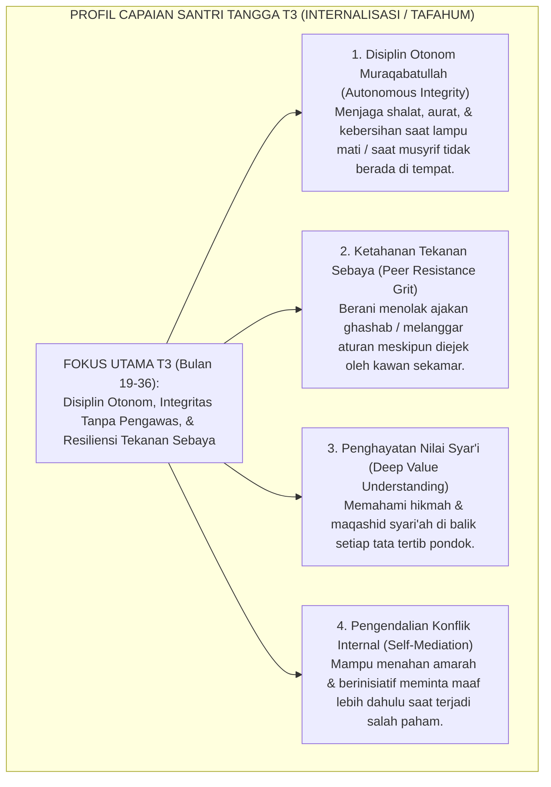
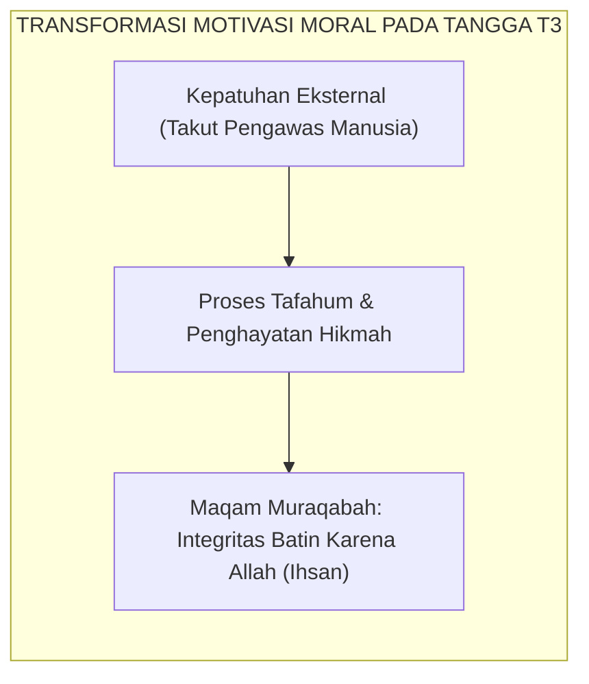
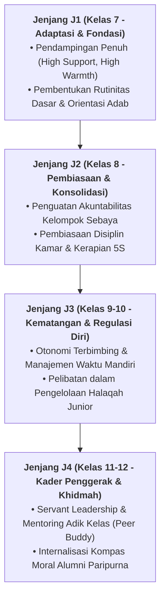

# TANGGA T3 — INTERNALISASI (TAFAHUM) & DISIPLIN OTONOM

---
### Tangga Ketiga: Lompatan Kualitatif dari Ketaatan Lahir Menuju Kesadaran Batin

Jika Jenjang J1 berfokus pada adaptasi dan Jenjang J2 berfokus pada pembiasaan fisik, maka **Jenjang J3 (Internalisasi / *Tafahum*)** yang menaungi santri pada **bulan ke-19 hingga bulan ke-36** (Tahun Kedua hingga Tahun Ketiga) adalah **fase pematangan spiritual dan otonomi moral**.

Pada tangga T3, santri mengalami lompatan kualitatif:
* Santri tidak lagi berbuat baik karena takut dicatat pelanggarannya oleh musyrif.
* Santri tidak lagi menjaga shalat berjamaah karena ingin mendapatkan stiker bintang atau pujian kawan.
* **Santri menjaga adab secara sukarela karena hatinya telah tertanam kesadaran *Muraqabatullah* (merasa senantiasa diawasi oleh Allah SWT)**.

<b>Gambar 4.3.1:</b> Peta Capaian Karakter Santri pada Jenjang J3 (Internalisasi / Tafahum).

Pakar psikologi perkembangan moral **Lawrence Kohlberg**[^1] merumuskan bahwa perkembangan moral tertinggi terjadi saat individu berpindah dari tingkat konvensional (patuh demi hukum sosial dan kelompok) menuju **tingkat pasca-konvensional (*post-conventional moral stage*)**: bertindak atas dasar prinsip etika universal dan integritas nurani yang hakiki.

---

### Teori Internalisasi Nilai Deci & Ryan: Terciptanya Regulasi Terintegrasi

Pakar psikologi motivasi **Richard M. Ryan & Edward L. Deci**[^2] menjelaskan proses **Internalisasi (*Internalization Process*)**:
1. Nilai adab yang mulanya berasal dari luar (*ekstrinsik*) diserap ke dalam struktur diri santri melalui proses refleksi dan pemahaman makna (*Tafahum*).
2. Nilai tersebut menyatu dengan identitas diri (*Integrated Regulation*), sehingga melanggar adab terasa sebagai pengkhianatan terhadap nilai moral dirinya sendiri.

Ketika seorang santri T3 menemukan sandal tergeletak tanpa pemilik, rem batinnya langsung menyala: *"Ini bukan hak milik ana. Allah Maha Melihat. Ana tidak akan memakainya."* Inilah integritas sejati yang dicari oleh pendidikan Islam.

---

### Integrasi Turats: Maqam *Muraqabah* Imam Ibnul Qayyim & Al-Muhasibi

Puncak internalisasi nilai ini adalah pencapaian maqam spiritual yang agung dalam tasawuf Sunni.

**Al-Imam Ibn al-Qayyim al-Jawziyyah** dalam *Madarij as-Salikin*[^3] mendefinisikan maqam **Al-Muraqabah**:
$$\text{الْمُرَاقَبَةُ: دَوَامُ عِلْمِ الْعَبْدِ وَتَيَقُّنِهِ بِاطِّلَاعِ الرَّبِّ سُبْحَانَهُ وَتَعَالَى عَلَى ظَاهِرِهِ وَبَاطِنِهِ فِي كُلِّ لَحْظَةٍ}$$
*"Muraqabah adalah kesinambungan ilmu dan keyakinan mantap seorang hamba bahwa Allah SWT senantiasa mengawasi lahir dan batinnya dalam setiap detik helaan nafasnya."*

<b>Gambar 4.3.2:</b> Transformasi Motivasi Santri Menuju Maqam Muraqabah pada Jenjang J3.

**Al-Imam Al-Harits al-Muhasibi** dalam *Adab an-Nufus*[^4] menegaskan bahwa jiwa yang telah mencapai derajat *Tafahum* akan merasa malu kepada Allah (*al-Haya' minallah*) bahkan saat ia berada sendirian di kegelapan malam yang sunyi.

---

### Solusi Sistemik TUMBUH: Transisi Menuju Manajemen Otonom Kamar

Pada Jenjang J3, Sistem TUMBUH memberikan porsi kepercayaan dan otonomi yang lebih besar:
1. **Pemberian Tanggung Jawab Mandiri (*Self-Managed Dormitory*)**: Musyrif mengurangi intensitas komando langsung dan berperan sebagai konsultan / fasilitator dialogis mingguan.
2. **Halaqah Muhasabah Diri (*Self-Reflection Circle*)**: Santri mengisi jurnal refleksi adab pribadi (*Ipsative Adab Journal*), mengevaluasi titik lemah dirinya secara jujur tanpa rasa takut dihukum.
3. **Pelatihan Asertivitas Menolak Ajaran Buruk (*Peer Resistance Workshop*)**: Santri dilatih teknik komunikasi asertif untuk berani berkata tidak saat diajak melanggar aturan oleh kawan sebaya.

Santri di tangga T3 telah memiliki **benteng moral internal yang kokoh**: mereka beradab di tengah keramaian, dan tetap beradab di kesunyian bilik asrama saat tidak ada mata manusia yang memandangnya.

---

## 📌 Catatan Kaki & Rujukan Primer

[^1]: **Lawrence Kohlberg**, *The Psychology of Moral Development: The Nature and Validity of Moral Stages* (San Francisco: Harper & Row, 1984), Bab 3: "Synopses of Moral Stages", hlm. 170–215.
[^2]: **Richard M. Ryan & Edward L. Deci**, *Self-Determination Theory: Basic Psychological Needs in Motivation, Development, and Wellness* (New York: Guilford Press, 2017), Bab 8: "Internalization and the Facilitation of Extrinsic Motivation", hlm. 179–215.
[^3]: **Al-Imam Syamsuddin Muhammad bin Abi Bakr Ibnu Qayyim al-Jawziyyah**, *Madarij as-Salikin bayna Manazil Iyyaka Na'budu wa Iyyaka Nasta'in*, Tahqiq: Muhammad al-Mu'tashim Billah al-Baghdadi (Beirut: Dar al-Kitab al-'Arabi, 1416 H), Jilid II: "Manzilat al-Muraqabah", hlm. 65–85.
[^4]: **Al-Imam Al-Harits bin Asad al-Muhasibi**, *Adab an-Nufus*, Tahqiq: Dr. Abdul Qadir Ahmad 'Atha (Kairo & Beirut: Dar al-Kutub al-'Ilmiyyah, 1986), hlm. 35–62.

---

### IV. Pembedahan Kapasitas Lanjutan & Trajektori Progresi Tangga T3 — Internalisasi (Tafahum) & Disiplin Otonom

Pengembangan kompetensi **TANGGA T3 — INTERNALISASI (TAFAHUM) & DISIPLIN OTONOM** pada santri memerlukan strategi diferensiasi yang selaras dengan tahapan usia perkembangan remaja (*Developmental Milestones*):

1. **Dekomposisi Indikator Kematangan Perilaku**:
   Untuk memastikan karakter **TANGGA T3 — INTERNALISASI (TAFAHUM) & DISIPLIN OTONOM** tertanam secara operasional, dewan asatidz dan musyrif memetakan indikator perilakunya ke dalam 3 ranah capaian:
   * **Ranah Kognitif-Reflektif (*Ma'rifah*)**: Santri memahami dalil syar'i, urgensi akhlak, dan konsekuensi logis dari setiap pilihannya.
   * **Ranah Afektif-Ruhiyyah (*Wijdan*)**: Tumbuhnya kepekaan nurani, rasa malu berbuat dosa (*Haya'*), dan kenikmatan dalam berbuat kebajikan.
   * **Ranah Psikomotorik-Habituasi (*'Amal*)**: Terwujudnya keterampilan bertindak nyata secara spontan, konsisten, dan mandiri tanpa perlu disuruh.

2. **Matriks Penahapan Lintas Jenjang Kemandirian (J1–J4)**:

3. **Rubrik Evaluasi Kualitatif & Indikator Pencapaian**:

| Level Kemandirian | Karakteristik Perilaku Teramati (*Behavioral Anchor*) | Pendekatan Bimbingan Musyrif |
| :--- | :--- | :--- |
| **Level 1 (Emerging)** | Memerlukan instruksi berulang dan pengawasan langsung musyrif. | *Direct Prompting* & pengingat visual harian. |
| **Level 2 (Developing)** | Mampu menjalankan adab saat diingatkan oleh teman sebaya. | Penguatan positif melalui pujian deskriptif. |
| **Level 3 (Proficient)** | Menjalankan adab secara mandiri dan konsisten tanpa diawasi. | Pemberian kepercayaan dan peran tanggung jawab kamar. |
| **Level 4 (Exemplary)** | Menjadi teladan (*Qudwah*) dan mampu membimbing kawan-kawannya. | Pelibatan aktif dalam struktur Dewan Santri & Mentor. |

---

### V. Panduan Praksis Pendampingan Musyrif di Asrama

Agar penanaman **TANGGA T3 — INTERNALISASI (TAFAHUM) & DISIPLIN OTONOM** berhasil maksimal di lapangan, musyrif disarankan menerapkan protokol pendampingan berikut:
* **Fokus pada Usaha (*Effort-Oriented Praise*)**: Berikan apresiasi atas proses perjuangan santri dalam memperbaiki diri, bukan semata-mata hasil akhir yang sempurna.
* **Dialog Sokratik Saat Santri Mengalami Kesulitan**: Ajukan pertanyaan reflektif seperti: *"Apa yang membuat antum merasa berat menjalankan adab ini hari ini? Bagaimana kita bisa mengatasinya bersama besok?"*
* **Menjaga Iklim Ukhuwah Bebas Perundungan**: Pastikan senioritas dimaknai sebagai amanah pengayoman dan perlindungan kepada yang lebih muda, bukan hak istimewa untuk memerintah.
