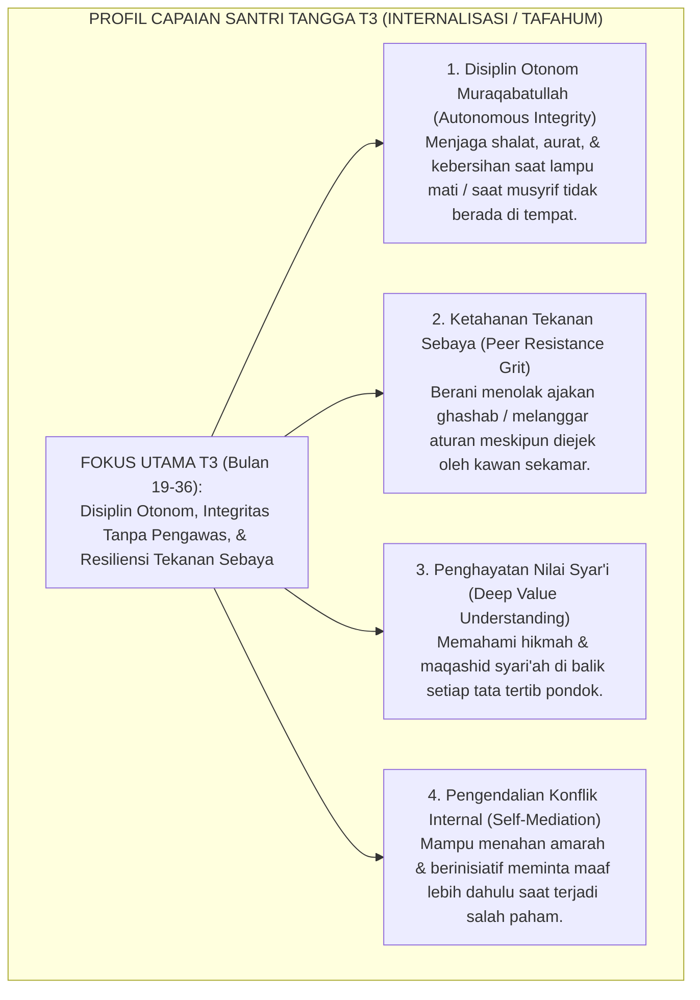
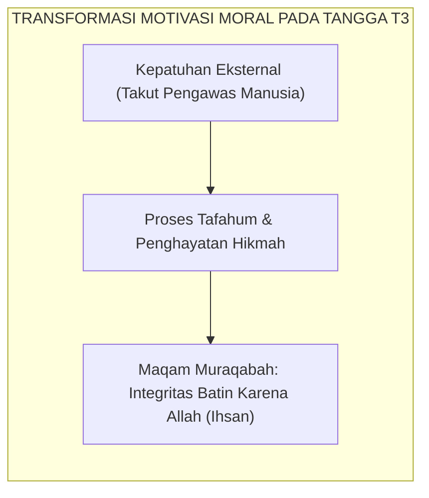

# TANGGA T3 — INTERNALISASI (TAFAHUM) & DISIPLIN OTONOM

---

### 🧭 PETA POSISI PANDUAN DALAM SISTEM TUMBUH (DARI HULU KE HILIR)
* **Posisi Arsitektur**: `BATANG EKOSISTEM I (Taksonomi 10 Muwashafat Adab & Tangga Kemandirian J1–J4)`
* **Peruntukan Pengguna**: Wali Kelas, Musyrif Kamar, Guru Pengampu Adab, & Mentor Santri
* **Fokus Panduan**: Memandu tahapan penanaman 10 Karakter Adab Nabawi dari fase Adaptasi (J1), Pembiasaan (J2), Kematangan (J3), hingga Kader Penggerak (J4/Tahap 7).
* **Hasil Akhir yang Dituju**: Terwujudnya santri berkarakter *Insan Adabi* yang mandiri, musyrif yang mengasuh dengan kasih sayang tanpa *burnout*, dan pesantren yang aman berbasis data (*Safe Boarding School*).

---

### 🎯 Mengapa Panduan Ini Ada & Masalah Nyata yang Dipecahkan
1. **Latar Masalah di Lapangan**: Sering kali pengasuhan di pesantren berjalan tanpa SOP yang jelas atau terjebak dalam pola reaktif—menunggu santri berbuat salah baru dihukum dengan emosional.
2. **Solusi Sistem TUMBUH**: Panduan ini memberikan langkah preventif dan terstruktur agar setiap pembiasaan adab berjalan terencana, konsisten, dan terukur.
3. **Sasaran Perubahan**: Memastikan nilai-nilai Islam menyatu dalam perilaku harian santri melalui keteladanan nyata (*Qudwah Hasanah*).

---
### 🎯 Tujuan & Manfaat Panduan
Panduan ini dirancang sebagai petunjuk operasional terapan agar pendidik dan musyrif dapat:
1. Menjalankan pembinaan adab santri dengan pendekatan kasih sayang (*Rahmah*) dan ketegasan yang mendidik (*Firm & Kind*).
2. Menghindari cara-cara kekerasan fisik, bentakan verbal, maupun hukuman yang mempermalukan santri.
3. Menciptakan suasana asrama dan kelas yang aman, tertib, dan menumbuhkan kesadaran diri (*Bi'ah Shalihah*).

---

### 💡 Intisari Cepat (3 Menit Memahami Esensi)
* **Kunci Pengasuhan**: Karakter santri tumbuh melalui keteladanan nyata (*Qudwah Hasanah*), komunikasi empatik, dan pembiasaan terstruktur 24 jam.
* **Tindakan Utama**: Terapkan panduan langkah demi langkah di bawah ini secara konsisten, pantau perkembangan santri secara objektif, dan berikan apresiasi atas setiap perbaikan diri yang mereka capai.
* **Prinsip Disiplin**: Fokus pada pemulihan hubungan dan tanggung jawab nyata (*Restoratif*), bukan sekadar melampiaskan amarah atau menghukum.

---

---

### 💬 ILUSTRASI NYATA & ANALOGI SEDERHANA
Bayangkan sebuah skenario yang sering kita lihat sehari-hari di asrama:
* Ketika seorang santri baru melakukan kekeliruan (misalnya terlambat bangun Subuh atau kasurnya berantakan), respon pertama yang sering muncul adalah bentakan keras atau hukuman fisik (seperti push-up atau jemur di lapangan).
* **Hasilnya?** Santri tersebut mungkin tampak patuh seketika karena takut, tetapi di dalam hatinya tumbuh rasa dongkol, dendam tersembunyi, atau kebiasaan "bersandiwara"—hanya tertib ketika ada pengawas di dekatnya.

Dalam Sistem TUMBUH, kita menggunakan cara yang jauh lebih cerdas, sejuk, dan membumi:
1. **Analogi "Rem dan Pedal Gas Otak"**: Santri usia remaja (usia MTs dan Aliyah) memiliki bagian otak emosi (*Sistem Limbik*) yang sudah menyala sangat kuat seperti *pedal gas mobil sport*, namun otak pengendali logikanya (*Prefrontal Cortex*) masih dalam proses tumbuh seperti *sistem rem yang baru dipasang*. Tugas guru dan musyrif bukan memarahi mobilnya, melainkan menjadi **"Sopir Teladan & Sabuk Pengaman"** yang mendampingi santri belajar menginjak rem dengan bijak.
2. **Kekuatan Contoh Nyata (*Qudwah Hasanah*)**: Santri jauh lebih cepat meniru apa yang mereka **lihat** setiap hari daripada apa yang mereka **dengar** dari ribuan nasihat panjang. Jika musyrif datang tepat waktu, tersenyum ramah, dan kamarnya rapi, santri akan menirunya dengan sukarela.

---

### 🛠️ PANDUAN LANGKAH PRAKTIS LAPANGAN (BISA LANGSUNG DIPRAKTIKKAN HARI INI)

| Tahapan Aksi | Tindakan Nyata Musyrif / Guru di Lapangan | Hal yang Harus Diperhatikan |
| :--- | :--- | :--- |
| **1. Langkah Persiapan (Sebelum Kejadian)** | Sepakati aturan bersama santri di awal pekan dengan kalimat positif (contoh: *"Kamar rapi membuat istirahat kita berkah"*). | Buat poster visual sederhana yang mudah dibaca di dinding kamar. |
| **2. Langkah Respon (Saat Terjadi Masalah)** | Tarik napas, tenangkan diri, ajak santri berbicara empat mata tanpa mempermalukannya di depan teman-temannya. | Gunakan nada bicara yang tenang namun tegas (*Firm & Kind*). |
| **3. Langkah Perbaikan (Tanggung Jawab Nyata)** | Minta santri memperbaiki kesalahannya secara langsung (contoh: merapikan kembali barang yang berantakan atau meminta maaf). | Berikan apresiasi seketika santri telah menuntaskan perbaikannya. |

---

### 🗣️ CONTOH DIALOG LAPANGAN (YANG HARUS DIUCAPKAN VS DIHINDARI)

* ❌ **JANGAN UCAPKAN (Membuat Santri Menutup Diri & Dendam)**:
  > *"Kamu ini pemalas sekali ya, sudah dibilangi berkali-kali masih saja kasur berantakan! Push-up 50 kali sekarang!"*
* ✅ **UCAPKAN INI (Mendidik Tanggung Jawab & Kesadaran Diri)**:
  > *"Akhi, antum tahu kesepakatan kamar kita tentang kerapian tempat tidur setelah Subuh. Coba lihat kasur antum sekarang, apa yang perlu disempurnakan? Mari rapikan bersama sekarang agar kamar kita nyaman dan berkah."*

---

### 📋 3 POIN EMAS RANGKUMAN (UNTUK SANTRI SENIOR & MUSYRIF MUDA)
1. **Didik dengan Kasih Sayang, Tegakkan Batas dengan Adil**: Jangan pernah mencampuradukkan ketegasan aturan dengan pelampiasan amarah pribadi.
2. **Apresiasi 4x Lebih Banyak daripada Teguran (*Magic Ratio 4:1*)**: Jangan hanya bersuara ketika santri berbuat salah. Saat mereka berbuat baik (salat di shaf depan, menolong kawan, membaca Al-Qur'an), segera berikan pujian tulus.
3. **Fokus pada Perbaikan Hubungan (*Restoratif*)**: Masalah perilaku adalah peluang emas untuk mendidik santri menjadi pribadi yang lebih dewasa dan bertanggung jawab.

---

### 📖 Uraian Lengkap Landasan & Rujukan Sistem

---

### Tangga Ketiga: Lompatan Kualitatif dari Ketaatan Lahir Menuju Kesadaran Batin

Jika Jenjang J1 berfokus pada adaptasi dan Jenjang J2 berfokus pada pembiasaan fisik, maka **Jenjang J3 (Internalisasi / *Tafahum*)** yang menaungi santri pada **bulan ke-19 hingga bulan ke-36** (Tahun Kedua hingga Tahun Ketiga) adalah **fase pematangan spiritual dan otonomi moral**.

Pada tangga T3, santri mengalami lompatan kualitatif:
* Santri tidak lagi berbuat baik karena takut dicatat pelanggarannya oleh musyrif.
* Santri tidak lagi menjaga shalat berjamaah karena ingin mendapatkan stiker bintang atau pujian kawan.
* **Santri menjaga adab secara sukarela karena hatinya telah tertanam kesadaran *Muraqabatullah* (merasa senantiasa diawasi oleh Allah SWT)**.

<b>Gambar 4.3.1:</b> Peta Capaian Karakter Santri pada Jenjang J3 (Internalisasi / Tafahum).

Pakar psikologi perkembangan moral **Lawrence Kohlberg**[^1] merumuskan bahwa perkembangan moral tertinggi terjadi saat individu berpindah dari tingkat konvensional (patuh demi hukum sosial dan kelompok) menuju **tingkat pasca-konvensional (*post-conventional moral stage*)**: bertindak atas dasar prinsip etika universal dan integritas nurani yang hakiki.

---

### Teori Internalisasi Nilai Deci & Ryan: Terciptanya Regulasi Terintegrasi

Pakar psikologi motivasi **Richard M. Ryan & Edward L. Deci**[^2] menjelaskan proses **Internalisasi (*Internalization Process*)**:
1. Nilai adab yang mulanya berasal dari luar (*ekstrinsik*) diserap ke dalam struktur diri santri melalui proses refleksi dan pemahaman makna (*Tafahum*).
2. Nilai tersebut menyatu dengan identitas diri (*Integrated Regulation*), sehingga melanggar adab terasa sebagai pengkhianatan terhadap nilai moral dirinya sendiri.

Ketika seorang santri T3 menemukan sandal tergeletak tanpa pemilik, rem batinnya langsung menyala: *"Ini bukan hak milik ana. Allah Maha Melihat. Ana tidak akan memakainya."* Inilah integritas sejati yang dicari oleh pendidikan Islam.

---

### Integrasi Turats: Maqam *Muraqabah* Imam Ibnul Qayyim & Al-Muhasibi

Puncak internalisasi nilai ini adalah pencapaian maqam spiritual yang agung dalam tasawuf Sunni.

**Al-Imam Ibn al-Qayyim al-Jawziyyah** dalam *Madarij as-Salikin*[^3] mendefinisikan maqam **Al-Muraqabah**:
$$\text{الْمُرَاقَبَةُ: دَوَامُ عِلْمِ الْعَبْدِ وَتَيَقُّنِهِ بِاطِّلَاعِ الرَّبِّ سُبْحَانَهُ وَتَعَالَى عَلَى ظَاهِرِهِ وَبَاطِنِهِ فِي كُلِّ لَحْظَةٍ}$$
*"Muraqabah adalah kesinambungan ilmu dan keyakinan mantap seorang hamba bahwa Allah SWT senantiasa mengawasi lahir dan batinnya dalam setiap detik helaan nafasnya."*

<b>Gambar 4.3.2:</b> Transformasi Motivasi Santri Menuju Maqam Muraqabah pada Jenjang J3.

**Al-Imam Al-Harits al-Muhasibi** dalam *Adab an-Nufus*[^4] menegaskan bahwa jiwa yang telah mencapai derajat *Tafahum* akan merasa malu kepada Allah (*al-Haya' minallah*) bahkan saat ia berada sendirian di kegelapan malam yang sunyi.

---

### Solusi Sistemik TUMBUH: Transisi Menuju Manajemen Otonom Kamar

Pada Jenjang J3, Sistem TUMBUH memberikan porsi kepercayaan dan otonomi yang lebih besar:
1. **Pemberian Tanggung Jawab Mandiri (*Self-Managed Dormitory*)**: Musyrif mengurangi intensitas komando langsung dan berperan sebagai konsultan / fasilitator dialogis mingguan.
2. **Halaqah Muhasabah Diri (*Self-Reflection Circle*)**: Santri mengisi jurnal refleksi adab pribadi (*Ipsative Adab Journal*), mengevaluasi titik lemah dirinya secara jujur tanpa rasa takut dihukum.
3. **Pelatihan Asertivitas Menolak Ajaran Buruk (*Peer Resistance Workshop*)**: Santri dilatih teknik komunikasi asertif untuk berani berkata tidak saat diajak melanggar aturan oleh kawan sebaya.

Santri di tangga T3 telah memiliki **benteng moral internal yang kokoh**: mereka beradab di tengah keramaian, dan tetap beradab di kesunyian bilik asrama saat tidak ada mata manusia yang memandangnya.

---

## 📌 Catatan Kaki & Rujukan Primer

[^1]: **Lawrence Kohlberg**, *The Psychology of Moral Development: The Nature and Validity of Moral Stages* (San Francisco: Harper & Row, 1984), Bab 3: "Synopses of Moral Stages", hlm. 170–215.
[^2]: **Richard M. Ryan & Edward L. Deci**, *Self-Determination Theory: Basic Psychological Needs in Motivation, Development, and Wellness* (New York: Guilford Press, 2017), Bab 8: "Internalization and the Facilitation of Extrinsic Motivation", hlm. 179–215.
[^3]: **Al-Imam Syamsuddin Muhammad bin Abi Bakr Ibnu Qayyim al-Jawziyyah**, *Madarij as-Salikin bayna Manazil Iyyaka Na'budu wa Iyyaka Nasta'in*, Tahqiq: Muhammad al-Mu'tashim Billah al-Baghdadi (Beirut: Dar al-Kitab al-'Arabi, 1416 H), Jilid II: "Manzilat al-Muraqabah", hlm. 65–85.
[^4]: **Al-Imam Al-Harits bin Asad al-Muhasibi**, *Adab an-Nufus*, Tahqiq: Dr. Abdul Qadir Ahmad 'Atha (Kairo & Beirut: Dar al-Kutub al-'Ilmiyyah, 1986), hlm. 35–62.
