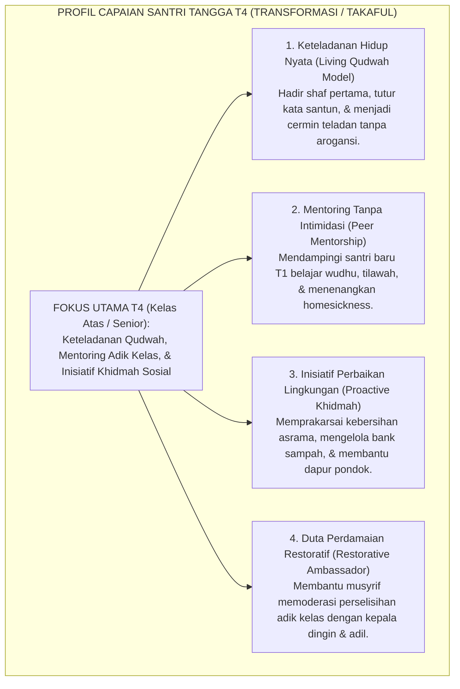
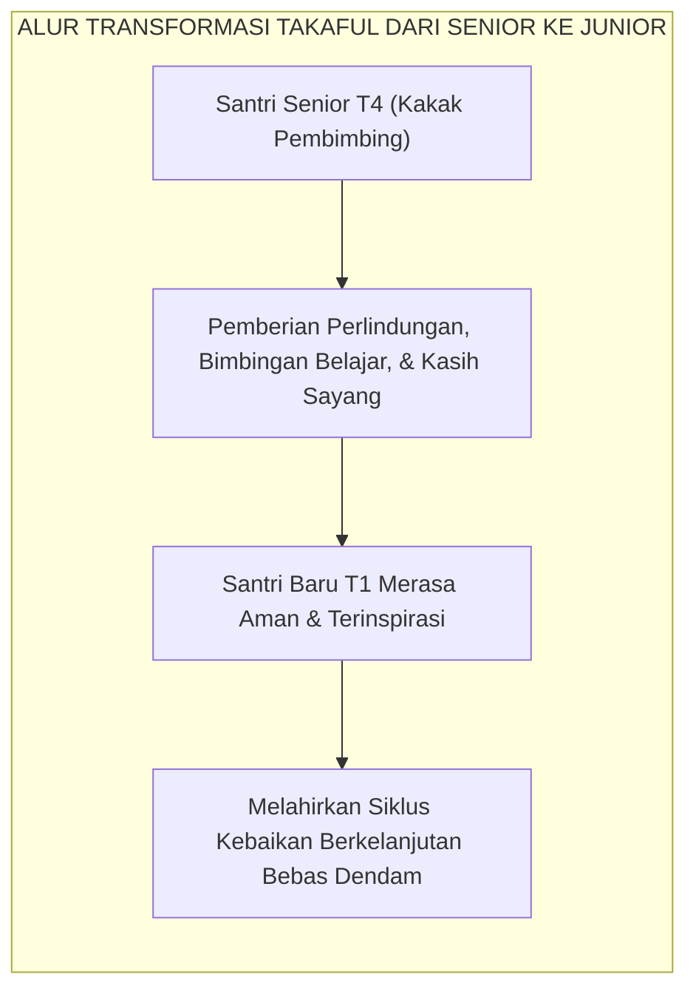

# TANGGA T4 — TRANSFORMASI (TAKAFUL) & KETELADANAN

---

### 🧭 PETA POSISI PANDUAN DALAM SISTEM TUMBUH (DARI HULU KE HILIR)
* **Posisi Arsitektur**: `BATANG EKOSISTEM I (Taksonomi 10 Muwashafat Adab & Tangga Kemandirian J1–J4)`
* **Peruntukan Pengguna**: Wali Kelas, Musyrif Kamar, Guru Pengampu Adab, & Mentor Santri
* **Fokus Panduan**: Memandu tahapan penanaman 10 Karakter Adab Nabawi dari fase Adaptasi (J1), Pembiasaan (J2), Kematangan (J3), hingga Kader Penggerak (J4/Tahap 7).
* **Hasil Akhir yang Dituju**: Terwujudnya santri berkarakter *Insan Adabi* yang mandiri, musyrif yang mengasuh dengan kasih sayang tanpa *burnout*, dan pesantren yang aman berbasis data (*Safe Boarding School*).

---

### 🎯 Mengapa Panduan Ini Ada & Masalah Nyata yang Dipecahkan
1. **Latar Masalah di Lapangan**: Sering kali pengasuhan di pesantren berjalan tanpa SOP yang jelas atau terjebak dalam pola reaktif—menunggu santri berbuat salah baru dihukum dengan emosional.
2. **Solusi Sistem TUMBUH**: Panduan ini memberikan langkah preventif dan terstruktur agar setiap pembiasaan adab berjalan terencana, konsisten, dan terukur.
3. **Sasaran Perubahan**: Memastikan nilai-nilai Islam menyatu dalam perilaku harian santri melalui keteladanan nyata (*Qudwah Hasanah*).

---
### 🎯 Tujuan & Manfaat Panduan
Panduan ini dirancang sebagai petunjuk operasional terapan agar pendidik dan musyrif dapat:
1. Menjalankan pembinaan adab santri dengan pendekatan kasih sayang (*Rahmah*) dan ketegasan yang mendidik (*Firm & Kind*).
2. Menghindari cara-cara kekerasan fisik, bentakan verbal, maupun hukuman yang mempermalukan santri.
3. Menciptakan suasana asrama dan kelas yang aman, tertib, dan menumbuhkan kesadaran diri (*Bi'ah Shalihah*).

---

### 💡 Intisari Cepat (3 Menit Memahami Esensi)
* **Kunci Pengasuhan**: Karakter santri tumbuh melalui keteladanan nyata (*Qudwah Hasanah*), komunikasi empatik, dan pembiasaan terstruktur 24 jam.
* **Tindakan Utama**: Terapkan panduan langkah demi langkah di bawah ini secara konsisten, pantau perkembangan santri secara objektif, dan berikan apresiasi atas setiap perbaikan diri yang mereka capai.
* **Prinsip Disiplin**: Fokus pada pemulihan hubungan dan tanggung jawab nyata (*Restoratif*), bukan sekadar melampiaskan amarah atau menghukum.

---

---

### 💬 ILUSTRASI NYATA & ANALOGI SEDERHANA
Bayangkan sebuah skenario yang sering kita lihat sehari-hari di asrama:
* Ketika seorang santri baru melakukan kekeliruan (misalnya terlambat bangun Subuh atau kasurnya berantakan), respon pertama yang sering muncul adalah bentakan keras atau hukuman fisik (seperti push-up atau jemur di lapangan).
* **Hasilnya?** Santri tersebut mungkin tampak patuh seketika karena takut, tetapi di dalam hatinya tumbuh rasa dongkol, dendam tersembunyi, atau kebiasaan "bersandiwara"—hanya tertib ketika ada pengawas di dekatnya.

Dalam Sistem TUMBUH, kita menggunakan cara yang jauh lebih cerdas, sejuk, dan membumi:
1. **Analogi "Rem dan Pedal Gas Otak"**: Santri usia remaja (usia MTs dan Aliyah) memiliki bagian otak emosi (*Sistem Limbik*) yang sudah menyala sangat kuat seperti *pedal gas mobil sport*, namun otak pengendali logikanya (*Prefrontal Cortex*) masih dalam proses tumbuh seperti *sistem rem yang baru dipasang*. Tugas guru dan musyrif bukan memarahi mobilnya, melainkan menjadi **"Sopir Teladan & Sabuk Pengaman"** yang mendampingi santri belajar menginjak rem dengan bijak.
2. **Kekuatan Contoh Nyata (*Qudwah Hasanah*)**: Santri jauh lebih cepat meniru apa yang mereka **lihat** setiap hari daripada apa yang mereka **dengar** dari ribuan nasihat panjang. Jika musyrif datang tepat waktu, tersenyum ramah, dan kamarnya rapi, santri akan menirunya dengan sukarela.

---

### 🛠️ PANDUAN LANGKAH PRAKTIS LAPANGAN (BISA LANGSUNG DIPRAKTIKKAN HARI INI)

| Tahapan Aksi | Tindakan Nyata Musyrif / Guru di Lapangan | Hal yang Harus Diperhatikan |
| :--- | :--- | :--- |
| **1. Langkah Persiapan (Sebelum Kejadian)** | Sepakati aturan bersama santri di awal pekan dengan kalimat positif (contoh: *"Kamar rapi membuat istirahat kita berkah"*). | Buat poster visual sederhana yang mudah dibaca di dinding kamar. |
| **2. Langkah Respon (Saat Terjadi Masalah)** | Tarik napas, tenangkan diri, ajak santri berbicara empat mata tanpa mempermalukannya di depan teman-temannya. | Gunakan nada bicara yang tenang namun tegas (*Firm & Kind*). |
| **3. Langkah Perbaikan (Tanggung Jawab Nyata)** | Minta santri memperbaiki kesalahannya secara langsung (contoh: merapikan kembali barang yang berantakan atau meminta maaf). | Berikan apresiasi seketika santri telah menuntaskan perbaikannya. |

---

### 🗣️ CONTOH DIALOG LAPANGAN (YANG HARUS DIUCAPKAN VS DIHINDARI)

* ❌ **JANGAN UCAPKAN (Membuat Santri Menutup Diri & Dendam)**:
  > *"Kamu ini pemalas sekali ya, sudah dibilangi berkali-kali masih saja kasur berantakan! Push-up 50 kali sekarang!"*
* ✅ **UCAPKAN INI (Mendidik Tanggung Jawab & Kesadaran Diri)**:
  > *"Akhi, antum tahu kesepakatan kamar kita tentang kerapian tempat tidur setelah Subuh. Coba lihat kasur antum sekarang, apa yang perlu disempurnakan? Mari rapikan bersama sekarang agar kamar kita nyaman dan berkah."*

---

### 📋 3 POIN EMAS RANGKUMAN (UNTUK SANTRI SENIOR & MUSYRIF MUDA)
1. **Didik dengan Kasih Sayang, Tegakkan Batas dengan Adil**: Jangan pernah mencampuradukkan ketegasan aturan dengan pelampiasan amarah pribadi.
2. **Apresiasi 4x Lebih Banyak daripada Teguran (*Magic Ratio 4:1*)**: Jangan hanya bersuara ketika santri berbuat salah. Saat mereka berbuat baik (salat di shaf depan, menolong kawan, membaca Al-Qur'an), segera berikan pujian tulus.
3. **Fokus pada Perbaikan Hubungan (*Restoratif*)**: Masalah perilaku adalah peluang emas untuk mendidik santri menjadi pribadi yang lebih dewasa dan bertanggung jawab.

---

### 📖 Uraian Lengkap Landasan & Rujukan Sistem

---

### Tangga Tertinggi Santri: Dari Menjaga Diri Menjadi Penggerak Perubahan

Puncak dari tangga perkembangan karakter di tingkat santri adalah **Jenjang J4 (Transformasi / *Takaful*)**, yang menaungi santri kelas atas (Tahun ke-3 ke atas dan Santri Aliyah/Senior).

Pada Jenjang J4, fokus pembinaan bergeser secara revolusioner:
* Santri tidak lagi sekadar menjadi "konsumen adab" yang menjaga kesalehan pribadinya.
* **Santri bertransformasi menjadi "produsen adab" dan agen perubahan (*Change Agent / Qudwah Hasanah*)** yang melayani, melindungi, dan membimbing adik-adik kelasnya di tangga T1 dan T2.

<b>Gambar 4.4.1:</b> Peta Capaian Karakter Santri pada Jenjang J4 (Transformasi / Takaful).

Pakar psikologi sosial legendaris **Albert Bandura**[^1] dalam *Social Cognitive Theory* membuktikan bahwa pemodelan perilaku oleh figur teladan sebaya (*peer modeling*) memiliki daya pengaruh pembentukan karakter 4 kali lebih kuat dibanding instruksi verbal guru di kelas.

---

### Dekonstruksi Feodalisme: Mengubah Senior dari "Penghukum" Menjadi "Pelayan Kasih"

Di pesantren tradisional usang, status santri senior kerap kali diselewengkan menjadi kasta penindas: santri senior merasa berhak membentak, menyuruh mencuci pakaian, atau menghukum fisik adik kelas.

Sistem TUMBUH melakukan revolusi kultural total: **mencabut 100% wewenang menghukum dari tangan santri senior!**
* Santri senior dilarang keras melayangkan hukuman fisik, denda materiil, atau bentakan kepada adik kelas.
* Peran santri senior diubah secara terstruktur menjadi **Kakak Asuh (*Peer Mentors*)**.

Pakar kepemimpinan pelayan **Robert K. Greenleaf**[^2] menegaskan bahwa ujian kepemimpinan sejati adalah: *"Apakah orang-orang yang dipimpin bertumbuh semakin cerdas, semakin mandiri, dan semakin berdaya?"*

Santri Jenjang J4 membuktikan kepemimpinannya bukan dengan membuat adik kelas gemetar ketakutan, melainkan dengan membuat adik kelas merasa aman, disayangi, dan terinspirasi untuk meneladani kesalehannya.

---

### Integrasi Turats: Konsep *Takaful Ijtima'i* & *Al-Hisbah bil Ma'ruf*

Tanggung jawab sosial santri Jenjang J4 berakar kokoh pada prinsip *Takaful* (saling menanggung dan memelihara keselamatan saudara seiman).

Rasulullah SAW bersabda dalam hadits yang diriwayatkan oleh **Imam Muslim**:
$$\text{مَثَلُ الْمُؤْمِنِينَ فِي تَوَادِّهِمْ، وَتَرَاحُمِهِمْ، وَتَعَاطُفِهِمْ مَثَلُ الْجَسَدِ؛ إِذَا اشْتَكَى مِنْهُ عُضْوٌ تَدَاعَى لَهُ سَائِرُ الْجَسَدِ بِالسَّهَرِ وَالْحُمَّى}$$
*"Perumpamaan orang-orang mukmin dalam hal saling mencintai, saling menyayangi, dan saling berlemah lembut adalah laksana satu tubuh; apabila satu anggota tubuh merasa sakit, niscaya seluruh anggota tubuh lainnya ikut merasakan demam dan tidak bisa tidur."* (HR. Muslim no. 2586).

<b>Gambar 4.4.2:</b> Siklus Keberkahan Takaful Antargenerasi Santri dalam sistem TUMBUH.

**Syaikhul Islam Ibnu Taimiyyah** dalam *Al-Hisbah fil Islam*[^3] menegaskan bahwa amar ma'ruf nahi munkar harus ditegakkan di atas tiga landasan: ilmu (*al-'Ilm*), kelembutan (*ar-Rifq*), dan kesabaran (*as-Shabr*). 

**Al-Imam Abu al-Hasan al-Mawardi** dalam *Al-Ahkam as-Sulthaniyyah*[^4] menggarisbawahi bahwa kepemimpinan (*Imamah*) ditegakkan untuk memelihara agama dan mengatur kemaslahatan umat dengan keadilan.

---

### Solusi Sistemik TUMBUH: Program Kakak Asuh & Inkubasi Kepemimpinan Khidmah

Di lingkungan pesantren berbasis sistem TUMBUH, santri Jenjang J4 menjalankan peran formal:
1. **Duta Pendamping Belajar (*Academic Peer Tutor*)**: Menjadi asisten ustadz dalam membimbing setoran hafalan Quran dan muthala'ah kitab santri T1 dan T2.
2. **Kepanitiaan Khidmah Komunal**: Mengelola kepanitiaan hari besar Islam, bakti sosial lingkungan sekitar pesantren, dan perawatan kebersihan asrama.
3. **Pemberian Lencana Teladan Qudwah**: Santri T4 yang menunjukkan integritas istimewa dilantik sebagai Duta Teladan TUMBUH dalam upacara resmi lembaga.

Santri Jenjang J4 telah mencapai puncak kepribadian *Insan Adabi*: mereka adalah pemimpin yang melayani, mercusuar teladan di asrama, dan calon pemimpin peradaban Islam di masa depan.

---

## 📌 Catatan Kaki & Rujukan Primer

[^1]: **Albert Bandura**, *Social Foundations of Thought and Action: A Social Cognitive Theory* (Englewood Cliffs: Prentice-Hall, 1986), Bab 2: "Social Modeling", hlm. 47–104.
[^2]: **Robert K. Greenleaf**, *Servant Leadership: A Journey into the Nature of Legitimate Power and Greatness* (New York: Paulist Press, 1977; Edisi Peringatan 25 Tahun, 2002), Bab 1: "The Servant as Leader", hlm. 21–48.
[^3]: **Syaikhul Islam Ahmad bin Abdul Halim Ibnu Taimiyyah**, *Al-Hisbah fil Islam aw Wazhifah al-Hukumah al-Islamiyyah*, Tahqiq: Syaikh Abdul Aziz bin Zaid ar-Rumi (Riyadh: Dar al-Wathan, 1412 H), hlm. 35–58.
[^4]: **Al-Imam Abu al-Hasan Ali bin Muhammad al-Mawardi**, *Al-Ahkam as-Sulthaniyyah wal Wilayat ad-Diniyyah*, Tahqiq: Dr. Ahmad Mubarak al-Baghdadi (Kuwait: Dar Ibn Qutaibah, 1989), Bab 1: "Aqd al-Imamah", hlm. 5–22.
