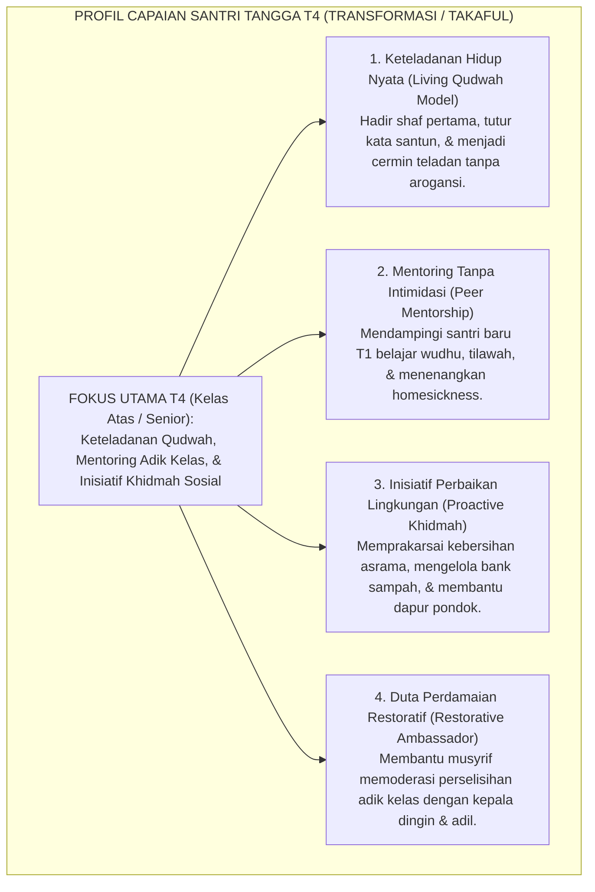
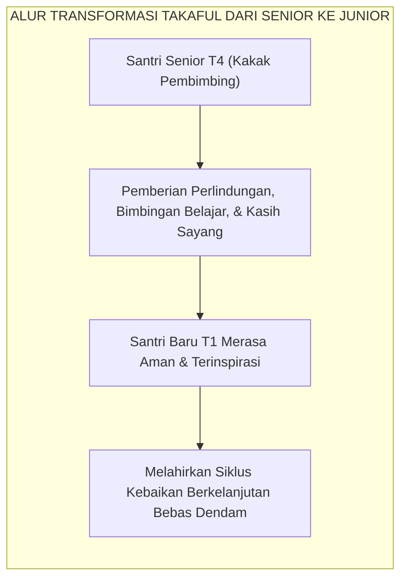
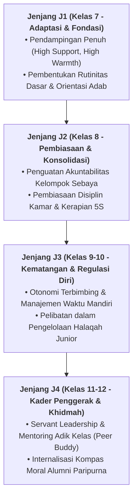

# TANGGA T4 — TRANSFORMASI (TAKAFUL) & KETELADANAN

---
### Tangga Tertinggi Santri: Dari Menjaga Diri Menjadi Penggerak Perubahan

Puncak dari tangga perkembangan karakter di tingkat santri adalah **Jenjang J4 (Transformasi / *Takaful*)**, yang menaungi santri kelas atas (Tahun ke-3 ke atas dan Santri Aliyah/Senior).

Pada Jenjang J4, fokus pembinaan bergeser secara revolusioner:
* Santri tidak lagi sekadar menjadi "konsumen adab" yang menjaga kesalehan pribadinya.
* **Santri bertransformasi menjadi "produsen adab" dan agen perubahan (*Change Agent / Qudwah Hasanah*)** yang melayani, melindungi, dan membimbing adik-adik kelasnya di tangga T1 dan T2.

<b>Gambar 4.4.1:</b> Peta Capaian Karakter Santri pada Jenjang J4 (Transformasi / Takaful).

Pakar psikologi sosial legendaris **Albert Bandura**[^1] dalam *Social Cognitive Theory* membuktikan bahwa pemodelan perilaku oleh figur teladan sebaya (*peer modeling*) memiliki daya pengaruh pembentukan karakter 4 kali lebih kuat dibanding instruksi verbal guru di kelas.

---

### Dekonstruksi Feodalisme: Mengubah Senior dari "Penghukum" Menjadi "Pelayan Kasih"

Di pesantren tradisional usang, status santri senior kerap kali diselewengkan menjadi kasta penindas: santri senior merasa berhak membentak, menyuruh mencuci pakaian, atau menghukum fisik adik kelas.

Sistem TUMBUH melakukan revolusi kultural total: **mencabut 100% wewenang menghukum dari tangan santri senior!**
* Santri senior dilarang keras melayangkan hukuman fisik, denda materiil, atau bentakan kepada adik kelas.
* Peran santri senior diubah secara terstruktur menjadi **Kakak Asuh (*Peer Mentors*)**.

Pakar kepemimpinan pelayan **Robert K. Greenleaf**[^2] menegaskan bahwa ujian kepemimpinan sejati adalah: *"Apakah orang-orang yang dipimpin bertumbuh semakin cerdas, semakin mandiri, dan semakin berdaya?"*

Santri Jenjang J4 membuktikan kepemimpinannya bukan dengan membuat adik kelas gemetar ketakutan, melainkan dengan membuat adik kelas merasa aman, disayangi, dan terinspirasi untuk meneladani kesalehannya.

---

### Integrasi Turats: Konsep *Takaful Ijtima'i* & *Al-Hisbah bil Ma'ruf*

Tanggung jawab sosial santri Jenjang J4 berakar kokoh pada prinsip *Takaful* (saling menanggung dan memelihara keselamatan saudara seiman).

Rasulullah SAW bersabda dalam hadits yang diriwayatkan oleh **Imam Muslim**:
$$\text{مَثَلُ الْمُؤْمِنِينَ فِي تَوَادِّهِمْ، وَتَرَاحُمِهِمْ، وَتَعَاطُفِهِمْ مَثَلُ الْجَسَدِ؛ إِذَا اشْتَكَى مِنْهُ عُضْوٌ تَدَاعَى لَهُ سَائِرُ الْجَسَدِ بِالسَّهَرِ وَالْحُمَّى}$$
*"Perumpamaan orang-orang mukmin dalam hal saling mencintai, saling menyayangi, dan saling berlemah lembut adalah laksana satu tubuh; apabila satu anggota tubuh merasa sakit, niscaya seluruh anggota tubuh lainnya ikut merasakan demam dan tidak bisa tidur."* (HR. Muslim no. 2586).

<b>Gambar 4.4.2:</b> Siklus Keberkahan Takaful Antargenerasi Santri dalam sistem TUMBUH.

**Syaikhul Islam Ibnu Taimiyyah** dalam *Al-Hisbah fil Islam*[^3] menegaskan bahwa amar ma'ruf nahi munkar harus ditegakkan di atas tiga landasan: ilmu (*al-'Ilm*), kelembutan (*ar-Rifq*), dan kesabaran (*as-Shabr*). 

**Al-Imam Abu al-Hasan al-Mawardi** dalam *Al-Ahkam as-Sulthaniyyah*[^4] menggarisbawahi bahwa kepemimpinan (*Imamah*) ditegakkan untuk memelihara agama dan mengatur kemaslahatan umat dengan keadilan.

---

### Solusi Sistemik TUMBUH: Program Kakak Asuh & Inkubasi Kepemimpinan Khidmah

Di lingkungan pesantren berbasis sistem TUMBUH, santri Jenjang J4 menjalankan peran formal:
1. **Duta Pendamping Belajar (*Academic Peer Tutor*)**: Menjadi asisten ustadz dalam membimbing setoran hafalan Quran dan muthala'ah kitab santri T1 dan T2.
2. **Kepanitiaan Khidmah Komunal**: Mengelola kepanitiaan hari besar Islam, bakti sosial lingkungan sekitar pesantren, dan perawatan kebersihan asrama.
3. **Pemberian Lencana Teladan Qudwah**: Santri T4 yang menunjukkan integritas istimewa dilantik sebagai Duta Teladan TUMBUH dalam upacara resmi lembaga.

Santri Jenjang J4 telah mencapai puncak kepribadian *Insan Adabi*: mereka adalah pemimpin yang melayani, mercusuar teladan di asrama, dan calon pemimpin peradaban Islam di masa depan.

---

## 📌 Catatan Kaki & Rujukan Primer

[^1]: **Albert Bandura**, *Social Foundations of Thought and Action: A Social Cognitive Theory* (Englewood Cliffs: Prentice-Hall, 1986), Bab 2: "Social Modeling", hlm. 47–104.
[^2]: **Robert K. Greenleaf**, *Servant Leadership: A Journey into the Nature of Legitimate Power and Greatness* (New York: Paulist Press, 1977; Edisi Peringatan 25 Tahun, 2002), Bab 1: "The Servant as Leader", hlm. 21–48.
[^3]: **Syaikhul Islam Ahmad bin Abdul Halim Ibnu Taimiyyah**, *Al-Hisbah fil Islam aw Wazhifah al-Hukumah al-Islamiyyah*, Tahqiq: Syaikh Abdul Aziz bin Zaid ar-Rumi (Riyadh: Dar al-Wathan, 1412 H), hlm. 35–58.
[^4]: **Al-Imam Abu al-Hasan Ali bin Muhammad al-Mawardi**, *Al-Ahkam as-Sulthaniyyah wal Wilayat ad-Diniyyah*, Tahqiq: Dr. Ahmad Mubarak al-Baghdadi (Kuwait: Dar Ibn Qutaibah, 1989), Bab 1: "Aqd al-Imamah", hlm. 5–22.

---

### IV. Pembedahan Kapasitas Lanjutan & Trajektori Progresi Tangga T4 — Transformasi (Takaful) & Keteladanan

Pengembangan kompetensi **TANGGA T4 — TRANSFORMASI (TAKAFUL) & KETELADANAN** pada santri memerlukan strategi diferensiasi yang selaras dengan tahapan usia perkembangan remaja (*Developmental Milestones*):

1. **Dekomposisi Indikator Kematangan Perilaku**:
   Untuk memastikan karakter **TANGGA T4 — TRANSFORMASI (TAKAFUL) & KETELADANAN** tertanam secara operasional, dewan asatidz dan musyrif memetakan indikator perilakunya ke dalam 3 ranah capaian:
   * **Ranah Kognitif-Reflektif (*Ma'rifah*)**: Santri memahami dalil syar'i, urgensi akhlak, dan konsekuensi logis dari setiap pilihannya.
   * **Ranah Afektif-Ruhiyyah (*Wijdan*)**: Tumbuhnya kepekaan nurani, rasa malu berbuat dosa (*Haya'*), dan kenikmatan dalam berbuat kebajikan.
   * **Ranah Psikomotorik-Habituasi (*'Amal*)**: Terwujudnya keterampilan bertindak nyata secara spontan, konsisten, dan mandiri tanpa perlu disuruh.

2. **Matriks Penahapan Lintas Jenjang Kemandirian (J1–J4)**:

3. **Rubrik Evaluasi Kualitatif & Indikator Pencapaian**:

| Level Kemandirian | Karakteristik Perilaku Teramati (*Behavioral Anchor*) | Pendekatan Bimbingan Musyrif |
| :--- | :--- | :--- |
| **Level 1 (Emerging)** | Memerlukan instruksi berulang dan pengawasan langsung musyrif. | *Direct Prompting* & pengingat visual harian. |
| **Level 2 (Developing)** | Mampu menjalankan adab saat diingatkan oleh teman sebaya. | Penguatan positif melalui pujian deskriptif. |
| **Level 3 (Proficient)** | Menjalankan adab secara mandiri dan konsisten tanpa diawasi. | Pemberian kepercayaan dan peran tanggung jawab kamar. |
| **Level 4 (Exemplary)** | Menjadi teladan (*Qudwah*) dan mampu membimbing kawan-kawannya. | Pelibatan aktif dalam struktur Dewan Santri & Mentor. |

---

### V. Panduan Praksis Pendampingan Musyrif di Asrama

Agar penanaman **TANGGA T4 — TRANSFORMASI (TAKAFUL) & KETELADANAN** berhasil maksimal di lapangan, musyrif disarankan menerapkan protokol pendampingan berikut:
* **Fokus pada Usaha (*Effort-Oriented Praise*)**: Berikan apresiasi atas proses perjuangan santri dalam memperbaiki diri, bukan semata-mata hasil akhir yang sempurna.
* **Dialog Sokratik Saat Santri Mengalami Kesulitan**: Ajukan pertanyaan reflektif seperti: *"Apa yang membuat antum merasa berat menjalankan adab ini hari ini? Bagaimana kita bisa mengatasinya bersama besok?"*
* **Menjaga Iklim Ukhuwah Bebas Perundungan**: Pastikan senioritas dimaknai sebagai amanah pengayoman dan perlindungan kepada yang lebih muda, bukan hak istimewa untuk memerintah.
