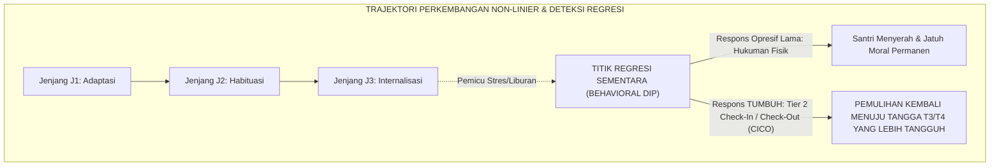

# DINAMIKA TRANSISI & PENANGANAN REGRESI KARAKTER

---

### 🧭 PETA POSISI PANDUAN DALAM SISTEM TUMBUH (DARI HULU KE HILIR)
* **Posisi Arsitektur**: `BATANG EKOSISTEM I (Taksonomi 10 Muwashafat Adab & Tangga Kemandirian J1–J4)`
* **Peruntukan Pengguna**: Wali Kelas, Musyrif Kamar, Guru Pengampu Adab, & Mentor Santri
* **Fokus Panduan**: Memandu tahapan penanaman 10 Karakter Adab Nabawi dari fase Adaptasi (J1), Pembiasaan (J2), Kematangan (J3), hingga Kader Penggerak (J4/Tahap 7).
* **Hasil Akhir yang Dituju**: Terwujudnya santri berkarakter *Insan Adabi* yang mandiri, musyrif yang mengasuh dengan kasih sayang tanpa *burnout*, dan pesantren yang aman berbasis data (*Safe Boarding School*).

---

### 🎯 Mengapa Panduan Ini Ada & Masalah Nyata yang Dipecahkan
1. **Latar Masalah di Lapangan**: Sering kali pengasuhan di pesantren berjalan tanpa SOP yang jelas atau terjebak dalam pola reaktif—menunggu santri berbuat salah baru dihukum dengan emosional.
2. **Solusi Sistem TUMBUH**: Panduan ini memberikan langkah preventif dan terstruktur agar setiap pembiasaan adab berjalan terencana, konsisten, dan terukur.
3. **Sasaran Perubahan**: Memastikan nilai-nilai Islam menyatu dalam perilaku harian santri melalui keteladanan nyata (*Qudwah Hasanah*).

---
### 🎯 Tujuan & Manfaat Panduan
Panduan ini dirancang sebagai petunjuk operasional terapan agar pendidik dan musyrif dapat:
1. Menjalankan pembinaan adab santri dengan pendekatan kasih sayang (*Rahmah*) dan ketegasan yang mendidik (*Firm & Kind*).
2. Menghindari cara-cara kekerasan fisik, bentakan verbal, maupun hukuman yang mempermalukan santri.
3. Menciptakan suasana asrama dan kelas yang aman, tertib, dan menumbuhkan kesadaran diri (*Bi'ah Shalihah*).

---

### 💡 Intisari Cepat (3 Menit Memahami Esensi)
* **Kunci Pengasuhan**: Karakter santri tumbuh melalui keteladanan nyata (*Qudwah Hasanah*), komunikasi empatik, dan pembiasaan terstruktur 24 jam.
* **Tindakan Utama**: Terapkan panduan langkah demi langkah di bawah ini secara konsisten, pantau perkembangan santri secara objektif, dan berikan apresiasi atas setiap perbaikan diri yang mereka capai.
* **Prinsip Disiplin**: Fokus pada pemulihan hubungan dan tanggung jawab nyata (*Restoratif*), bukan sekadar melampiaskan amarah atau menghukum.

---

---

### 💬 ILUSTRASI NYATA & ANALOGI SEDERHANA
Bayangkan sebuah skenario yang sering kita lihat sehari-hari di asrama:
* Ketika seorang santri baru melakukan kekeliruan (misalnya terlambat bangun Subuh atau kasurnya berantakan), respon pertama yang sering muncul adalah bentakan keras atau hukuman fisik (seperti push-up atau jemur di lapangan).
* **Hasilnya?** Santri tersebut mungkin tampak patuh seketika karena takut, tetapi di dalam hatinya tumbuh rasa dongkol, dendam tersembunyi, atau kebiasaan "bersandiwara"—hanya tertib ketika ada pengawas di dekatnya.

Dalam Sistem TUMBUH, kita menggunakan cara yang jauh lebih cerdas, sejuk, dan membumi:
1. **Analogi "Rem dan Pedal Gas Otak"**: Santri usia remaja (usia MTs dan Aliyah) memiliki bagian otak emosi (*Sistem Limbik*) yang sudah menyala sangat kuat seperti *pedal gas mobil sport*, namun otak pengendali logikanya (*Prefrontal Cortex*) masih dalam proses tumbuh seperti *sistem rem yang baru dipasang*. Tugas guru dan musyrif bukan memarahi mobilnya, melainkan menjadi **"Sopir Teladan & Sabuk Pengaman"** yang mendampingi santri belajar menginjak rem dengan bijak.
2. **Kekuatan Contoh Nyata (*Qudwah Hasanah*)**: Santri jauh lebih cepat meniru apa yang mereka **lihat** setiap hari daripada apa yang mereka **dengar** dari ribuan nasihat panjang. Jika musyrif datang tepat waktu, tersenyum ramah, dan kamarnya rapi, santri akan menirunya dengan sukarela.

---

### 🛠️ PANDUAN LANGKAH PRAKTIS LAPANGAN (BISA LANGSUNG DIPRAKTIKKAN HARI INI)

| Tahapan Aksi | Tindakan Nyata Musyrif / Guru di Lapangan | Hal yang Harus Diperhatikan |
| :--- | :--- | :--- |
| **1. Langkah Persiapan (Sebelum Kejadian)** | Sepakati aturan bersama santri di awal pekan dengan kalimat positif (contoh: *"Kamar rapi membuat istirahat kita berkah"*). | Buat poster visual sederhana yang mudah dibaca di dinding kamar. |
| **2. Langkah Respon (Saat Terjadi Masalah)** | Tarik napas, tenangkan diri, ajak santri berbicara empat mata tanpa mempermalukannya di depan teman-temannya. | Gunakan nada bicara yang tenang namun tegas (*Firm & Kind*). |
| **3. Langkah Perbaikan (Tanggung Jawab Nyata)** | Minta santri memperbaiki kesalahannya secara langsung (contoh: merapikan kembali barang yang berantakan atau meminta maaf). | Berikan apresiasi seketika santri telah menuntaskan perbaikannya. |

---

### 🗣️ CONTOH DIALOG LAPANGAN (YANG HARUS DIUCAPKAN VS DIHINDARI)

* ❌ **JANGAN UCAPKAN (Membuat Santri Menutup Diri & Dendam)**:
  > *"Kamu ini pemalas sekali ya, sudah dibilangi berkali-kali masih saja kasur berantakan! Push-up 50 kali sekarang!"*
* ✅ **UCAPKAN INI (Mendidik Tanggung Jawab & Kesadaran Diri)**:
  > *"Akhi, antum tahu kesepakatan kamar kita tentang kerapian tempat tidur setelah Subuh. Coba lihat kasur antum sekarang, apa yang perlu disempurnakan? Mari rapikan bersama sekarang agar kamar kita nyaman dan berkah."*

---

### 📋 3 POIN EMAS RANGKUMAN (UNTUK SANTRI SENIOR & MUSYRIF MUDA)
1. **Didik dengan Kasih Sayang, Tegakkan Batas dengan Adil**: Jangan pernah mencampuradukkan ketegasan aturan dengan pelampiasan amarah pribadi.
2. **Apresiasi 4x Lebih Banyak daripada Teguran (*Magic Ratio 4:1*)**: Jangan hanya bersuara ketika santri berbuat salah. Saat mereka berbuat baik (salat di shaf depan, menolong kawan, membaca Al-Qur'an), segera berikan pujian tulus.
3. **Fokus pada Perbaikan Hubungan (*Restoratif*)**: Masalah perilaku adalah peluang emas untuk mendidik santri menjadi pribadi yang lebih dewasa dan bertanggung jawab.

---

### 📖 Uraian Lengkap Landasan & Rujukan Sistem

---

### Perkembangan Karakter Bukanlah Garis Lurus yang Mulus

Salah satu ilusi terbesar dalam evaluasi pendidikan karakter adalah asumsi keliru bahwa pertumbuhan moral santri bergerak secara linier lurus dari hari ke hari tanpa pernah mengalami kemunduran.

Sains psikologi perkembangan dan konsensus PBIS membuktikan bahwa **pertumbuhan karakter manusia bersifat non-linier dan berfluktuasi**:
* Seorang santri yang telah mencapai Jenjang J2 atau T3 sewaktu-waktu dapat mengalami **Regresi Perilaku (*Behavioral Regression / Dip*)**: mendadak kembali malas bangun subuh, melanggar kerapian loker, atau tersulut amarah di bilik asrama.
* Regresi ini kerap dipicu oleh faktor transisi lingkungan: pasca-liburan panjang pulang ke rumah (*post-holiday shock*), kelelahan fisik menjelang pekan ujian (*exam fatigue*), kabar duka keluarga, atau konflik relasi dengan kawan sekamar.

<b>Gambar 4.5.1:</b> Trajektori Fluktuasi Pertumbuhan Karakter dan Respons Pemulihan Tier 2 PBIS.

Pakar intervensi perilaku **G. Alan Marlatt & Judith R. Gordon**[^1] dalam *Relapse Prevention Model* menegaskan bahwa kemunduran sementara (*lapse*) bukanlah sebuah kegagalan total, melainkan titik evaluasi yang membutuhkan penyesuaian strategi koping dan penguatan kembali jaring pengaman lingkungan.

---

### Protokol Penyangga Scaffolding Tier 2: Check-In / Check-Out (CICO)

Ketika santri terdeteksi mengalami regresi perilaku, Sistem TUMBUH tidak melayangkan hukuman atau vonis kegagalan, melainkan mengaktifkan **Protokol Penyangga Tier 2 PBIS (*Check-In / Check-Out System*)**[^2] melalui tahapan:

1. **Morning Check-In (05.30 WIB)**: Musyrif menyapa santri secara personal, menanyakan target harian, dan memberikan kata-kata motivasi yang menguatkan tekadnya.
2. **Daily Teacher Rating**: Guru madrasah memberikan paraf apresiasi positif atas usaha adab santri di kelas.
3. **Evening Check-Out (20.30 WIB)**: Musyrif bersama santri merefleksikan catatan harian dengan hangat, mengapresiasi keberhasilan kecil, dan mendoakan keberkahan istirahat malamnya.

Melalui pendampingan terstruktur 2–4 pekan ini, lebih dari 90% santri yang mengalami regresi mampu bangkit kembali dan mengukuhkan posisinya di tangga kapasitas yang lebih tinggi.

---

### Wawasan Turats: Fenomena *Fathrah* dalam Ibadah

Fluktuasi semangat beradab ini selaras dengan hadits agung Rasulullah SAW:
$$\text{إِنَّ لِكُلِّ عَمَلٍ شِرَّةً، وَلِكُلِّ شِرَّةٍ فَتْرَةً، فَمَنْ كَانَتْ فَتْرَتُهُ إِلَى سُنَّتِي فَقَدِ اهْتَدَى، وَمَنْ كَانَتْ إِلَى غَيْرِ ذَلِكَ فَقَدْ هَلَكَ}$$
*"Sesungguhnya bagi setiap amal ada masa semangat menggelora (*Syirrah*), dan bagi setiap masa semangat ada masa kejenuhan/keletihan (*Fathrah*). Barangsiapa yang masa fathrah-nya tetap berada di atas sunnahku, maka ia telah mendapat petunjuk; dan barangsiapa yang fathrah-nya tergelincir kepada selain itu, maka ia telah binasa!"* (HR. Ahmad no. 6764 dan Ibnu Hibban no. 11).

**Al-Imam Ibn al-Qayyim al-Jawziyyah** dalam *Madarij as-Salikin*[^3] menjelaskan bahwa masa *fathrah* adalah hukum alamiah jiwa (*sunnatun nafsiyyah*) yang harus dipahami oleh para murabbi; tugas pendidik pada masa fathrah adalah merangkul santri dengan kelembutan agar ia tidak terlempar keluar dari batas syariat.

---

## 📌 Catatan Kaki & Rujukan Primer

[^1]: **G. Alan Marlatt & Judith R. Gordon** (Eds.), *Relapse Prevention: Maintenance Strategies in the Treatment of Addictive Behaviors* (New York: Guilford Press, 1985; Edisi ke-2, 2005), Bab 1: "Relapse Prevention: Theoretical Rationale and Overview", hlm. 1–45.
[^2]: **Leanne S. Hawken, Cynthia M. Anderson, & Donald P. Crone**, *Responding to Problem Behavior in Schools: The Behavior Education Program (Check-In, Check-Out)* (New York: Guilford Press, 2014; Edisi ke-2), Bab 2: "The BEP/CICO Process", hlm. 15–48.
[^3]: **Al-Imam Syamsuddin Muhammad bin Abi Bakr Ibnu Qayyim al-Jawziyyah**, *Madarij as-Salikin bayna Manazil Iyyaka Na'budu wa Iyyaka Nasta'in*, Tahqiq: Muhammad al-Mu'tashim Billah al-Baghdadi (Beirut: Dar al-Kitab al-'Arabi, 1416 H), Jilid I: "Manzilat ash-Shidq wa Dawam al-Amal", hlm. 115–138.
