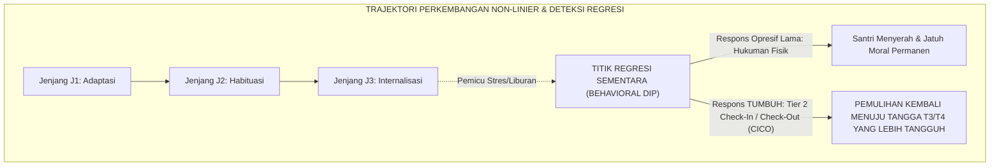
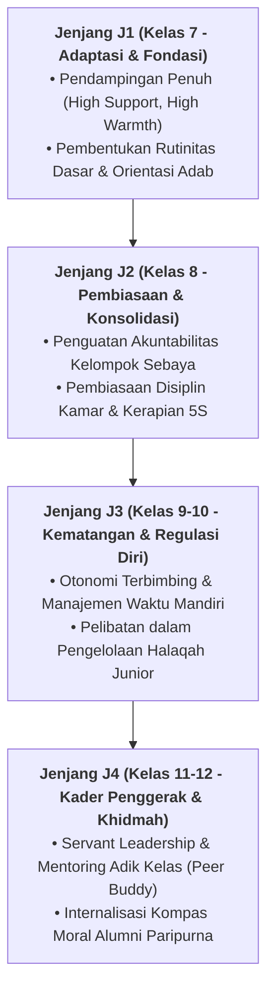

# DINAMIKA TRANSISI & PENANGANAN REGRESI KARAKTER

---
### Perkembangan Karakter Bukanlah Garis Lurus yang Mulus

Salah satu ilusi terbesar dalam evaluasi pendidikan karakter adalah asumsi keliru bahwa pertumbuhan moral santri bergerak secara linier lurus dari hari ke hari tanpa pernah mengalami kemunduran.

Sains psikologi perkembangan dan konsensus PBIS membuktikan bahwa **pertumbuhan karakter manusia bersifat non-linier dan berfluktuasi**:
* Seorang santri yang telah mencapai Jenjang J2 atau T3 sewaktu-waktu dapat mengalami **Regresi Perilaku (*Behavioral Regression / Dip*)**: mendadak kembali malas bangun subuh, melanggar kerapian loker, atau tersulut amarah di bilik asrama.
* Regresi ini kerap dipicu oleh faktor transisi lingkungan: pasca-liburan panjang pulang ke rumah (*post-holiday shock*), kelelahan fisik menjelang pekan ujian (*exam fatigue*), kabar duka keluarga, atau konflik relasi dengan kawan sekamar.

<b>Gambar 4.5.1:</b> Trajektori Fluktuasi Pertumbuhan Karakter dan Respons Pemulihan Tier 2 PBIS.

Pakar intervensi perilaku **G. Alan Marlatt & Judith R. Gordon**[^1] dalam *Relapse Prevention Model* menegaskan bahwa kemunduran sementara (*lapse*) bukanlah sebuah kegagalan total, melainkan titik evaluasi yang membutuhkan penyesuaian strategi koping dan penguatan kembali jaring pengaman lingkungan.

---

### Protokol Penyangga Scaffolding Tier 2: Check-In / Check-Out (CICO)

Ketika santri terdeteksi mengalami regresi perilaku, Sistem TUMBUH tidak melayangkan hukuman atau vonis kegagalan, melainkan mengaktifkan **Protokol Penyangga Tier 2 PBIS (*Check-In / Check-Out System*)**[^2] melalui tahapan:

1. **Morning Check-In (05.30 WIB)**: Musyrif menyapa santri secara personal, menanyakan target harian, dan memberikan kata-kata motivasi yang menguatkan tekadnya.
2. **Daily Teacher Rating**: Guru madrasah memberikan paraf apresiasi positif atas usaha adab santri di kelas.
3. **Evening Check-Out (20.30 WIB)**: Musyrif bersama santri merefleksikan catatan harian dengan hangat, mengapresiasi keberhasilan kecil, dan mendoakan keberkahan istirahat malamnya.

Melalui pendampingan terstruktur 2–4 pekan ini, lebih dari 90% santri yang mengalami regresi mampu bangkit kembali dan mengukuhkan posisinya di tangga kapasitas yang lebih tinggi.

---

### Wawasan Turats: Fenomena *Fathrah* dalam Ibadah

Fluktuasi semangat beradab ini selaras dengan hadits agung Rasulullah SAW:
$$\text{إِنَّ لِكُلِّ عَمَلٍ شِرَّةً، وَلِكُلِّ شِرَّةٍ فَتْرَةً، فَمَنْ كَانَتْ فَتْرَتُهُ إِلَى سُنَّتِي فَقَدِ اهْتَدَى، وَمَنْ كَانَتْ إِلَى غَيْرِ ذَلِكَ فَقَدْ هَلَكَ}$$
*"Sesungguhnya bagi setiap amal ada masa semangat menggelora (*Syirrah*), dan bagi setiap masa semangat ada masa kejenuhan/keletihan (*Fathrah*). Barangsiapa yang masa fathrah-nya tetap berada di atas sunnahku, maka ia telah mendapat petunjuk; dan barangsiapa yang fathrah-nya tergelincir kepada selain itu, maka ia telah binasa!"* (HR. Ahmad no. 6764 dan Ibnu Hibban no. 11).

**Al-Imam Ibn al-Qayyim al-Jawziyyah** dalam *Madarij as-Salikin*[^3] menjelaskan bahwa masa *fathrah* adalah hukum alamiah jiwa (*sunnatun nafsiyyah*) yang harus dipahami oleh para murabbi; tugas pendidik pada masa fathrah adalah merangkul santri dengan kelembutan agar ia tidak terlempar keluar dari batas syariat.

---

## 📌 Catatan Kaki & Rujukan Primer

[^1]: **G. Alan Marlatt & Judith R. Gordon** (Eds.), *Relapse Prevention: Maintenance Strategies in the Treatment of Addictive Behaviors* (New York: Guilford Press, 1985; Edisi ke-2, 2005), Bab 1: "Relapse Prevention: Theoretical Rationale and Overview", hlm. 1–45.
[^2]: **Leanne S. Hawken, Cynthia M. Anderson, & Donald P. Crone**, *Responding to Problem Behavior in Schools: The Behavior Education Program (Check-In, Check-Out)* (New York: Guilford Press, 2014; Edisi ke-2), Bab 2: "The BEP/CICO Process", hlm. 15–48.
[^3]: **Al-Imam Syamsuddin Muhammad bin Abi Bakr Ibnu Qayyim al-Jawziyyah**, *Madarij as-Salikin bayna Manazil Iyyaka Na'budu wa Iyyaka Nasta'in*, Tahqiq: Muhammad al-Mu'tashim Billah al-Baghdadi (Beirut: Dar al-Kitab al-'Arabi, 1416 H), Jilid I: "Manzilat ash-Shidq wa Dawam al-Amal", hlm. 115–138.

---

### IV. Pembedahan Kapasitas Lanjutan & Trajektori Progresi Dinamika Transisi & Penanganan Regresi Karakter

Pengembangan kompetensi **DINAMIKA TRANSISI & PENANGANAN REGRESI KARAKTER** pada santri memerlukan strategi diferensiasi yang selaras dengan tahapan usia perkembangan remaja (*Developmental Milestones*):

1. **Dekomposisi Indikator Kematangan Perilaku**:
   Untuk memastikan karakter **DINAMIKA TRANSISI & PENANGANAN REGRESI KARAKTER** tertanam secara operasional, dewan asatidz dan musyrif memetakan indikator perilakunya ke dalam 3 ranah capaian:
   * **Ranah Kognitif-Reflektif (*Ma'rifah*)**: Santri memahami dalil syar'i, urgensi akhlak, dan konsekuensi logis dari setiap pilihannya.
   * **Ranah Afektif-Ruhiyyah (*Wijdan*)**: Tumbuhnya kepekaan nurani, rasa malu berbuat dosa (*Haya'*), dan kenikmatan dalam berbuat kebajikan.
   * **Ranah Psikomotorik-Habituasi (*'Amal*)**: Terwujudnya keterampilan bertindak nyata secara spontan, konsisten, dan mandiri tanpa perlu disuruh.

2. **Matriks Penahapan Lintas Jenjang Kemandirian (J1–J4)**:

3. **Rubrik Evaluasi Kualitatif & Indikator Pencapaian**:

| Level Kemandirian | Karakteristik Perilaku Teramati (*Behavioral Anchor*) | Pendekatan Bimbingan Musyrif |
| :--- | :--- | :--- |
| **Level 1 (Emerging)** | Memerlukan instruksi berulang dan pengawasan langsung musyrif. | *Direct Prompting* & pengingat visual harian. |
| **Level 2 (Developing)** | Mampu menjalankan adab saat diingatkan oleh teman sebaya. | Penguatan positif melalui pujian deskriptif. |
| **Level 3 (Proficient)** | Menjalankan adab secara mandiri dan konsisten tanpa diawasi. | Pemberian kepercayaan dan peran tanggung jawab kamar. |
| **Level 4 (Exemplary)** | Menjadi teladan (*Qudwah*) dan mampu membimbing kawan-kawannya. | Pelibatan aktif dalam struktur Dewan Santri & Mentor. |

---

### V. Panduan Praksis Pendampingan Musyrif di Asrama

Agar penanaman **DINAMIKA TRANSISI & PENANGANAN REGRESI KARAKTER** berhasil maksimal di lapangan, musyrif disarankan menerapkan protokol pendampingan berikut:
* **Fokus pada Usaha (*Effort-Oriented Praise*)**: Berikan apresiasi atas proses perjuangan santri dalam memperbaiki diri, bukan semata-mata hasil akhir yang sempurna.
* **Dialog Sokratik Saat Santri Mengalami Kesulitan**: Ajukan pertanyaan reflektif seperti: *"Apa yang membuat antum merasa berat menjalankan adab ini hari ini? Bagaimana kita bisa mengatasinya bersama besok?"*
* **Menjaga Iklim Ukhuwah Bebas Perundungan**: Pastikan senioritas dimaknai sebagai amanah pengayoman dan perlindungan kepada yang lebih muda, bukan hak istimewa untuk memerintah.
