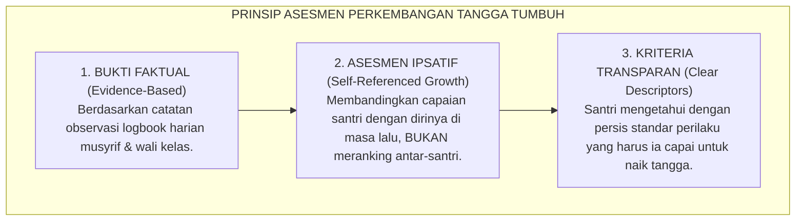
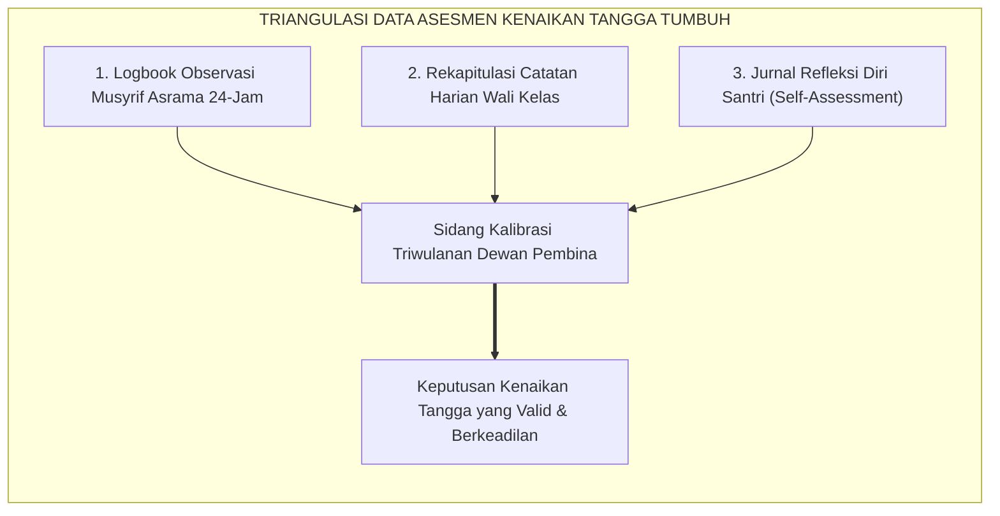
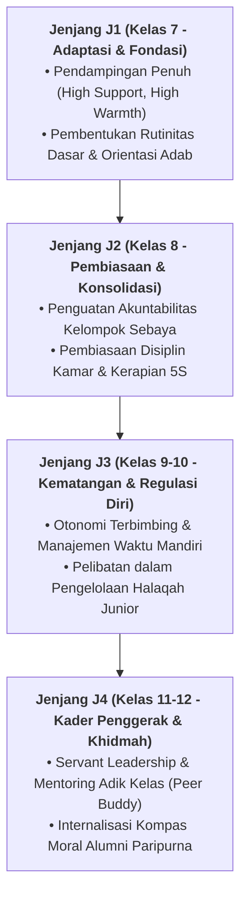

# MATRIKS RUBRIK INDIKATOR KENAIKAN J1–J4

---
### Menghapus Bias Subjektivitas dalam Penilaian Karakter Santri

Di banyak lembaga pendidikan tradisional, penilaian akhlak santri kerap kali dinodai oleh dua kelemahan fatal:
1. **Subjektivitas Guru (*Halo Effect / Favoritisme*)**: Santri yang pandai mengambil hati guru atau anak dari tokoh terpandang otomatis diberi nilai akhlak "A", sementara santri pendiam atau yang pernah berbuat khilaf dicap "nakal" seumur hidup.
2. **Ketiadaan Indikator Perilaku yang Terukur (*Lack of Behavioral Clarity*)**: Nilai adab di rapor hanya berupa huruf abstrak tanpa deskripsi jelas apa yang harus diperbaiki dan bagaimana cara mencapainya.

Ekosistem TUMBUH memecahkan kebuntuan ini melalui **Matriks Rubrik Indikator Kenaikan Jenjang J1–J4**: sebuah panduan observasi berbasis bukti faktual (*evidence-based behavioral descriptors*) yang memetakan perkembangan nyata santri dalam ritme kehidupan 24 jam.

<b>Gambar 4.5.1:</b> Tiga Prinsip Utama Sistem Asesmen Perkembangan Jenjang Kemandirian TUMBUH (J1–J4).

Pakar desain asesmen pendidikan **Grant Wiggins & Jay McTighe**[^1] dalam *Understanding by Design* menegaskan bahwa rubrik yang efektif harus mendeskripsikan kualitas performa secara objektif, menghindari kata-kata sifat yang ambigu, dan menjadi alat panduan belajar bagi peserta didik (*assessment as learning*).

---

### Matriks Komprehensif: Deskriptor Perilaku Jenjang J1 hingga T4

Tabel berikut menyajikan matriks rubrik operasional lintas 5 dimensi kapasitas pada setiap tingkatan tangga perkembangan:

| Dimensi Kapasitas | Jenjang J1 (Adaptasi) | Jenjang J2 (Habituasi) | Jenjang J3 (Internalisasi) | Jenjang J4 (Transformasi) |
| :--- | :--- | :--- | :--- | :--- |
| **1. Ruhaniyyah (Spiritual)** | Mengenal jadwal shalat; butuh diingatkan musyrif untuk ke masjid. | Shalat berjamaah tepat waktu secara rutin; membaca wirid ba'da shalat. | Hadir shaf pertama atas inisiatif sendiri; istiqamah dhuha & qiyamul lail. | Membangunkan kawan dengan santun; menjadi imam/muadzin teladan asrama. |
| **2. Wijdaniyyah (Sosio-Emosional)** | Mengatasi rasa homesick; mengenal nama teman sekamar. | Mampu menahan amarah saat berselisih; meminta maaf jika salah. | Berani menolak ajakan buruk sebaya; proaktif mendamaikan perselisihan. | Menjadi mentor sebaya (*peer mentor*); memimpin lingkaran restoratif kamar. |
| **3. Aqliyyah (Kognitif)** | Mengikuti halaqah kitab; mencatat makna dasar (*makna gandul*). | Mengulang pelajaran mandiri (*muthala'ah*) 45 menit per hari. | Mampu menganalisis dalil secara kritis; aktif berdiskusi argumentatif santun. | Membimbing adik kelas dalam memahami matan kitab nahwu-sharaf. |
| **4. Jasadiyyah (Fisik-Motorik)** | Mengenal alur wudhu & sanitasi; membersihkan kamar saat disuruh. | Melaksanakan tugas piket kamar mandiri; pakaian dan tubuh bersih. | Menjaga kebersihan kamar tanpa disuruh; tidur tepat waktu pukul 22.00 WIB. | Memelopori budaya hidup sehat asrama; menginisiasi bank sampah pondok. |
| **5. Mahariyyah (Vokasional)** | Menata pakaian di loker dengan panduan; mengelola uang saku harian. | Menata loker rapi standar 5S; mencuci pakaian pribadi secara mandiri. | Mengelola anggaran keuangan mingguan; menjaga fasilitas umum asrama. | Mengelola unit kegiatan santri; memimpin kepanitiaan program komunal. |

---

### Verifikasi Objektif & Kalibrasi Penilai (*Rater Reliability*)

Pakar Positive Behavioral Interventions and Supports (SW-PBIS) **Robert H. Horner & George Sugai**[^2] menekankan pentingnya reliabilitas penilai (*inter-rater reliability*) agar evaluasi perilaku di sekolah berasrama bebas dari bias personal.

Dalam sistem TUMBUH di pesantren:
* Penentuan kenaikan tangga santri (misalnya dari T1 ke T2, atau dari T2 ke T3) dilakukan melalui **Sidang Dewan Pembina Asrama Triwulanan**.
* Keputusan kenaikan didasarkan pada triangulasi data: **Logbook Observasi Harian Musyrif + Rekap Wali Kelas Madrasah + Jurnal Refleksi Mandiri Santri**.
* Santri yang belum memenuhi indikator tidak dihukum atau direndahkan, melainkan diberikan **Dukungan Intervensi Terarah (Tier 2 Mentoring)** pada dimensi yang masih memerlukan penguatan.

<b>Gambar 4.5.2:</b> Alur Triangulasi Data dalam Penentuan Kenaikan Tangga Karakter Santri.

---

### Landasan Turats: Keadilan Timbangan Amal (*Mizanul Adab*)

Prinsip keadilan dan transparansi penilaian ini merupakan perwujudan dari ajaran moral Turats Islam.

**Al-Imam ar-Raghib al-Isfahani** dalam *Adz-Dzari'ah ila Makarim asy-Syari'ah*[^3] menegaskan bahwa tahapan penyempurnaan akhlak manusia bergerak secara gradual: dari keterpaksaan awal (*al-Qasr*), menuju kebiasaan lahiriah (*al-I'tiyad*), kemudian penghayatan akal (*at-Tafaqquh*), hingga mencapai derajat hikmah dan keteladanan tertinggi (*al-Hikmah wal Qudwah*).

**Hujjatul Islam Imam Abu Hamid Al-Ghazali** dalam *Mizan al-'Amal*[^4] menggarisbawahi bahwa menimbang amal perbuatan dengan ukuran yang presisi adalah syarat mutlak untuk mendiagnosis penyakit jiwa dan merumuskan terapi penyembuhannya secara tepat.

---

### Solusi Sistemik TUMBUH: Perayaan Capaian Karakter (*Growth Milestone Celebration*)

Setiap kali seorang santri dinyatakan resmi naik tangga (misalnya dilantik dari Jenjang J2 ke Jenjang J3):
* Lembaga mengadakan **Upacara Perayaan Pertumbuhan (*Growth Milestone Assembly*)**.
* Santri disematkan pin lencana tangga barunya dan mendapatkan doa tulus dari para kiai dan musyrif.
* Perayaan ini memberikan penguatan dopamin alami dan kebanggaan spiritual yang membakar semangat seluruh santri untuk terus bertumbuh meraih kemuliaan adab.

Dengan berakhirnya Bab 04 ini, arsitektur tangga perkembangan karakter J1–J4 telah berdiri kokoh, siap mengantarkan santri menuju puncak kepemimpinan peradaban pada **Bab 05: Puncak Perkembangan: Tahap 7 PENGGERAK dalam Kontinuum 10-Tahap**.

---

## 📌 Catatan Kaki & Rujukan Primer

[^1]: **Grant Wiggins & Jay McTighe**, *Understanding by Design* (Alexandria: Association for Supervision and Curriculum Development / ASCD, 1998; Edisi ke-2, 2005), Bab 8: "Criteria and Validity", hlm. 173–204.
[^2]: **Robert H. Horner & George Sugai**, "School-wide positive behavioral interventions and supports: The research base on implementation with fidelity", *Exceptionality*, Vol. 23, No. 4 (2015), hlm. 197–212; serta **George Sugai & Robert H. Horner**, *School-Wide PBIS Tiered Fidelity Inventory (TFI)* (Eugene: University of Oregon, 2017).
[^3]: **Al-Imam ar-Raghib al-Isfahani**, *Adz-Dzari'ah ila Makarim asy-Syari'ah*, Tahqiq: Dr. Abu al-Yazid Abu Zaid al-'Ajami (Kairo: Dar as-Salam, 2007), Bab 2: "Fi Maratib al-Insan", hlm. 95–130.
[^4]: **Hujjatul Islam Imam Abu Hamid al-Ghazali**, *Mizan al-'Amal*, Tahqiq: Dr. Sulaiman Dunya (Kairo: Dar al-Ma'arif, 1964), Bab 1: "Fi Bayani 'Ilmi Akhlaq", hlm. 25–48.

---

### IV. Pembedahan Kapasitas Lanjutan & Trajektori Progresi Matriks Rubrik Indikator Kenaikan J1–J4

Pengembangan kompetensi **MATRIKS RUBRIK INDIKATOR KENAIKAN J1–J4** pada santri memerlukan strategi diferensiasi yang selaras dengan tahapan usia perkembangan remaja (*Developmental Milestones*):

1. **Dekomposisi Indikator Kematangan Perilaku**:
   Untuk memastikan karakter **MATRIKS RUBRIK INDIKATOR KENAIKAN J1–J4** tertanam secara operasional, dewan asatidz dan musyrif memetakan indikator perilakunya ke dalam 3 ranah capaian:
   * **Ranah Kognitif-Reflektif (*Ma'rifah*)**: Santri memahami dalil syar'i, urgensi akhlak, dan konsekuensi logis dari setiap pilihannya.
   * **Ranah Afektif-Ruhiyyah (*Wijdan*)**: Tumbuhnya kepekaan nurani, rasa malu berbuat dosa (*Haya'*), dan kenikmatan dalam berbuat kebajikan.
   * **Ranah Psikomotorik-Habituasi (*'Amal*)**: Terwujudnya keterampilan bertindak nyata secara spontan, konsisten, dan mandiri tanpa perlu disuruh.

2. **Matriks Penahapan Lintas Jenjang Kemandirian (J1–J4)**:

3. **Rubrik Evaluasi Kualitatif & Indikator Pencapaian**:

| Level Kemandirian | Karakteristik Perilaku Teramati (*Behavioral Anchor*) | Pendekatan Bimbingan Musyrif |
| :--- | :--- | :--- |
| **Level 1 (Emerging)** | Memerlukan instruksi berulang dan pengawasan langsung musyrif. | *Direct Prompting* & pengingat visual harian. |
| **Level 2 (Developing)** | Mampu menjalankan adab saat diingatkan oleh teman sebaya. | Penguatan positif melalui pujian deskriptif. |
| **Level 3 (Proficient)** | Menjalankan adab secara mandiri dan konsisten tanpa diawasi. | Pemberian kepercayaan dan peran tanggung jawab kamar. |
| **Level 4 (Exemplary)** | Menjadi teladan (*Qudwah*) dan mampu membimbing kawan-kawannya. | Pelibatan aktif dalam struktur Dewan Santri & Mentor. |

---

### V. Panduan Praksis Pendampingan Musyrif di Asrama

Agar penanaman **MATRIKS RUBRIK INDIKATOR KENAIKAN J1–J4** berhasil maksimal di lapangan, musyrif disarankan menerapkan protokol pendampingan berikut:
* **Fokus pada Usaha (*Effort-Oriented Praise*)**: Berikan apresiasi atas proses perjuangan santri dalam memperbaiki diri, bukan semata-mata hasil akhir yang sempurna.
* **Dialog Sokratik Saat Santri Mengalami Kesulitan**: Ajukan pertanyaan reflektif seperti: *"Apa yang membuat antum merasa berat menjalankan adab ini hari ini? Bagaimana kita bisa mengatasinya bersama besok?"*
* **Menjaga Iklim Ukhuwah Bebas Perundungan**: Pastikan senioritas dimaknai sebagai amanah pengayoman dan perlindungan kepada yang lebih muda, bukan hak istimewa untuk memerintah.
