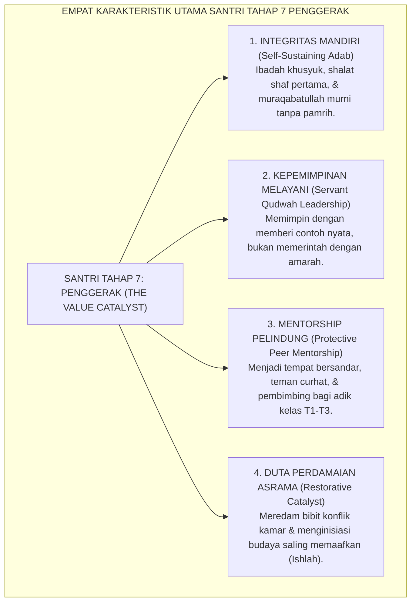
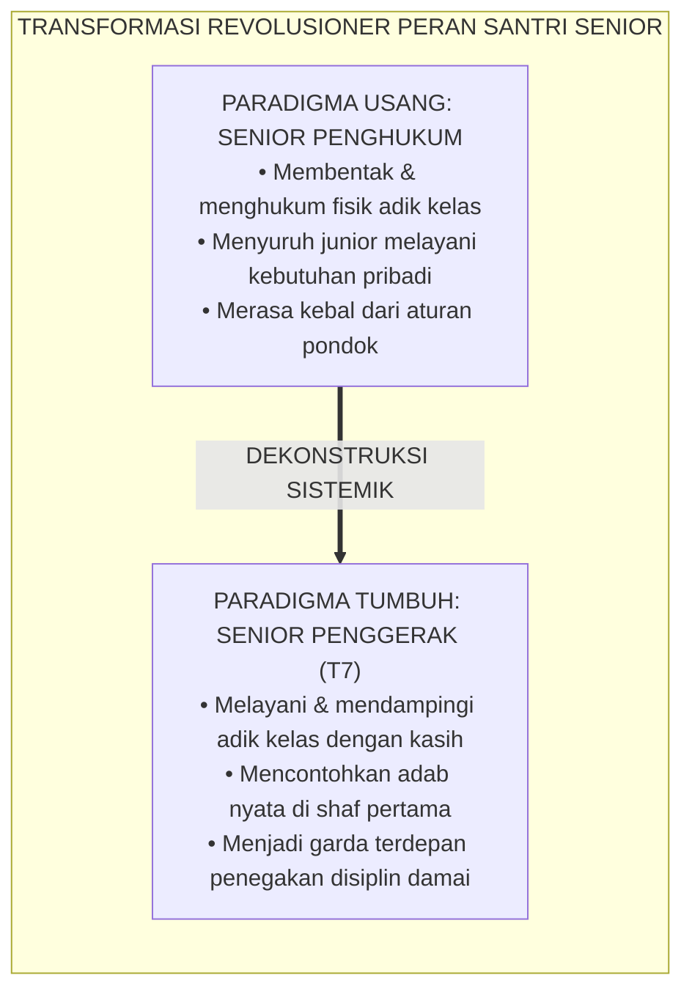
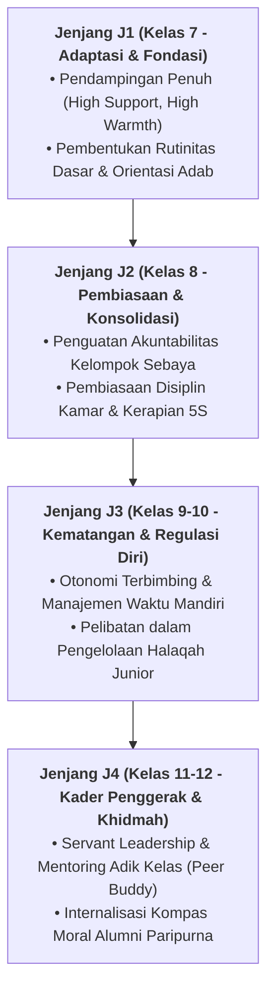

# KARAKTERISTIK SANTRI TAHAP 7 PENGGERAK

---
### Puncak Tangga Perkembangan Santri dalam Ekosistem TUMBUH

Dalam Kontinuum Perkembangan Longitudinal 10-Tahap Ekosistem TUMBUH (yang membentang dari Tahap 1 Santri Baru hingga Tahap 10 Pengasuh Sepuh), **Tahap 7: PENGGERAK** adalah **puncak capaian tertinggi (*culmination milestone*) bagi seorang santri** sebelum ia resmi bertransisi menjadi asatidz atau berkiprah di tengah masyarakat luas.

Santri Tahap 7 biasanya adalah santri kelas akhir (Kelas 12 MA/SMA) atau santri yang sedang menjalani masa pengabdian (*Tahun Khidmah*).

Santri pada tahap ini telah melampaui fase belajar adab dasar; mereka adalah sosok yang:
* **Memiliki integritas moral otonom**: menjaga adab secara konsisten tanpa perlu diawasi musyrif.
* **Memancarkan keteladanan hidup (*Living Qudwah*)**: menjadi magnet kebaikan yang menginspirasi adik-adik kelasnya.
* **Mendedikasikan hidupnya untuk melayani (*Servant Leadership*)**: memimpin dengan kerendahan hati (*tawadhu'*), keadilan, dan kasih sayang.

<b>Gambar 5.1.1:</b> Empat Karakteristik Utama Santri Tahap 7 Penggerak Ekosistem TUMBUH.

Pakar kepemimpinan pelayan **Robert K. Greenleaf**[^1] menegaskan bahwa pemimpin sejati adalah mereka yang memulai kiprahnya dengan dorongan alami untuk melayani (*the natural feeling that one wants to serve first*), bukan dorongan untuk berkuasa atau mengintimidasi orang lain.

---

### Dekonstruksi Paradigma "Senioritas Penguasa"

Di banyak pondok pesantren tradisional usang, santri kelas akhir kerap kali mengalami degradasi peran:
* Merasa sebagai "kasta tertinggi" yang bebas dari aturan pondok: boleh bangun terlambat, boleh melanggar jadwal shalat, dan boleh menyuruh adik kelas mencucikan bajunya.
* Melestarikan tradisi sidang malam ilegal dan pemukulan fisik berkedok "menegakkan disiplin pondok".

Sistem TUMBUH meruntuhkan ilusi kekuasaan feodal ini. Dalam sistem TUMBUH di pesantren:
* **Semakin tinggi kelas santri, semakin berat tuntutan keteladanan adabnya (*Al-Qudwah bil Qudwah*)**.
* Santri Tahap 7 tidak diukur dari seberapa keras suaranya membentak junior, melainkan dari **seberapa bersih toilet asrama yang ia bersihkan bersama adik kelasnya dan seberapa lembut sapaannya saat membangunkan santri baru di waktu subuh**.

Pakar psikologi perundungan internasional **Dan Olweus**[^2] membuktikan bahwa ketika figur senior sekolah bertransformasi dari pelaku dominasi menjadi pelindung junior, angka perundungan (*bullying*) di institusi tersebut anjlok hingga lebih dari 85% secara permanen.

---

### Integrasi Turats: Hakikat Kepemimpinan *Khadimul Ummah*

Konsep kepemimpinan melayani pada Tahap 7 Penggerak berakar pada sabda Baginda Rasulullah SAW yang monumental:
$$\text{سَيِّدُ الْقَوْمِ خَادِمُهُمْ}$$
*"Pemimpin sejati dari suatu kaum adalah pelayan bagi kaumnya!"* (HR. Al-Baihaqi dalam *Syu'abul Iman* no. 8634).

**Hujjatul Islam Imam Abu Hamid Al-Ghazali** dalam *Ihya' 'Ulumiddin* (Kitab *al-Amr bil Ma'ruf wan Nahy 'anil Munkar*)[^3] menegaskan bahwa penegak kebaikan wajib memiliki sifat *Rifq* (kelembutan): tidak boleh menegur orang lain dengan nada sombong yang menganggap dirinya lebih suci, melainkan dengan rasa belas kasih laksana seorang dokter yang sedang mengobati luka pasiennya.

<b>Gambar 5.1.2:</b> Transformasi Revolusioner Peran Santri Senior Menjadi Penggerak Tahap 7.

**Al-Imam Abu al-Hasan al-Mawardi** dalam *Al-Ahkam as-Sulthaniyyah*[^4] menggarisbawahi bahwa kepemimpinan yang membawa berkah adalah kepemimpinan yang dibangun di atas keadilan (*al-'Adalah*) dan kepedulian tulus terhadap kesejahteraan rakyat yang dipimpinnya.

---

### Solusi Sistemik TUMBUH: Peran Fungsional Santri Tahap 7 di Asrama

Di ekosistem TUMBUH, Santri Tahap 7 Penggerak menjalankan amanah strategis:
1. **Ketua Dewan Musyawarah Santri (*Majlis Syura Santri*)**: Mewakili aspirasi santri dalam merumuskan program kegiatan asrama yang memberdayakan dan inklusif.
2. **Fasilitator Lingkaran Perdamaian (*Peace Circle Facilitator*)**: Mendampingi musyrif dalam memediasi perselisihan kecil antarsantri junior dengan pendekatan keadilan restoratif.
3. **Pelopor Inovasi Komunal**: Memimpin proyek-proyek kreativitas pondok (seperti festival seni Islam, klub riset sains santri, dan gerakan ramah lingkungan hijau).

Santri Tahap 7 Penggerak membuktikan bahwa kemuliaan santri sejati terletak pada **keikhlasannya menjadi lentera penerang bagi sekitarnya**: menuntun adik-adiknya menuju keselamatan fitrah dan kemuliaan adab nabawi.

---

## 📌 Catatan Kaki & Rujukan Primer

[^1]: **Robert K. Greenleaf**, *The Servant as Leader* (Newton Centre: Robert K. Greenleaf Center, 1970; cetak ulang 2008), hlm. 1–35.
[^2]: **Dan Olweus**, *Bullying at School: What We Know and What We Can Do* (Oxford: Blackwell Publishing, 1993), Bab 5: "The Bullying Prevention Program", hlm. 64–98.
[^3]: **Hujjatul Islam Imam Abu Hamid al-Ghazali**, *Ihya' 'Ulumiddin*, Kitab al-Amr bil Ma'ruf wan Nahy 'anil Munkar (Kairo & Beirut: Dar al-Ma'rifah, t.th.), Jilid II, hlm. 305–332.
[^4]: **Al-Imam Abu al-Hasan Ali bin Muhammad al-Mawardi**, *Al-Ahkam as-Sulthaniyyah wal Wilayat ad-Diniyyah*, Tahqiq: Dr. Ahmad Mubarak al-Baghdadi (Kuwait: Dar Ibn Qutaibah, 1989), Bab 1: "Aqd al-Imamah", hlm. 12–28.

---

### IV. Pembedahan Kapasitas Lanjutan & Trajektori Progresi Karakteristik Santri Tahap 7 Penggerak

Pengembangan kompetensi **KARAKTERISTIK SANTRI TAHAP 7 PENGGERAK** pada santri memerlukan strategi diferensiasi yang selaras dengan tahapan usia perkembangan remaja (*Developmental Milestones*):

1. **Dekomposisi Indikator Kematangan Perilaku**:
   Untuk memastikan karakter **KARAKTERISTIK SANTRI TAHAP 7 PENGGERAK** tertanam secara operasional, dewan asatidz dan musyrif memetakan indikator perilakunya ke dalam 3 ranah capaian:
   * **Ranah Kognitif-Reflektif (*Ma'rifah*)**: Santri memahami dalil syar'i, urgensi akhlak, dan konsekuensi logis dari setiap pilihannya.
   * **Ranah Afektif-Ruhiyyah (*Wijdan*)**: Tumbuhnya kepekaan nurani, rasa malu berbuat dosa (*Haya'*), dan kenikmatan dalam berbuat kebajikan.
   * **Ranah Psikomotorik-Habituasi (*'Amal*)**: Terwujudnya keterampilan bertindak nyata secara spontan, konsisten, dan mandiri tanpa perlu disuruh.

2. **Matriks Penahapan Lintas Jenjang Kemandirian (J1–J4)**:

3. **Rubrik Evaluasi Kualitatif & Indikator Pencapaian**:

| Level Kemandirian | Karakteristik Perilaku Teramati (*Behavioral Anchor*) | Pendekatan Bimbingan Musyrif |
| :--- | :--- | :--- |
| **Level 1 (Emerging)** | Memerlukan instruksi berulang dan pengawasan langsung musyrif. | *Direct Prompting* & pengingat visual harian. |
| **Level 2 (Developing)** | Mampu menjalankan adab saat diingatkan oleh teman sebaya. | Penguatan positif melalui pujian deskriptif. |
| **Level 3 (Proficient)** | Menjalankan adab secara mandiri dan konsisten tanpa diawasi. | Pemberian kepercayaan dan peran tanggung jawab kamar. |
| **Level 4 (Exemplary)** | Menjadi teladan (*Qudwah*) dan mampu membimbing kawan-kawannya. | Pelibatan aktif dalam struktur Dewan Santri & Mentor. |

---

### V. Panduan Praksis Pendampingan Musyrif di Asrama

Agar penanaman **KARAKTERISTIK SANTRI TAHAP 7 PENGGERAK** berhasil maksimal di lapangan, musyrif disarankan menerapkan protokol pendampingan berikut:
* **Fokus pada Usaha (*Effort-Oriented Praise*)**: Berikan apresiasi atas proses perjuangan santri dalam memperbaiki diri, bukan semata-mata hasil akhir yang sempurna.
* **Dialog Sokratik Saat Santri Mengalami Kesulitan**: Ajukan pertanyaan reflektif seperti: *"Apa yang membuat antum merasa berat menjalankan adab ini hari ini? Bagaimana kita bisa mengatasinya bersama besok?"*
* **Menjaga Iklim Ukhuwah Bebas Perundungan**: Pastikan senioritas dimaknai sebagai amanah pengayoman dan perlindungan kepada yang lebih muda, bukan hak istimewa untuk memerintah.
