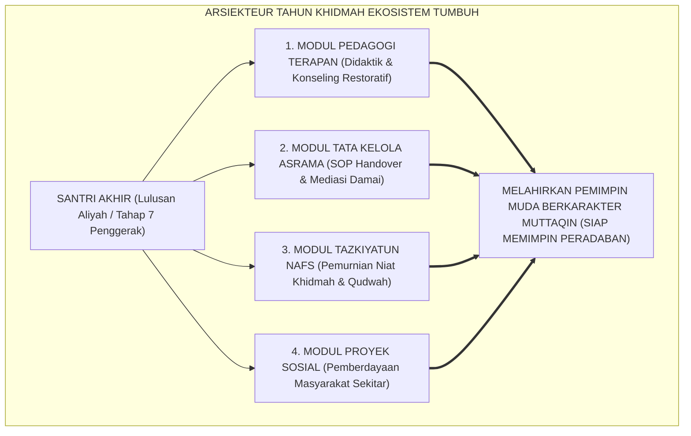

# SUB-BAB 5.2: DESAIN PROGRAM TAHUN KHIDMAH (INKUBASI KEPEMIMPINAN)
## *Rekayasa Tahun Pengabdian Santri Akhir sebagai Laboratorium Inkubasi Kepemimpinan, Pedagogi Terapan, dan Kematangan Moral*

**Kode Klasifikasi**: `BOOK-02/BAB-05/SUB-02/MONOGRAF-MASTER-VIBRANT`  
**Disiplin Ilmu**: Desain Program Pengabdian (*Service Learning*), Manajemen Kepemimpinan Pesantren, & Teori Pembelajaran Magang (*Apprenticeship*)  
**Penanggung Jawab Keilmuan**: Dewan Pakar Ekosistem TUMBUH (*Pakar Tata Kelola Qudwah & Pakar Pedagogi Guru*)

---

### Makna Sakral Khidmah: Mengapa Santri Akhir Wajib Mengabdi?

Di dalam tradisi agung pesantren Nusantara, terdapat sebuah kearifan lokal yang tidak ternilai harganya: **Masa Pengabdian Santri Akhir (*Tahun Khidmah*)**.

Setelah menuntaskan seluruh kurikulum hafalan Al-Qur'an dan kitab kuning di tingkat madrasah aliyah, para santri akhir tidak langsung dilepas pulang ke rumah. Mereka diwajibkan menjalani satu hingga dua tahun masa pengabdian (*Khidmah*) di pondok induk atau di pondok cabang di pelosok Nusantara.

Namun, di era modern, banyak lembaga pesantren kehilangan ruh hakiki dari program ini:
* Santri pengabdian kerap kali hanya diperlakukan sebagai "tenaga kerja murah (*buruh penjaga barak*)" yang dibebani tugas-tugas administratif melelahkan tanpa pelatihan pedagogi yang memadai.
* Akibatnya, santri pengabdian rentan mengalami kelelahan mental (*early burnout*), meniru pola kekerasan pengurus lama, atau kehilangan keikhlasan beramal.

Sistem TUMBUH merekonstruksi Tahun Khidmah menjadi **Laboratorium Inkubasi Kepemimpinan Transformatif (*Transformational Leadership Incubator*)**:

<b>Gambar 5.2.1:</b> Arsitektur Modul Pelatihan Inkubasi Kepemimpinan Tahun Khidmah TUMBUH.

Pakar organisasi pembelajar **Peter M. Senge**[^1] menegaskan bahwa organisasi yang bertumbuh secara berkelanjutan adalah organisasi yang mampu membangun kepemimpinan bersama (*shared leadership*) melalui proses magang kepemimpinan nyata (*practicing the disciplines of personal mastery and mental models*).

---

### Kurikulum Pembekalan 4-Pilar bagi Santri Tahun Khidmah

Sebelum diterjunkan mengasuh adik-adik kelasnya di asrama, santri Tahap 7 Penggerak wajib menempuh **Pelatihan Intensif Khidmah 14 Hari**:

1. **Pilar 1: Keterampilan Pedagogi & Konseling Restoratif**:  
   Mempelajari teknik de-eskalasi emosi, prinsip *Firm and Kind*, cara memfasilitasi lingkaran restoratif (*restorative circles*), dan seni membimbing setoran hafalan tanpa bentakan.
2. **Pilar 2: Standar Operasional Pengasuhan 24-Jam**:  
   Memahami SOP mitigasi titik rawan (*Zero Hotspots*), protokol tanggap darurat medis, dan tata cara serah terima data harian (*Protokol Handover 15-Menit*).
3. **Pilar 3: Tazkiyatun Niyyah & Ketahanan Mental**:  
   Menata niat suci berkhidmah lillahi ta'ala, melatih keikhlasan saat diremehkan, dan membiasakan amalan qiyamul lail serta doa mustajab bagi santri binaannya.
4. **Pilar 4: Manajemen Proyek & Khidmah Kemasyarakatan**:  
   Merancang program pengabdian nyata bagi masyarakat desa di sekitar pondok (seperti mengajar TPA gratis, bakti sosial, dan pendampingan literasi).

---

### Wawasan Turats: Hakikat Khidmah Guru & Masyaikh Ulama Salaf

Masa pengabdian ini berakar kokoh pada tradisi *Mulazamah* dan *Khidmah* yang dipraktikkan oleh para imam agung peradaban Islam.

**Al-Khathib al-Baghdadi** dalam karyanya *Al-Jami' li Akhlaq ar-Rawi wa Adab as-Sami'*[^2] meriwayatkan bahwa para ulama hadits terkemuka senantiasa mendahulukan khidmah (melayani kebutuhan guru dan lembaga) sebelum mereka mulai menyebarkan hadits ke seluruh penjuru dunia:

> [!NOTE]
> ### 📜 Mutiara Hikmah Salaf tentang Keberkahan Khidmah:
> 
> $$\text{قَالَ بَعْضُ الْعُلَمَاءِ: مَنْ خَدَمَ الْعِلْمَ وَأَهْلَهُ، نَالَ مِنَ الْبَرَكَةِ وَالرِّفْعَةِ مَا لَا يَنَالُهُ بِكَثْرَةِ الْحِفْظِ وَالْمُطَالَعَةِ وَحْدَهَا}$$
> 
> **Artinya:**  
> *"Sebagian ulama menegaskan: 'Barangsiapa yang berkhidmah melayani ilmu dan para penuntut ilmu dengan penuh keikhlasan, niscaya ia akan memperoleh keberkahan dan derajat kemuliaan yang tidak akan pernah bisa diraih semata-mata dengan banyaknya hafalan dan ketekunan membaca kitab saja.'"*

**Al-Imam Yahya bin Syaraf an-Nawawi** dalam *At-Tibyan fi Adab Hamalatil Qur'an*[^3] menggarisbawahi bahwa seorang pengajar Al-Qur'an wajib berakhlak mulia, tidak mengharap upah duniawi dari murid-muridnya, dan memandang tugas mengajar sebagai amanah pelayanan (*Khidmah*) kepada kalamullah.

Pendiri Pondok Modern Gontor **KH. Imam Zarkasyi**[^4] merumuskan semboyan legendaris:  
$$\text{"Berjasalah tetapi jangan minta jasa; berjuanglah dengan ikhlas lillahi ta'ala."}$$

---

### Solusi Sistemik TUMBUH: Sistem Pembinaan & Perlindungan Santri Khidmah

Sistem TUMBUH melindungi para santri pengabdian agar tidak menjadi korban eksploitasi atau kelelahan mental (*burnout*):
1. **Pembagian Shift yang Manusiawi**: Santri pengabdian bekerja dalam sistem rotasi shift teratur dengan jaminan waktu istirahat malam 7 jam dan waktu luang mingguan untuk muthala'ah mandiri.
2. **Mentoring Mingguan Bersama Kiai / Musyrif Senior (*Musyaratah Khidmah*)**: Sesi evaluasi batin dan pendampingan psikologis setiap pekan untuk menyerap keluh kesah dan menyegarkan kembali niat keikhlasan mereka.
3. **Sertifikasi Kompetensi Kepemimpinan Pesantren**: Di akhir masa pengabdian, santri mendapatkan ijazah sanad khidmah dan sertifikat kompetensi kepemimpinan yang diakui secara nasional.

Tahun Khidmah dalam Ekosistem TUMBUH menjadi kawah candradimuka peradaban: mencetak kader-kader ulama dan pemimpin masa depan yang berotak Jerman, berhati Mekkah, dan bertangan pengabdi yang tulus bagi kemaslahatan umat manusia.

---

## 📌 Catatan Kaki & Rujukan Primer

[^1]: **Peter M. Senge**, *The Fifth Discipline: The Art & Practice of The Learning Organization* (New York: Doubleday / Currency, 1990), Bab 9: "Personal Mastery", hlm. 139–173.
[^2]: **Al-Hafizh Al-Khathib al-Baghdadi**, *Al-Jami' li Akhlaq ar-Rawi wa Adab as-Sami'*, Tahqiq: Dr. Mahmud ath-Thahhan (Riyadh: Maktabah al-Ma'arif, 1403 H / 1983 M), Jilid I, hlm. 145–168.
[^3]: **Al-Imam Abu Zakariyya Yahya bin Syaraf an-Nawawi**, *At-Tibyan fi Adab Hamalatil Qur'an*, Tahqiq: Syaikh Muhammad al-Hajjar (Beirut: Dar Ibnu Hazm, 1994), Bab 3: "Fi Adab Mu'allimil Qur'an wa Muta'allimihi", hlm. 45–68.
[^4]: **K.H. Imam Zarkasyi**, *Pondok Pesantren sebagai Lembaga Pendidikan Karakter dan Pencetak Kader Umat* (Ponorogo: Gontor Press, 1988), hlm. 75–98.
