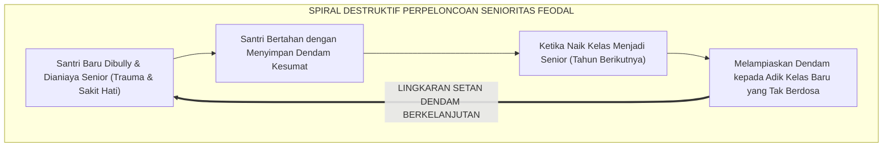
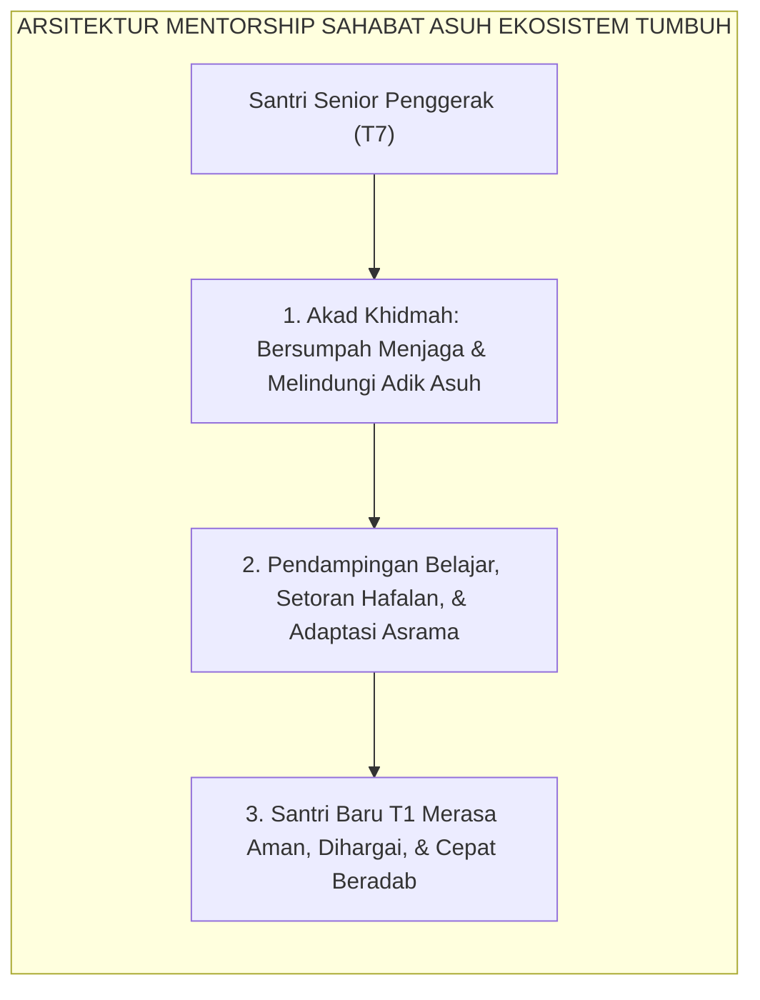

# MENTORSHIP SEBAYA BEBAS PERPELONCOAN

---

### 🧭 PETA POSISI PANDUAN DALAM SISTEM TUMBUH (DARI HULU KE HILIR)
* **Posisi Arsitektur**: `BATANG EKOSISTEM I (Taksonomi 10 Muwashafat Adab & Tangga Kemandirian J1–J4)`
* **Peruntukan Pengguna**: Wali Kelas, Musyrif Kamar, Guru Pengampu Adab, & Mentor Santri
* **Fokus Panduan**: Memandu tahapan penanaman 10 Karakter Adab Nabawi dari fase Adaptasi (J1), Pembiasaan (J2), Kematangan (J3), hingga Kader Penggerak (J4/Tahap 7).
* **Hasil Akhir yang Dituju**: Terwujudnya santri berkarakter *Insan Adabi* yang mandiri, musyrif yang mengasuh dengan kasih sayang tanpa *burnout*, dan pesantren yang aman berbasis data (*Safe Boarding School*).

---

### 🎯 Mengapa Panduan Ini Ada & Masalah Nyata yang Dipecahkan
1. **Latar Masalah di Lapangan**: Sering kali pengasuhan di pesantren berjalan tanpa SOP yang jelas atau terjebak dalam pola reaktif—menunggu santri berbuat salah baru dihukum dengan emosional.
2. **Solusi Sistem TUMBUH**: Panduan ini memberikan langkah preventif dan terstruktur agar setiap pembiasaan adab berjalan terencana, konsisten, dan terukur.
3. **Sasaran Perubahan**: Memastikan nilai-nilai Islam menyatu dalam perilaku harian santri melalui keteladanan nyata (*Qudwah Hasanah*).

---
### 🎯 Tujuan & Manfaat Panduan
Panduan ini dirancang sebagai petunjuk operasional terapan agar pendidik dan musyrif dapat:
1. Menjalankan pembinaan adab santri dengan pendekatan kasih sayang (*Rahmah*) dan ketegasan yang mendidik (*Firm & Kind*).
2. Menghindari cara-cara kekerasan fisik, bentakan verbal, maupun hukuman yang mempermalukan santri.
3. Menciptakan suasana asrama dan kelas yang aman, tertib, dan menumbuhkan kesadaran diri (*Bi'ah Shalihah*).

---

### 💡 Intisari Cepat (3 Menit Memahami Esensi)
* **Kunci Pengasuhan**: Karakter santri tumbuh melalui keteladanan nyata (*Qudwah Hasanah*), komunikasi empatik, dan pembiasaan terstruktur 24 jam.
* **Tindakan Utama**: Terapkan panduan langkah demi langkah di bawah ini secara konsisten, pantau perkembangan santri secara objektif, dan berikan apresiasi atas setiap perbaikan diri yang mereka capai.
* **Prinsip Disiplin**: Fokus pada pemulihan hubungan dan tanggung jawab nyata (*Restoratif*), bukan sekadar melampiaskan amarah atau menghukum.

---

---

### 💬 ILUSTRASI NYATA & ANALOGI SEDERHANA
Bayangkan sebuah skenario yang sering kita lihat sehari-hari di asrama:
* Ketika seorang santri baru melakukan kekeliruan (misalnya terlambat bangun Subuh atau kasurnya berantakan), respon pertama yang sering muncul adalah bentakan keras atau hukuman fisik (seperti push-up atau jemur di lapangan).
* **Hasilnya?** Santri tersebut mungkin tampak patuh seketika karena takut, tetapi di dalam hatinya tumbuh rasa dongkol, dendam tersembunyi, atau kebiasaan "bersandiwara"—hanya tertib ketika ada pengawas di dekatnya.

Dalam Sistem TUMBUH, kita menggunakan cara yang jauh lebih cerdas, sejuk, dan membumi:
1. **Analogi "Rem dan Pedal Gas Otak"**: Santri usia remaja (usia MTs dan Aliyah) memiliki bagian otak emosi (*Sistem Limbik*) yang sudah menyala sangat kuat seperti *pedal gas mobil sport*, namun otak pengendali logikanya (*Prefrontal Cortex*) masih dalam proses tumbuh seperti *sistem rem yang baru dipasang*. Tugas guru dan musyrif bukan memarahi mobilnya, melainkan menjadi **"Sopir Teladan & Sabuk Pengaman"** yang mendampingi santri belajar menginjak rem dengan bijak.
2. **Kekuatan Contoh Nyata (*Qudwah Hasanah*)**: Santri jauh lebih cepat meniru apa yang mereka **lihat** setiap hari daripada apa yang mereka **dengar** dari ribuan nasihat panjang. Jika musyrif datang tepat waktu, tersenyum ramah, dan kamarnya rapi, santri akan menirunya dengan sukarela.

---

### 🛠️ PANDUAN LANGKAH PRAKTIS LAPANGAN (BISA LANGSUNG DIPRAKTIKKAN HARI INI)

| Tahapan Aksi | Tindakan Nyata Musyrif / Guru di Lapangan | Hal yang Harus Diperhatikan |
| :--- | :--- | :--- |
| **1. Langkah Persiapan (Sebelum Kejadian)** | Sepakati aturan bersama santri di awal pekan dengan kalimat positif (contoh: *"Kamar rapi membuat istirahat kita berkah"*). | Buat poster visual sederhana yang mudah dibaca di dinding kamar. |
| **2. Langkah Respon (Saat Terjadi Masalah)** | Tarik napas, tenangkan diri, ajak santri berbicara empat mata tanpa mempermalukannya di depan teman-temannya. | Gunakan nada bicara yang tenang namun tegas (*Firm & Kind*). |
| **3. Langkah Perbaikan (Tanggung Jawab Nyata)** | Minta santri memperbaiki kesalahannya secara langsung (contoh: merapikan kembali barang yang berantakan atau meminta maaf). | Berikan apresiasi seketika santri telah menuntaskan perbaikannya. |

---

### 🗣️ CONTOH DIALOG LAPANGAN (YANG HARUS DIUCAPKAN VS DIHINDARI)

* ❌ **JANGAN UCAPKAN (Membuat Santri Menutup Diri & Dendam)**:
  > *"Kamu ini pemalas sekali ya, sudah dibilangi berkali-kali masih saja kasur berantakan! Push-up 50 kali sekarang!"*
* ✅ **UCAPKAN INI (Mendidik Tanggung Jawab & Kesadaran Diri)**:
  > *"Akhi, antum tahu kesepakatan kamar kita tentang kerapian tempat tidur setelah Subuh. Coba lihat kasur antum sekarang, apa yang perlu disempurnakan? Mari rapikan bersama sekarang agar kamar kita nyaman dan berkah."*

---

### 📋 3 POIN EMAS RANGKUMAN (UNTUK SANTRI SENIOR & MUSYRIF MUDA)
1. **Didik dengan Kasih Sayang, Tegakkan Batas dengan Adil**: Jangan pernah mencampuradukkan ketegasan aturan dengan pelampiasan amarah pribadi.
2. **Apresiasi 4x Lebih Banyak daripada Teguran (*Magic Ratio 4:1*)**: Jangan hanya bersuara ketika santri berbuat salah. Saat mereka berbuat baik (salat di shaf depan, menolong kawan, membaca Al-Qur'an), segera berikan pujian tulus.
3. **Fokus pada Perbaikan Hubungan (*Restoratif*)**: Masalah perilaku adalah peluang emas untuk mendidik santri menjadi pribadi yang lebih dewasa dan bertanggung jawab.

---

### 📖 Uraian Lengkap Landasan & Rujukan Sistem

---

### Warisan Kolonial yang Meracuni Kesucian Pesantren

Salah satu noktah hitam yang paling mencoreng nama baik dunia pesantren di era modern adalah **tradisi perpeloncoan (*hazing / ospek liar*) dan senioritas feodal**.

Di sebagian pondok pesantren konvensional, telah lama mengakar sebuah tradisi beracun yang diwariskan secara turun-temurun antargenerasi:
* Setiap malam hari setelah asatidz pulang, santri senior mengumpulkan santri baru di kamar mandi atau lorong belakang asrama untuk diinterogasi, dibentak, ditampar, atau dipaksa melakukan push-up ratusan kali.
* Tindakan kezaliman fisik dan psikologis ini kerap dibungkus dengan dalih pembenaran munafik: *"Ini demi melatih mental!", "Biar tidak cengeng!", "Dulu kami juga diperlakukan seperti ini oleh senior kami!"*

Padahal sejarah membuktikan bahwa tradisi perpeloncoan dan feodalisme senioritas ini **sama sekali bukan berasal dari ajaran Islam, melainkan warisan budaya militeristik kolonial masa lampau yang menyusup ke dalam asrama santri**.

<b>Gambar 5.3.1:</b> Lingkaran Setan Dendam Antargenerasi Akibat Tradisi Perpeloncoan Senioritas.

Pakar psikologi pencegahan kekerasan sekolah **Dan Olweus**[^1] menegaskan bahwa perpeloncoan (*hazing*) bukanlah instrumen pembentukan karakter, melainkan sebuah bentuk kejahatan kelompok terorganisir (*systemic collective abuse*) yang merusak fungsi empati pelaku dan meninggalkan luka trauma mendalam seumur hidup pada diri korban.

---

### Hukum Syar'i: Keharaman Mutlak Menakut-nakuti dan Menindas Sesama Muslim

Di dalam syariat Islam, menakut-nakuti seorang muslim—bahkan sekadar bercanda—adalah perbuatan yang diharamkan secara mutlak.

Rasulullah SAW bersabda dengan sangat tegas:
$$\text{لَا يَحِلُّ لِمُسْلِمٍ أَنْ يُرَوِّعَ مُسْلِمًا}$$
*"Tidak halal bagi seorang muslim menakut-nakuti sesama muslim lainnya!"* (HR. Abu Dawud no. 5004 dan Ahmad no. 23064).

**Al-Imam Yahya bin Syaraf an-Nawawi** dalam *Syarh Shahih Muslim*[^2] menjelaskan bahwa hadits ini adalah kaidah ushul yang mengharamkan segala bentuk tindakan intimidasi, ancaman verbal, pemukulan fisik, atau perundungan yang menimbulkan rasa takut dan cemas di hati seorang mukmin.

**Syaikhul Islam Ibnu Taimiyyah** dalam *Majmu' al-Fatawa*[^3] menegaskan bahwa kezaliman (*azh-Zhulm*) adalah dosa paling besar yang diharamkan Allah atas Diri-Nya dan atas seluruh hamba-Nya; dan barangsiapa menggunakan dalih penegakan aturan untuk menzalimi orang lain, maka ia termasuk orang yang berkhianat kepada Allah dan Rasul-Nya.

---

### Solusi Sistemik TUMBUH: Arsitektur Mentorship Sahabat Asuh (*Peer Mentorship*)

Ekosistem TUMBUH memutus tuntas lingkaran setan dendam ini dengan menerapkan sistem **Sahabat Asuh (*Peer Mentorship System*)**:

<b>Gambar 5.3.2:</b> Arsitektur Mentorship Sahabat Asuh Bebas Kekerasan Ekosistem TUMBUH.

Pakar pembelajaran teman sebaya internasional **Keith J. Topping**[^4] membuktikan bahwa program *Peer-Assisted Learning* yang terstruktur mampu meningkatkan capaian belajar kedua belah pihak: adik kelas belajar lebih cepat tanpa rasa takut, dan kakak kelas menginternalisasi nilai-nilai tanggung jawab moral yang sangat mendalam.

---

### Standar Baku Peran Kakak Asuh di Ekosistem Pesantren Berbasis TUMBUH

Setiap santri senior Tahap 7 Penggerak yang ditunjuk sebagai Kakak Asuh menjalankan protokol:
1. **Penyambutan Hangat (*Welcome Protocol*)**: Membantu membawakan koper santri baru di hari pertama, mengenalkan fasilitas asrama, dan mendoakan keberkahan menuntut ilmu.
2. **Bimbingan Akademis Harian (*Study Buddy*)**: Menemani adik asuh muthala'ah pelajaran malam hari dan mengoreksi makhraj huruf Al-Qur'an dengan penuh kesabaran.
3. **Teman Curhat & Perlindungan (*Safe Confidant*)**: Mendengarkan keluhan adik asuh yang rindu orang tua (*homesick*) dan segera melaporkan ke musyrif jika adik asuh mengalami demam atau cedera fisik.

Dengan lenyapnya tradisi perpeloncoan dan tegaknya sistem Sahabat Asuh, asrama pesantren bertransformasi menjadi **Baituna Jannatuna**: rumah suci yang aman, sejuk, dipenuhi lantunan dzikir, dan memancarkan kasih sayang persaudaraan Islam sejati.

---

## 📌 Catatan Kaki & Rujukan Primer

[^1]: **Dan Olweus**, *Bullying at School: What We Know and What We Can Do* (Oxford: Blackwell Publishing, 1993), Bab 1: "The Phenomenon of Bullying and Its Characteristics", hlm. 1–25.
[^2]: **Al-Imam Abu Zakariyya Yahya bin Syaraf an-Nawawi**, *Al-Minhaj Syarh Shahih Muslim bin al-Hajjaj* (Kairo: Al-Mathba'ah al-Mishriyyah / Dar Ihya' at-Turats al-'Arabi, 1349 H / 1930 M), Jilid XVI, hlm. 165–172.
[^3]: **Syaikhul Islam Ahmad bin Abdul Halim Ibnu Taimiyyah**, *Majmu' al-Fatawa*, Dikumpulkan oleh Abdurrahman bin Muhammad bin Qasim (Madinah: Majma' al-Malik Fahd li Thiba'at al-Mush-haf asy-Syarif, 1416 H / 1995 M), Jilid XVIII: "Kitab al-Jihad wa Tahrim azh-Zhulm", hlm. 135–160.
[^4]: **Keith J. Topping**, *Peer-Assisted Learning: A Practical Guide for Teachers* (Cambridge: Brookline Books, 2001), Bab 2: "Principles of Peer Tutoring", hlm. 21–48.
