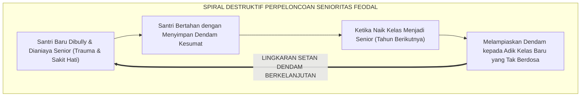
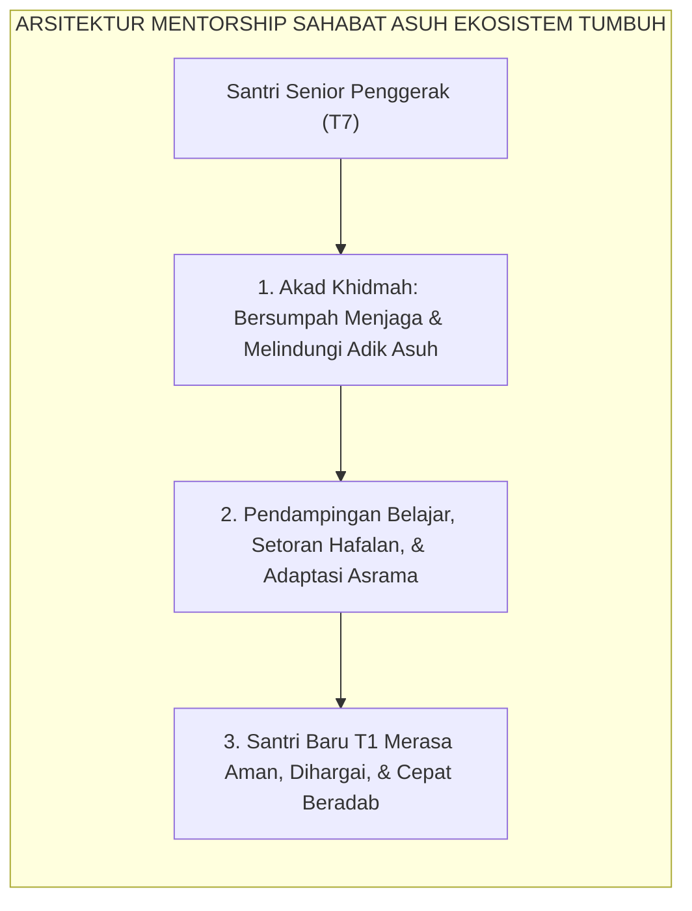
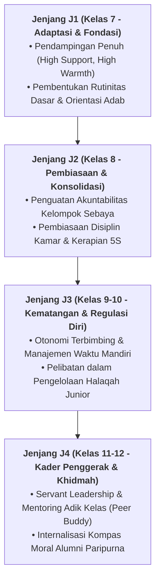

# MENTORSHIP SEBAYA BEBAS PERPELONCOAN

---
### Warisan Kolonial yang Meracuni Kesucian Pesantren

Salah satu noktah hitam yang paling mencoreng nama baik dunia pesantren di era modern adalah **tradisi perpeloncoan (*hazing / ospek liar*) dan senioritas feodal**.

Di sebagian pondok pesantren konvensional, telah lama mengakar sebuah tradisi beracun yang diwariskan secara turun-temurun antargenerasi:
* Setiap malam hari setelah asatidz pulang, santri senior mengumpulkan santri baru di kamar mandi atau lorong belakang asrama untuk diinterogasi, dibentak, ditampar, atau dipaksa melakukan push-up ratusan kali.
* Tindakan kezaliman fisik dan psikologis ini kerap dibungkus dengan dalih pembenaran munafik: *"Ini demi melatih mental!", "Biar tidak cengeng!", "Dulu kami juga diperlakukan seperti ini oleh senior kami!"*

Padahal sejarah membuktikan bahwa tradisi perpeloncoan dan feodalisme senioritas ini **sama sekali bukan berasal dari ajaran Islam, melainkan warisan budaya militeristik kolonial masa lampau yang menyusup ke dalam asrama santri**.

<b>Gambar 5.3.1:</b> Lingkaran Setan Dendam Antargenerasi Akibat Tradisi Perpeloncoan Senioritas.

Pakar psikologi pencegahan kekerasan sekolah **Dan Olweus**[^1] menegaskan bahwa perpeloncoan (*hazing*) bukanlah instrumen pembentukan karakter, melainkan sebuah bentuk kejahatan kelompok terorganisir (*systemic collective abuse*) yang merusak fungsi empati pelaku dan meninggalkan luka trauma mendalam seumur hidup pada diri korban.

---

### Hukum Syar'i: Keharaman Mutlak Menakut-nakuti dan Menindas Sesama Muslim

Di dalam syariat Islam, menakut-nakuti seorang muslim—bahkan sekadar bercanda—adalah perbuatan yang diharamkan secara mutlak.

Rasulullah SAW bersabda dengan sangat tegas:
$$\text{لَا يَحِلُّ لِمُسْلِمٍ أَنْ يُرَوِّعَ مُسْلِمًا}$$
*"Tidak halal bagi seorang muslim menakut-nakuti sesama muslim lainnya!"* (HR. Abu Dawud no. 5004 dan Ahmad no. 23064).

**Al-Imam Yahya bin Syaraf an-Nawawi** dalam *Syarh Shahih Muslim*[^2] menjelaskan bahwa hadits ini adalah kaidah ushul yang mengharamkan segala bentuk tindakan intimidasi, ancaman verbal, pemukulan fisik, atau perundungan yang menimbulkan rasa takut dan cemas di hati seorang mukmin.

**Syaikhul Islam Ibnu Taimiyyah** dalam *Majmu' al-Fatawa*[^3] menegaskan bahwa kezaliman (*azh-Zhulm*) adalah dosa paling besar yang diharamkan Allah atas Diri-Nya dan atas seluruh hamba-Nya; dan barangsiapa menggunakan dalih penegakan aturan untuk menzalimi orang lain, maka ia termasuk orang yang berkhianat kepada Allah dan Rasul-Nya.

---

### Solusi Sistemik TUMBUH: Arsitektur Mentorship Sahabat Asuh (*Peer Mentorship*)

Ekosistem TUMBUH memutus tuntas lingkaran setan dendam ini dengan menerapkan sistem **Sahabat Asuh (*Peer Mentorship System*)**:

<b>Gambar 5.3.2:</b> Arsitektur Mentorship Sahabat Asuh Bebas Kekerasan Ekosistem TUMBUH.

Pakar pembelajaran teman sebaya internasional **Keith J. Topping**[^4] membuktikan bahwa program *Peer-Assisted Learning* yang terstruktur mampu meningkatkan capaian belajar kedua belah pihak: adik kelas belajar lebih cepat tanpa rasa takut, dan kakak kelas menginternalisasi nilai-nilai tanggung jawab moral yang sangat mendalam.

---

### Standar Baku Peran Kakak Asuh di Ekosistem Pesantren Berbasis TUMBUH

Setiap santri senior Tahap 7 Penggerak yang ditunjuk sebagai Kakak Asuh menjalankan protokol:
1. **Penyambutan Hangat (*Welcome Protocol*)**: Membantu membawakan koper santri baru di hari pertama, mengenalkan fasilitas asrama, dan mendoakan keberkahan menuntut ilmu.
2. **Bimbingan Akademis Harian (*Study Buddy*)**: Menemani adik asuh muthala'ah pelajaran malam hari dan mengoreksi makhraj huruf Al-Qur'an dengan penuh kesabaran.
3. **Teman Curhat & Perlindungan (*Safe Confidant*)**: Mendengarkan keluhan adik asuh yang rindu orang tua (*homesick*) dan segera melaporkan ke musyrif jika adik asuh mengalami demam atau cedera fisik.

Dengan lenyapnya tradisi perpeloncoan dan tegaknya sistem Sahabat Asuh, asrama pesantren bertransformasi menjadi **Baituna Jannatuna**: rumah suci yang aman, sejuk, dipenuhi lantunan dzikir, dan memancarkan kasih sayang persaudaraan Islam sejati.

---

## 📌 Catatan Kaki & Rujukan Primer

[^1]: **Dan Olweus**, *Bullying at School: What We Know and What We Can Do* (Oxford: Blackwell Publishing, 1993), Bab 1: "The Phenomenon of Bullying and Its Characteristics", hlm. 1–25.
[^2]: **Al-Imam Abu Zakariyya Yahya bin Syaraf an-Nawawi**, *Al-Minhaj Syarh Shahih Muslim bin al-Hajjaj* (Kairo: Al-Mathba'ah al-Mishriyyah / Dar Ihya' at-Turats al-'Arabi, 1349 H / 1930 M), Jilid XVI, hlm. 165–172.
[^3]: **Syaikhul Islam Ahmad bin Abdul Halim Ibnu Taimiyyah**, *Majmu' al-Fatawa*, Dikumpulkan oleh Abdurrahman bin Muhammad bin Qasim (Madinah: Majma' al-Malik Fahd li Thiba'at al-Mush-haf asy-Syarif, 1416 H / 1995 M), Jilid XVIII: "Kitab al-Jihad wa Tahrim azh-Zhulm", hlm. 135–160.
[^4]: **Keith J. Topping**, *Peer-Assisted Learning: A Practical Guide for Teachers* (Cambridge: Brookline Books, 2001), Bab 2: "Principles of Peer Tutoring", hlm. 21–48.

---

### IV. Pembedahan Kapasitas Lanjutan & Trajektori Progresi Mentorship Sebaya Bebas Perpeloncoan

Pengembangan kompetensi **MENTORSHIP SEBAYA BEBAS PERPELONCOAN** pada santri memerlukan strategi diferensiasi yang selaras dengan tahapan usia perkembangan remaja (*Developmental Milestones*):

1. **Dekomposisi Indikator Kematangan Perilaku**:
   Untuk memastikan karakter **MENTORSHIP SEBAYA BEBAS PERPELONCOAN** tertanam secara operasional, dewan asatidz dan musyrif memetakan indikator perilakunya ke dalam 3 ranah capaian:
   * **Ranah Kognitif-Reflektif (*Ma'rifah*)**: Santri memahami dalil syar'i, urgensi akhlak, dan konsekuensi logis dari setiap pilihannya.
   * **Ranah Afektif-Ruhiyyah (*Wijdan*)**: Tumbuhnya kepekaan nurani, rasa malu berbuat dosa (*Haya'*), dan kenikmatan dalam berbuat kebajikan.
   * **Ranah Psikomotorik-Habituasi (*'Amal*)**: Terwujudnya keterampilan bertindak nyata secara spontan, konsisten, dan mandiri tanpa perlu disuruh.

2. **Matriks Penahapan Lintas Jenjang Kemandirian (J1–J4)**:

3. **Rubrik Evaluasi Kualitatif & Indikator Pencapaian**:

| Level Kemandirian | Karakteristik Perilaku Teramati (*Behavioral Anchor*) | Pendekatan Bimbingan Musyrif |
| :--- | :--- | :--- |
| **Level 1 (Emerging)** | Memerlukan instruksi berulang dan pengawasan langsung musyrif. | *Direct Prompting* & pengingat visual harian. |
| **Level 2 (Developing)** | Mampu menjalankan adab saat diingatkan oleh teman sebaya. | Penguatan positif melalui pujian deskriptif. |
| **Level 3 (Proficient)** | Menjalankan adab secara mandiri dan konsisten tanpa diawasi. | Pemberian kepercayaan dan peran tanggung jawab kamar. |
| **Level 4 (Exemplary)** | Menjadi teladan (*Qudwah*) dan mampu membimbing kawan-kawannya. | Pelibatan aktif dalam struktur Dewan Santri & Mentor. |

---

### V. Panduan Praksis Pendampingan Musyrif di Asrama

Agar penanaman **MENTORSHIP SEBAYA BEBAS PERPELONCOAN** berhasil maksimal di lapangan, musyrif disarankan menerapkan protokol pendampingan berikut:
* **Fokus pada Usaha (*Effort-Oriented Praise*)**: Berikan apresiasi atas proses perjuangan santri dalam memperbaiki diri, bukan semata-mata hasil akhir yang sempurna.
* **Dialog Sokratik Saat Santri Mengalami Kesulitan**: Ajukan pertanyaan reflektif seperti: *"Apa yang membuat antum merasa berat menjalankan adab ini hari ini? Bagaimana kita bisa mengatasinya bersama besok?"*
* **Menjaga Iklim Ukhuwah Bebas Perundungan**: Pastikan senioritas dimaknai sebagai amanah pengayoman dan perlindungan kepada yang lebih muda, bukan hak istimewa untuk memerintah.
